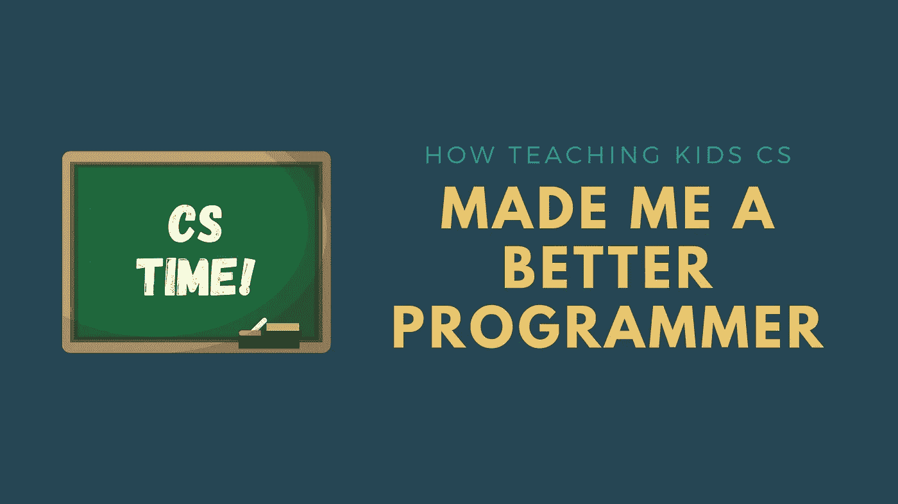

# 教孩子们计算机如何让我成为一个更好的程序员

> 原文：<https://betterprogramming.pub/how-teaching-kids-cs-made-me-a-better-programmer-37030dd2d3e4>

## 如果你能向一个 6 岁的孩子解释某事，那么你就真正理解了它

作者照片(使用 [Canva](https://www.canva.com/) 制作)。

> ”平庸的老师讲述道。好老师解释道。上级老师示范。大老师启发。”— [威廉·亚瑟·沃德](https://www.goodreads.com/quotes/166029-the-mediocre-teacher-tells-the-good-teacher-explains-the-superior)

如果你想真正学到东西，试着把它教给别人，因为只有这样你才能确信你完全理解了它。这种说法完全正确。当你试图向六岁、七岁或八岁的孩子教授一些相对复杂的话题时，它甚至更准确。然后，你不仅仅需要完全理解题目。你需要尽量简化它，让孩子们能够理解，但不要让它听起来微不足道。

我已经教孩子们计算机科学五年了，已经教了 50 多个学生。我可以肯定地说，我现在的计算机科学和编程知识远胜于五年前。教孩子帮助我成长，以一种我刚开始教书时从未想过的方式提高了我的技能。

以下是教孩子们 CS 帮助我提高程序员水平的五种方法。

# 以相关的方式解释概念的能力

我总是听说程序员不善于解释他们做了什么，以及他们如何使他们的代码直接工作。我想那部分是真的。作为开发人员，我们主要与其他开发人员交流，因此我们下意识地对我们正在向其解释事情的人的知识做出许多假设。正因为如此，我们习惯于在非常高的抽象层次上定义术语和概念。这也是为什么我们发现向没有相同背景知识的更一般的观众或人员解释相同的术语和概念具有挑战性。

用简单易懂的方式解释编程概念的能力意味着你完全理解了这些概念。

试着解释一下什么是列表或堆栈。即使这样也不行，试着给一个还没在学校学过除法的人解释一下模运算符。在解释这些术语时，你需要更有创造性。我用 Python 教授列表和索引的一种方法是，让我的学生想象一栋建筑，其中公寓是项目，公寓号是索引。

以六岁儿童理解的方式思考和提出解释这些概念的想法的过程迫使你重新思考这个概念，并试图从不同的角度接近它，直到你达到一个可以容易解释和理解的观点。

# 回到基础总是好的

我们编程的时间越长，我们在职业道路上走得越远，学习新的工具和先进的技术，我们离基础就越远。虽然我们知道这些基本知识，但它们储存在我们记忆的某个地方。我们目前的知识是基于它们，但它们的细节已经变得有些模糊。

回到基础总是一个好主意。它帮助我们更新知识。不仅如此，用更高级的知识回到基础可以帮助我们更好地理解基础，并加强我们对日常使用的更高级工具的理解。

# 教学是逆向学习

当一个人教书时，他们不仅仅是传递信息。他们也从学生那里接受想法和观点。孩子们非常有创造力，从完全不同的角度看待事物。正因为如此，他们对一些问题的解决方案可能看起来很奇怪，而且非常简单，这正是为什么教他们是一种学习形式。

我从我的学生身上学到了很多:他们如何看待问题，他们如何思考解决方案，以及解决方案本身。教孩子让我总是寻找任何问题最简单、最直接的答案。我学会了停止把事情弄得过于复杂，并试图找到一个能显示我知道多少的答案。相反，我开始专注于寻找一个高效的解决方案，让任何阅读我的代码的人都容易理解——不管他们的知识水平如何。

# 更多地使用伪代码

伪代码是计算机科学中被低估的瑰宝之一。通常，当我们面临一个新的编程挑战时，我们会立即寻找解决方案，而不是一步一步地提出问题，并试图找到每个级别的解决方案。

使用伪代码是我教给学生的第一个技能。这向他们——还有我——表明想法和概念才是最重要的。不是语法。学习编码不是学习编程语言的语法。相反，它是关于学习思考和找到答案的过程。不幸的是，这不是我学习编程的方式。我是通过使用 C++语法严格学习的，将我的知识扩展到一个更抽象的层面，在这个层面上，想法才是最重要的。思维过程是我开始从事现实生活项目时学到的技能。

# 编写更短、更简单的代码/注释

我一直相信自我解释的代码是最好的代码。当我开始教 CS 时，这种信念变得更加强烈。我需要非常小心我的变量命名、函数命名和注释。我的命名方案必须超越描述性。它必须简洁明了。孩子们很快就会感到无聊和心烦意乱，所以他们想快速而容易地弄清楚代码试图实现什么。如果代码没有很好地组织和注释，他们将会失去兴趣，并且不会进一步阅读/学习代码做什么。

# 结论

自从我开始教孩子们，我就开始把从他们那里学到的技能应用到我的日常编码中。我变得更善于解释复杂的编程思想，并开始使用更多的可视化和图形来使我的技术更容易掌握。我的代码变得更有组织性，更简洁，并且更具可读性。我终于写出了近乎完美的评论。

所以，我给任何程序员或开发者的建议是，试着教你的弟弟妹妹、孩子、侄女或侄子编程。尝试向他们解释你的想法，如果他们不能理解，简化它，再试一次。

简化你的工作会让你对其背后的机制有更深的理解。

你会被解释你的代码对你未来工作质量的积极影响所震惊。