# 地形如何工作:视觉介绍

> 原文：<https://betterprogramming.pub/how-terraform-works-a-visual-intro-6328cddbe067>

## 通过插图了解 Terraform

为了更新我的地形知识，我保存了一些图表。

在任何题目中，我总是发现创作插图的练习对学习很有帮助。当我必须向我的同事解释一些地形概念时，他们也很有帮助。

# Terraform 的主要特征

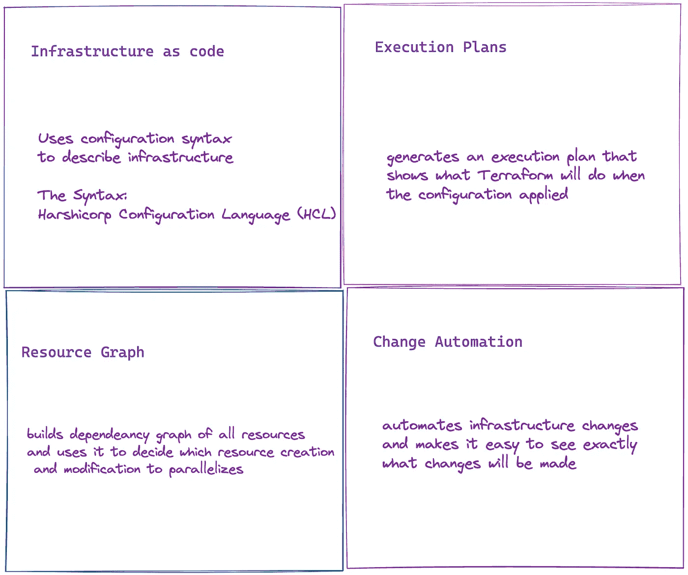

# 它是如何工作的

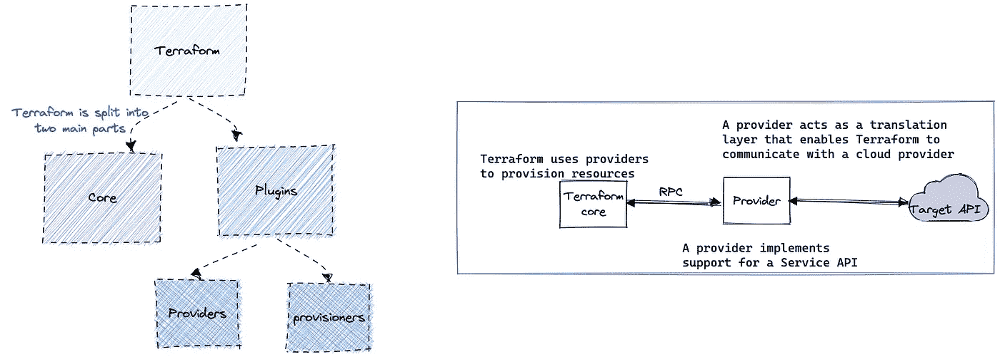

# 核心工作流程

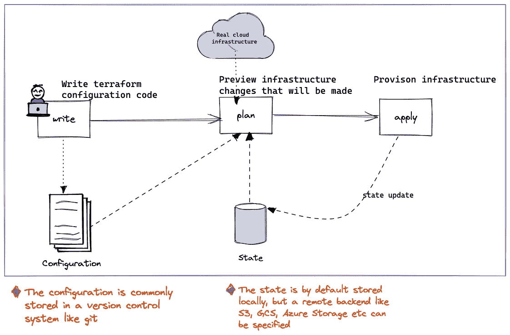

# terraform 基本 CLI |运行 terraform

您通常在包含**的目录中使用 CLI 运行 terrafom。** **tf 文件。**

```
terraform init
```

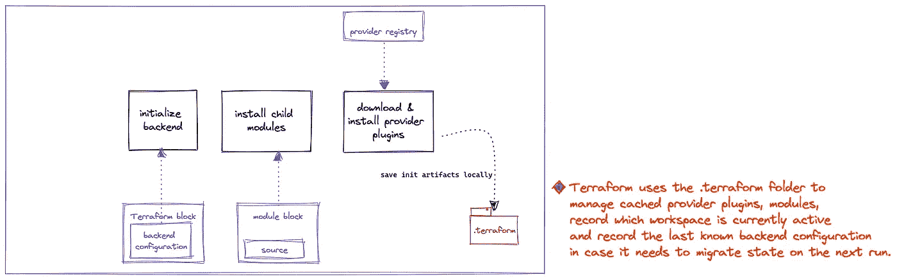

```
terraform plan
```

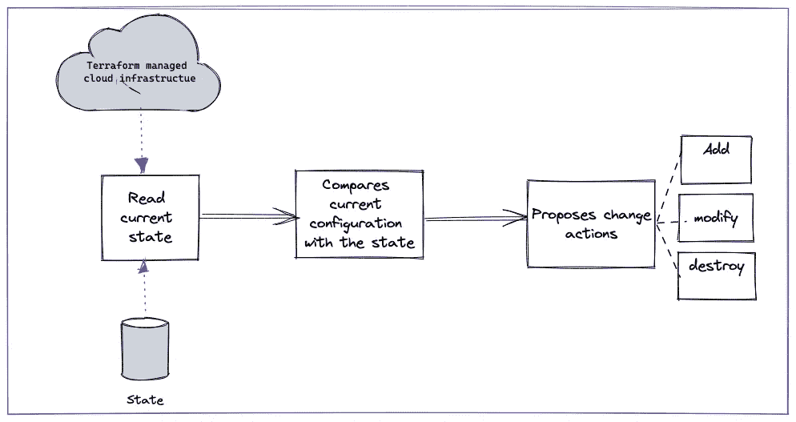

```
terraform apply
```

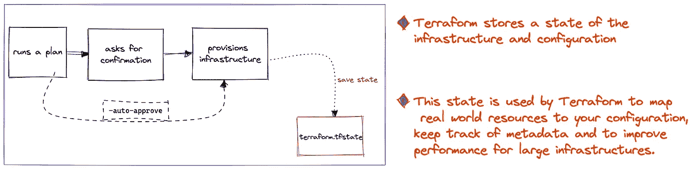

# HCL 语法

## 一点语言等级

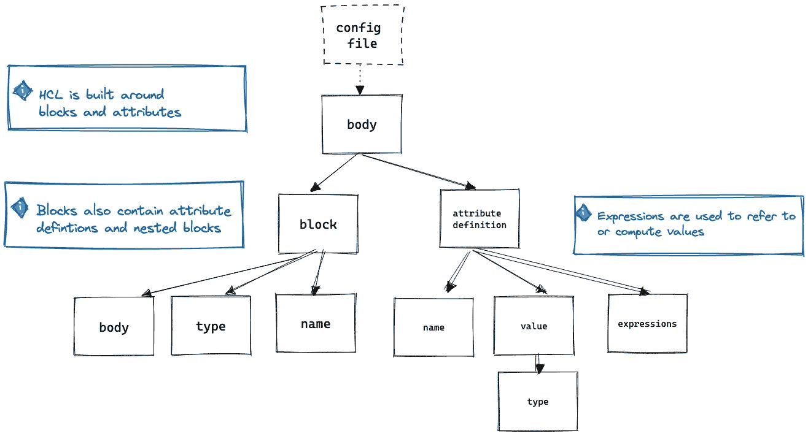

## 块类型

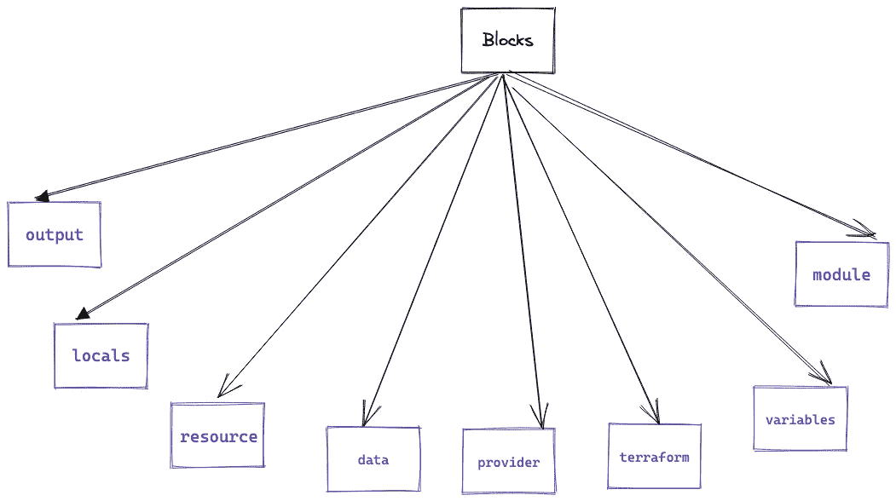

## 专用块

地形块

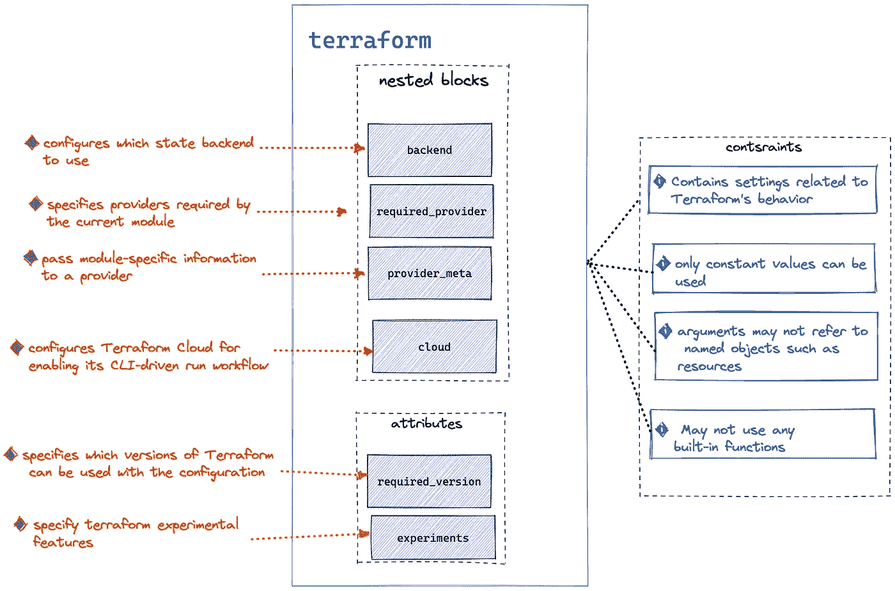

提供程序块

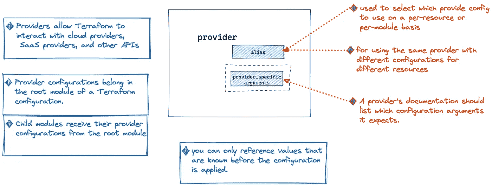

变量块

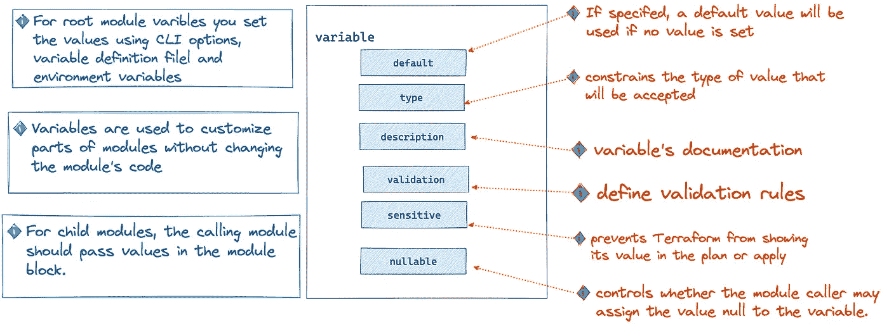

变量类型约束和验证嵌套块

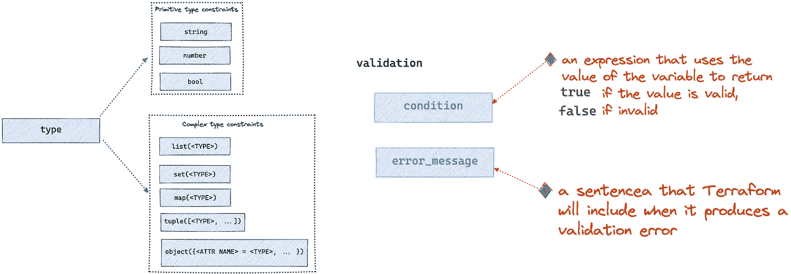

变量定义

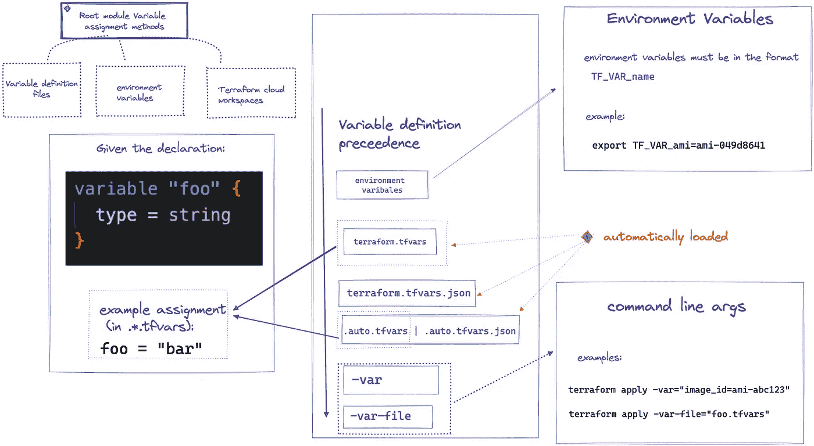

查看后续文章:[图解的 Terraform 模块](https://medium.com/@mfundo/terraform-modules-illustrate-26cbc48be83a)

*如果你认为这是有帮助的，并想表示你的支持，这里是我的:*

```
 [**PayPal page**](http://paypal.me/mfndou)[**Buy me a coffee page**](https://www.buymeacoffee.com/mfundo)[**Ko-fi page**](https://ko-fi.com/mfundo)
```

*或者在推特上关注我:*[*https://twitter.com/mfund0_*](https://twitter.com/mfund0_)