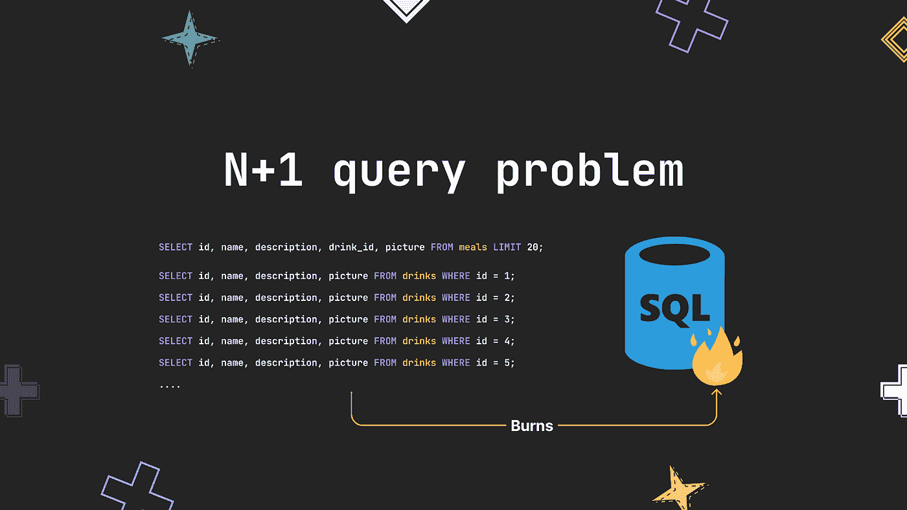

# N+1 查询如何烧毁您的数据库

> 原文：<https://betterprogramming.pub/how-the-n-1-query-can-burn-your-database-3841c93987e5>

## 处理这种有害逻辑的简要指南

# 概观

你有没有看过一部电影/连续剧，或者自己去过有客房服务的酒店？

假设你去一家这样的酒店，酒店的餐厅在一楼，你住在十楼。现在，当你到了那里，你决定点一些午餐吃的东西。想象一下，女服务员没有给你带食物(饮料、甜点等)。)一次—逐一为您提供每一餐、饮料、甜点等。

那将是非常低效的，因为女服务员将不得不跑很多趟才能把你要的东西都端上来。他们需要从一楼到十楼来回走动。这就是`N+1`的问题所在，在多次运行中得到你所要求的一切。

最理想的是把你点的东西放在这样的手推车里，这样女服务员就可以一次把它端上来。

本文将深入探讨这个问题在代码中的表现，并提供解决方案来避免这种情况，确保您的应用程序获得最佳性能。

# 是时候看看代码了

为了展示`N+1`在您的代码中的样子，我将构建一个简单的控制台应用程序，它打印从餐馆订购的可用菜单。为此，我们将拥有一个包含`meals`和`drinks`表的数据库。在菜单上，每顿饭都会有饮料。

让我们看看这些表格的模型:

餐厅桌子

现在，让我们来看看`N+1`的行动。这里我们有一些从数据库中查询数据的方法(你可以在我的 repo 上找到完整的代码):

最后，这里是处理`N+1`查询问题的方法:

是的，这个简单的逻辑可能会烧毁您的数据库，因为您要来回将饮料添加到每顿饭中，这是没有效率的。

你要查询的记录越多，或者你拥有的用户越多，这个`N+1`问题对你的应用影响就越大，因为时间复杂度是[O(N)/线性时间](https://learn2torials.com/a/linear-time-complexity)。

这里我给了你一个后端的例子，但是这个问题也可以在你的前端发现，在前端，你不是直接调用你的数据库，而是调用你的后端的一个端点，这个端点同时会调用数据库。

# 解决办法

现在，让我们来看看这个问题的两个解决方案。

## **在 SQL 查询中加入作者**

这可能是更容易的解决方案。在这里，您必须编写如下所示的查询:

使用该查询，我们的代码将如下所示:

有了这个查询，现在我们只需要您查询我们的数据库一次，就这样。

## **拿饭，然后用你的编程语言加入饮料**

不，我们不会像看到`N+1`问题的例子那样做。这里，我们将在数据库中执行两次查询，而不是先查询饭菜，然后再逐个查询饮料。让我们看看如何:

如您所见，我们对数据库只有两个查询:`s.getMeals()`和`s.getDrinksByIDsIn`，如果您阅读了`ListMenu`方法，您会注意到我们引入了另外两个方法。让我们看看它们的作用以及我们为什么需要它们:

现在，你可以看到我们没有为每一种饮料查询数据库。相反，在一个查询中，我们获取所有的饭菜，在另一个查询中，我们查询饮料，然后将它们加入相应的饭菜。

## **何时使用其中一种解决方案？**

嗯，在这个应用程序中，每顿饭只包括一种饮料，但如果一顿饭包括多种饮料，会发生什么呢？

在这种情况下，第一个解决方案帮不了我们，因为 SQL 查询将重复一顿饭中每一种饮料的记录。因此，我们想做的是使用第二种解决方案，首先查询餐食，然后获取饮料，将它们加入相应的餐食

## **个人经历**

在工作中，我们有一个微服务，负责一天两次或按需缓存关于产品的大量数据。由于这个问题，以前需要大约一分钟来缓存所有数据。在我们移除了`N+1`之后，它从一分钟变成了两秒钟！

# 结论

不要高估了`N+1`这样一个简单的逻辑。你很容易陷入这个问题，但你也很容易解决它。但是如果你不及时做，你的应用程序性能会随着时间的推移让你知道。

我没有提到的是像 [Gorm](https://gorm.io/) 这样的 orm 中的`N+1`。我没有这方面的经验，但是如果你使用 ORM，我建议你深入底层代码，看看是否有这个问题。

**注意**:我在本文中构建代码的方式并不意味着指导你应该如何构建你的代码；尽可能简单地关注问题和解决方案代码。

# **作业**

如果你正在做一个项目，或者你已经有了正在生产的项目，去检查它们，去掉你发现的任何`N+1`。

# 参考

1.  Laravel 中的`N+1`:在这里你可以看到雄辩(Laravel 的一个 ORM)中的`N+1`
2.  [Figma Jam](https://www.figma.com/figjam/) 和 [IconDuck](https://iconduck.com/) :制作插图
3.  [文章库](https://github.com/hernanhrm/blog-examples/tree/main/n-plus-1):你可以在我的 GitHub 里找到例子