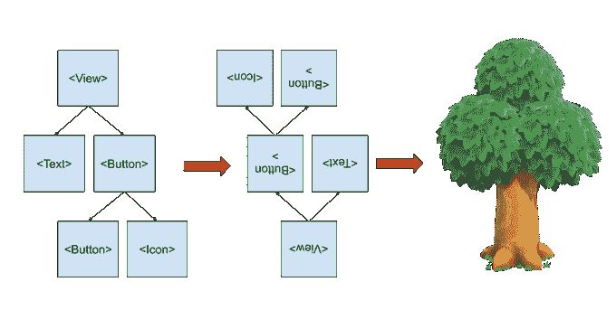

# React 协调算法的工作原理

> 原文：<https://betterprogramming.pub/how-the-react-reconciliation-algorithm-works-e29bf77a4d78>

## JavaScript 中使用最多的 UI 库是什么？

由 [Sitraka Rakotoarivelo](https://unsplash.com/@mecdjino?utm_source=medium&utm_medium=referral) 在 [Unsplash](https://unsplash.com?utm_source=medium&utm_medium=referral) 拍摄的照片。

React 是数百万人使用的 UI 库，他们有充分的理由这样做。React 是第一个实现真正的反应式开发用户界面的方法，它可以在任何可以想象的平台上工作。但是很少有人知道，如果没有 React 协调算法，这一切都是不可能的。

# 画一些按钮有什么难的？

当使用 React 开发时，很容易忘记(或者根本不知道)创建和管理 UI 的必要方式。打个比方，React 让您“描述”您想要的接口，而本机库和框架必须使用原语“构建”它。因此，虽然对您来说它看起来像一个 return 语句，但在本机代码中它会转换成数百个对象、赋值和表达式。

更新本地(DOM 或平台)接口不是一个简单的过程。谢天谢地，我们不必经常这样做。大多数时候，你的应用程序不会在每次渲染时完全改变 UI 结构。通常，按钮会改变颜色，或者标签会更新文本。在少数情况下，当一切都改变时(导航到另一个屏幕)，我们将不得不处理它。但是 React 如何知道对底层接口最有效的改变是什么呢？协调算法。

你可能熟悉一种叫做`tree` *的数据结构。即使你不是，你也每天都在使用它。树是节点(组件)的集合。每个节点都可以有自己是节点的子节点。基本上，JSX 和 HTML 都可以被描述为树。*

作者照片。

然后，协调算法比较两棵树，并返回一组操作来更新第二棵树，使其与第一棵树匹配。在计算机科学领域，这被称为[树距离问题](https://grfia.dlsi.ua.es/ml/algorithms/references/editsurvey_bille.pdf)。当然，它有几个通用的解决方案，但是它们的复杂度是 *O(n )* ，完全不适合用户界面。为了让它更快，React 团队不得不做出一些权衡。

# 调和算法是如何解决问题的？

回想一下，该算法针对用户界面进行了优化，以及我们之前所做的关于用户界面的假设。这些是调和算法的基础。根据这些假设，算法采取以下措施:

1.  如果一个节点已经改变了它的类型(`H1` - > `MARKUEE`或`View` - > `Text`)，那么旧的节点将被删除，新的节点将从头开始递归渲染。
2.  如果两棵树中的两个节点具有相同的`key`属性，那么它们就是同一个节点，无需创建新的节点就可以被重用。

使用这些作为公理，你可以很容易地推导出算法的其余部分。如果节点不同，旧的会被删除，新的会从头开始创建。如果节点是相同的，该算法将比较其属性，对它们进行必要的更改，并继续递归到子节点。

# 调和算法的缺点

由于这些都是折衷方案，它们会带来一些不想要的结果。考虑一个项目列表。它可能有数百个相同类型的节点，可以编辑和重新排列。如果我们要重新排列它们，协调算法将不知道两棵树中的哪些是哪些，从而导致完全重新渲染。

这就是`key`发挥作用的地方。如果您为每个列表项分配一个唯一的键，算法将很容易在树之间匹配它们，不会有任何问题。这也是为什么绝不能使用数组索引或随机数作为键的原因。如果您使用索引并且重新排列了项目，它们的索引将会改变。算法会以错误的方式匹配节点，你的用户界面会完全不可预测。如果您使用在每次渲染时生成的随机数，将不会破坏任何东西，但这将是非常低效的，因为每次渲染时每个节点都将从头开始重新创建。

# 结束语

感谢您的阅读。我希望你喜欢这篇文章。React 的并发模式将对 React 处理 UI 的方式带来一些变化，敬请关注更新！

# 资源

*   `[react-reconciler](https://github.com/facebook/react/tree/master/packages/react-reconciler)` [包](https://github.com/facebook/react/tree/master/packages/react-reconciler)
*   [树编辑距离问题](http://tree-edit-distance.dbresearch.uni-salzburg.at/)