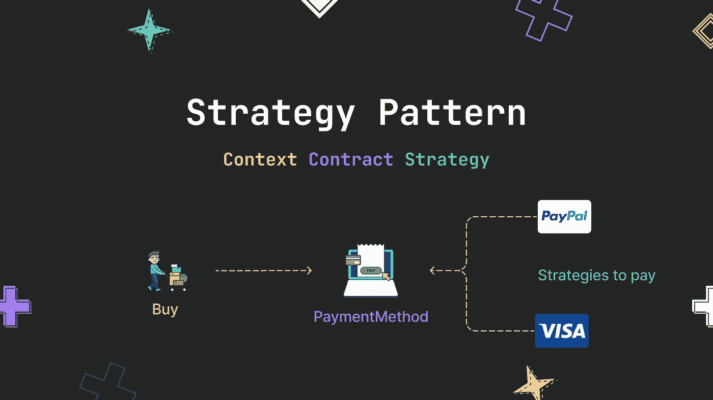
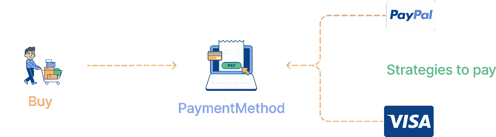
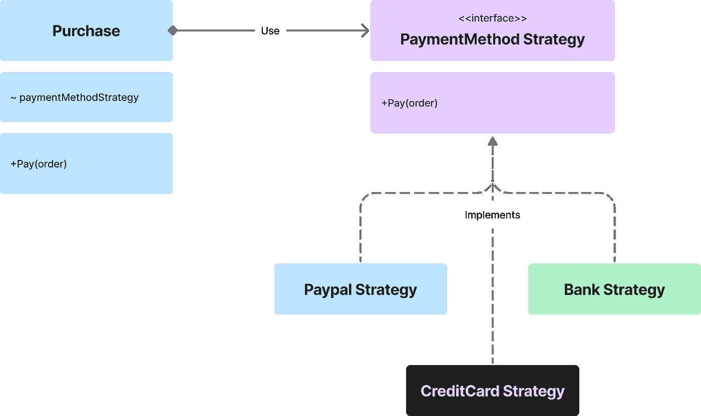
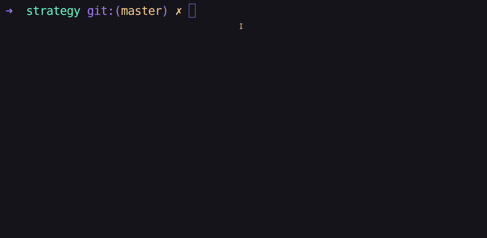
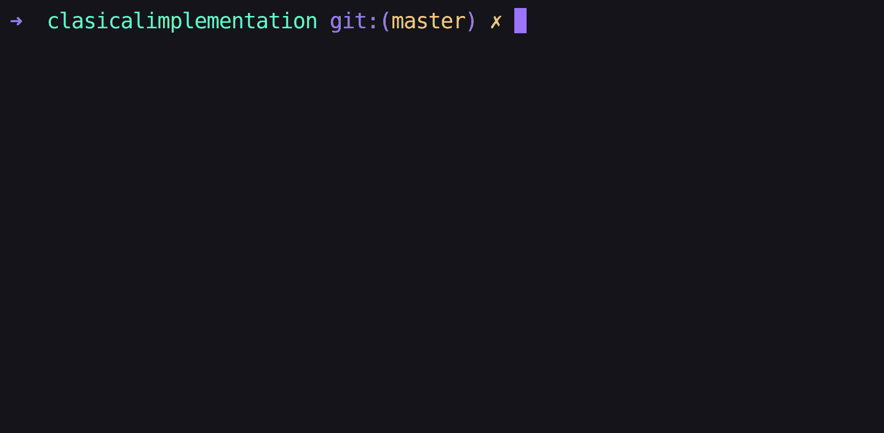

# 在采购流程电子商务系统中实现策略模式

> 原文：<https://betterprogramming.pub/how-the-strategy-pattern-works-ce3700100679>

## 理解策略模式如何工作



# 概观

你有没有进过电商网站购买过一个产品？如果你有，那么你可能见过不同的支付方式(贝宝，信用卡等。)



购买流程

这个购买过程是一种观察战略模式的方式。

策略是一种行为设计模式，允许您定义不同的策略并在它们之间切换以达到目标。在上图中，你有一个目标(购买产品)和不同的策略来完成它(用 PayPal、信用卡等支付)。).

让我们看看我们将如何实现这个购买过程。

# 战略模式的结构

首先，让我们了解一下模式的结构。它由 3 部分定义:

1.  情境类:这是我们的目标
2.  契约接口:这些是策略要遵循的规则
3.  策略类:指达到目标的不同策略，都是`Contract Interface`的实施

下面是策略结构的类图:



也需要一个触发购买过程的客户端。将在代码示例中看到这一点。

# 代码时间，耶！

现在，让我们将类图转化为代码，看看它是如何实现的。我将使用 [Golang](https://go.dev/) ，因为这是我熟悉的语言:

**定义合同界面**

PaymentMethodStrategy 接口

**定义上下文**

购买用例

**实施战略**

为此，将有 3 个不同的类(贝宝，信用卡和银行)

PayPal 策略

信用卡策略

银行战略

**客户端**

在这个例子中，我将使用控制台来执行购买过程。

客户端使用

当我们运行程序时，情况是这样:



> 注意:这个模式是实现 SOLID 的开/闭原理的一种方式。

## 如果我们想增加另一种支付方式呢？

这很容易，您只需创建另一个实现“PaymentMethodStrategy”接口的类:

比特币策略

之后，你只需要在你的上下文类中注册它:

```
purchase.RegisterStrategy("Bitcoin", NewBitcoin())
```

# 传统的方式

*如果没有战略模式，实施这个流程会怎么样？*

我们没有 3 个类(上下文、契约和策略)，而是只有一个类来实现用 PayPal、信用卡、银行等支付的所有逻辑。

这将是我们实现所有逻辑的`Purchase`类:

经典实现

**我们的客户**

使用经典实现的客户端

当我们运行程序时，情况是这样:



当您第一次构建我们的应用程序时，或者当您知道您很少添加或修改现有逻辑时，这可能是好的。但是如果你知道商业逻辑将会增长，这样的事情将来可能会发生:

1.  浏览代码将会很困难
2.  很有可能你修改了不该修改的东西
3.  当不同的人处理同一个类时，Git 会发生冲突
4.  许多条件之间切换不同的支付方式

从业务的角度来看，它可以工作，但是从技术的角度来看，它不可维护。

> 注意:在这个例子中，将所有的逻辑放在一个类中，将违背 SOLID 的单一责任原则。

# 实践

在这里，我展示了什么是策略模式，它是如何构造的，以及何时应该使用这种模式，而不是将所有的逻辑放在一个类中。

我邀请你实现这种模式来应用订单折扣，并在评论中分享代码。希望这篇博客能帮助你理解战略模式。在本系列的下一篇设计模式文章中再见。

# 参考

1.  [深入研究设计模式](https://refactoring.guru/design-patterns/book):这篇文章是我从这本书上记下来的
2.  [Peek](https://github.com/phw/peek) :记录我终端的工具
3.  [Figma Jam](https://www.figma.com/figjam/) :制作插画
4.  文章库:你可以在我的 GitHub 中找到例子
5.  [Ray.so](https://ray.so/) :截图