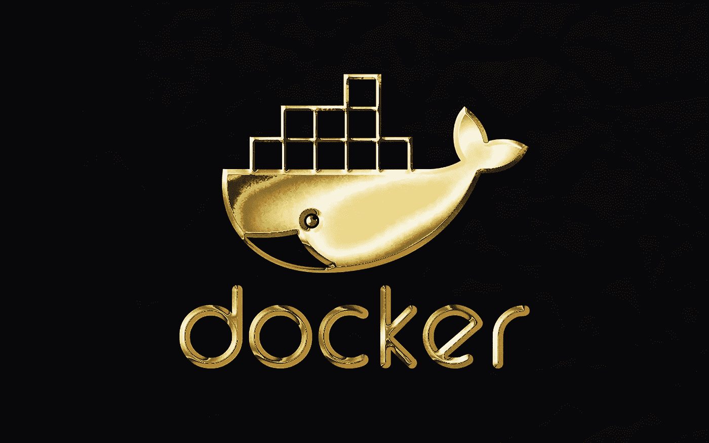

# 如何访问 Docker 容器——安全外壳与 Docker 附加

> 原文：<https://betterprogramming.pub/how-to-access-a-docker-container-secure-shell-vs-docker-attach-1270d0475bb1>

## 简短的教程教学是每个 DevOps 工程师的基本技能



[Rubaitul Azad](https://unsplash.com/@rubaitulazad?utm_source=medium&utm_medium=referral) 在 [Unsplash](https://unsplash.com/?utm_source=medium&utm_medium=referral) 上拍摄的照片

今天，最流行的容器技术之一是 Docker，它被广泛用于运行各种不同的应用程序。

使用 Docker 容器的一项基本技能是知道如何连接到正在运行的容器来修改数据、调试或执行命令。

在这篇短文中，我描述了两种连接到正在运行的 Docker 容器的不同方法。

# 1.使用 Docker Exec 附加到运行中的容器

通过 shell 访问容器的最有用的命令是通过执行`docker exec -it`来完成的。

这是因为以下原因:

`docker exec`在 Docker 环境中运行新命令

`-i`:保持 STDIN 打开，即使没有连接

`-t`:分配一个伪 TTY

`-it`:结合`-i`和`-t`与流程交互

要对此进行测试，请使用以下命令启动一个新的测试容器:

```
docker run --name nginx --rm -p 8080:80  -d nginx
```

容器成功启动后，您可以执行前面解释的命令，并添加容器名`nginx`和`bash`来执行 bash。

```
docker exec -it nginx bash# the shell will be opened as root user
root@b24af25732a2:/#
```

您可以随时通过按下`control + d`或在 shell 中键入`exit`来退出附加的 shell。

通常，如果您使用 Alpine Docker 图像，默认情况下`bash`不会安装。您可以通过使用`sh` -shell 来访问容器:

```
docker exec -it nginx sh
```

另一种方法是创建一个新的 docker 文件，并添加以下内容:

```
FROM nginx:alpineRUN apk update && apk add bash
```

然后，您必须构建并标记图像，如下所示:

```
docker build -t nginx-2
```

然后运行它(使用不同名称/端口)

```
docker run — name nginx2 — rm -p 81801:80 -d nginx-2
```

之后，您可以用`bash`连接到容器上

```
docker exec -it nginx bash
```

有时，您会使用没有安装任何 shell 的容器。因此，在普通的 Docker 环境中，无法在容器中获取 shell。如果您仍然想要一个 shell，那么您应该通过创建一个新的 Dockerfile 来创建一个新的容器，并使用它来代替基本映像。

# 2.使用 Docker Attach 连接到正在运行的容器

> *`*docker attach*`*命令使用容器的* `*id*` *或* `*name*` *将终端的标准输入、输出和错误附加到运行中的容器。(来源*【docker.com】**)***

**这意味着您在打开的 shell 中输入的所有内容都将被转发到容器中，并且容器中的所有内容都将显示在您的控制台中。**

**如果之前创建的容器仍在运行，可以使用以下命令将控制台连接到它:**

```
**docker attach nginx**
```

**如果您还没有接触 Nginx web 服务器，您将不会在控制台中看到任何输出。**

**在浏览器中打开`[http://localhost:8080](http://localhost:8080/)`，Nginx 会生成一些日志。它应该如下所示:**

```
**10.100.128.1 - - [26/Apr/2022:07:42:56 +0000] "GET / HTTP/1.1" 200 615 "-" "Mozilla/5.0 (Windows NT 10.0; Win64; x64) AppleWebKit/537.36 (KHTML, like Gecko) Chrome/99.0.4844.84 Safari/537.36 OPR/85.0.4341.72" "-"2022/04/26 07:42:56 [error] 33#33: *2 open() "/usr/share/nginx/html/favicon.ico" failed (2: No such file or directory), client: 10.100.128.1, server: localhost, request: "GET /favicon.ico HTTP/1.1", host: "localhost:8080", referrer: "http://localhost:8080/"10.100.128.1 - - [26/Apr/2022:07:42:56 +0000] "GET /favicon.ico HTTP/1.1" 404 555 "http://localhost:8080/" "Mozilla/5.0 (Windows NT 10.0; Win64; x64) AppleWebKit/537.36 (KHTML, like Gecko) Chrome/99.0.4844.84 Safari/537.36 OPR/85.0.4341.72" "-"**
```

**通常情况下，你现在可以按下`control+c`从窗口中分离出来，重新开始在你的 shell 中工作。当您在这里使用`docker attach`命令时，您的输入被转发到容器，按下`control + c`也将触发容器内的 kill 信号，该信号将被关闭。**

```
**10.100.128.1 - - [26/Apr/2022:07:46:35 +0000] [notice] 1#1: signal 2 (SIGINT) received, exiting10.100.128.1 - - [26/Apr/2022:07:46:35 +0000] [notice] 32#32: exiting**
```

**从一个附加的容器上分离可能很棘手，因为`control + c`是用来分离和杀死一个容器的。为了能够在不停止容器的情况下分离，您可以在连接容器时禁用转发信号。**

**首先，再次启动容器，因为它是使用以下命令终止的:**

```
**docker run --name nginx --rm -p 8080:80  -d nginx**
```

**然后再次连接到容器并禁用转发信号。**

```
**docker attach --sig-proxy=false nginx**
```

**现在，你可以用`control + c`拆下容器而不杀死它。**

# **结论**

**我希望本教程对您有所帮助，现在您知道了两个不同的命令来连接容器:`docker exec`和`docker attach`。**

**`docker attach`非常严格，因为它附加到您的控制台并将输入转发到容器。此外，您不能在容器中访问文件或进行操作。**

**`docker exec`更加强大和流行，因为您可以运行一个允许生成新 shell 的新命令。然后，您可以检查进程、打开或编辑文件，并像在本地环境中一样在 shell 中操作。**

**此外，您可以使用`docker exec`来执行其他命令。这不限于使用`bash`或`sh`。我将在另一篇文章中解释这一点。**

**此外，如果你有任何问题，想法，建议，或想分享酷 Docker 命令或工具，请记下它们。我会试着回答你的问题，测试你的推荐。**

```
****Want to connect?**You can find me on [LinkedIn](https://www.linkedin.com/in/paulknulst/) and [GitHub](https://github.com/paulknulst)!**
```

***本文最初发表于我的博客*[*https://www . paulsblog . dev/how-to-access-a-docker-container-secure-shell-vs-docker-attach/*](https://www.paulsblog.dev/how-to-access-a-docker-container-secure-shell-vs-docker-attach/)**