# 如何从 Mac Catalyst 应用程序访问 AppKit API

> 原文：<https://betterprogramming.pub/how-to-access-the-appkit-api-from-mac-catalyst-apps-2184527020b5>

## 在 pure Swift 中从 Catalyst 应用程序访问 AppKit 的两种技术

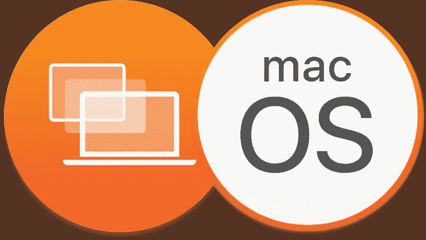

图片来源:作者

只有一小部分 AppKit API 可供 Mac Catalyst 使用，但由于 Mac Catalyst 应用程序也是 macOS 应用程序，因此它们在运行时确实可以完全访问 AppKit API。他们只是看不到，因为苹果将大多数 AppKit 类标记为 Catalyst 应用不可用。

在本文中，我们将了解如何从 Mac Catalyst 应用程序中以两种不同的方式和纯 Swift 方式访问 AppKit API。

# A.使用`Dynamic`

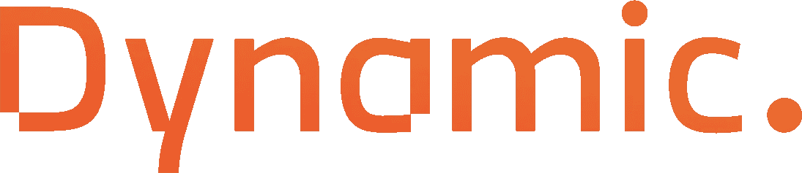

图片来源:作者

[Dynamic](https://github.com/mhdhejazi/Dynamic) 是一个库，它允许我们以简单、干净的方式从 Swift 访问 Objective-C 代码。我编写这个库是因为我想要一种简单的方法来访问 Swift 的隐藏和私有 API，而不需要创建一个单独的插件或使用使代码更难看、更难理解的消息发送技巧。

## 1.将动态添加为 Swift 包依赖项

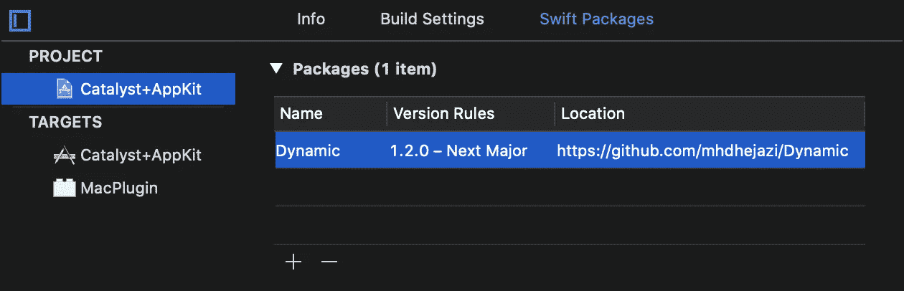

## 2.访问 AppKit API

就是这样！现在，您可以使用非常简单明了的语法来访问所有的 AppKit API，这与您在 API 是公共的情况下所做的非常相似。

例如，这是我们如何从 macOS 应用程序进入全屏，而不是使用动态的 Catalyst:

如果您需要调用几个方法或访问一个隐藏的 AppKit 类，那么 Dynamic 非常有用。对于更复杂的用例，创建一个 macOS 插件可能是更好的选择。

# B.使用插件

由于 Mac Catalyst 应用也是 macOS 应用，所以可以嵌入使用 AppKit API 的 macOS 插件，并在运行时加载。让我们构建一个非常简单的插件，使用 AppKit 的`NSAlert`显示一条消息。

## 1.添加 macOS 捆绑包目标

我们把它命名为 MacPlugin 吧。

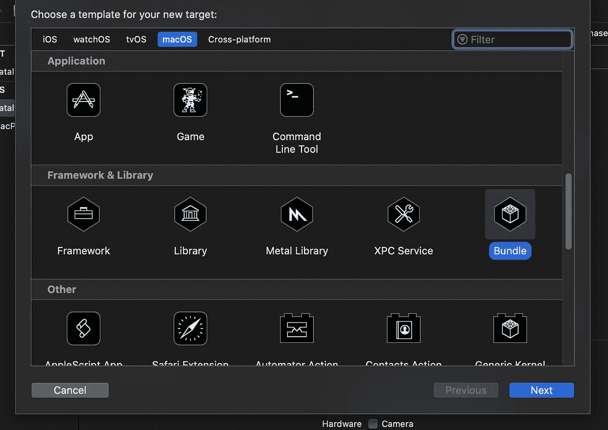

## 2.将插件嵌入应用程序目标，并将“平台”更改为 macOS

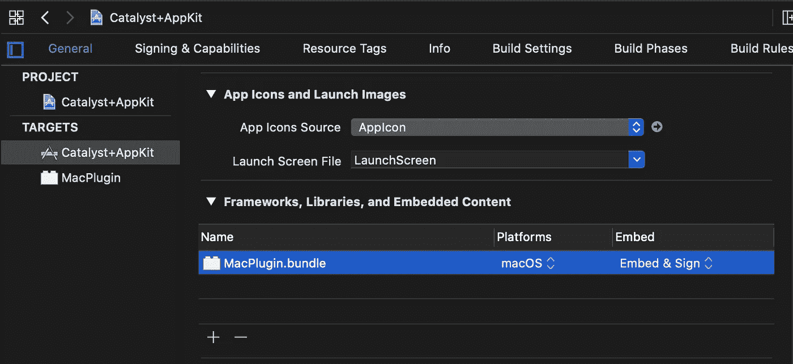

因为包是在运行时手动加载的，所以我们不能直接引用它的类。相反，我们将使这些类符合共享协议，这些协议定义了我们的应用程序和插件之间的契约。稍后，当我们从插件加载一个类时，我们将把它转换成共享协议。

## 3.创建共享协议“插件”

确保它包含在两个目标中。

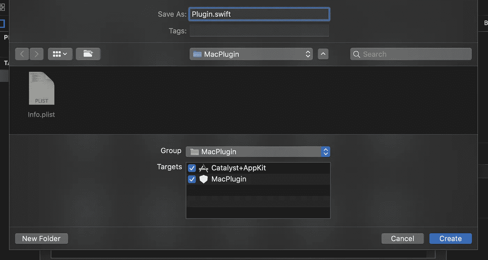

捆绑包只能加载从`NSObject`继承的 Objective-C 类或 Swift 类。共享协议通常用 Objective-C 编写，但是我们也可以使用 Swift 协议，只要它们继承自`NSObjectProtocol`并且只使用与 Objective-C 运行时兼容的 Swift 特性(例如，像结构、泛型和 enum 关联值这样的特性与 Objective-C 运行时不兼容，因此不受支持)。

当你添加 Swift 代码到插件目标时，Xcode 会建议配置一个 Objective-C 桥接头。这的确是明智的建议——接受吧！

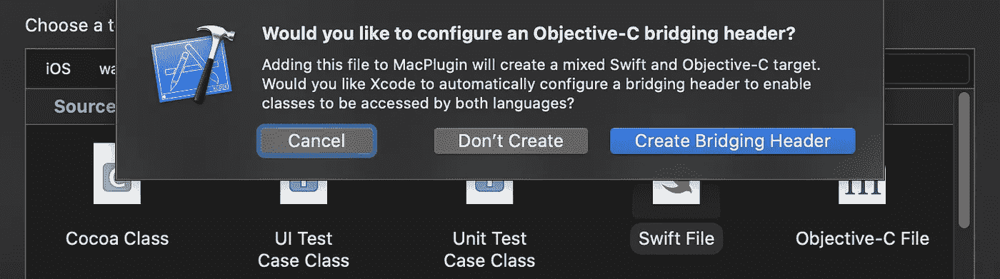

让我们用一个方法编写一个简单的协议，显示来自 AppKit land 的警报。

注意，我们用`@objc(Plugin)`对协议进行了注释。这非常重要，因为它确保了在两个目标中，协议的名称在 Objective-C 运行时看来是相同的。

如果没有注释，运行时将会看到两个名称不同的协议，因为模块名称是默认名称的一部分:
`App.Plugin`—我们的应用程序中包含的协议
`MacPlugin.Plugin`—插件中包含的协议

这意味着我们不能将符合`MacPlugin.Plugin`的插件类转换为`App.Plugin`。

另外，请注意，我们向共享协议添加了一个初始化器。这对于在将插件加载到内存中之后创建插件类的实例是必要的。

## 4.编写符合共享协议的类

您只需要将它包含在插件目标中。

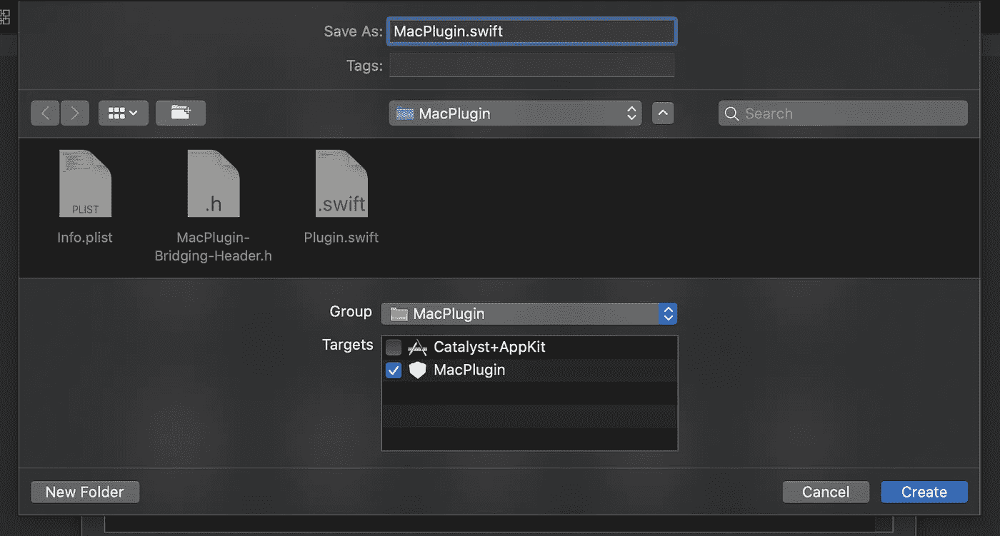

实现很简单。我们只是使用 AppKit 的`NSAlert`类显示一个警告。

## 5.加载插件包并创建一个新的`MacPlugin`实例

我们正在用插件的 URL 创建一个新的`Bundle`实例。插件包应该在主包内的内置插件目录中，因为 Xcode 会在那里复制它。

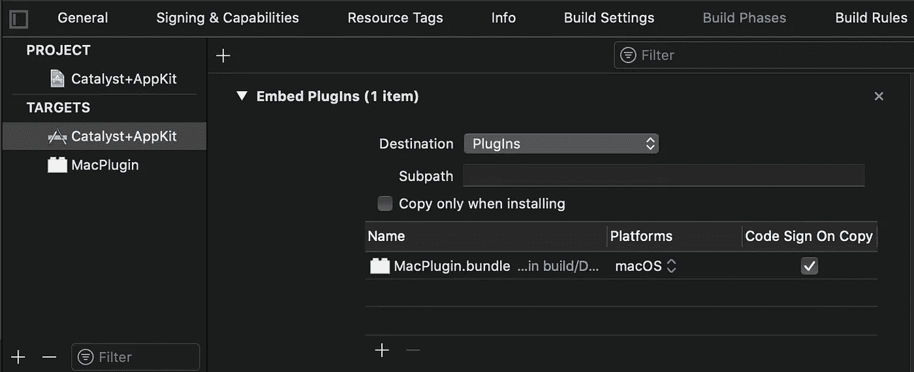

然后我们调用`bundle.classNamed()`，它将指定的类加载到内存中并返回类类型。如果找不到指定的类，该方法返回`nil`。请注意，类名必须包含模块名。

**注 1** :如果你的插件中只有一个公共类，你可以将`Info.plist`文件中的“principal class”属性(`NSPrincipalClass`)设置为完整的类名，使其成为插件的 principal 类。

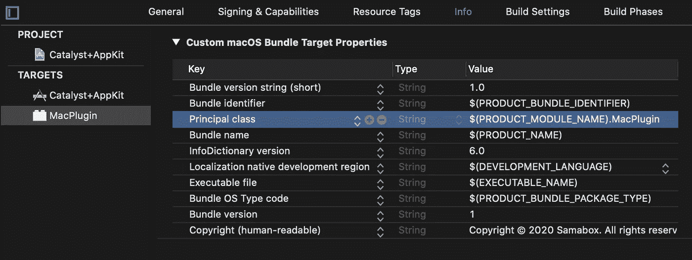

然后，您可以通过调用`Bundle.principalClass`来访问该类，而不是搜索该类。

**注 2** :我们可以通过调用`bundle.load()`显式加载插件，但这并不是真正必要的，因为当我们试图从插件中加载任何类时，插件都会自动加载。

加载类后，我们使用在共享协议中定义的初始化器创建一个新的实例，然后调用`sayHello()`。如果一切顺利，您会看到类似这样的内容:

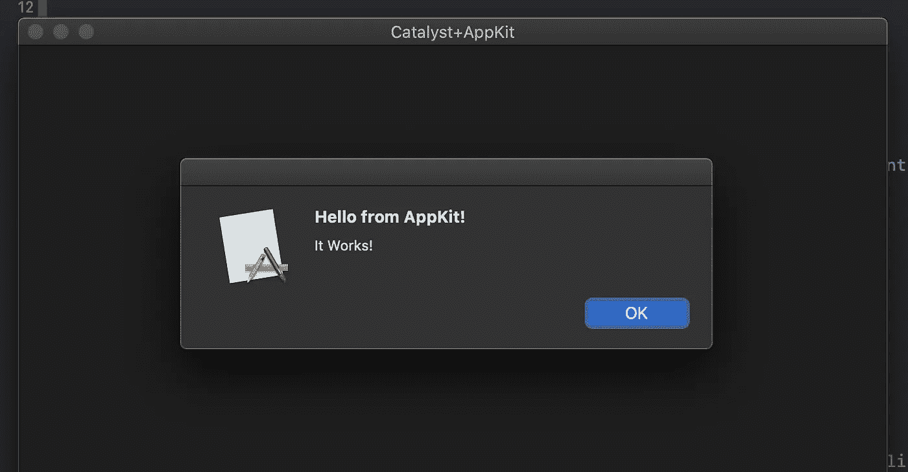

就是这样！

我希望这有所帮助。如果您有任何问题或反馈，请随时回复。你可以在 [GitHub](https://github.com/mhdhejazi/Catalyst-AppKit) 上找到这个简单插件的完整源代码。