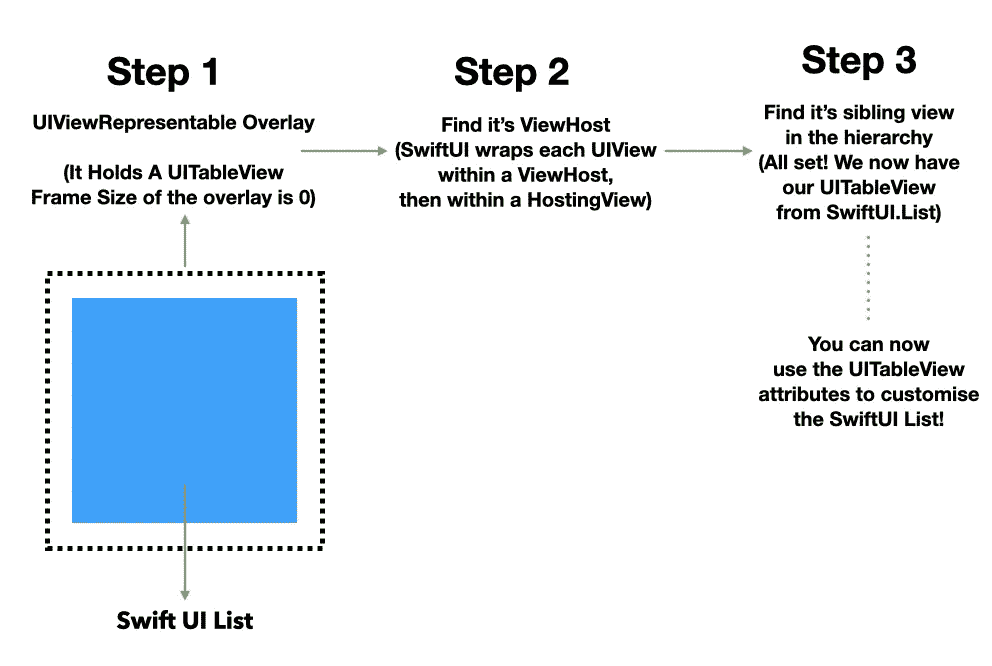
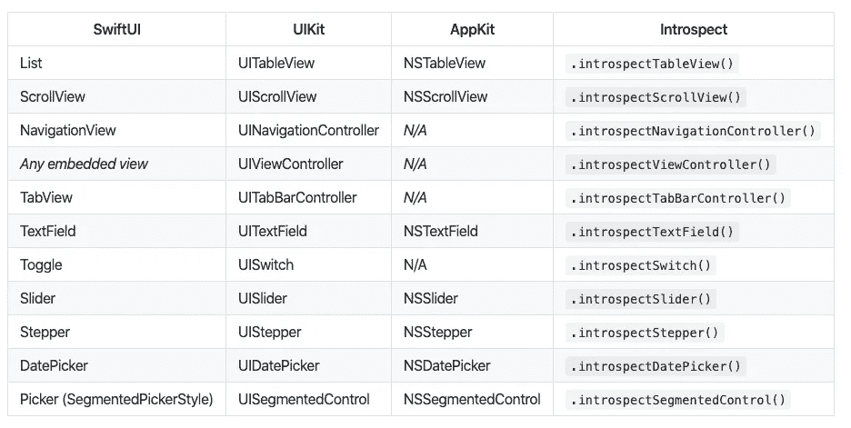
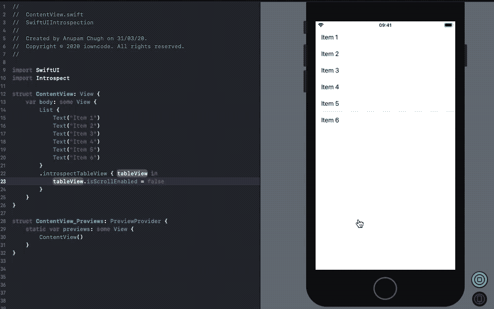
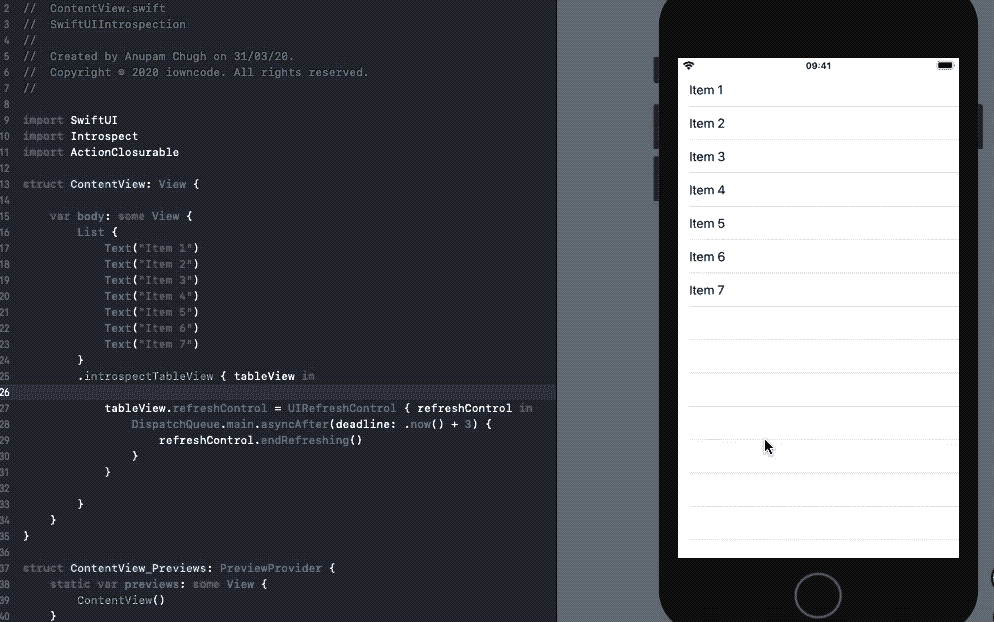
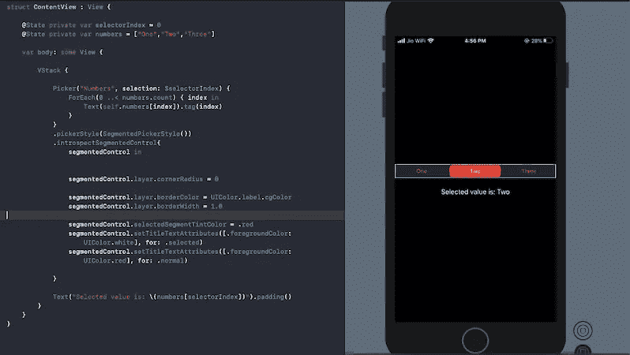
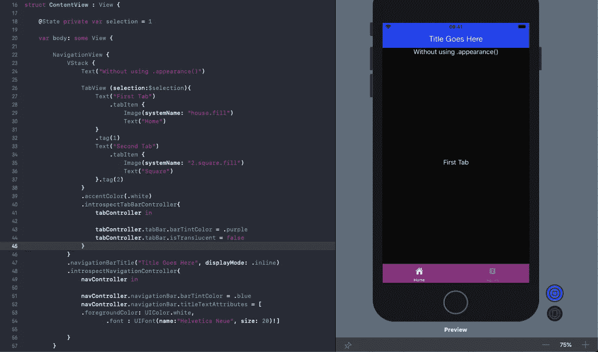

# SwiftUI 自省—在 SwiftUI 视图下访问 UIKit 组件

> 原文：<https://betterprogramming.pub/how-to-access-the-uikit-components-under-swiftui-objects-4a808568014a>

## 如何通过访问 UIScrollView 等来禁用列表中的滚动

照片由[江户努格罗霍](https://unsplash.com/@edonugroho?utm_source=medium&utm_medium=referral)在 [Unsplash](https://unsplash.com?utm_source=medium&utm_medium=referral) 拍摄。

SwiftUI 是 2019 年 WWDC 期间的热门话题。尽管工具集有限，但它创造了一种欣快感，因为您可以轻松地构建用户界面。令人高兴的是，许多 SwiftUI 组件都构建在 UIKit 之上。此外，SwiftUI 和 UIKit 的互操作性允许我们利用[UIViewControllerRepresentable](https://developer.apple.com/documentation/swiftui/uiviewrepresentable)和[UIViewControllerRepresentable](https://developer.apple.com/documentation/swiftui/uiviewcontrollerrepresentable)——两者都允许您将 UIKit 组件移植到 SwiftUI 中。

但是我们已经知道了！那么这篇文章的目的是什么呢？

在接下来的几节中，我们将研究一个令人惊叹的 SwiftUI 库([自省](https://github.com/siteline/SwiftUI-Introspect))，它让我们能够访问底层 UIKit 视图。

我们将讨论以下主题:

*   自省库是如何工作的？
*   如何禁用 SwiftUI 列表的滚动？
*   如何在 SwiftUI 列表中添加 Pull 来刷新控件？
*   如何在 SwiftUI 中自定义分段样式选择器？
*   如何更新 NavigationView 和 TabView 的颜色？
*   如何让 SwiftUI TextField 成为第一响应者？

# 在后台

自省库的工作方式是向视图层次结构添加一个定制的覆盖图，然后查看 UIKit 层次结构以找到相关的视图。

如果上面的几行没有多大意义，让我们看看下面的插图来了解自省库是如何工作的。

引擎盖下:检查 SwiftUI 视图。

本质上，我们在 SwiftUI 视图上覆盖了一个不可见的`UIViewRepresentable`。视图将挖掘视图链，并最终找到托管 SwiftUI 视图的`UIHostingView`。一旦我们得到了这些，我们就可以在`UIHostingView`中访问 UIKit 视图。

并非所有 SwiftUI 视图都可以检查。例如，SwiftUI 的`Text`不是建立在`UILabel`之上的。同样，`Image`和`Button`也不是建立在`UIImageView`和`UIButton`之上。因此，我们不能访问它们的底层 UIKit 视图——因为它们不存在。下表展示了可以检查的 SwiftUI 视图:

让我们看一些场景，在这些场景中，检查底层 UIKit 视图允许我们在 SwiftUI 当前缺失的特性上进行构建。

# 禁用 SwiftUI 列表滚动

SwiftUI 列表目前没有定制滚动能力的`isScrollEnabled`属性，就像我们在`UITableView`中做的那样。通过使用`VStack + ForEach`，我们可以解决这个问题。但是仍然有一个缺点:我们通常在 SwiftUI 列表或`UITableView`行中看到的点击效果消失了。

相反，通过使用`introspectTableView` viewModifier，我们可以在保留原生列表特性的同时轻松禁用滚动，如下所示:

同样，为了隐藏 SwiftUI 列表元素之间的分隔线，一旦我们获得了底层 UIKit 视图，我们将简单地调用`tableView.separatorColor = .none`。

# 拉动以刷新 SwiftUI 列表

SwiftUI List 在编写时不提供对刷新的内置支持。在之前的一篇文章中，我们做了一个[变通实现](https://medium.com/better-programming/pull-to-refresh-in-swiftui-6604f54a01d5)(尽管在使用大型列表时不是最好的)。很高兴，我们可以通过在 SwiftUI 列表的底层`UITableView`上设置`UIRefreshControl`来进一步减少样板代码，如下所示:

注意:我们不能在 SwiftUI 结构中定义`objc`函数。所以我们使用一个[库](https://github.com/takasek/ActionClosurable)将`UIRefreshControl`的选择器定义为一个闭包。

# 在 SwiftUI 中自定义分段控件

SwiftUI 让我们将`SegmentedPickerStyle`设置为`Pickers`。但是目前有很多限制:定制边框、半径、标题和背景属性是不可能的。

同样，通过利用底层视图，我们可以定制 SwiftUI 中分段控件的外观。在以下示例中，我们从分段控件中移除了圆角半径，并设置了其周围的边框颜色:

# 自定义导航视图和选项卡视图样式

改变导航栏中标题文本的颜色并不简单。这同样适用于 TabView。虽然有人可能建议使用`init`方法来改变外观——如下所示——但这并不是一个好的解决方案:

这个实现并没有真正定制 NavigationView 或 TabView。相反，它在全球范围内覆盖了它们的外观。

我们有一个更好的解决方法。例如，以下代码片段以简洁的方式更新了导航栏标题和背景色:

通过检查`TabView`和`NavigationView`，我们能够修改它们各自的 UIKit 视图:

# 使 TextField 成为 SwiftUI 中的第一响应者

SwiftUI 目前不提供自动弹出键盘的方式。除非我们做些什么，否则用户必须手动关注它。我们可以再次访问底层的`UITextField`并调用`becomeFirstResponder`函数，如下所示:

# 结束语

我们看到了检查底层 UIKit 视图如何让我们克服一些 SwiftUI 组件的限制。我们从列表开始，定制它们的外观并利用 scroll view API(swift ui 中没有)。我们还讨论了如何定制分段控件、导航视图、标签视图和文本字段的属性。

展望未来，你可以在 SwiftUI 中定制`Steppers`、`Sliders`和`DatePickers`，直到苹果将其推出——可能是在 2020 年的 WWDC。

这个到此为止。感谢阅读。