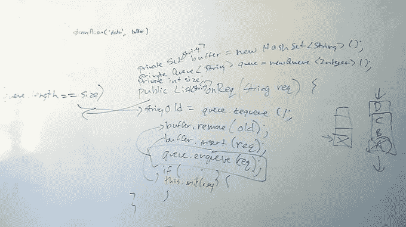

# 前脸书面试官如何在编码面试中胜出

> 原文：<https://betterprogramming.pub/how-to-ace-the-coding-interview-by-an-ex-facebook-interviewer-9c163a845d05>

## 获得你梦想中的软件工程工作

在 [Unsplash](https://unsplash.com/s/photos/coding?utm_source=unsplash&utm_medium=referral&utm_content=creditCopyText) 上由 [dhe haivan](https://unsplash.com/@dhehaivan?utm_source=unsplash&utm_medium=referral&utm_content=creditCopyText) 拍摄的照片

去年，我花了数不清的时间面试申请脸书职位的工程学候选人。

现在我已经参与了面试过程的双方，我愿意帮助你。

也许你是一名大学生，正在寻找你的第一份软件工程实习。也许你已经是一名软件工程师，正打算跳槽去一家新公司。

或者也许你不是以上任何一种，正试图从一个完全不同的行业进入软件工程世界。

这篇文章强调了我在脸书做软件工程面试官时学到的重要经验。

我希望他们能为一个让许多人感到沮丧的过程提供一些启示。

# 格式

编码面试通常是 45 分钟的谈话，意在测试你对数据结构和算法的知识。

大多数公司的实习候选人只会被要求做编码面试。然而，高级候选人可能需要进行两到三次编码面试，一到两次系统设计面试，以及一次行为面试。

这篇文章只涵盖了对编码面试的建议。

最近有人问我，“如果我不知道如何马上解决问题，我该怎么办？”

我的回应:“嗯，如果这是一个好的面试问题，你不会知道该怎么做。”

如果你做了，那还有什么意义？编码面试的目标是掌握你的编码能力。在脸书，我们称之为*信号*。

作为面试官，我们的目标总是尽可能多地提取信号。这意味着，如果我们发现您以前听过这个问题，我们的工作就是转换问题。

我们想知道你如何处理逆境。

如果你碰巧背诵了一个你从“破解编码面试”中记住的解决方案，我们对你解决问题的技巧一无所知。

# 编码面试最佳实践

绝对最佳的候选人主导面试。他们几乎不需要面试官的指导。他们是主导谈话的人，而不是面试官。

这些候选人通常会自己完成这些步骤，很少或根本没有面试官的提示:

1.  提出澄清性问题。
2.  分析各种解决方案和权衡。
3.  用伪代码规划解决方案。
4.  实施解决方案。
5.  测试。

## **领先**≦**狂奔**

领导并不意味着你匆忙地写代码。事实上，在面试的前五分钟开始写代码通常是一个非常不好的信号。

领导一场精彩面试的第一步是提出精彩的澄清性问题。

## 问一些很好的澄清问题

在你着手解决问题之前，你需要**理解**这个问题。

问几个澄清性的问题对你走向成功大有帮助。

以下是一些很好的澄清问题:

*   这个应该做到位吗？(无额外内存)
*   我们能对输入做出任何假设吗？
*   我们更关心性能还是节省内存？

这会让你专注于重要的事情，忽略其他的。知道忽略什么和知道关注什么同样重要。

## **不要做假设**

太多时候考生对问题做假设(即所有整数都是正的，数组不为空，所有输入都是安全的)……**大**红旗。

永远不要假设问题的条件是一致的，这样可以方便你解决问题。而是直接**问**。

"传入这个问题的整数都是正数吗？"

就这么简单。如果是的话，那太好了。你不必为此检查。如果没有，那么只需要一个简单的 If 语句就可以保证代码的安全。

通常，问这些问题可以给你很大的提示，告诉你该朝哪个方向前进。

## 谈论权衡

我们面试官喜欢看到应聘者讨论解决问题的各种方法。

这表明你明白解决一个问题总是有多种方法，但更重要的是，在你没有明确要求的情况下，迫使面试官给你一个暗示。Booyah！

我们不能只给你正确的答案，但如果你提出两个选项，A 和 B，并问:“你认为我应该采取哪种方法？”我们肯定会选择最接近我们想看到的答案的那个。

## 用伪代码规划您的解决方案

通常，在这些面试中，你会在白板上工作。这意味着你不能轻易地在任何你想插入的地方插入语句。在写代码之前，你必须知道**你要做什么。**

深呼吸，规划出你的代码。它可能是伪代码，也可能是一幅简单的图画，但是请确保您知道您将使用什么数据结构，以及您需要跟踪什么变量。

我相信您不希望您的最终解决方案看起来像这样:

呀!

## 实施您的解决方案

这是每个人都被挂在上面的一步，但真的不应该。

实现您的解决方案应该是容易的部分。你已经提出了很好的澄清问题，你已经考虑了各种不同的方法，你已经计划好了你的算法；现在你要做的就是编码。

但是当你这么做的时候，记得…

## 交流！

**大声说话**。如果我不知道你在想什么，就很难帮你找到正确的方向。

如果你走错了方向，我可以插一句。如果你的方向正确，我很可能会让你继续下去。

小注意:这就是面试官的风格可能是一个因素。在插话方面，有些面试官比其他人更主动。

## 测试

出于某种原因，这是最容易被忽视的一步。我敢说，我面试的 98%的候选人本可以从更好的测试中受益。

在面试开始时，通常会给应聘者一个面试问题和一个测试案例。

当候选人写完他们的解决方案，他们将运行通过给定的测试用例。唯一的问题？我们给你一个最简单的测试案例。很可能是一个没有边缘案例的测试案例，也没有正确测试代码的能力。

仅仅因为你的算法可以为这个测试用例提供正确的输出，并不意味着它可以为每个用例提供正确的输出。

在编码面试中脱颖而出的最简单的方法就是……编写更多的测试。编写更难的测试。编写全面的测试。

通常情况下，这将有助于您在不需要我介入的情况下发现错误。这对你来说很好。

# 当你不知道该做什么的时候该做什么

所以当你被问到一个你不知道的问题时，你应该怎么做？

一步一步来。

回想一下，看看这个问题是否让你想起了另一个你以前听过的问题。我问的许多编码面试问题都是基本的算法问题，这些问题在大多数数据结构和算法课程中都有讲授，只是有一个**的转变**。

如果什么都没想到，不要惊慌。这是完全正常的。

不要强迫自己马上想出最有效的解决方案。从最简单的解决方案开始。

从那里开始，思考瓶颈是什么？算法的哪个方面效率最差？你能做些什么来最大限度地减少这些低效？

## 将解决方案的弱点与数据结构的优势结合起来

当试图提高算法的效率时，有时(不总是)可以使用数据结构来帮助你。

每种数据结构都有其优点和缺点(例如，Hashmaps 查找速度，BST—排序，等等)。).

当您能够将特定数据结构的优势与问题的瓶颈相结合时，一些最佳的问题解决方案就会出现。

例如:

*给定一个句子，返回字母表中每个字母出现的次数。*

强力解决方案是让你一次计算每个字母出现的次数，然后输出结果。这里的瓶颈是存储/查找信息。我们需要存储句子中每个字母的出现次数，并在末尾查找最终结果。

如果我们看一下所有可用的数据结构，有一个非常突出:

*   二叉查找树
*   排列
*   散列表
*   AVL 树
*   堆
*   长队

最有效地存储和检索数据数据结构是哈希表。

因此，如果我们使用散列表来解决这个问题，我们就不需要将这个句子重复 26 次。我们只需要浏览一遍。

## 寻找转折

通常，面试问题会有一个转折，让你更有效地解决它们。

一些微妙的东西创造了一个独特的条件，让你比平常更有效率地做一些事情。找找这些。

这里有一个例子:

> 给定两个排序的整数数组 A 和 B，将 B 合并到 A 中作为一个排序的数组。
> 
> 你可以假设 A 有足够的空间容纳 B 中的额外元素，A 和 B 中初始化的元素数量分别是 m 和 n。

这是一个直接来自破解编码面试的问题。

注意到这里的扭曲了吗？

我们可能会遇到这样的问题，我们需要合并两个排序后的数组，但是没有。

我们有两个数组，其中一个可以完全放入另一个。

这就是我说的转折。当你看到这样的东西时，请注意它的存在是有原因的。

这些空槽实际上为你提供了一个机会，比没有它们更有效地解决这个问题。

你可以在这里阅读完整解决方案[。](https://www.programcreek.com/2012/12/leetcode-merge-sorted-array-java/)

## 请求帮助

有时，即使经历了所有这些步骤，你也不知道该去哪里。在这种情况下，你应该寻求帮助。

安静地站十分钟对我们都没有任何好处。如果你真的不知道该做什么，寻求提示是正确的步骤。

每个人偶尔都需要一点提示。真正重要的是你如何对待这个暗示。

# 结束语

技术面试是一种标准化的考试，就像 ACT、SAT、GRE 和其他许多考试一样。虽然问题的细节可能有所不同，但用来解决这些问题的主要概念和策略是相当标准化的。

许多候选人在简单的事情上犯了错误，搬起石头砸了自己的脚。做假设。没有交流他们的想法。编写糟糕的测试。

这些错误是可以纠正的，并最终决定雇佣与否。

遵循我在这篇文章中概述的框架，你会变得非常好。

*Q.E.D.
-Ish*