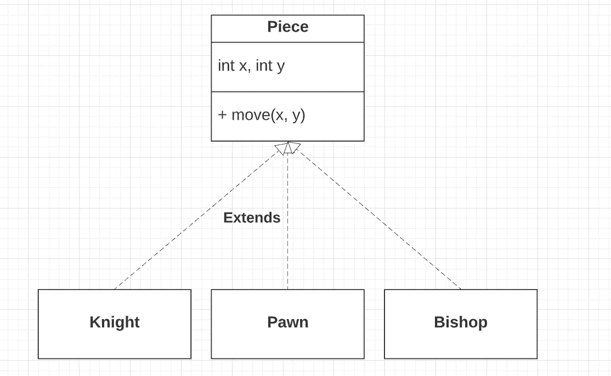
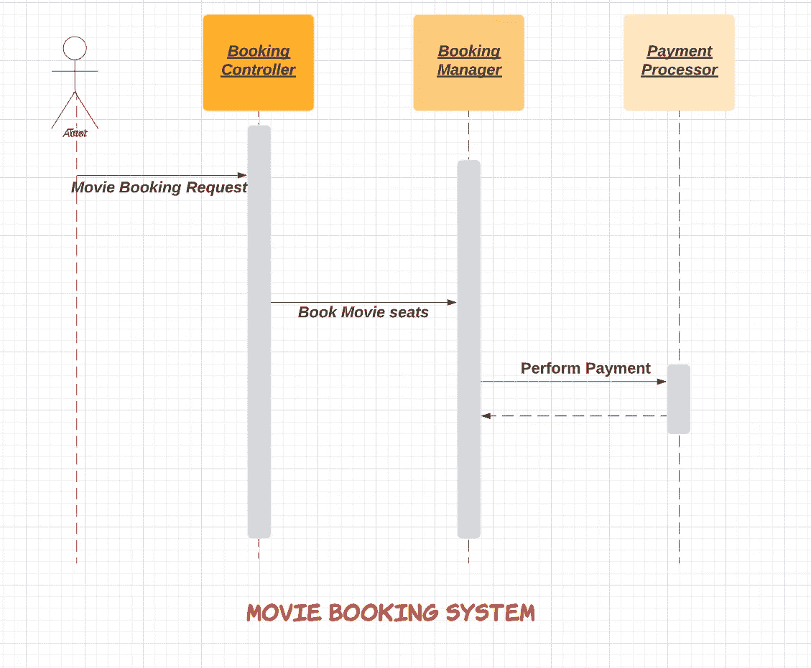
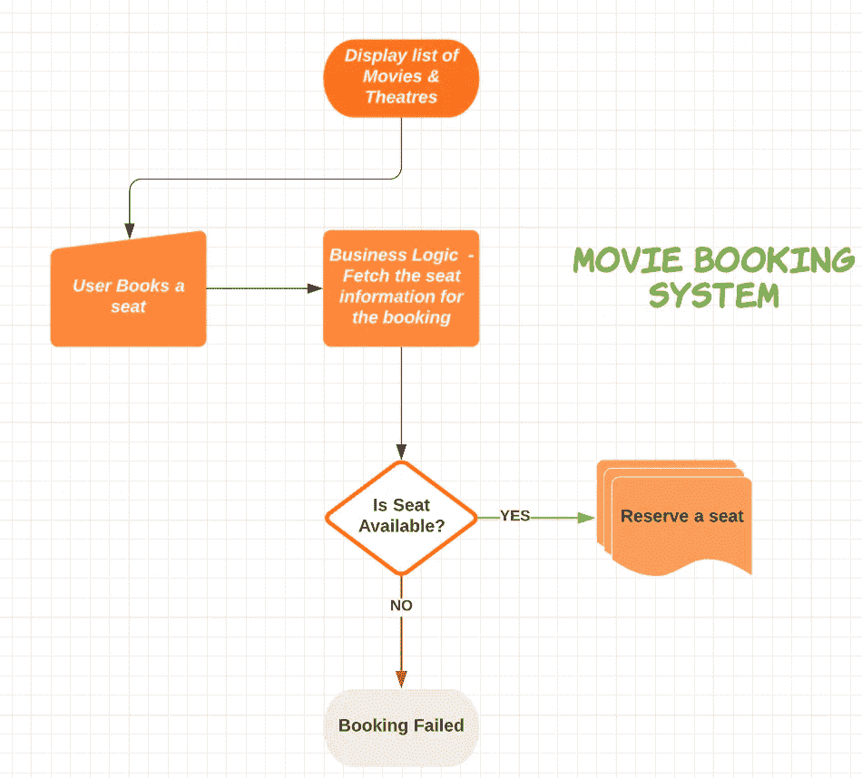

# 如何在低级设计面试中胜出

> 原文：<https://betterprogramming.pub/how-to-ace-the-low-level-design-interview-3f1be6401070>

## 破解法学博士面试的技巧和策略

照片由 [Jiroe](https://unsplash.com/@iamjiroe?utm_source=medium&utm_medium=referral) 在 [Unsplash](https://unsplash.com?utm_source=medium&utm_medium=referral) 上拍摄

# 介绍

低层次设计已经成为科技招聘过程中不可或缺的一部分。很少有公司称之为*配对编程*轮或*机器编码*轮。在这一轮中，大多数公司都会问类似于“*设计自动售货机”*的开放式问题。

我看到许多候选人在高层次设计和低层次设计之间感到困惑。有一次我问了一个候选人一个 LLD 问题，他们开始攻击它是 HLD 问题。了解两者的区别并在面试中进行沟通是很重要的。

HLD 轮次评估个人设计高级组件和扩展系统的能力。而 LLD 给出了候选人对软件建模能力的见解。

在本文中，我将分享 LLD 回合的必要性及其重要性。我还将介绍破解 LLD 面试的必要技巧、策略和资源。

# 为什么是低级设计面试？

考生花几个小时磨 Leetcode，背常见的数据结构题。此外，他们还会花时间进行系统设计和行为访谈。你们大多数人可能会问为什么还要再来一轮？需要吗？不是让考生负担过重，心力交瘁吗？

以上问题我逐一回答。让我们从一个公司的角度来看。当你创建一个有影响力的产品时，写好的代码会在公司里工作很多年。如果你拥有优秀的系统设计技能，将建立一个可扩展的和高性能的系统。良好的编码技能将确保您的代码没有错误并且资源高效。然而，软件一直在变化，公司可能会决定引入新功能。你能无缝地引入一个新特性并快速发布代码吗？

在开发任何功能时，考虑软件的可维护性是很重要的。编写的代码将由团队的其他成员管理。代码的可读性和可理解性在这个过程中扮演着重要的角色。

在 LLD 阶段，候选人应该设计类、方法和契约。面试官会评估应聘者处理模糊问题的能力。它显示了候选人编写可扩展和可维护代码的能力。它揭示了候选人对面向对象编程的精通程度。此外，设计模式和最佳实践的知识就像蛋糕上的糖衣。

# 法学博士面试结构

这一轮问的问题故意含糊其辞。问题范围从“*设计一个蛇和梯子游戏*”到“*设计一个像 LinkedIn 一样的社交网络*”。面试持续时间在 60 到 90 分钟之间。

## 需求收集

面试官可能会也可能不会给出问题的实际要求。因此，有必要进行有效的沟通并理解需求。一旦明确了需求，下一步就是根据现实世界的实体对软件进行建模。

每一个要求都会转化为系统中的行动。让我们举一个设计社交网络的例子。其中一个要求是“添加某人为好友”。在软件世界中，这是在一个类中引入一个方法`**AddFriend**`。

## 对象建模

下一步是确定实体之间的关系。根据问题的不同，关系会有所不同。

在社交网络的例子中，一个人可以创建许多帖子。因此，`**Person**`和`**Post**`之间的关系是一对多的。此外，您将在每个类中添加必要的数据成员。

## 实施和讨论

之后，候选人将大部分时间用于实施解决方案。如果时间允许，将执行代码并测试一些场景。

到最后，面试官会深入研究代码。他/她会问一些与可扩展性相关的问题。很多时候，他们会更改需求，并要求您确定对代码的影响。因此，代码应该很容易适应新的需求而无需修改。

# 如何准备 LLD 轮次？

## 面向对象编程

编写可维护代码的一个关键方面是面向对象编程(OOP)。候选人需要熟悉所有面向对象的结构和基础。人们需要将基本原理应用于给定的设计问题。

让我们假设你正在设计一个象棋游戏。您将为各个实体创建类，例如`pawn`、`knight`、`bishop`等。这些类中的每一个都显示了在棋盘上移动的共同行为。因此，您将创建一个公共抽象类并声明一个名为`move`的方法。`pawn`、`knight`、`bishop`等。类将实现此方法。这些类将使用它们的实现重写方法。实体的行为可以在父类中抽象。在这种情况下，继承、封装和多态变得很有用。

**象棋实体建模**

同样，假设您正在设计一个公司门户网站。您可能已经识别出类似于`Employee`、`Manager`等的实体。这些实体共享某些属性，如`firstName`和`lastName`。您可以创建一个名为`Person`的基类，并在其中声明公共属性。您可以使用继承来重用代码。

## 面向对象的分析和设计

在确定了设计中涉及的实体之后，您需要理解这些实体之间的交互。您需要定义两个或多个对象如何相互通信。在 UML 图的帮助下，对象可以被表示和可视化。

你可以使用类图来表示对象。面试官并不指望你在这个过程中画出 UML 图。手边有一张草图作为参考总是好的。万一你忘了什么，你可以参考图表继续。

单个功能可能涉及多个实体之间的交互。例如:-在电影预订应用程序的情况下，预订将涉及诸如`BookingController`、`BookingManager`和`PaymentProcessor`的组件。

`BookingController`将处理预订请求，并向`BookingManager`发送预订电影票的请求。`BookingManager`将与`PaymentProcessor`交互完成支付。

电影预订系统的顺序图

这可以形象地表示为序列图。序列图帮助您可视化流程。而且你可以很快了解整个系统。你可以在一张粗糙的纸上画图表，这样会更清晰。

除了序列图，你还可以画活动图。活动图有助于您获得系统的整体视图。它帮助你在一个单一的图表中表现所有的用例。您可以表示不同的流程和系统在不同时间点将采取的决策。

以下是电影预订系统的示例活动图:

**电影预订系统的活动图**

## 坚实的原则

除了 OOP 技巧，你还需要理解 S.O.L.I.D 原则，并将其应用到问题中。我写了一篇关于坚实原则的文章[这里](https://levelup.gitconnected.com/solid-principles-simplified-with-illustrations-fe5265f68ec6)。

# 如何接近一个典型的法学博士面试？

在这一部分，我们将看到解决法学博士面试问题的策略。

## 需求收集和澄清问题

*   LLD 问题陈述通常是开放式的。所以，尽可能多问问题。
*   确定需求的范围，以便您能够在给定的时间内完成实现。
*   列出您在此步骤中确定的所有特征。

## 参与者和用例

*   一旦需求明确了，你就应该确定系统中的参与者。
*   接下来，您记下每个参与者的行为和用例。
*   例如:在国际象棋比赛中，有两个玩家。每个玩家会轮流。他们中的一个会被分配黑色的棋子，另一个会得到白色的棋子。

## 活动图

*   如果需要，您可以绘制一个详细描述所有流程的活动图。
*   让我们以设计一台自动取款机为例。你将描述用户刷卡、输入 pin、提取现金等流程。
*   此外，在每一步中，您都要注意系统的行为。例如，如果余额不足，ATM 将抛出一个异常。

## 实体和对象建模

*   在这一步中，您将列出系统中涉及的对象。找出它们之间的关系。
*   这一步将帮助您提出正确的数据结构来组织数据。

## 程序表

*   到目前为止，您已经列出了系统中的所有对象。你必须设计这些对象之间的交互。
*   序列图将帮助您描述这种交互。这将使您了解每个对象将公开什么方法。
*   此外，您还必须定义实体间通信的契约。

## 履行

*   现在，你必须把所有的东西都翻译成工作代码。
*   在实施过程中，确保您遵循 S.O.L.I.D 原则。
*   你的代码需要模块化和可扩展。您可以编写单元测试来测试代码的端到端工作情况。
*   您可以将代码分解成小函数，而不是编写长代码。提取代码时，IDE 快捷方式会派上用场。
*   并跟随 D.R.Y(不要重复自己)。你写的代码应该是可重用的。

# 你应该使用设计模式吗？

这是考生问得最多的问题之一。面试时在代码中使用设计模式并不是一个硬性规定。LLD 面试不是为了评估你的设计模式知识。

大多数候选人一直在思考使用哪种模式，然后浪费时间。你需要记住你有有限的时间来编写解决方案。所以，明智地使用你的时间，多考虑模块化、可扩展性和可重用性。

然而，确定最合适的模式会给你带来好处。最常用的模式之一是单例、工厂和策略。你不必记住这些模式的代码。相反，试着理解这个框架和它试图解决的问题。这将使它很容易应用于手头的问题。

例如:-如果您正在设计一个`Parking Lot`，并且您需要基于车辆类型计算账单，那么您将为每种车辆类型创建一个`strategy`。

# 有必要用多线程吗？

人们经常注意到，面试官通常会要求应聘者将设计变成多线程的。这通常会在面试快结束时问。面试官试图衡量你在一个问题上应用并发结构的能力。

多线程的主要目标是高效利用资源。您需要确定如何将代码分解成独立的任务。你应该在面试前修改并发概念。

假设你正在开发一个`Movie Booking`系统的后端。您正在成功预订机票。在这种情况下，系统将执行多个操作。它将首先更新数据库，然后向用户发送通知。

如果你仔细观察，这两个任务是独立的。第二个任务不需要等待第一个任务完成。因此，可以启动两个线程。第一个线程将执行`database`更新，第二个线程由您管理`notification`。因此，我们实现了并行，并有效地利用了资源。

# 结论

如果你是应届毕业生，破解法学博士的面试可能看起来是一项艰巨的任务。有了经验，你就学会了提出一个好的设计。

提高设计技能的最好方法之一是参与代码评审和设计讨论。这些可以是任何东西，从开源到在你的公司工作。找一个有经验的导师，能给你指引正确的方向，总是好的。

此外，您可以提出问题，并尝试在解决问题的同时应用设计原则。例如，一个问题可能是设计消息代理或作业调度程序。如果你有一个导师或朋友，你可以让他们审查你的设计。

最后，尽量多练习题。解决不同的问题给你不同的视角，从而提高你的设计技能。你获得了足够的信心去处理和解决一个问题，这在以前是没有的。

# 参考资料:-

*   [图表](https://lucid.app/)
*   [笔记图片](https://encrypted-tbn0.gstatic.com/images)
*   [四人帮形象](https://www.packetcoders.io/python-creational-design-patterns/)
*   [探寻面向对象设计面试——互动学习(educative.io)](https://www.educative.io/courses/grokking-the-object-oriented-design-interview)