# 如何实现 React 功能组件的 100%测试覆盖率

> 原文：<https://betterprogramming.pub/how-to-achieve-100-test-coverage-for-react-functional-components-fbde1e40631c>

## 使用 Jest/Enzyme 测试 React 组件的分步指南


图片来源:许茹芸

[Enzyme](https://enzymejs.github.io/enzyme/) 是一个测试 React 组件的 JavaScript 实用程序。它提供了内置的方法来操作和遍历虚拟 DOM 以及模拟动作和事件。它允许我们断言呈现的组件按预期工作。

Enzyme、 [React 测试库](https://github.com/testing-library/react-testing-library)和 [Cypress](https://www.cypress.io/) 是与 Jest 一起工作的三个流行的测试框架。Enzyme 和 React 测试库专注于[单元测试和](/testing-your-components-in-react-967abda02396)集成测试，而 Cypress 专注于端到端测试。

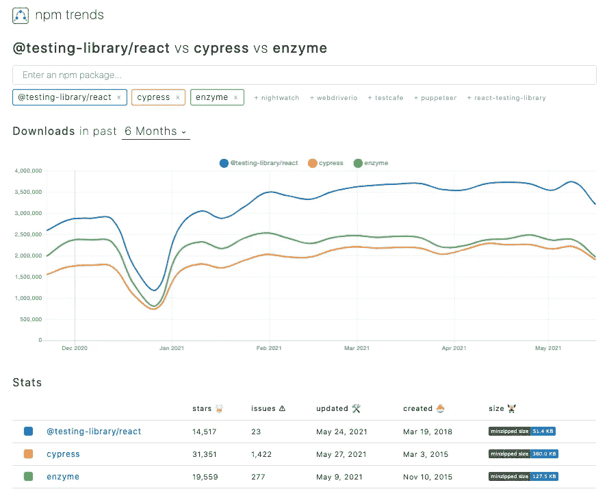

我们已经写了许多关于 React 测试库的文章。在这篇文章中，我们将进一步了解酶。

# 使用 Create React 应用程序设置酶

我们正在为工作环境使用 [Create React App](/upgrade-create-react-app-based-projects-to-version-4-cra-4-d7962aee11a6) 。

```
npx create-react-app react-app
cd react-app
```

Create React App 预配置了 React 测试库，因此我们将把它改为 Enzyme。

安装与 React 版本相对应的酶及其适配器:

```
npm i --save-dev enzyme @wojtekmaj/enzyme-adapter-react-17
```

新增的包配置在`package.json`的`[devDpendencies](/package-jsons-dependencies-in-depth-a1f0637a3129)`中:

修改`src/setupTests.js`设置酶测试环境:

我们将构建一个简单而通用的用户界面，如下所示:

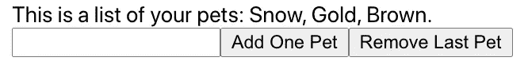

这是修改后的`src/App.js`，使用钩子重写为功能组件:

为了让用户界面工作，我们在`src/utils.js`设置了假服务:

创建 React App 隐藏`jest.config.js`。我们可以在运行命令时[配置 Jest 选项，或者我们可以将 Jest 的配置放在`package.json`中，如下所示:](/test-cases-and-test-coverage-for-high-order-components-2fb6fbddc33c)

这里，我们只收集来自`src/App.js`的测试覆盖，我们的目标是使它 100%覆盖。

本文使用的测试命令是`npm test -- --collectCoverage --u`。我们收集测试覆盖并更新现有的快照(如果有的话)。

# 使用浅层、挂载或渲染进行测试

有三种方法可以将酶装载到 React 组件中:

*   `shallow(<Component />)`:它独立于子组件测试组件。
*   `mount(<Component />)`:测试组件及其子组件。它支持测试组件的整个生命周期。
*   `render(<Component />)`:将组件渲染成静态 HTML。它支持测试生成的 HTML 结构，但不支持测试 React 代码。

## 浅的

为`shallow`快照修改`src/App.test`:

它创建了`src/__snapshots__/App.test.js.snap`:

以下是测试结果，其中语句覆盖率为 42.11%:

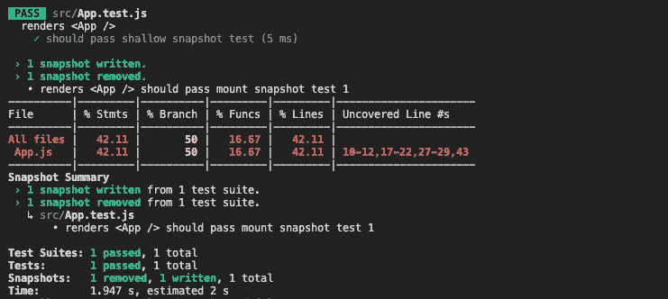

## 增加

为`mount`快照修改`src/App.test`:

它创建了`src/__snapshots__/App.test.js.snap`:

以下是测试结果，其中语句覆盖率为 52.63%:

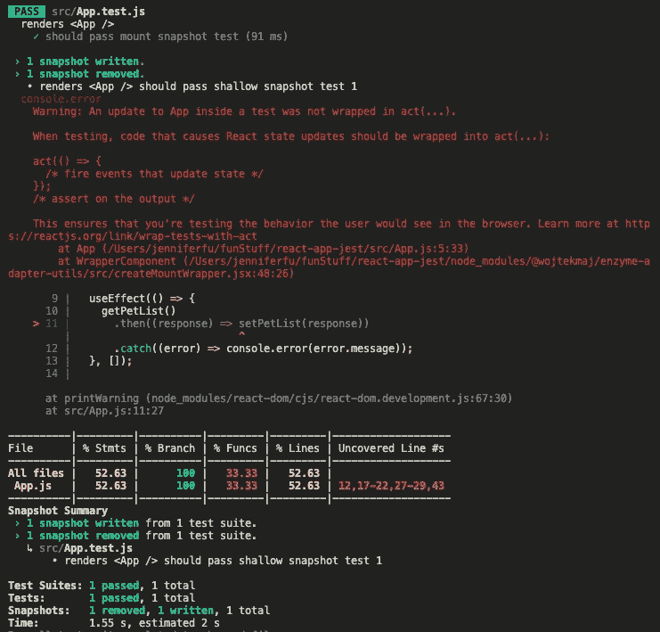

很明显，已安装组件的快照应该具有更高的覆盖率。但是这个关于“测试中的应用程序更新没有封装在`act(…)`中”的警告是什么？

Enzyme 的[问题](https://github.com/enzymejs/enzyme/issues/2073)与`useEffect`钩子进行异步调用，然后用结果调用`setState`钩子。mount 选项测试组件的整个生命周期，因此会遇到这个问题。

这个问题可以通过缠绕`act()`中的钩子来解决:

现在测试结束，没有任何警告:

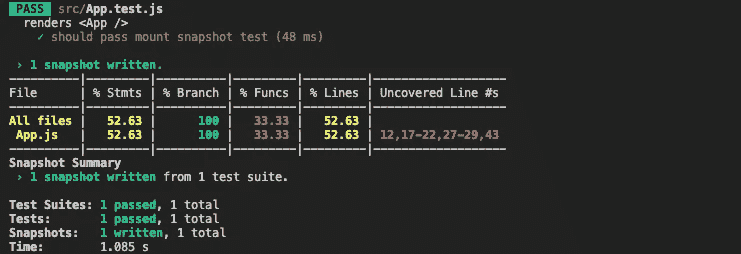

## 提供；给予

为`render`快照修改`src/App.test`:

它创建了`src/__snapshots__/App.test.js.snap`。完整版有 1468 行代码。以下是简短的版本:

以下是测试结果，其中语句覆盖率为 42.11%:

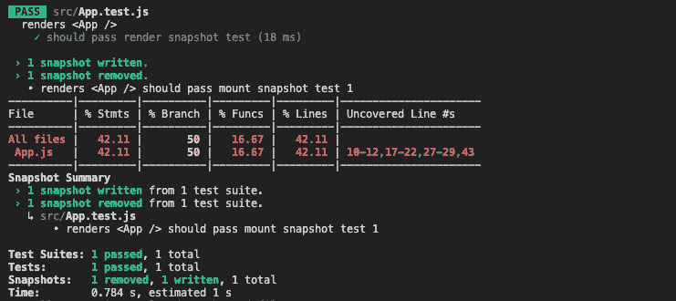

# 测试初始文本消息—达到 52.63%的覆盖率

我们已经展示了加载 React 组件的三种方式。在本文的剩余部分，我们将使用`mount`来探索酶。目标是在没有快照测试的帮助下达到 100%的覆盖率。

我们为初始文本消息添加一个测试用例:

*   第 8 行嘲讽了`getPetList`承诺电话返回`[‘Snow’, ‘Gold’, ‘Brown’]`。
*   第 13-15 行验证初始文本消息。
*   第 16 行验证了在`useEffect`中的`getPetList`承诺调用已经被调用一次。
*   第 17 行恢复了对`getPetList` promise 调用的模拟。

运行测试用例，测试用例通过。

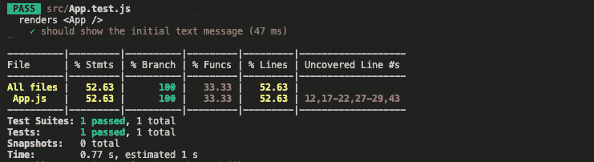

我们已经达到了 52.63%的覆盖率。

# 测试承诺失败短信—覆盖率达到 57.89%

之前的测试覆盖结果显示未覆盖的行是`12,17–22,27–29,43`。其中 12 号线与`getPetList`承诺失败通话有关，我们尽量覆盖。

*   第 2 行嘲笑`getPetList`承诺调用失败。
*   第 7 行验证文本消息是`You have no pets.`。
*   第 8 行验证了`useEffect`中的`getPetList`承诺调用已经被调用了一次。
*   第 9 行恢复了对`getPetList` promise 调用的模拟。

运行测试用例，它们都通过了。

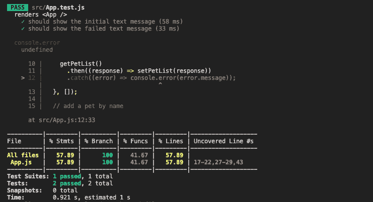

但是控制台错误是什么呢？

如果`getPetList`承诺调用失败，则记录该错误。它是用户界面代码的一部分。然而，我们不想显示它污染控制台输出。

在 [6 种静默运行 Jest 测试用例的方法](https://medium.com/swlh/6-ways-to-run-jest-test-cases-silently-67d2fead8c11)中，我们讨论了如何关闭`console.error`。解决方法是用`jest.spyOn()`来嘲讽`console.error()`什么都不做。我们可以把它放在`beforeEach`中，在每个测试用例之前执行。此外，我们可以在每个测试用例之后使用`afterEach`来清除所有的模拟。

通过修复，测试用例可以干净地运行。

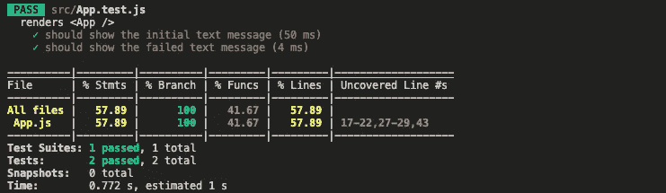

我们已经达到了 57.89%的声明覆盖率。

# 测试删除按钮—达到 68.42%的覆盖率

之前的测试覆盖结果显示未覆盖的行是`17–22,27–29,43`。让我们研究删除按钮的测试用例，以覆盖语句`27–29`。

*   2 号线嘲弄了`getPetList`诺言召唤归来`[‘Snow’, ‘Gold’, ‘Brown’]`。
*   第 3 行模拟`removePet` promise 调用成功并返回`[‘Snow’, ‘Gold’]`。
*   第 8 行找到了用户界面上的按钮。索引`1`处的按钮是删除按钮。
*   第 9-11 行模拟点击删除按钮。这个更新需要用`act`包装。
*   第 12-14 行验证文本消息是`This is a list of your pets: Snow, Gold.`。
*   第 15 行验证了`useEffect`中的`getPetList`承诺调用已经被调用一次。
*   第 16 行验证了通过点击 delete 按钮已经调用了一次`removePet` promise 调用。

因为在每个测试用例之后所有的模拟都被清除了，所以不再需要清晰的模拟代码了。

运行测试用例，它们都通过了。

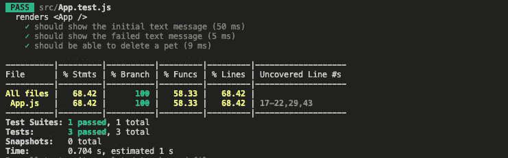

测试覆盖率为 68.42%。

# 测试删除失败案例—达到 73.68%的覆盖率

之前的测试覆盖结果显示未覆盖的行是`17–22,29,43`。为第 29 行的删除失败案例添加了以下测试案例。

*   第 2 行模拟了返回`[]`的`getPetList`承诺调用。
*   第 3-5 行模拟`removePet` promise 调用被拒绝并返回一个错误。
*   第 10 行找到了删除按钮。
*   第 11-13 行模拟点击删除按钮。这个更新需要包在`act`里。
*   第 14 行验证文本消息是`You have no pets.`。
*   第 15 行验证了`useEffect`中的`getPetList`承诺调用已经被调用一次。
*   第 16 行验证了`removePet` promise 调用已经通过点击 delete 按钮被调用了一次。

运行测试用例，它们都通过了。

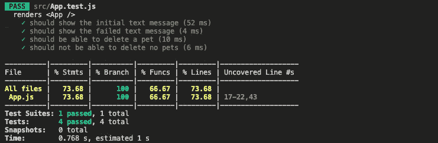

测试覆盖率为 73.68%。

# 测试添加失败案例—达到 84.21%的覆盖率

之前的测试覆盖结果显示未覆盖的行是`17–22,43`。让我们研究添加按钮的测试用例，以覆盖语句`17–22`。添加名字为空的宠物就是添加失败案例。

*   第 2 行模仿`getPetList`承诺调用返回`[‘Snow’, ‘Gold’, ‘Brown’]`。
*   第 3 行模拟了被拒绝的`addPet` promise 调用，并返回一个错误。
*   第 8 行找到了 add 按钮。
*   第 9-11 行模拟点击 add 按钮。这个更新需要用`act`包装。
*   第 12-14 行验证文本消息是`This is a list of your pets: Snow, Gold, Brown.`。
*   第 15 行验证了`useEffect`中的`getPetList`承诺调用已经被调用了一次。
*   第 16 行验证了通过点击 add 按钮已经调用了一次`addPet`承诺调用。

运行测试用例，它们都通过了。

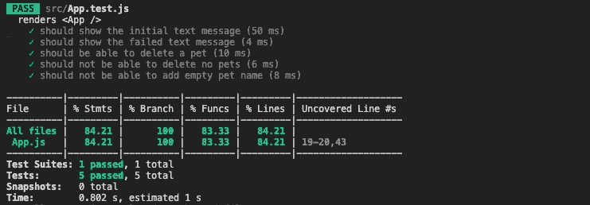

测试覆盖率为 84.21%。

# 测试添加按钮—达到 100%覆盖率

之前的测试覆盖结果显示未覆盖的行是`19–20,43`。让我们用一个测试用例来覆盖它们，以添加一个有名字的宠物。

*   第 3 行嘲笑了`getPetList`承诺调用返回一个宠物列表。
*   第 4-6 行模拟了`addPet` promise 调用，将新名字添加到宠物列表中。
*   第 11 行找到输入字段。
*   第 12 行模拟向字段输入值`Yellow`。
*   第 13 行找到了 add 按钮。
*   第 14-16 行模拟点击 add 按钮。这个更新需要用`act`包装。
*   第 17-19 行验证文本消息是`This is a list of your pets: Snow, Gold, Brown, Yellow.`。
*   第 20 行验证了`useEffect`中的`getPetList` promise 调用已经被调用了一次。
*   第 21 行验证了通过点击 add 按钮已经调用了一次`addPet` promise 调用。

运行测试用例，它们都通过了。

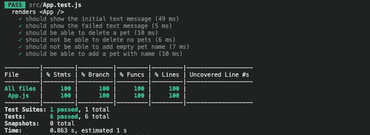

测试语句覆盖率是 100%。太好了！

# 额外提示

您可以查看 Enzyme 的文档，了解 [API 规范](https://enzymejs.github.io/enzyme/docs/api/)。以下 API 对于编写和调试测试用例非常有用:

*   `console.log(wrapper.debug())`:打印出包装器的虚拟 DOM，用于调试目的。当测试没有按预期通过时，这很有用。

这里是最后一个测试用例的虚拟 DOM，“应该可以添加一个带名字的宠物”:

*   `wrapper.update())`:将酶组件树快照与反应组件树同步。如果有外部的东西可能正在更新状态，例如来自服务器响应的 Redux 存储更新，那么在检查呈现输出之前调用是很有用的。

# 结论

在本文中，我们介绍了测试 React 功能组件所需的步骤。最后，我们达到了 100%覆盖的目标。

以下是`src/App.test.js`中的完整测试代码:

在生产中，合理的目标是 80-90%的覆盖率。最后~10-20%达到 100%可能会变得真的很难。

Enzyme 在执行单元测试和集成测试方面非常有效。

感谢您的阅读。我希望这有所帮助。你可以在这里看到我的其他媒体出版物。

*注:感谢悉达多钦塔帕里审阅我的测试案例。*