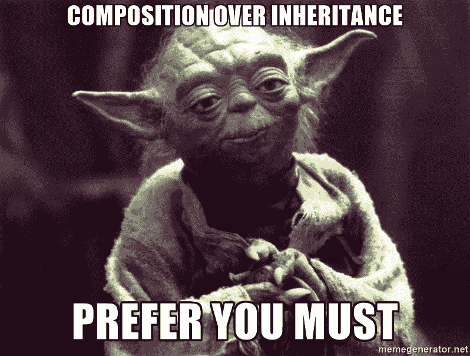

# 如何实现围棋中的哎呀原则

> 原文：<https://betterprogramming.pub/how-to-achieve-principles-of-oops-in-go-6568f7b76f5f>

## 熟悉 Go 中的 OOPs 概念，理解 Go 如何以自己独特的方式实现这些原则


费德里科·贝卡里在 [Unsplash](https://unsplash.com?utm_source=medium&utm_medium=referral) 上的照片

你可以看到上面有一个迷人的红色天体，在这个远离数百万颗恒星和行星的黑暗宇宙中，它看起来和描述的比这张照片要多得多。嗯，我们也可以把这和我们今天的话题联系起来，比如宇宙是一个大的**类**物体，指的是太阳、行星、卫星、小行星等等，都是那个类的**物体**。事实上，月光也在遗传中发挥着作用。因此，我们可以把 OOP 的概念和很多事情联系起来。那么，让我们更熟悉一下围棋。

# 什么是哎呀，为什么我们需要使用它们？

OOPs 代表*面向对象的编程系统，而*是一种编程类型，在这种编程中，我们需要定义数据类型的数据结构和特定的操作，以模块化我们的程序结构。更多可以参考这个链接:[https://en.wikipedia.org/wiki/Object-oriented_programming](https://en.wikipedia.org/wiki/Object-oriented_programming)

当我们需要模块化我们复杂的代码结构，使它更可靠，更易维护，为代码库提供一个好的框架等等时，我们需要 OOPs。

# Go 实际上使用 OOPs 概念还是一种 OOP 语言？

让我们考虑一下 Go 是一种轻量级的面向对象编程语言，因为 Go 很简单。使用相同的哎呀概念，但不要一次全部使用。首先，Go 不是一种面向对象的语言，它不是被设计成那样的，因为 OOPs 的原理被设计成由类和对象结构组成，通过实现超类、抽象类、构造函数、对象、派生类和析构函数等来维护代码基础结构。嗯，那有很多。说到 Go，它只是用自己的方式实现了它的 OOPs 结构。这场争论可能会持续很长时间，但这里有一个官方的常见问题解答链接:[https://go.dev/doc/faq#Is_Go_an_object-oriented_language](https://go.dev/doc/faq#Is_Go_an_object-oriented_language)。去看看。

下面是一些关于围棋的 OOPs 的概念，让我们试着熟悉一下。

## 包装


照片由[戴恩·托普金](https://unsplash.com/@dtopkin1?utm_source=medium&utm_medium=referral)在 [Unsplash](https://unsplash.com?utm_source=medium&utm_medium=referral) 上拍摄

简而言之，[封装](https://en.wikipedia.org/wiki/Encapsulation_(computer_programming))意味着如果我们有写在任何类或包中的单一实体数据，它对另一个类或外部世界是隐藏的，而[抽象](https://en.wikipedia.org/wiki/Abstraction_(computer_science))意味着隐藏不必要的信息

在 Go 中，我们在包级别使用这个原则，因为它不提供像 private、public 和 protected 这样的访问修饰符[。它还在变量、结构、方法和函数中起作用，所以如果你说，例如，用大写字母声明一个函数，该函数可以很容易地在当前包和另一个包中调用，因此它使它在代码结构中公开可用，而如果你用小写字母声明一个函数，它将只对那个特定的包可用，因此使它更私有和有点安全。](https://en.wikipedia.org/wiki/Access_modifiers)

围棋中的数据隐藏

因此，从上面的例子中，您可以看到函数如何根据大小写的不同变成私有和公共的。

就 OOPs 而言，封装和抽象不仅仅是数据隐藏和访问规范，它为类和接口带来了更多的特性，但在 Go 中，它只是使用了这两个概念的简化版本。

## 遗产



简而言之，[继承](https://en.wikipedia.org/wiki/Inheritance_(object-oriented_programming)#:~:text=Inheritance%20allows%20programmers%20to%20create,via%20public%20classes%20and%20interfaces.)是指从现有的基(父)类创建新的类(子类或派生类)并实现代码重用。在 Go 中，没有继承这种东西，但是有**组合**来通过 **struct-embedding** 实现结构继承，这意味着将一个结构的字段嵌入到另一个结构中。你可以通过这个链接了解更多关于结构嵌入的知识:[https://gobyexample.com/struct-embedding](https://gobyexample.com/struct-embedding)

围棋中的构图

如果从继承的角度来说，围棋只支持作曲。而继承不仅仅是像那些有 JAVA、C++等 OOPs 语言经验的人那样的组合。

## 多态性

多态性是 oop 的概念，在这个概念中，一个对象能够塑造成多种形式，就像我们的例子中的三个蜘蛛侠，从不同的维度看，有不同的形式，但实体是相同的。

在 Go 中，我们可以通过在 Go **中实现 [**接口**](https://gobyexample.com/interfaces) 来实现多态性。接口是方法的集合。让我们更熟悉一个例子。**

围棋中的多态性

因此，在上面的例子中，你可以看到 Developer struct 通过定义像 BugFix 和 Improvement 这样的方法来实现 Tasks 接口。我写这个例子是因为我们开发人员在接受不同版本的任务，如 bugfix、改进、hotfix 等时，对这些术语更加友好。

## 枚举

[枚举](https://en.wikipedia.org/wiki/Enumerated_type)是一种特殊的数据类型，枚举数据由一组元素组成。在许多语言中，大多数枚举数据都是常量类型。
在 Go 的情况下，我们可以创建枚举并相应地定义常量变量，方法是将 **iota** 声明为一系列变量中的第一个变量。iota 关键字表示从零开始的整数常量。

```
const (
     Java = iota
     Go
     Javascript
     Rust
)Output: 0 1 2 3
```

还有一些例子可以让我们更多地了解 iota 在几种初始化方式下的不同工作方式。

```
const (
     Java = iota
     Go
     _
     Rust
)Output: 0 1 3
```

如上所示，您可以看到 _ 跳过了枚举计数器中的值

```
const (
     Java = iota
     Go
)const (
     Rust = iota
     Javascript
)Output1: 0 1
Output2: 0 1
```

如上所述，您可以看到，如果您定义不同的枚举类型常量，它们将有自己的从零开始的增量值。

所以，这就是围棋中的哎呀。在下一篇文章中，我会写我们如何在 Go 中实现函数式编程，同时我也会提出系统设计原则。

敬请关注。