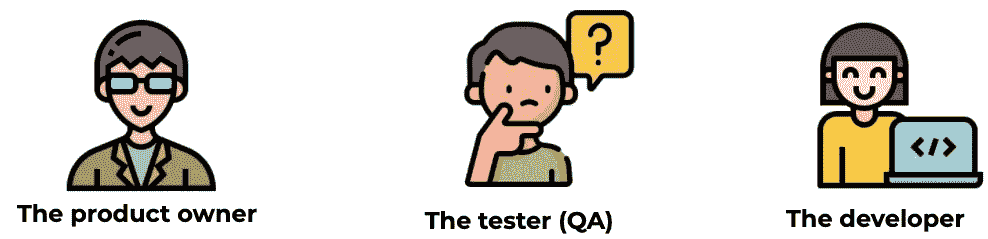

# 如何实现团队与行为驱动开发的一致

> 原文：<https://betterprogramming.pub/how-to-achieve-team-alignment-with-behavior-driven-development-163417f8eb72>

## 更好的团队，更好的代码


来自 [Pexels](https://www.pexels.com/photo/people-notes-meeting-team-7095/?utm_content=attributionCopyText&utm_medium=referral&utm_source=pexels) 的[创业股票照片](https://www.pexels.com/@startup-stock-photos?utm_content=attributionCopyText&utm_medium=referral&utm_source=pexels)

在基于 scrum 的项目中，我们的团队总会经历一段时间的冲刺计划。

与我的团队聚在一起并开始我们的下一个软件开发项目的仪式总是令人兴奋的任务。房间里的气氛有一种好奇的感觉。

由产品经理、软件开发人员和测试人员组成的团队，渴望探索我们即将开发的软件的下一个规范。

产品经理向我们展示了故事中的业务需求。我们回顾、提问并更清晰地了解业务预期。我们创建高级图表，并将工作分解成更小的任务。

当我们最终对我们的理解感到自信时，我们评估并开始我们的软件开发生命周期。

随着开发的进展，在许多情况下，我观察到我们如何慢慢地意识到每个团队成员都有他们自己对需求的解释。这导致团队中不同的人对软件应该如何运行有不同的理解。

这激发了团队寻找一种有效的方法来最小化误解和错误沟通的必要性。

我开始研究行为驱动开发或 *BDD* 。BDD 吸引我的第一个方面是产生所有团队成员都能理解的可执行测试场景的可能性，而不管他们的角色。

我喜欢让技术人员和非技术人员参与这个过程的想法。在开发开始之前，有意识地寻求发现团队不了解什么是一种实践。

# **行为驱动开发**

BDD 是一个敏捷的开发过程。它可以很容易地作为你的冲刺计划仪式的一部分。非常鼓励使用对话和具体的例子。BDD 传达了一种意图，即形成对应用程序应该如何运行的共同理解。

BDD 不会也不应该取代你的测试驱动开发(或者 TDD)。相反，它是 TDD 的扩展，结合了 TDD 的一般技术和原理。

在很大程度上，BDD 可以通过使用自然语言构造的简单领域特定语言来实现。在 BDD 中，英语或你的母语的句子可以表达行为和预期的结果。

# BDD 的三个步骤

我和我的团队喜欢用三个简单的步骤来实现 BDD。这些步骤受到 BDD 文档网站上建议的基本活动的启发。

我们添加了一种适合我们的口味。在您的实现中也可以这样做。

## **第一步:沟通**

首先，谈谈即将到来的功能的具体例子。发现未知，发现新的需求，并就预期行为的细节达成一致。

在这样做之前，确保房间里至少有这三个原型:



*   产品所有者——这个人决定项目范围内的内容。
*   测试者**——这个人提出了许多场景。此外，测试人员会考虑可能导致应用程序崩溃的边缘情况。**
*   **开发人员**——这个人通过添加成功实现场景所需的步骤和细节来赋予场景生命。****

## ******第二步:文档******

****接下来，以非技术性和人类可读的方式记录这些场景。****

****小黄瓜是用来定义可执行场景的语言。它被设计成非技术性的和人类可读的，并且集中描述了与软件系统相关的用例。****

****使用 Gherkin 编写的场景:****

```
**Scenario: Eric wants to withdraw money from his bank account at an ATM**Given** Eric has a valid Credit or Debit card
**And** his account balance is $100
**When** he inserts his card
**And** withdraws $45
**Then** the ATM should return $45
**And** his account balance is $55**
```

****如上所示，Gherkin 使用了一组特殊的关键字。词语*给出了*、*和*、*当*和*然后*给出了可执行场景的结构和含义。****

## ******第三步:编码******

****最后，根据那些文档化的场景编写自动化测试来指导您的软件开发。****

****黄瓜是软件开发者支持行为驱动开发的工具。从上面提到的三个步骤开发的场景是用小黄瓜编写的，cumber 可以很容易地解析它。****

****我使用 jest-cumber 库在前端执行我们的场景。确保您为您的项目找到了正确的 Cucumber 库，以及您想要从中执行场景的栈。****

# ****结果****

****拥有一个包含场景的文档，团队中的人都可以阅读，这样他们就可以快速理解我们软件的行为，这是令人满意的。****

****将 BDD 集成到我们的项目中，我最喜欢的方面是让产品经理参与创建可执行的测试用例，而不需要他们具备运行软件测试所需的技术知识。****

****在实现 BDD 之后，很容易看到对话、文档和执行是如何有效地联合一个团队甚至整个组织的。****

****感谢阅读！****