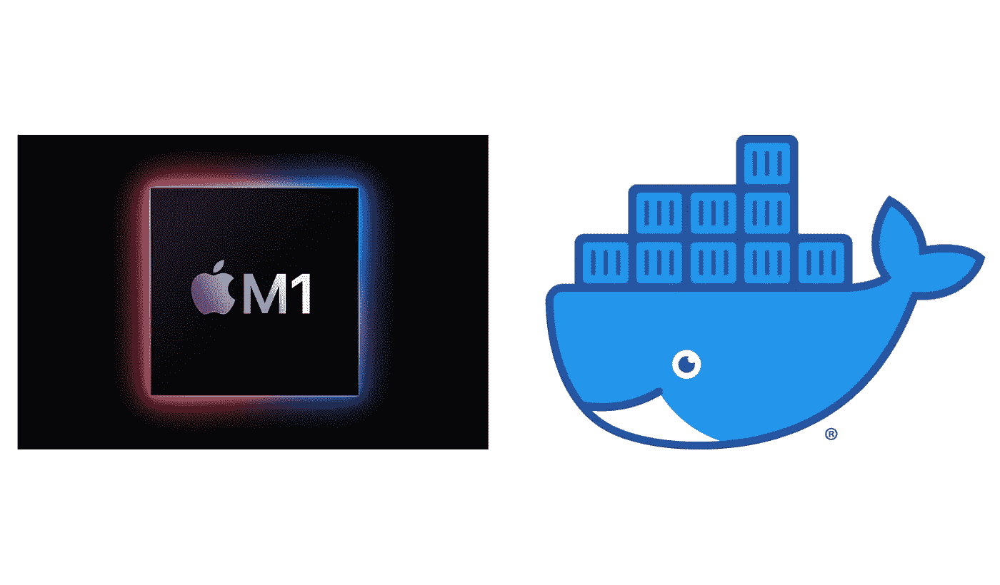
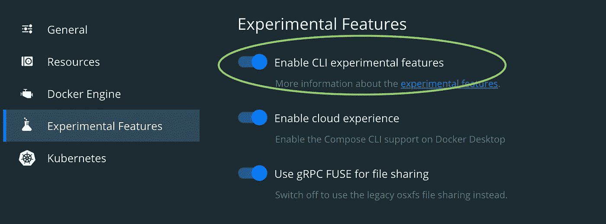

# 如何实际部署基于苹果芯片的 M1 MAC 电脑的 Docker 映像

> 原文：<https://betterprogramming.pub/how-to-actually-deploy-docker-images-built-on-a-m1-macs-with-apple-silicon-a35e39318e97>

## 帮助您从 M1 Mac 部署跨平台版本的指南



苹果硅 M1 和 Docker。作者照片。

在使用苹果芯片的早期“技术预览”Docker 桌面构建时，我很快就进入了与不同架构和部署相关的学习曲线。我现在可以在我的 M1 Mac 上构建和运行映像，但这是我在将基于 Apple Silicon 的 Mac 构建的映像推送到 AWS 上的 ECS 实例时看到的错误:

```
standard_init_linux.go:219: exec user process caused: exec format error
```

希望本指南能帮助您更快地部署从您的新机器构建的映像！

# 安装兼容的 Docker 版本

Docker 团队在构建 M1 芯片方面进展非常迅速，值得称赞。你可以从他们的网站获得最新的[“科技预览”。请注意，他们不建议在生产中使用该版本。](https://docs.docker.com/docker-for-mac/apple-m1/)

虽然你现在可以在 Mac 上运行 Docker 容器，但是你需要在不同的架构上运行。幸运的是，Docker 有一个叫做`buildx`的工具可以帮你搞定。

安装完成后，开始构建其他架构的第一件事就是启用实验特性:



这将使 Docker `buildx`程序可用。Docker 有[文档](https://docs.docker.com/buildx/working-with-buildx/)和几篇关于它的博客文章。我们现在将走过它。

# 使用 buildx

Buildx 附带了一个默认的构建器，您可以通过在终端中键入`docker buildx ls`来观察它。然而，我们想自己制造和使用一个生成器。

## 成为建设者

你将需要一个新的建造者，所以用`docker buildx create --name m1_builder`建造一个。现在你应该在运行`docker buildx ls`的时候看到新的构建器了。

## 使用并引导构建器

接下来的步骤是“使用”新的构建器并引导它。从`docker buildx use m1_builder`开始，然后是`docker buildx inspect --bootstrap`，它将检查并引导您刚刚开始使用的构建器实例。您应该会看到类似这样的内容:

```
computer@computer-m1 ~ % docker buildx inspect — bootstrap[+] Building 5.3s (1/1) FINISHED=> [internal] booting buildkit 5.3s=> => pulling image moby/buildkit:buildx-stable-1 3.1s=> => creating container buildx_buildkit_m1_builder0 2.3sName: m1_builderDriver: docker-containerNodes:Name: m1_builder0Endpoint: unix:///var/run/docker.sockStatus: runningPlatforms: linux/arm64, linux/amd64, linux/riscv64, linux/ppc64le, linux/s390x, linux/arm/v7, linux/arm/v6
```

你可以看到这个构建器有一大堆它要构建的平台！

## 与构建者一起构建

现在，`cd`您的终端进入您想要构建和推送映像的位置，这样您就可以运行这个伪命令:

```
docker buildx —-platform linux/amd64,linux/arm64,linux/arm/v7 -t <remote image repository> --push .
```

您应该看到“正在使用”的构建器疯狂地构建您指定的架构。

如果你不想要尽可能小的构建，你需要知道你要部署的架构。在我的例子中，我的 AWS ECS 任务需要`linux/amd64`，这是我在`--platform`标志后使用的唯一选项。

## 显示

构建并推送映像后，您可以使用以下命令检查清单:

```
docker buildx imagetools inspect <remote image repository>
```

您应该会看到包含所有不同体系结构的清单打印输出。大多数获取图像的服务都足够聪明，知道应该获取哪种架构。

## 打扫

最后，正如你可能已经经历过的，Docker 会开始占用一些磁盘空间。如果你没有使用`buildx`，你可能会跑`docker system prune --all`，幸运的是`buildx`的对等词在语义上是相似的。

```
docker buildx prune --all
```

就是这样！快乐的容器开发！