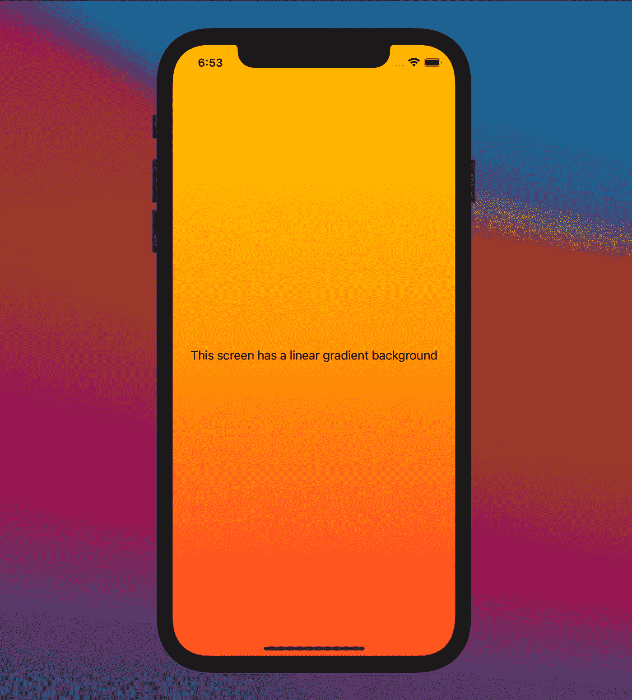
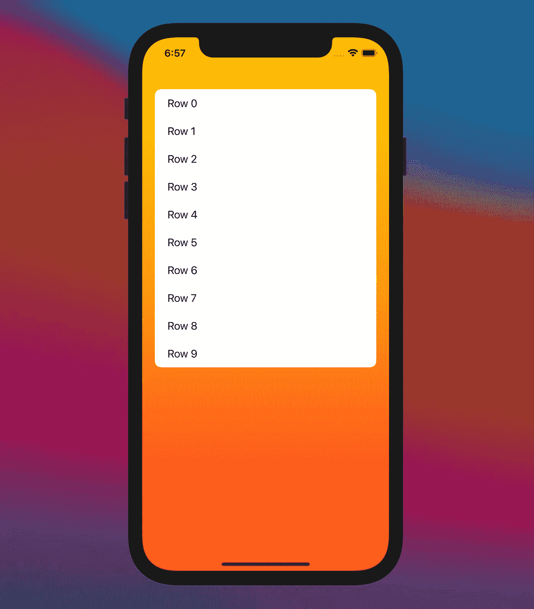

# 如何在 SwiftUI 中添加背景

> 原文：<https://betterprogramming.pub/how-to-add-a-background-in-swiftui-98fd0001c8ef>

## 在 UIKit 中，在任何视图上设置背景都非常简单——在 SwiftUI 中则稍微复杂一点

[秋工作室](https://unsplash.com/@autumnstudio?utm_source=medium&utm_medium=referral)在 [Unsplash](https://unsplash.com?utm_source=medium&utm_medium=referral) 拍摄的照片

从素色到渐变和自定义视图，这篇文章将教你**如何给 SwiftUI 视图**添加背景，以及如何包装该功能以便在需要时重用。

# 基础知识

让我们从一个简单的观点开始:

# 彩色背景

在这篇文章中，我将向你解释给我们的视图添加彩色背景的两种方法:

## 1.使用`ZStack`

第一种方法是创建一个`ZStack`结构，其中颜色背景是实际内容后面的第二层:

## 2.使用`.overlay`视图修改器

第二种方法是添加所选的颜色作为主要元素，然后添加一个`.overlay`修饰符，其中包含显示在背景顶部的内容。

注意:我已经包括了修改器`.edgesIgnoringSafeArea(.all)`来填充屏幕到设备边缘。如果您不想要这种行为，只需移除修饰符。

# 使其可重复使用

现在是时候重构代码，以形成一个可重用的解决方案。为此，您将创建一个外部结构，其中包括已经解释过的方法之一。

由于这两种方法达到了相同的结果，你可以选择你最喜欢的一种。我会用第二个。

结构`init` 方法接收两个输入参数:

*   要显示的`color: Color`。
*   将作为覆盖图包含在内的`content: () -> Content`。它是一个闭包，所以您可以很容易地在构造函数调用中包含我们的内容。该参数标有标签`@ViewBuilder`，因为它可以是任何类型的视图。

回到我们最初的视图，结果将是这样的:内容包装后清晰而容易地显示出来:

彩色背景手机

# 自定义视图背景

一旦您创建了显示单色的背景视图，让我们扩展解决方案以支持任何类型的视图作为背景。

主要区别在于背景内容类型，从`Color`移动到`BackgroundContent`，可以是任何种类的`View`。

更新`init`方法以支持`BackgroundContent`输入参数，而不是`Color`输入参数。

此外，更新对`BackgroundView`的调用，以包含包含您的定制视图的闭包。

具有线性渐变背景的电话

注意:您可以通过使用第二个解决方案来摆脱之前的单色解决方案:在自定义背景视图闭包内添加颜色。

# 特殊情况

这在与像`Text`这样的元素一起使用时效果很好，但是将这种解决方案与其他 SwiftUI 元素一起使用可能需要额外的配置。发生这种情况是因为一些 UI 元素包含了它们的背景，所以需要移除它们。

让我们看看如何在一个`List`元素后面添加一个彩色背景。

为了使`List`背景透明，您将声明一个`UITableView.appearance()`配置，使列表和列表行背景清晰。

具有使用列表的自定义背景的手机

# 结论

如果你有一些关于堆叠和覆盖的知识，在 SwiftUI 中添加一个背景视图并不是一件大事。您在本文中了解到的干净的解决方案提供了灵活性，从而避免了对额外代码的需求。所以，在任何屏幕上包含都非常方便。

我希望你喜欢这篇文章！