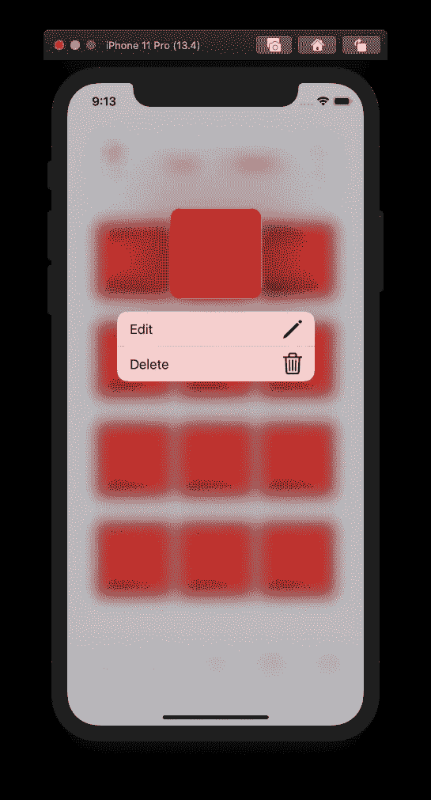
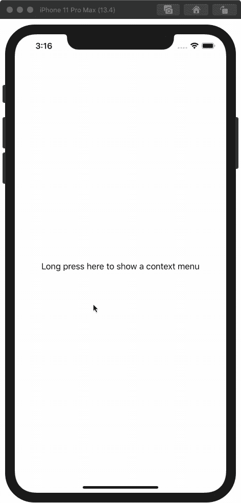
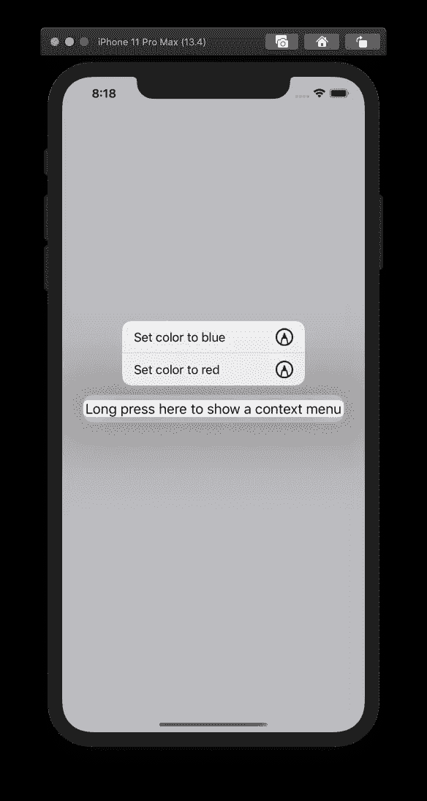

# 如何在 SwiftUI 中向视图添加上下文菜单

> 原文：<https://betterprogramming.pub/how-to-add-a-context-menu-to-a-view-in-swiftui-36a91189fc9d>

## 向用户展示他们可以在你的应用中执行的其他操作

照片由[日出照片](https://unsplash.com/@sunrisephotography?utm_source=medium&utm_medium=referral)在 [Unsplash](https://unsplash.com?utm_source=medium&utm_medium=referral) 上拍摄。

回购示例可以在我的 [GitHub](https://github.com/maeganjwilson/context-menu-example) 上找到。

# 什么是上下文菜单？

上下文菜单是可以触发动作的按钮的集合。通常，在 iOS/iPadOS 中长按屏幕上的某个项目，或者在 macOS 中右键单击，都会触发上下文菜单。它可用于按钮或项目的后续操作。

上图是我的 iOS 应用 [iHog](https://ihogapp.com/) 中上下文菜单的一个例子。

# 如何添加上下文菜单？

为了添加一个上下文菜单，我们将使用`contextMenu()`修饰符并传递它`Button()s`来显示。

下面是一个基本的 SwiftUI 视图，其文本视图的字体颜色设置为红色:

我把字体颜色变成了一个变量，这样我们就可以用上下文菜单来改变它。

要向`Text()`添加上下文菜单，添加修饰符`contextMenu()`，如下所示:

这将产生错误`Type of expression is ambiguous without more context`，因为`ContextMenu`内没有按钮。让我们添加一个按钮来改变字体颜色:

通过添加这两个按钮，我们现在可以长按文本并改变颜色，如下面的 GIF 所示:

在第一张图中，菜单包含图标。这些可以通过在文本和图像周围加上一个`HStack`来添加到`Button()`中。现在，让我们这样做:

苹果在你的应用程序中提供带有 SF 符号的图标。

这就是在 SwiftUI 中制作上下文菜单的方法！感谢阅读。有问题就留言评论吧！