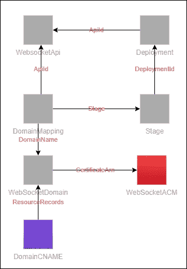
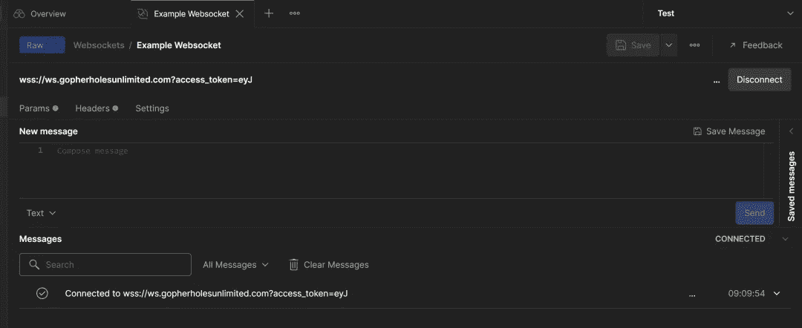

# 如何向 AWS WebSocket 添加自定义域

> 原文：<https://betterprogramming.pub/how-to-add-a-custom-domain-to-your-aws-websocket-9f8354445671>

## 了解如何向您的 WebSocket 添加自定义域


布里特妮·科莱特在 [Unsplash](https://unsplash.com/s/photos/phonebook?utm_source=unsplash&utm_medium=referral&utm_content=creditCopyText) 上的照片

域名被认为是理所当然的。这是那些假定存在的事情之一，如果它们不存在，灾难就随之而来。

我们看到大量的教程展示如何创建一个 API 或者建立一个网站，但是我们很少看到如何添加一个必要的润色——一个**域名**。

所以今天我们将通过添加一个自定义域来为我们的 WebSocket 教程打上蝴蝶结。

这是 WebSockets 介绍系列的第 5 部分。每一部分都建立在前一部分的基础上，所以如果你现在加入我们，我强烈推荐阅读前四部分。

*   [第一部分——构建 WebSocket](/introduction-to-aws-websockets-8b336a92c379)
*   [第二部分—保护您的网络插座](/using-authoriser-for-aws-websockets-caf7a0441c8e)
*   [第三部分—使用异步 API 规范的文档](/aws-websockets-writing-documentation-using-async-api-spec-6c4ccc77f20)
*   [第四部分—用户通知](/how-to-build-user-notifications-with-aws-websockets-93b1b16b8af4)

# 先决条件

在配置自定义域之前，您必须做两件事:[购买您的域名](https://docs.aws.amazon.com/Route53/latest/DeveloperGuide/domain-register.html)和[设置一个公共托管区域](https://docs.aws.amazon.com/Route53/latest/DeveloperGuide/CreatingHostedZone.html)。这些需要手动完成，以便为 WebSocket 选择和部署 GitHub repo 的第五部分中的堆栈。

购买域名必须手动完成。从技术上讲，托管区域可以通过我们的 SAM 模板来完成，但是它是在假设您在同一个域名下也有一个 REST 或 HTTP API 的情况下构建的。根据这一假设，我们将重用 Route53 中的公共托管区域。

如果你想开始将一个现有的 REST 或 HTTP APIs 放在自定义域之后，我写了这篇文章带你在 AWS 控制台中完成这件事。

# 新参数

如果您一直在跟踪这个系列，并且一直在使用从`sam deploy --guided`命令生成的`samconfig.toml`文件，那么您需要再次运行这个命令。如果您现在是第一次加入我们，您需要第一次运行命令来配置部署参数。

部署自定义域有三个新参数:

*   `DeployCustomDomain` —如果要部署自定义域，请设置为`true`。如果您不希望这样做，请将其设置为 false。
*   `DomainName` —您希望您的 WebSocket 位于其后的域名。在我的例子中，我使用了`ws.gopherholesunlimited.com`。
*   `HostedZoneId` —您创建的公共托管区域的标识符

# 自定义域 AWS 资源

在 AWS 中为 WebSocket 设置域名有几个组件在起作用。没有一个是特别直观地拼凑起来的。



*自定义域后设置 WebSocket API 的组件图*

为了让我们的 WebSocket 使用自定义域，我们正在部署的资源有:

*   **ACM 证书** —验证我们拥有该域的 AWS 证书
*   **API Gateway v2 域名** —在 API Gateway 中为 WebSocket 配置自定义域
*   **从域名到 API 的域映射** —设置基本路径( */* )以使用我们的 WebSocket API 和正确的阶段
*   **CNAME DNS 记录** —将我们域名的`id`映射到全球记录的 DNS 记录

这些都已配置好，可以在 SAM 模板中部署。一旦您配置了部署参数并运行了`deploy`命令，我们的 WebSocket 就可以通过我们的自定义域名访问了！

**重要说明** —如果您通过 Route53 购买了域名，SAM 部署将会工作。AWS 允许[自动 DNS 验证](https://docs.aws.amazon.com/AWSCloudFormation/latest/UserGuide/aws-resource-certificatemanager-certificate.html)如果您的域在 Route53 中，它驻留在您部署到的 AWS 帐户中，并且您正在使用 DNS 验证(我们就是这样)。

# 挑选你的域名

选择域名时要记住的一点是，它不能与 HTTP 或 REST API 共享现有的域。域名只能与单一类型的 API 一起使用。

这意味着如果您在像`api.gopherholesunlimited.com`这样的域名后面有 REST 或 HTTP API，您就不能为 WebSocket ( `api.gopherholesunlimited.com/websocket`)使用基路径。在 API Gateway 中必须是自己完全独立的域。

基于此，我建议像我一样为你的 WebSocket 创建一个单独的子域，`ws.gopherholesunlimited.com`。

有了新的域名，连接方法基本保持不变。你仍然需要通过`wss`协议连接到你的域，你仍然需要添加`access_token`头。我的 WebSocket 连接 url 是:

```
wss://ws.gopherholesunlimited.com?access_token=eyJ******
```

在 Postman 中更新我们的连接 url 并尝试连接…



*通过我们的自定义域成功连接！*

# 结论

这就结束了我们的 WebSockets 系列。还有一个帖子是关于如何将 WebSockets 实现到您的应用程序中，以从长期运行的同步端点转变为具有状态更新的流畅的异步工作流。

我希望你喜欢学习 WebSockets，并且和我写这些一样开心。这是一次冒险。我希望您能够部署堆栈，试用它，甚至将它集成到您的应用程序中！

编码快乐！