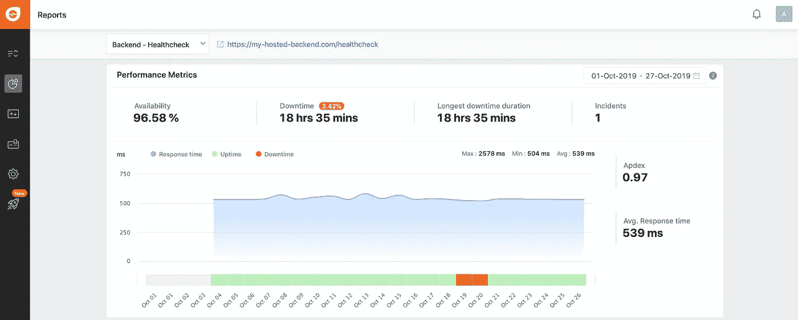

# 如何向 Node.js 应用程序添加运行状况检查

> 原文：<https://betterprogramming.pub/how-to-add-a-health-check-to-your-node-js-app-5154d13b969e>

## 无需深入研究代码，即可查看您的应用是否正在运行

在 [Unsplash](https://unsplash.com?utm_source=medium&utm_medium=referral) 上由 [Ani Kolleshi](https://unsplash.com/@anikolleshi?utm_source=medium&utm_medium=referral) 拍照

随着越来越多的用户使用你的软件，对软件可用性的责任也越来越大。让我们看看为什么我们需要软件的高可用性。

# 为什么我们需要软件的高可用性

*   在 SLA 中，您通常指定您应该保持的有保证的可用性(例如 99.9%)。
*   对于 B2C 应用程序(例如网上商店)，[宕机可能意味着高额的财务损失](https://venturebeat.com/2013/08/16/3-minute-outage-costs-google-545000-in-revenue/)。
*   除了财务影响，意外停机还会损害您的声誉。

既然我们已经理解了为什么我们需要高可用性，我们就来看看可能导致高可用性的常见问题。

# 可用性如何受到负面影响

*   软件中妨碍应用程序正常工作的关键问题(例如，与数据库的连接失败)。
*   第三方基础设施问题(例如，您的云提供商意外停机)。

显然，我们应该对确保我们的应用程序可用和健康非常感兴趣。

问题是:“您的应用程序何时真正健康？”因为健康的定义对你来说意味着什么，这可能很难说出口，也很难实现。这是你需要自己定义的东西。

# 如何定义应用程序的健康状况

*   服务器可以响应请求。
*   服务器可以响应请求并连接到数据库。
*   服务器可以响应请求，可以连接到数据库，可以连接到其他第三方系统和集成。

API 测试可用于调用您的健康检查端点。然而，有专门的服务，如 [Pingdom](https://www.pingdom.com/) 、 [New Relic](https://newrelic.com/) 和 [Freshping](https://www.freshworks.com/website-monitoring/) 可以持续监控网站和服务器的可用性。

这些工具提供的常见数据和功能:

*   可用性。
*   停工期。
*   事故数量。
*   平均响应时间(通常以毫秒为单位)。
*   过去事件的总结。
*   选择显示相关数据的时间范围。
*   与其他流行软件工具的集成:Slack、[吉拉](https://www.atlassian.com/software/jira)、[page duty](https://www.pagerduty.com/)等。

# 为什么在软件项目中使用健康检查？

*   健康检查很容易实施。如上所述，你必须定义健康对你意味着什么。
*   无停机部署。例如，[渲染](https://render.com/docs/zero-downtime-deploys)平台会在部署应用程序时自动调用健康检查路径。
*   一旦发生停机，立即检测出来。有很多免费和付费的工具提供连续的正常运行时间监控:Pingdom、New Relic 和 Freshping。
*   健康检查在出现问题时提供健全性检查。如果您有[随叫随到的职责](https://www.pagerduty.com/resources/learn/call-rotations-schedules/)并且出现了问题(例如，一个实例出现故障)，检查服务的健康状况是第一件也是最容易的事情，无需深入实际代码。因此，即使是最基本的健康检查也提供了一些价值。

在本教程中，我们将使用 Node.js 的流行框架 [Express](https://expressjs.com/) ，但是，如果您使用其他框架或其他编程语言，如 C#、Java 或 Python，步骤是相似的。

# 如何向 Node.js 应用程序添加健康检查

1.  创建新路线(例如`healthcheck.routes.js`)。
2.  在`app.js`中注册您的路线。我建议给这条路线命名为`healthcheck`。
3.  在您的`healthcheck`路线中，如果一切正常，您需要发送一个成功响应，如果您的应用程序不健康，您需要发送一个错误响应。
4.  如果您有多个微服务，您应该为每个微服务添加运行状况检查。
5.  可选:添加验证以限制对您的健康检查路线的访问(例如，使用 [JWT](https://jwt.io/) )。
6.  可选:添加调用此新路由的 API 测试。

# 工具如何使用健康检查，以及它们如何支持我们

在本教程中，我将使用刷新来监控托管 API 的健康状况。下面的报告显示了 2019 年 10 月的数据。

让我们更详细地看看这份报告:

*   在选定的时间段内，可用性为 96.58%。通常，您的目标应该是至少 99%的可用性。许多软件供应商承诺至少 99.90%的可用性，尤其是对企业客户而言。
*   乍一看，96.58%的可用性听起来相当不错，但是您必须注意停机时间:几乎 19 个小时的连续停机时间对您的业务非常不利。因此，在事故发生时尽早得到通知非常重要，这样您就可以快速解决问题。
*   在选定的时间段内发生了一起事故。当然，你应该尽可能地保持这个数字。万一发生事故，应尽快解决，以最大限度地减少影响。
*   平均响应时间为 539 毫秒，相当一致。这种一致性是一个好迹象，因为它意味着我们的运行状况检查工作可靠。
*   虽然平均响应时间还不错，但也不是很快，因为您应该尽可能缩短响应时间。这可能表明确定应用程序的健康状态涉及太多的步骤。另一方面，这可能只是基础设施的问题(例如，服务器离客户端太远，或者硬件不够强大)。

# 结论

感谢阅读这篇文章。如您所见，向 Node.js 应用程序添加健康检查很容易。

当然，如果您使用其他编程语言编写服务器端代码，您也可以(并且应该)添加健康检查。像 Pingdom 或 Freshping 这样的工具可以定期检查我们的应用程序的健康状况，并帮助我们尽早发现问题。

您如何实施健康检查，使用什么工具？