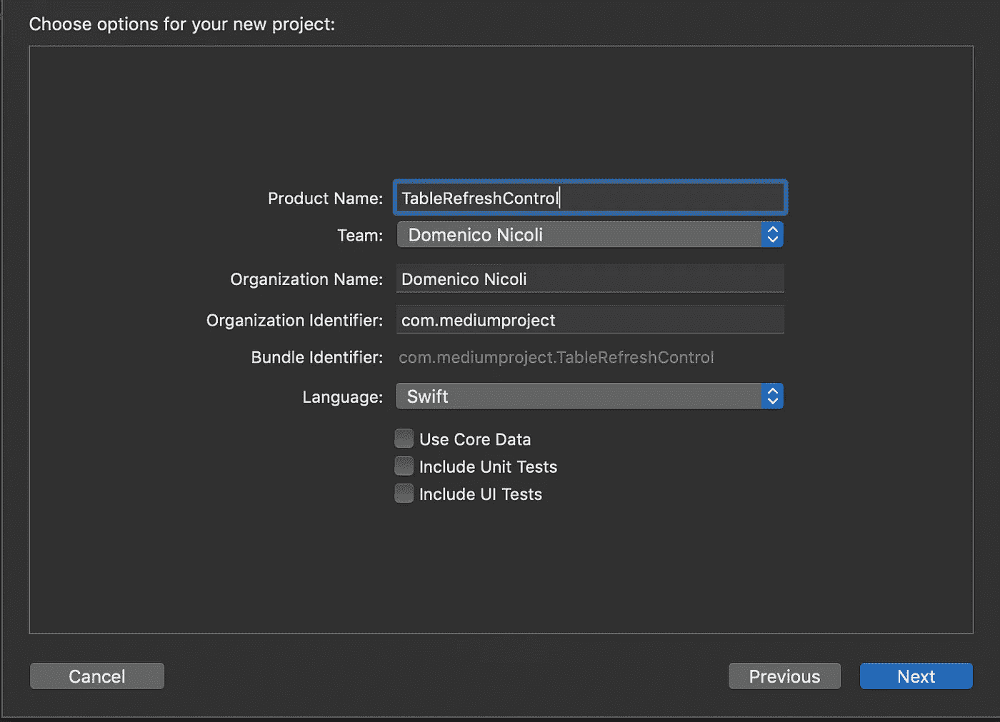
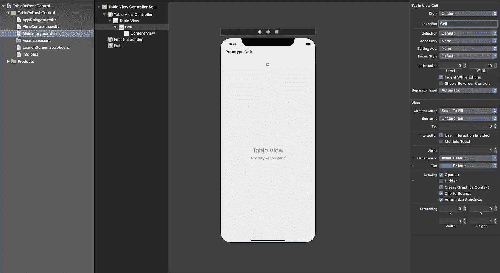
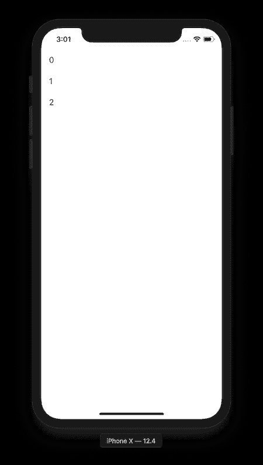
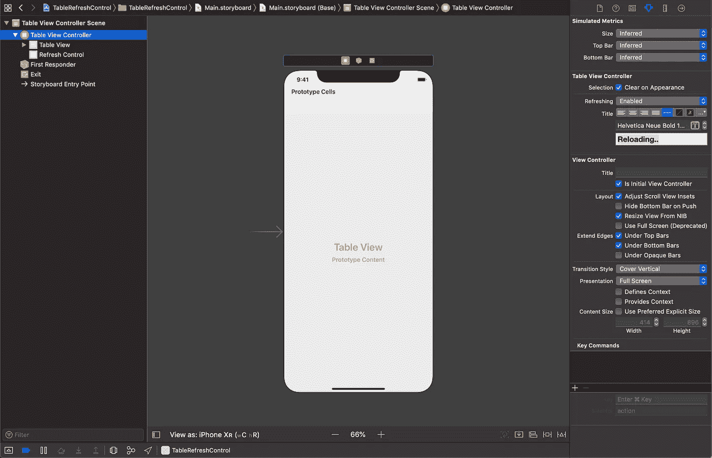
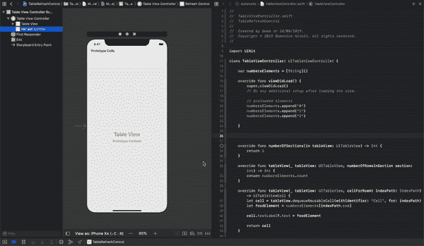
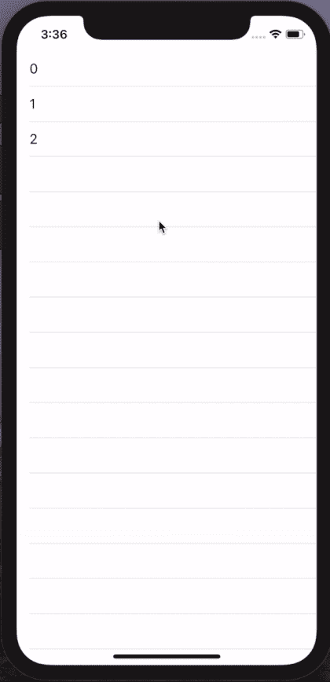

# 如何使用 Swift 在 UITableViewController 中添加拉至刷新功能

> 原文：<https://betterprogramming.pub/how-to-add-a-pull-to-refresh-feature-in-your-uitableviewcontroller-using-swift-5622fbf35664>

## 了解如何利用这个非常有用的隐藏功能

查尔斯·🇵🇭在 [Unsplash](https://unsplash.com?utm_source=medium&utm_medium=referral) 上拍摄的照片

开发人员偶尔会问我是否知道任何可用于管理`UITableView`刷新的开源库。

当我回答“为什么不用已经嵌入的苹果刷新控件？”人们常说，“已经有原生控件了？”

可能看起来很奇怪，但是很多开发者并不知道这个功能从 iOS 6 开始就有了。

下面你可以找到一个如何在不到五分钟的时间内实现它的示例项目。更多信息，你可以在这里找到苹果文档。

# **简介**

首先，新建一个 Xcode 项目。可以从单视图 app 开始。

在本指南中，我将使用故事板，因为使用图形参考更容易解释，但所有这些都可以通过代码以编程方式完成，没有任何问题。

现在继续故事板，删除`ViewController`，添加一个`UITableViewController`。通过属性检查器将其设置为`Initial View Controller`。然后选择`UITableViewCell`，并将标识符重命名为`Cell`。

现在创建`TablewViewController`文件，并在`TableViewController` Identity Inspector 上将它设置为自定义类。下面您可以看到我是如何用一些元素填充表格的:

如果您现在运行这个应用程序，您应该会看到一个包含三个元素的简单表格。

极简设计，对吧？

# UIRefreshControl

最后，我们可以谈谈我们的新朋友。

回到故事板，选择`TableViewController`，启用属性检查器下的刷新选项。您还可以自定义字体、颜色和文本对齐方式。

然后将`Refresh Control` 出口链接到您的代码，并添加`valueChanged event`。务必选择`UIRefreshControl` 作为发送方。

我们差不多完成了——我们只需要给我们的新事件添加一些逻辑。例如，我们可以添加一个以最后一个数字`+ 1`作为值的新元素。

# 最后试验

现在让我们试着运行它，看看在模拟器上会发生什么。

好哇

# 结论

我们在没有第三方库的情况下刷新了表格内容。请记住，我们也可以在我们的应用程序中使用这一点，通过网络请求获得新的内容数据，就像脸书和 Instagram 应用程序所做的那样，只需更改`changedValue` 事件中的代码。

**你可以在这里** **找到** [**的完整代码。**](https://github.com/domeniconicoli/TableRefreshControl)