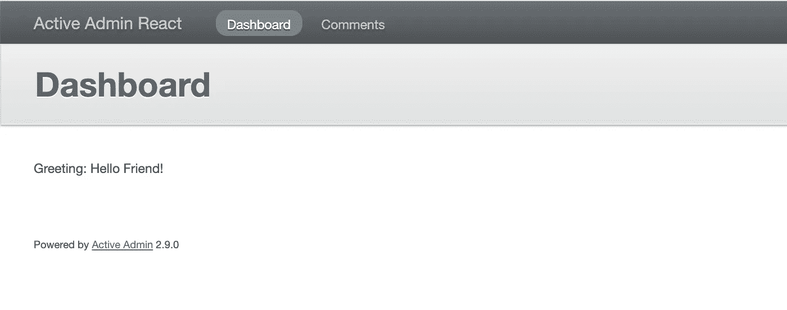
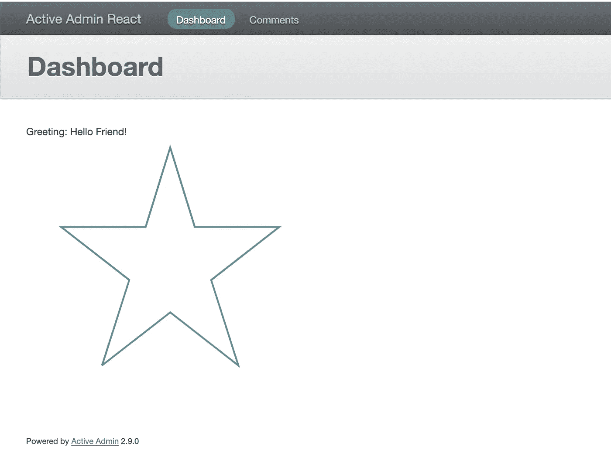

# 如何向活动管理添加 React 组件

> 原文：<https://betterprogramming.pub/how-to-add-a-react-component-to-active-admin-9fe6151033eb>

## 使用此库快速构建管理面板

斯坦利·戴在 [Unsplash](https://unsplash.com?utm_source=medium&utm_medium=referral) 上的照片

众所周知，您可以用 Ruby 快速编写和测试您的商业想法。这可以在 Rails 和 Active Admin 的帮助下完成，Active Admin 是一个允许您用最少的精力和时间快速创建管理面板的库。但是有时表单或信息小部件非常复杂或动态，以至于您开始考虑转向现代前端，而不是使用熟悉但不太受支持的 jQuery 代码。

在这些情况下，Vue.js 和 React 非常有帮助。在本文中，我将告诉您如何将 React 组件添加到 Active Admin 中。

让我们考虑 Active Admin 使用 Webpacker 管理资产的完美场景。查看[官方文档](https://activeadmin.info/0-installation.html#webpacker)以了解如何设置该模式。

# 活动管理员和 Webpacker

让我们从添加和安装`activeadmin`和`react-rails`宝石开始:

现在运行安装程序:

让我们将`HelloWorld` React 组件添加到目录*app/JavaScript/components*:

要使组件在 Active Admin 中可见，请将以下代码添加到*app/JavaScript/packs/Active _ Admin . js*:

现在让我们添加一个新的 Arbre 组件，它将允许我们轻松地调用 React 小部件(单击[官方文档](https://activeadmin.info/12-arbre-components.html)阅读更多关于 Arbre 组件的信息):

最后，让我们调用 *dashboard.rb* 中的组件:

太神奇了！您现在可以在 Active Admin 中使用 React 组件了！

# **主动管理和资产渠道**

如果您的项目使用链轮来管理活动管理资产，可以通过资产管道集成 react-rails(单击[自述文件](https://github.com/reactjs/react-rails#use-with-asset-pipeline)了解详细信息)。这就是我如何从上面的例子中运行 HelloWorld.jsx 的，但在我看来，这种方法很难维护，所以我建议添加`webpacker`并使用它来构建 React 组件。

首先，将 gem `webpacker`添加到 Gemfile，然后安装`react-rails`，像上面那样添加 Arbre 组件和 React 组件。

唯一的区别是我们没有文件*app/JavaScript/packs/active _ admin . js—*，所以让我们创建它:

另一个不同点是:由于我们在链轮模式下工作，主动管理并不连接这个包，所以我们需要手动连接。例如，像这样:

此外，还有一些“更纯粹”的选项，例如，您可以编写下面的`ActiveAdmin`扩展:

现在让我们将扩展添加到初始化器的开头:

最后，让我们更改 *app/admin/dashboard.rb* :

这就是诀窍。界面可以更方便，但我想重点介绍这个选项。确保重新加载应用程序，以使初始化器的更改生效。

# React-rails 和 Webpacker 的作用

让我们让手册更贴近实践:让我们向项目添加 Typescript 支持和带有 React 组件的外部库。然后我们将使用一个. tsx 文件调用组件。

让我们从配置 TypeScript 开始:

现在让我们将测试组件从。jsx 到。tsx:

让我们以 [react-vis](https://github.com/uber/react-vis) 作为外部库的例子。我们首先添加一个依赖项:

我们添加一个新组件*app/JavaScript/components/plot . tsx*:

让我们检查一下新组件的工作情况:

就这样，现在您知道如何将 React 添加到 Active Admin 中了。我希望你向前看，下定决心在实践中使用(或不使用)这些知识！