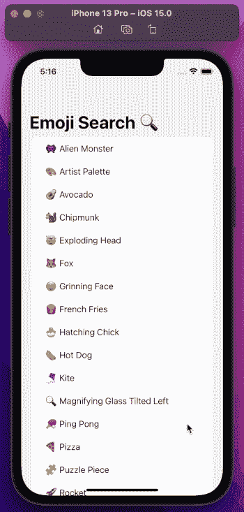
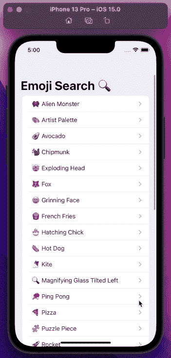
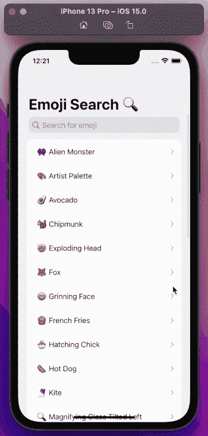
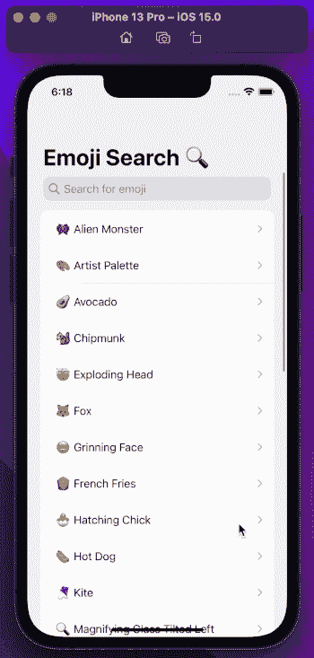

# 如何用 SwiftUI 添加表情符号搜索栏

> 原文：<https://betterprogramming.pub/how-to-add-a-search-bar-with-swiftui-d76a0b46a07e>

## SwiftUI 简化了搜索栏、列表和导航的实现

作者图片

在本教程中，我们将使用 SwiftUI 构建一个简单的应用程序，允许您查看和搜索表情列表。

在创建一个使用 SwiftUI 作为接口的新 Xcode 项目后，我们将开始添加一个模型结构来表示列表中的每个表情符号。

继续创建一个名为`EmojiProvider`的新文件。

在这个文件中，我们将添加一个名为`EmojiDetails`的`struct`，它有 4 个属性(id、表情符号、名称、描述)，如下所示:

在定义了我们的模型结构之后，我们将添加另一个名为`EmojiProvider`的`struct`，它将包含一个返回包含多个`EmojiDetails`的列表的方法。

就在`EmojiDetails` `struct`上面，可以添加下面的代码:

我们将使用这个`EmojiDetails`数组来填充`View`的`List`。

现在让我们转到`ContentView.swift`文件。

在`ContentView`中，我们首先要添加一个名为`searchResults`的计算变量。

现在，这将返回我们刚刚定义的完整数组，但是稍后，我们将根据用户在搜索栏上键入的文本过滤列表。

现在我们可以修改我们的`View`的`body`来显示一个嵌入在`NavigationView`中的`List`，它显示`searchResults`中的每个`EmojiDetails`。

如果你运行你的应用程序，你现在应该可以看到表情列表，就像这样:

现在我们将更新我们的代码，以便点击列表中的任何一行都会显示更多关于表情符号的详细信息。

在`ContentView.swift`文件中，我们将定义一个名为`EmojiDetailsView`的新视图。

现在在`ContentView` `struct`中，我们将使用一个`NavigationLink`，这样每当点击列表中的一行时，就会显示一个`EmojiDetailsView`。

让我们再次运行我们的应用程序。点击列表中的任意一行，应导航至详细视图:

我们最终将把搜索栏添加到我们的视图中。我们将首先添加一个名为`searchText`的新状态变量。这个变量将保存用户在搜索栏中键入的文本，最初将是一个空字符串。

为了显示搜索栏，我们将使用`[searchable](https://developer.apple.com/documentation/swiftui/view/searchable(text:placement:prompt:)-18a8f)`修饰符。在`navigationTitle`下面，我们将增加`searchable`，并将提供一个`text`、`placement`和`prompt`。

对于文本，我们可以将绑定传递给我们的`searchText`变量。

对于`placement`，我们将使用`navigationBarDrawer`和显示模式`always`。这样，搜索栏将始终可见。

最后，对于提示，我们可以提供一个字符串。当用户没有在搜索栏中键入任何内容时，就会显示这个字符串，我将使用`“Search for emoji”`。

最终，我们的`ContentView`看起来会是这样:

既然我们将`searchText`绑定到在搜索栏中输入的文本，我们可以更新`searchResults`变量的值。

我们将只返回其名称或表情与用户的搜索查询相匹配的表情细节。

所以让我们更新一下:如果搜索文本为空，那么我们可以显示所有的表情细节项。

否则，我们将过滤列表，只返回那些姓名或表情符号包含`searchText`中文本的人。

对于名称，我们应该进行不区分大小写的比较。我们的`searchResults`变量现在看起来像这样:

让我们再次运行我们的应用程序。我们现在应该能够使用视图顶部的搜索栏来搜索特定的表情符号。

我们要做的最后一件事是在用户输入时提供一个建议列表。

我们可以通过向`searchable`提供一个闭包来实现这一点，这个闭包将返回一个包含建议的视图。我们将添加一个名为`suggestedResults`的新变量。

如果搜索文本为空，我们不会显示任何建议，否则我们希望为每个搜索结果显示一个建议。

现在我们可以添加闭包，对于每个建议的结果，我们将显示一个表示`“Looking for \(emojiDetails.emoji)?”`的`Text`。最后，我们将添加`searchCompletion(emojiDetails.name)`,这样当用户点击搜索建议时，搜索栏将自动显示表情符号的名称。`ContentView` `body`的代码应该是这样的:

让我们最后一次运行我们的应用程序。当您在搜索栏上键入时，您现在应该会看到不同的建议。如果你按下一个建议，搜索栏将会显示表情符号的名称，如下图所示:

感谢阅读！我希望你今天学到了新东西。你可以在 [GitHub](https://github.com/apatronl/YouTube/tree/main/Emoji%20Search) 上找到完成的 app。本教程也可以在 YouTube 上找到: