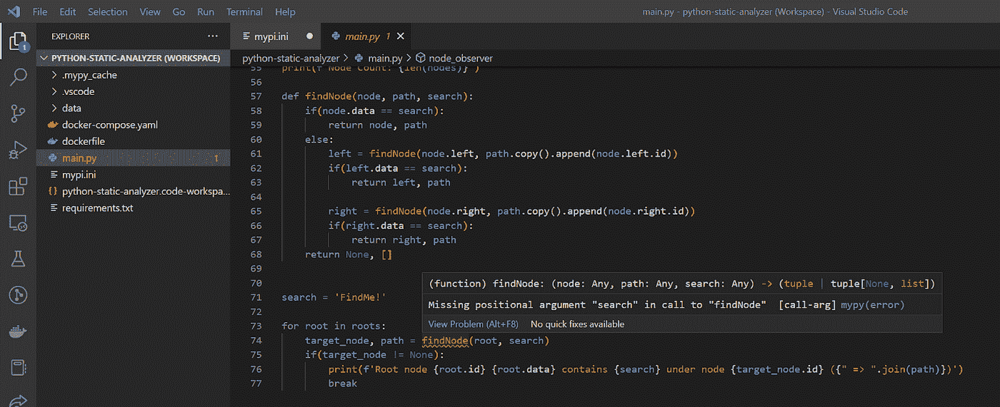
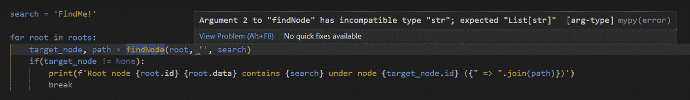
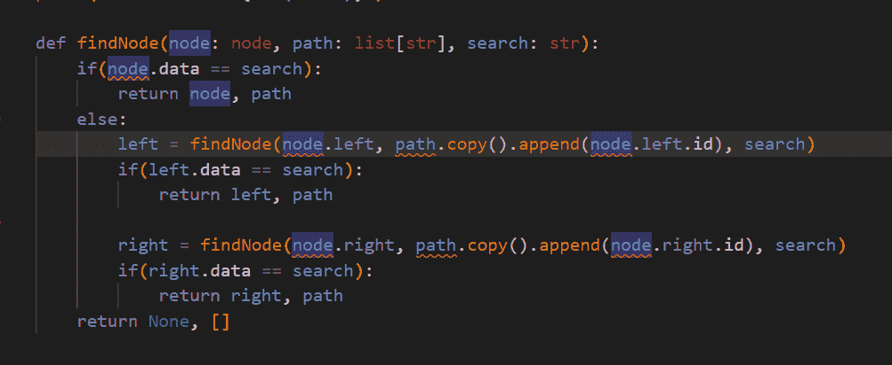
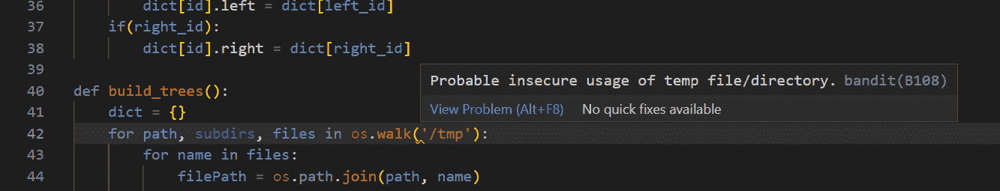
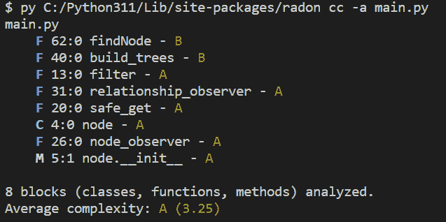
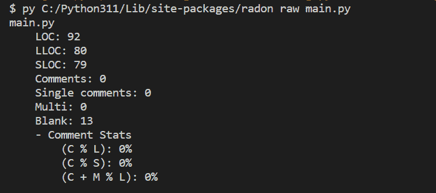
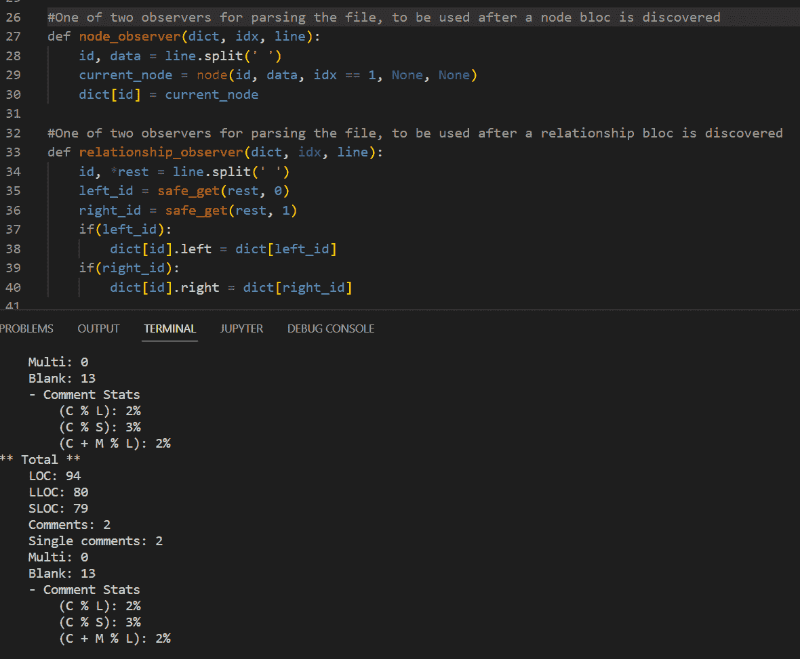
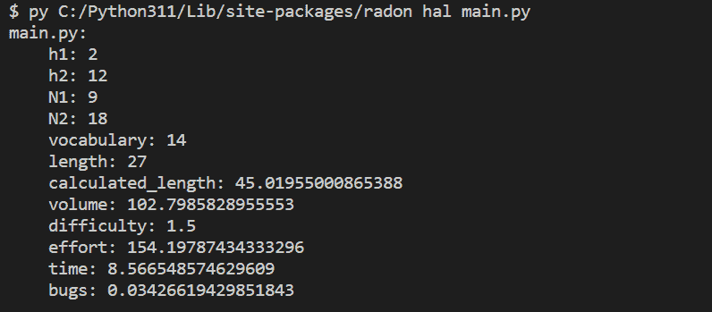
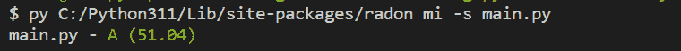

# 如何对 Python 代码使用静态分析工具

> 原文：<https://betterprogramming.pub/how-to-add-a-static-scanner-to-your-ide-for-python-e3a7e287f214>

## 在您的 IDE 中添加静态扫描器来检查漏洞


照片由[克里斯里德](https://unsplash.com/@cdr6934)通过 [unsplash](https://unsplash.com/photos/ieic5Tq8YMk) 拍摄

在过去的几年中，静态代码分析器极大地促进了应用程序的开发。静态分析不是发现生产系统或部署中的代码问题或漏洞，而是根据类型和其他代码提示告诉我们代码将在哪里失败。

今天，我们将深入探讨 Python 开源静态分析工具的几个选项，展示它们是如何工作的，以及您可以在编程之旅中获得哪些好处。

# 静态代码分析到底是什么？

静态代码分析只是检查程序的源代码，而不是实际运行它。这使您可以在代码中的错误成为问题之前找到它。静态分析还可以发现代码中的漏洞，使代码更加安全。

# Python 代码分析

为了展示静态分析有多健壮，我将在一台甚至没有安装 Python 的计算机上构建这个应用程序。

然后，我将设置一个分析器，并按照它产生的一些提示进行操作。现代扫描器超越了代码风格和格式，以解决 [SAST 漏洞](https://www.mend.io/resources/blog/sast-static-application-security-testing/)、空检查和标准应用程序，我们将尝试用这个示例项目来演示。

让我们首先从这个应用程序开始，它检查二叉树中的一个节点是否包含某些信息，并打印出它的路径。它接收一个被分解成一些`node`和`relationship`定义的文件。它将这些定义解析成树，然后在树中搜索特定的节点。

除了核心应用程序代码，我们还会有一个`dockerfile`:

```
FROM python:3
WORKDIR /app

COPY requirements.txt ./

RUN pip install — no-cache-dir -r requirements.txt

COPY . .

CMD [“python”, “./main.py”]
```

和`docker-compose`运行应用程序:

```
services:
  python:
    build: .
    volumes:
      - ./tmp:/tmp
```

让我们先了解一些基础知识——我们将为 VS 代码安装 [MyPy](http://mypy-lang.org/) 扩展。这将使我们进行静态类型检查。安装后，我们立即得到一些反馈，L74 上的`findNode`方法调用用红色下划线标出。



这是一些很好的信息！`MyPy`能够立即检测到我们在路径的`findNode`方法调用中缺少位置参数——我们可以通过将该行改为:

```
target_node, path = findNode(root, ‘’, search)
```

啊，但是等等——路径不应该是字符串。

然而似乎并不明白这一点。这是因为我们缺少我们所期望的这个值的类型注释。让我们更新该方法，使其具有一些类型注释:

```
def findNode(node: node, path: list[str], search: str):
```

如果我们把它保存为一个字符串，我们几乎马上就会得到错误类型的反馈:



我将把它转换为数组声明，将调用更新为:

```
target_node, path = findNode(root, [], search)
```

但是我们现在有一个问题，几个参数有不正确的注释，并且`findNode`方法体被红色下划线覆盖。

这是因为我们已经在文件中定义了`node`类，但是它没有注释，并且`MyPy`已经根据编写的代码尽最大能力假设了那些参数的类型。需要更多的帮助来解决这些问题:



让我们通过用所需的注释设置节点类来修复这些注释。我们将需要从类型库中导入`Optional`注释，然后我们将能够使用它来纠正一些静态类型错误:

现在我们看到 MyPy 在`findNode`方法中的一些更有趣的输出——内部`findNode`调用和`path.copy().append`都用红色下划线标出。

当我们将鼠标悬停在调用`findNode`的红色下划线上时，我们会看到错误:

> “findNode”的参数 1 具有不兼容的类型“可选[节点]”；应为" node" [arg-type]mypy(错误)

请注意，我们将左右节点属性设为可选属性，因为我们希望从根到叶加载树定义，所以在创建左右节点并实施关系之前，我们不会有左右节点。

因此，MyPy 警告我们，我们正试图访问一个可能为 null 的属性，这将是一个运行时错误。让我们添加一些快速保护代码来清除分析错误:

这清除了第一个错误，但是当我们将鼠标悬停在调用`path.copy().append`的红色下划线上时，我们会看到另一个错误:

> “列表”的“追加”不返回值[func-returns-value]mypy(错误)

看起来我们在这里放了一些代码，做了我们想做的事情，但是因为它没有返回变异列表，所以在运行时会有一个错误。

幸运的是，静态分析给了我们一个提示，所以我们没有浪费宝贵的时间来调试为什么应用程序会崩溃或以意想不到的方式运行。让我们快速写出一组正确的命令:

这些是我们在实际运行代码之前就发现的应用程序代码的主要问题。这节省了我们大量的时间来找出为什么代码的输出是不正确的。

## 强盗

让我们来看看另一个清除代码安全问题的解决方案— [Bandit](https://bandit.readthedocs.io/en/latest/) ，它是一个很棒的 SAST 漏洞扫描工具。遵循[文档](https://bandit.readthedocs.io/en/latest/start.html)链接，Bandit*真的*容易设置。一旦它被安装在本地系统上，我们就可以将 linter 切换到 Bandit，并对当前的 main.py 文件执行它。

啊哦！Bandit 已经发现了另一个问题！



班迪特是正确的。我们的应用程序代码目前引用了来自`/tmp`——Linux 发行版中的顶级目录和可能的攻击媒介。

我们应该引用与应用程序代码相关的本地文件夹中的数据，或者在代码入口点允许参数化的条目。

由于这是我们唯一的警告，我们将切换到`./data`下的本地文件夹，并修改 docker-compose 以将数据文件夹内容放入新的本地文件夹。

如果您查看了 Bandit 的开源存储库，您也可以将许多示例文件导入到项目中，以查看 Bandit 可能在您自己的代码中暴露的其他漏洞。

接下来，让我们得到一些关于代码的启发。

## 氡

为此，我们可以使用 Radon，它是一个开源包，可以生成各种有趣的代码度量。在快速简单的安装之后，我们可以用`cc`命令(圈复杂度)将 radon 指向我们的代码文件，以获得一些很酷的指标:



对于圈复杂度(这可能是可维护性的一个主要指标)，看起来我们没有得到任何特别可怕的结果，所以这很好。

如此低的平均复杂度是成功的，但是在更大的代码库中，我们可能甚至不想看到低复杂度的结果。Radon 还有一个标志`--nc`，只显示“C”或更差的结果。

让我们也来看看关于 raw 命令代码的一些核心指标:



这打印出了一些关于代码行的重要信息，区分了逻辑代码行(LLOC)和源代码行(SLOC)、注释以及本质上的注释覆盖。让我们添加两个注释，看看有什么不同:



啊，现在我们也有了一些评论指标。太棒了。

`halstead`复杂性度量是我们可以借助 Radon 收集的另一组非常有趣的度量:



此外，该命令可以使用`-f`标志为代码文件中的每个函数单独运行。

另一个有趣的命令是`mi`。它打印出一个可维护性指数，该指数从其他几个命令中收集信息，对代码的易维护性进行总体评价:



这个应用程序正在顺利通过！Radon 文档提供了关于如何计算的更多信息。

# 包扎

这篇博文概述了各种可用于静态分析的工具，包括 Bandit 和 Radon。

Bandit 发现了代码中的一个漏洞，Radon 生成了关于代码复杂性和可维护性的指标。根据 Radon 可维护性指数，该应用程序被视为“成功通过”。

希望静态代码分析空间中几个选项的分解对您有所帮助！感谢您的阅读。