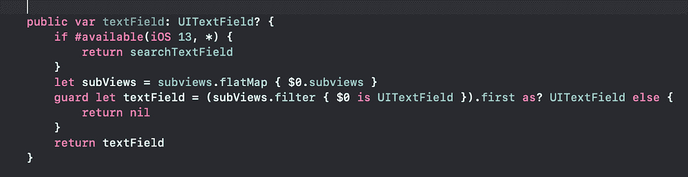
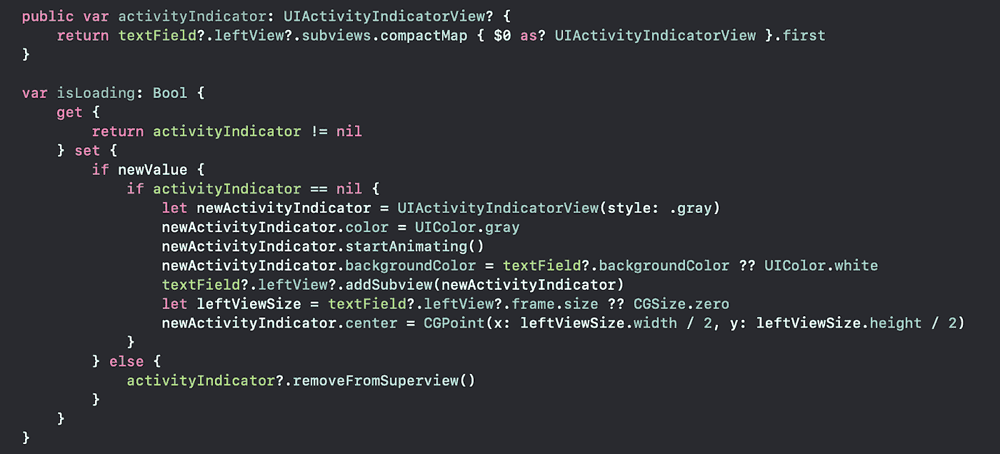

# 如何在 UISearchBar 中添加活动加载器

> 原文：<https://betterprogramming.pub/how-to-add-an-activity-loader-in-a-uisearchbar-6993f8476004>

## 当您必须进行 API 调用或任何长时间运行的任务时，显示 UIActivityIndicatorView


Christophe Hautier 在 [Unsplash](https://unsplash.com?utm_source=medium&utm_medium=referral) 拍摄的照片。

# 访问 UISearchBar 的 UITextField

我们知道，苹果并没有让我们在不同的操作系统上方便地访问`UITextField`参考。下面是帮助你在所有 iOS 版本中安全访问`UITextField`的代码:



用于访问 TextField 并更改其属性的代码段

# **ui search bar 中的 UIActivityIndicatorView**



在 UISearchBar 中添加加载程序的代码片段

```
searchBar.isLoading = true // show loader 
searchBar.isLoading = false // hide loader
```


输出:搜索图标中的加载程序

# 结论

感谢您的阅读。希望这篇文章能帮助你定制你的`UISearchBar`

# 其他文章

*   [如何更改用户搜索栏中的搜索图标](https://medium.com/better-programming/how-to-change-the-search-icon-in-a-uisearchbar-150b775fb6c8)
*   [如何更改 UISearchBar 中的占位符颜色](https://medium.com/better-programming/how-to-change-the-placeholder-color-in-a-uisearchbar-1f47e5266e10)
*   [如何在 UISearchBar 中添加左填充](https://medium.com/better-programming/how-to-add-left-padding-to-a-uisearchbar-2406bcaf9271)