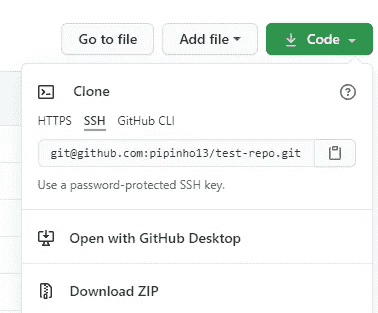
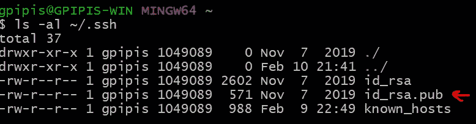
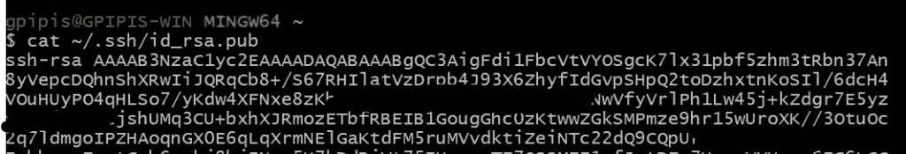
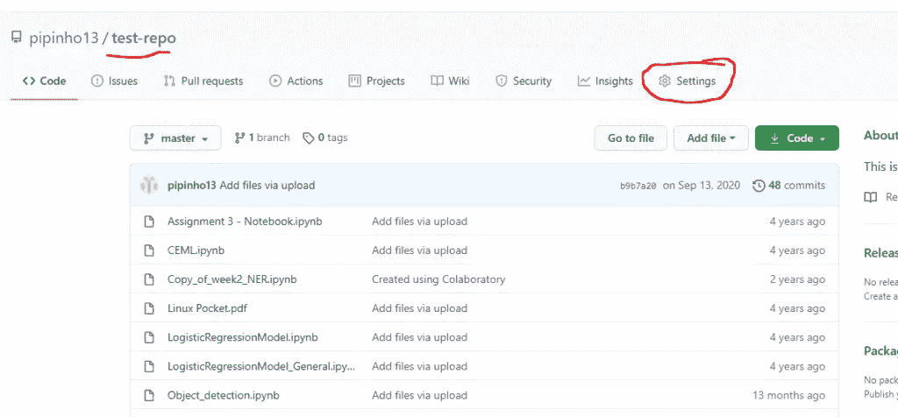
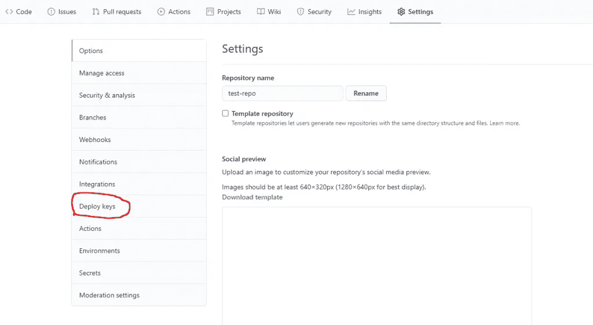
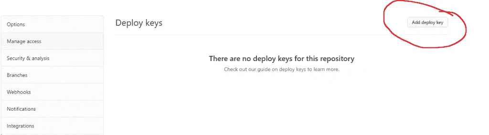
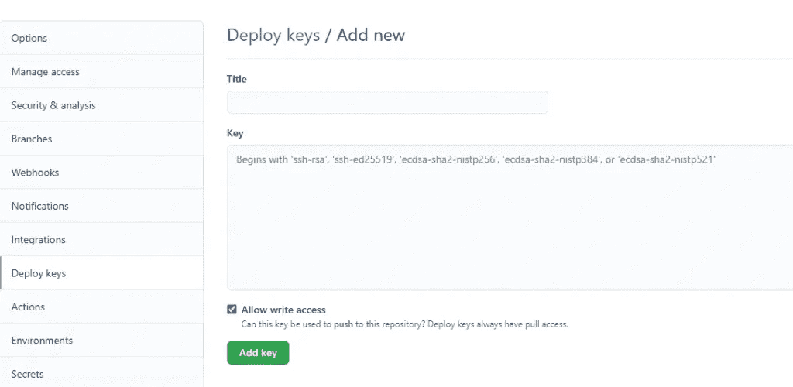

# 如何向 GitHub 添加 SSH 密钥

> 原文：<https://betterprogramming.pub/how-to-add-an-ssh-key-to-github-96d934d09d35>

## 正确部署 SSH 密钥


[Brina Blum](https://unsplash.com/@brina_blum?utm_source=medium&utm_medium=referral) 在 [Unsplash](https://unsplash.com?utm_source=medium&utm_medium=referral) 上的照片。

[](https://jorgepit-14189.medium.com/membership) [## 用我的推荐链接加入媒体-乔治皮皮斯

### 阅读乔治·皮皮斯(以及媒体上成千上万的其他作家)的每一个故事。您的会员费直接支持…

jorgepit-14189.medium.com](https://jorgepit-14189.medium.com/membership) 

当使用 Git 和 GitHub 时，您可以与 HTTPS 或 SSH 进行交互。今天，我们将提供一个关于如何将 SSH 密钥部署到 GitHub 存储库的教程。



# 设置 SSH 密钥

您可以通过在您的计算机上运行`[ssh-keygen](https://docs.github.com/en/articles/generating-a-new-ssh-key-and-adding-it-to-the-ssh-agent/#generating-a-new-ssh-key)` [过程](https://docs.github.com/en/articles/generating-a-new-ssh-key-and-adding-it-to-the-ssh-agent/#generating-a-new-ssh-key)来生成 SSH 密钥。您需要记住您将生成的公钥和私钥对保存在哪里。生成新 SSH 密钥的步骤是:

*   打开 Git bash。
*   通过输入您的 GitHub 电子邮件地址，复制粘贴以下命令:

```
$ ssh-keygen -t ed25519 -C "[[email protected]](https://predictivehacks.com/cdn-cgi/l/email-protection)"
```

*注意:如果您使用的是不支持 Ed25519 算法的传统系统，请使用:*

```
$ ssh-keygen -t rsa -b 4096 -C "[[email protected]](https://predictivehacks.com/cdn-cgi/l/email-protection)"
```

这将使用提供的电子邮件作为标签创建一个新的 SSH 密钥。

```
> Generating public/private ed25519 key pair.
```

*   当提示您“输入保存密钥的文件”时，接受默认文件位置:

```
> Enter a file in which to save the key (/c/Users/you/.ssh/id_ed25519):[Press enter]
```

*   然后会要求您输入密码。你可以让它空着。你可以看看文档中的[密码。](https://docs.github.com/en/github/authenticating-to-github/working-with-ssh-key-passphrases)

```
> Enter passphrase (empty for no passphrase): [Type a passphrase] 
> Enter same passphrase again: [Type passphrase again]
```

# 检查现有的 SSH 密钥

在生成 SSH 密钥之前，您应该检查您是否已经有一个现有的 SSH 密钥。您可以通过使用 Git bash 并输入下面的命令来检查现有的 SSH 密钥，该命令列出了`.ssh`目录中的文件:

```
ls -al ~/.ssh
```

默认情况下，公钥的文件名是下列之一:

```
id_rsa.pub id_ecdsa.pub id_ed25519.pub
```



如你所见，我有一个`id_rsa.pub`文件。

# 将您的 SSH 密钥添加到 ssh-agent

您可以通过键入以下命令在后台启动`ssh-agent`:

```
$ eval `ssh-agent -s`
```


然后，您可以通过键入以下命令来添加已经生成的私钥文件:

```
$ ssh-add ~/.ssh/id_rsa
```

# 将 SSH 密钥添加到 GitHub 中

您必须复制 SSH 公共密钥。有两种选择。一种选择是使用`cat`命令并从终端复制它:

```
$ cat ~/.ssh/id_rsa.pub
```



另一个选项是通过键入以下内容将其复制到剪贴板:

```
$ clip < ~/.ssh/id_rsa.pub
```

然后，转到您想要处理的存储库，并单击“设置”:



然后转到“部署密钥”:



然后单击“添加部署密钥”:



在标题部分，你想写什么就写什么。在密钥部分，粘贴您的公钥，勾选“允许写访问”复选框，然后单击“添加密钥”你准备好了！



# 使用多个存储库

如果您在一台服务器上使用多个存储库，您将需要为每个存储库生成一个专用的密钥对。您不能对多个存储库重复使用一个部署密钥。

在服务器的 SSH 配置文件(通常是`~/.ssh/config`)中，为每个存储库添加一个别名条目。例如:

```
Host github.com-repo-0
        Hostname github.com
        IdentityFile=/home/user/.ssh/repo-0_deploy_key

Host github.com-repo-1
        Hostname github.com
        IdentityFile=/home/user/.ssh/repo-1_deploy_key
```

*   `Host github.com-repo-0`是存储库的别名。
*   `Hostname github.com`配置主机名和别名。
*   `IdentityFile=/home/user/.ssh/repo-0_deploy_key`给别名分配一个私钥。

然后，您可以使用主机名的别名通过 SSH 与存储库进行交互，SSH 将使用分配给该别名的唯一部署密钥。例如:

```
$ git clone[[email protected]](https://predictivehacks.com/cdn-cgi/l/email-protection):OWNER/repo-1.git
```

如果你没有一个`config`文件，你可以在栈溢出时生成一个新的[文件。另外，](https://stackoverflow.com/questions/56287059/how-to-set-up-an-ssh-config-file-for-beginners)[这个帖子](https://stackoverflow.com/questions/49587932/i-dont-have-ssh-config-file-but-multiple-github-accounts-works-how)可能会有帮助。

[](https://jorgepit-14189.medium.com/membership) [## 用我的推荐链接加入媒体-乔治皮皮斯

### 作为一个媒体会员，你的会员费的一部分会给你阅读的作家，你可以完全接触到每一个故事…

jorgepit-14189.medium.com](https://jorgepit-14189.medium.com/membership) 

*原载于* [*预测黑客*](https://predictivehacks.com/how-to-add-an-ssh-key-to-github/) *。*