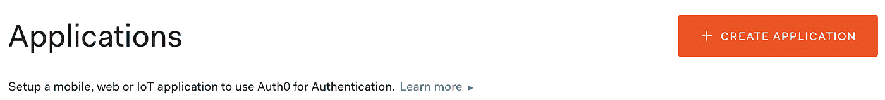
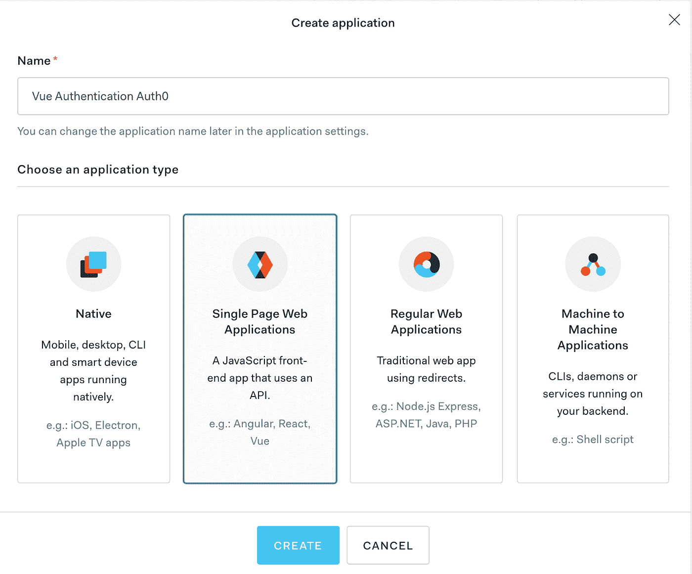
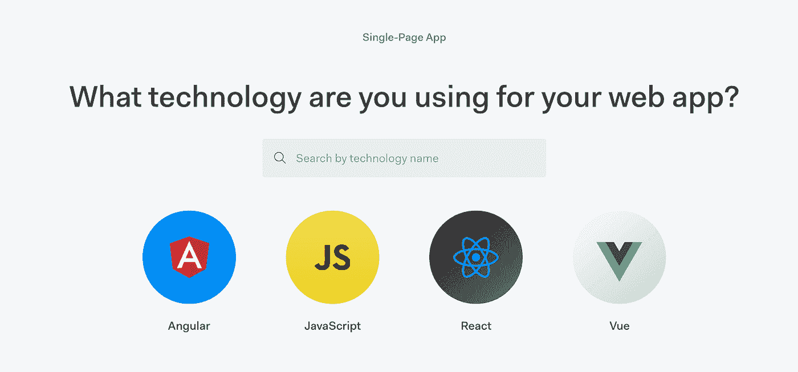
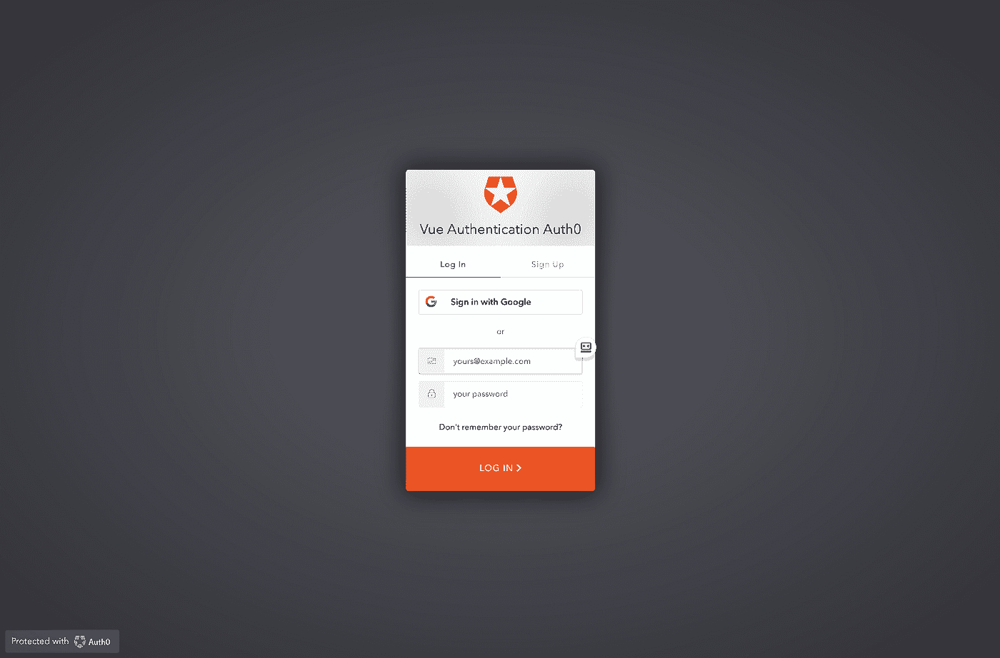

# 如何使用 Auth0 向 Vue.js 应用程序添加认证

> 原文：<https://betterprogramming.pub/how-to-add-authentication-to-a-vue-app-using-auth0-4a2fa32df05c>

## 使用 Auth0 向您的 Vue 应用程序添加身份验证


[千斤顶 T](https://unsplash.com/@blankest?utm_source=medium&utm_medium=referral) 在 [Unsplash](https://unsplash.com?utm_source=medium&utm_medium=referral) 上拍照

[Auth0](https://auth0.com/) 是一个灵活的嵌入式解决方案，为您的应用程序添加认证和授权服务。了解添加到您的 Vue 应用程序有多简单，这样您就可以使用用户的电子邮件地址和密码来注册和登录用户。

# 我们将创造什么

我们将使用 Vue CLI 创建一个非常简单的 Vue 应用程序。我们将修改默认的 scaffolded 应用程序，以便我们可以使用 Auth0 来注册新用户或登录现有用户。一旦用户登录，他们将有权查看“关于”页面。

用户将能够使用 Auth0 中的电子邮件和密码认证系统向应用程序注册。

# 创建我们的项目

我将使用 Vue CLI 为我们搭建一个项目。为此，您需要在系统上安装 Vue CLI。如果没有安装，可以使用以下命令进行全局安装:

```
npm install -g @vue/cli
```

现在我们可以使用 Vue CLI 来创建我们的项目。使用以下命令创建一个新项目:

```
vue create vue-authentication-auth0
```

您将被要求选择一个预设。选取“手动选择功能”，然后选择“babel”、“Router”和“Linter / Formatter”

系统会询问您是否要对路由器使用历史模式。选择“是”(应该是默认值)。

你可以选择任何你想要的棉绒，但是对于本教程，我将选择“Eslint +更漂亮。”

在 Vue CLI 完成后，它将为您提供一些命令，以切换到刚刚创建的新目录并启动服务器。遵循这些指示。一旦服务器启动，您就可以打开浏览器到 localhost:8080。您应该看到这个:


# 创建 Auth0 帐户

你需要做的第一件事是[用 Auth0 创建一个账户](https://auth0.com/signup)，如果你还没有的话。创建帐户是免费的。

# 创建 Auth0 应用程序

创建免费的 Auth0 帐户后，请登录您的帐户。在左侧导航栏中，单击应用程序。


在这里，单击“创建应用程序”按钮。



您将看到一个对话框，让您为应用程序提供一个名称，并指定要创建的应用程序的类型。

我的应用程序的名称是 Vue 身份验证 Auth0。您可以为您的应用程序取任何您想要的名称。

对于应用程序类型，选择单页 Web 应用程序。



创建应用程序后，Quick Start 选项卡将提供如何使用最流行的 JavaScript 框架在 web 应用程序中实现 Auth0 的说明。

因为我们的应用程序使用 Vue，所以单击 Vue 图标。



Auth0 就如何实现他们的身份验证即服务产品提供了非常详细的说明。对于本教程，我们将在我们已经创建的 Vue 应用程序中实现他们的指令。

# 配置应用程序设置

您可以通过点击页面顶部的设置选项卡来访问您的设置。

您将在基本信息下看到您的域名和客户端 ID。我们稍后将回到这一点，因为我们将需要存储这些值以使我们的应用程序工作。

在“应用程序 URIs”部分，我们需要定义允许的回调 URL、允许的注销 URL 和允许的 web 源。

为了本地测试我们的应用程序，我们将使用 URL http://localhost:8080。

**注意:**如果您决定在某个地方托管您的应用程序，比如在 [Netlify](https://www.netlify.com/) 或 [Heroku](https://www.heroku.com/) 上，那么您将需要使用您托管的应用程序的 URL 来更新所有这些设置。

将 strong >允许的回拨 URL、允许的注销 URL 和允许的 Web 源设置为 http://localhost:8080。


# 安装 Auth0 SDK

返回到您的 Vue 应用程序，使用以下命令添加 Auth0 Client SDK:

```
npm install @auth0/auth0-spa-js
```

# 创建身份验证包装

Auth0 SDK 要求在 Vue 应用程序启动之前对其进行初始化。Vue 有生命周期挂钩，我们可以用它来初始化 SDK。你可能认为我们可以在`App.vue`文件中使用一个`beforeCreate`钩子，但是你错了。让我告诉你为什么。

这是 Vue 生命周期挂钩的图像。


图片由[https://vuejs.org/v2/guide/instance.html](https://vuejs.org/v2/guide/instance.html)提供

`beforeCreate`是第一个 Vue 生命周期挂钩。但是请注意，在该图像中，它是在使用`new Vue()`创建 Vue 应用程序之后触发的。

我们需要能够在创建 Vue 应用程序的`new Vue()`之前初始化 Auth0 SDK。Vue 提供了一种机制来用 Vue 插件做到这一点。

为了使用一个插件，你必须用`Vue.use()`命令调用它。此命令必须在您通过调用`new Vue()`启动应用程序之前完成。

我们将创建的认证包装器实际上将是一个 Vue 插件。

在`src`目录中，创建一个名为`auth`的新目录。在 auth 目录中，创建一个名为`index.js`文件。

我们将复制快速启动选项卡中提供的代码，并将其粘贴到此文件中。代码如下:

# 创建配置文件

传递给插件的 options 对象用于提供`clientId`和`domain`的值，我在前面提到过，并说我们稍后会用到。

在应用程序的根目录下，创建一个名为`auth_config.json`的新文件。我们将从您的应用程序中为`domain`和`clientId`填充值。将这段代码放入`auth_config.json`文件，并确保用您的应用程序的值更新它。

```
{ 
  "domain": "yourAppValuesHere", 
  "clientId": "yourAppValuesHere" 
}
```

此配置文件包含与您的 Auth0 应用程序相关的非敏感值。该文件不应提交给源代码管理。我们可以通过将文件名添加到`.gitignore`文件中来实现。

打开`.gitignore`文件，在文件中添加`auth_config.json`。

# 向我们的 Vue 应用程序添加插件

现在我们已经创建了插件，我们需要告诉 Vue 使用它。打开`main.js`文件。添加这两个导入语句，它们从`auth_config.json`文件中导入我们的插件以及我们的`domain`和`clientId`。

```
// Import the Auth0 configuration
import { domain, clientId } from "../auth_config.json";// Import the plugin here
import { Auth0Plugin } from "./auth";
```

接下来我们需要告诉 Vue 使用我们的插件。在导入语句后，添加以下代码:

# 登录应用程序

如果你查看`auth/index.js`文件中的插件代码，你会注意到提供了两种不同的登录方式:`loginWithPopup`和`loginWithRedirect`。

Auth0 提供了一个托管登录页面，任何应用程序都可以使用它来登录或注册用户。`loginWithRedirect`方法将访问托管登录页面。这意味着，当用户单击登录按钮时，URL 将变为指向 Auth0 网站，用户将在那里输入他们的登录详细信息。成功通过身份验证后，它们将被重定向回我们的应用程序。

如果我们不想做这个重定向，Auth0 提供了通过弹出窗口登录或注册用户的选项，该弹出窗口显示在我们的网站上。

我将向您展示如何使用这两种登录方法。

打开`App.vue` 文件。导航目前有两个条目，主页和关于页面。我们需要添加两个按钮来登录。将此代码添加到导航中:

请注意，按钮被包装在一个指令中，该指令确保`$auth.loading`为假。如果你查看我们插件的代码，你会看到有一个数据段的值是`isAuthenticated`。如果用户成功通过 Auth0 验证，则设置该值。如果用户已经过身份验证，那么我们不希望显示两个登录按钮。

当我们添加 div 时，按钮出现在 Home 和 About 按钮链接下面的行中。我希望它们都在同一行上，所以将 CSS 样式更新为:

```
#nav { 
  display: flex; 
  justify-content: center; 
  padding: 30px; 
} #nav a { 
  font-weight: bold; 
  color: #2c3e50; 
  padding: 0 5px; 
}
```

现在，当您查看应用程序时，您将看到两个按钮。


这两个按钮是调用方法`login`和`loginPopup`。让我们现在就实施它们。

用两种方法添加一个`methods`对象。代码如下:

```
methods: { 
  login() { 
    this.$auth.loginWithRedirect(); 
  }, 
  loginPopup() { 
    this.$auth.loginWithPopup(); 
  }, 
}
```

`this.$auth`是我们插件的一个句柄。然后我们调用插件中可用的方法。

现在回到您的应用程序。如果您单击登录按钮，应该会转到 Auth0 的托管登录页面。



如果您单击登录弹出按钮，您将在您的应用程序中看到一个登录模式。


无论您选择哪一个，您都会看到您可以选择登录或注册。继续创建一个帐户。当您返回应用程序时，您会看到两个登录按钮都被隐藏了。它们是隐藏的，因为插件中的`isAuthenticated`值现在是`true`。

# 实施注销

下一步是实现注销。打开`App.vue`文件。像这样添加一个注销按钮:

```
<button @click="logout" v-if="$auth.isAuthenticated">
  Logout
</button>
```

这里我们有一个指令，只在用户当前通过身份验证时显示这个按钮。回到您的应用程序，您现在应该会看到 Logout 按钮。


添加此方法以实现注销功能:

```
logout() { 
  this.$auth.logout(); 
  this.$router.push({ path: '/' }); 
}
```

在这个方法中，我们调用插件中的注销函数。如果用户在一个只有经过身份验证的用户才能看到的页面上，我们会将用户重定向到主页。

# 仅向经过身份验证的用户显示页面

目前，我们的应用程序有一个主页和一个关于页面。我们不创建新页面，而是将 About 页面设置为只有用户登录时才可见。

如果用户已经登录，我们只想在导航中显示“关于”页面。我们将使用与显示注销按钮相同的指令，并将它放在导航中的 About 页面上。将导航更新为:

```
<router-link v-if="$auth.isAuthenticated" to="/about">About</router-link>
```

# 添加路线守卫

如果用户当前没有被认证，我们已经隐藏了导航中的关于页面的链接。但是用户可以输入网址“/about”直接进入页面。这表明未经验证的用户可以访问该页面。避免这种情况的方法是使用路由保护。

在`auth`目录中，创建一个名为`authGuard.js`的新文件。

将以下代码添加到文件中:

这段代码检查用户当前是否已经过身份验证。如果不是，它将弹出 Auth0 托管的登录页面供用户登录。如果用户未能登录或无法成功登录，它会将用户从他们试图访问的具有路由保护的页面重定向出去。

现在让我们在 Vue 路由器中实现这个路由保护。打开路由器目录中的`index.js`文件。

在文件的顶部，为我们刚刚创建的`authGuard`文件添加一个导入:

```
import { authGuard } from "../auth/authGuard";
```

接下来，我们需要在/about 路由中添加路由保护。将/about 路由更新为:

```
{ 
  path: '/about', 
  name: 'About', 
  component: () => import(/* webpackChunkName: "about" */ '../views/About.vue'), 
  beforeEnter: authGuard 
}
```

回到您的应用程序。如果您当前没有通过身份验证，请登录到您的应用程序。您应该会在导航中看到 About 条目。现在从应用程序中注销。手动尝试去网址“ **/** 了解一下。”您应该被重定向到 Auth0 托管的登录页面。

恭喜你！您已成功将 Auth0 身份验证添加到您的 Vue 应用程序中。

# 获取代码

我的 GitHub 账户里有完整的代码。

# 结论

Auth0 是一个身份验证即服务产品，您可以将其添加到您的应用程序中。它使得使用认证变得非常容易。

我希望你喜欢这篇文章。感谢阅读。