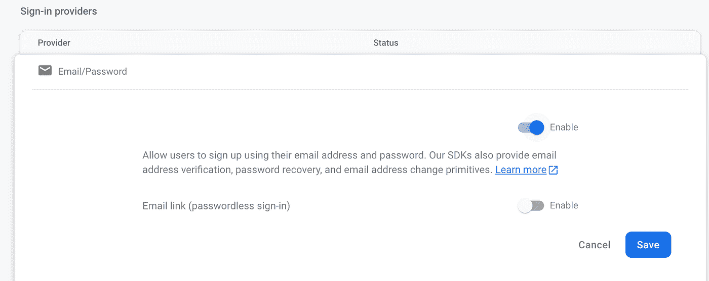
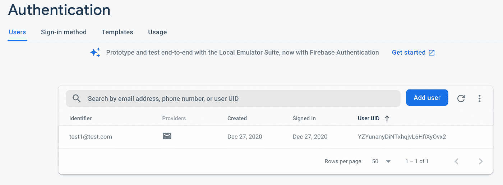

# 如何使用 Firebase 向 Vue.js 应用程序添加身份验证

> 原文：<https://betterprogramming.pub/how-to-add-authentication-to-a-vue-app-using-firebase-dc045d719521>

## 将 Firebase auth 添加到您的 Vue 应用程序


由 [iMattSmart](https://unsplash.com/@imattsmart?utm_source=medium&utm_medium=referral) 在 [Unsplash](https://unsplash.com?utm_source=medium&utm_medium=referral) 拍摄的照片。

Firebase 为您的 Vue.js 应用程序添加身份验证提供了一种非常简单快捷的方式。在本文中，我将向您展示允许用户使用他们的电子邮件和密码注册您的应用程序是多么容易。

# 我们将创造什么

我们将使用 Vue CLI 创建一个非常简单的 Vue 应用程序。我们将修改默认的 scaffolded 应用程序，以便它提供一个注册为新用户的表单、一个登录页面和一个只显示给登录用户的仪表板页面。

用户将能够使用 Firebase 中的电子邮件和密码认证系统向应用程序注册。一旦他们注册并登录，就会看到仪表板页面。

# 创建我们的项目

我将使用 Vue CLI 为我们搭建一个项目。为此，您需要在系统上安装 Vue CLI。如果尚未安装，可以使用以下命令进行全局安装:

```
npm install -g @vue/cli
```

现在我们可以使用 Vue CLI 来创建我们的项目。使用以下命令创建一个新项目:

```
vue create vue-firebase-auth-tutorial
```

您将被要求选择一个预设。选取“手动选择功能”，然后选择“babel”、“Router”和“Linter / Formatter”

系统会询问您是否要对“路由器”使用历史模式选择“是”(这应该是默认值)。

你可以选择任何你想要的棉绒，但是对于本教程，我将选择“Eslint +更漂亮。”

在 Vue CLI 完成后，它将为您提供切换到刚刚创建的新目录的命令以及启动服务器的命令。遵循这些指示。一旦服务器启动，您就可以打开浏览器进入`localhost:8080`。您应该看到这个:


# 重火力点

对于本教程，我假设您已经创建了一个 Firebase 帐户。如果没有，您需要在继续之前这样做。

我们将在应用程序中使用 Firebase SDK 来提供身份验证功能。您可以使用以下命令在应用程序中安装 Firebase:

```
npm install firebase
```

# 在 Firebase 中创建项目

下一步是在 Firebase 控制台中添加一个项目。登录你的 Firebase 控制台。单击按钮添加新项目:


您可以将 Google Analytics 添加到您的项目中，但我不会在本教程中添加它。单击“创建项目”按钮。

一旦 Firebase 创建了您的新项目，您需要将 Firebase 添加到您的应用程序中。点击网络图标:


您将被要求输入应用程序的昵称。我已经输入了昵称“Vue Firebase 认证教程”输入您的昵称后，点击“注册应用程序”按钮:


对于步骤 2，将有关于将 Firebase SDK 添加到您的应用程序的说明。我们只需要复制`firebaseConfig`和行就可以初始化 app 了。

打开你的`main.js`文件。我们将在 Vue 应用程序中初始化 Firebase。在已有的导入行下面，粘贴`firebaseConfig`和行来初始化 app。您需要为 Firebase 添加一个导入。您的`main.js`文件应该如下所示:

# 设置验证方法

在浏览器中打开 Firebase 控制台。从控制台中，找到您刚刚创建的项目并单击它。

在左上角，点击“认证”:


单击“开始”按钮。

从“身份验证”菜单中，单击“登录方法”选项卡:


将鼠标悬停在第一个条目“电子邮件/密码”上点击铅笔图标打开一个对话框。选择“启用”:



点击“保存”按钮。现在，您已经添加了使用用户的电子邮件地址和密码来创建和验证用户的功能。

# 添加新组件

当我们用 Vue Router 创建我们的应用程序时，它自动为我们的应用程序创建了两条路由:Home 和 About。我们将使用 Home 作为应用程序的登录名。我们将使用 About 作为页面，为我们的应用程序注册一个新用户。

当注册用户登录到我们的应用程序时，我们希望向他们显示仪表板页面。我们还想为用户提供一种方法来注销我们的应用程序。目前，这两个选项在我们的应用程序中都不可用，所以让我们现在添加它们。

打开`App.vue`文件。目前，`nav`有两个条目，分别是“家”和“关于”。我们将更改关于注册，并为仪表板和注销添加两个新条目。更新您的导航，使其看起来像这样:

```
<div id="nav">
  <router-link to="/">Home</router-link> |
  <router-link to="/register">Register</router-link> |
  <router-link to="/dashboard">Dashboard</router-link> |
  <button [@click](http://twitter.com/click)="logout">Logout</button>
</div>
```

当您单击 logout 按钮时，它会调用`logout`方法。我们稍后将对此进行定义。

# 创建我们的登录组件

打开视图文件夹中的`Home.vue`文件。删除模板部分的所有 HTML 代码。用这段代码替换它，它提供了一个非常基本的登录表单。代码如下:

现在，如果您查看我们的应用程序，您会在主页上看到这样的登录表单:


我们的表单有点拥挤，输入字段和按钮相互接触。我们可以通过添加一些 CSS 样式来改变这一点。我们可以在`Home.vue`文件中添加 CSS 样式。因为我们将使用相同的表单注册用户，所以我们需要在该组件中复制相同的 CSS 样式。相反，我们可以将样式放在`App.vue`文件中，它将样式化我们的登录和注册表单。

打开`App.vue`文件。在样式中，添加以下内容:

```
input { 
  margin-right: 20px; 
}
```

现在我们的登录表单看起来更好了:


# 创建我们的注册表

打开视图文件夹中的`About.vue`文件。您可以从`Home.vue`文件中复制 HTML 代码并粘贴到这个文件中。将`Login`的所有引用改为`Register`。您的`About.vue`文件应该是这样的:

# 更新我们的路线

目前，显示我们注册页面的 URL 是`/about`。那就改成`/register`吧。打开路由器文件夹中的`index.js`文件。将`/about`的第二条路线改为`/register`。您的`routes`数组应该如下所示:

当我们在这个文件中时，让我们继续添加一个条目来显示我们的仪表板组件。添加第三条路线以显示`/dashboard`。您的`routes`数组现在应该看起来像这样:

# 创建仪表板组件

在 views 文件夹中创建一个名为`Dashboard.vue`的新文件。这个页面应该只对已经登录到我们的应用程序的用户可见。

在模板部分，添加以下 HTML 代码:

```
<div>
  <h2>Dashboard</h2>
  <p>This page is only visible to users that are currently logged in</p>
</div>
```

# 注册用户

早先当我们更新`About.vue`文件来注册用户时，我们调用了一个名为`Register`的方法。我们需要添加注册新用户的功能。

首先，让我们看看关于如何创建一个基于密码的账户的 [Firebase 文档](https://firebase.google.com/docs/auth/web/password-auth)。Firebase Auth 有一个方法叫做`createuserWithEmailAndPassword`。您需要传递用户的电子邮件和密码。这个方法要么注册用户并返回一个用户对象，要么返回一个错误消息。现在让我们实现这个方法。

打开`About.vue`文件。我们需要将`email`和`password`添加到我们的数据对象中。在脚本部分，添加以下数据对象:

接下来，用一个叫做`register`的方法添加一个`methods`对象。我们可以从 Firebase 文档中复制这个方法的例子。我们需要对文档中的代码进行以下更改:

*   我们将不使用`user`对象。
*   登录失败时显示警告。
*   如果用户已注册，将他们重定向到登录页面。

下面是`register`方法的代码:

让我们测试为我们的应用程序注册第一个用户。点击导航中的“注册”。输入电子邮件地址和密码，然后单击“注册”按钮。

如果用户成功注册，您应该会收到一个警告，并被重定向到登录页面。

如果注册失败，您应该会收到一条带有错误消息的警报。

要检查用户是否注册成功，请转到 Firebase 控制台并单击您的项目。在左侧导航栏中，点击
“认证”然后点击“用户”选项卡。您将看到您的用户列表:



既然我们已经成功地实现了为我们的应用程序注册新用户，我们需要实现用户登录的能力。

# 登录用户

我们使用 Firebase 提供的代码注册了一个新用户。 [Firebase 文档](https://firebase.google.com/docs/auth/web/password-auth)提供了使用电子邮件地址和密码登录用户的示例代码。我们将使用的 Firebase auth 方法是`signInWithEmailAndPassword`。

与`Register`一样，我们将对示例代码进行同样的修改。如果用户成功登录，我们会提醒他们，并将他们重定向到仪表板页面。

如果登录失败，我们会显示一条带有错误消息的警报。

下面是您应该在`Home.vue`文件中拥有的`login`方法:

# 创建路线守卫

我们不希望用户能够导航到`/dashboard`，除非他们已经登录。我们可以通过为`/dashboard`增加一个路由保护来实现。

打开路由器文件夹中的`index.js`文件。我们将向`/register`路由添加一个元密钥，表明需要认证。以下是更新后的路线:

Vue 路由器在处理路由之前，有一个叫`beforeEach`的方法。我们可以通过检查元值来查看路由是否需要认证。

如果需要身份验证，我们需要能够检查用户是否登录。幸运的是，Firebase auth 中有一个`currentUser`对象。我们将使用它来检查用户是否登录。

如果他们当前已登录，我们将显示控制面板页面。

如果没有，我们将显示一个警告，告诉用户他们必须登录，并重定向到主页让他们登录。

代码如下:

# 注销

我们需要添加到应用程序中的最后一件事是`logout`方法。Firebase auth 提供了一个我们将使用的`signOut`方法。

打开`App.vue`文件。我们将注销用户。如果成功，他们将收到警报并被重定向到主页。

如果注销失败，我们会显示一个带有错误消息的警报，并将他们重定向到主页。

为`logout`方法添加以下代码:

在上面的代码中，我们使用了 Firebase，但是在我们的`index.js`文件中没有对它的任何引用。我们需要加上这一点。向上滚动到现有导入行所在的文件顶部。添加这一行:

```
import firebase from 'firebase';
```

添加后，您可以练习注册新用户。然后以该用户身份登录，并验证您是否被重定向到仪表板页面。然后注销并确认您被重定向到主页。

祝贺您，您已经成功地将 Firebase 身份验证添加到您的 Vue 应用程序中！

完整的代码可以在 GitHub 网站[上找到。](https://github.com/ratracegrad/Vue-Firebase-Auth-Tutorial)

# 使用其他身份验证方法

我写过几篇后续文章，介绍如何使用其他身份验证方法向 Vue 应用程序添加身份验证。

想要使用 Auth0 进行身份验证吗？[阅读本文](https://ratracegrad.medium.com/how-to-add-authentication-to-a-vue-app-using-auth0-4a2fa32df05c)。

想用 AWS Amplify 做认证？[阅读本文](https://medium.com/better-programming/how-to-add-authentication-to-a-vue-app-using-aws-amplify-f10fbeef04d0)。

# 结论

Firebase 提供了一种非常有效的方法来为您的 Vue 应用程序添加身份验证。它允许您添加身份验证，而不必编写自己的后端服务并自己实现身份验证。

我希望你喜欢这篇文章。感谢阅读。