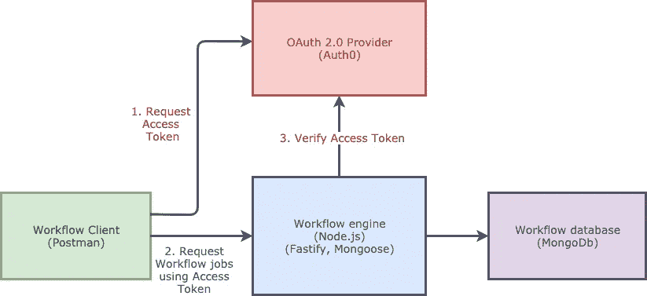
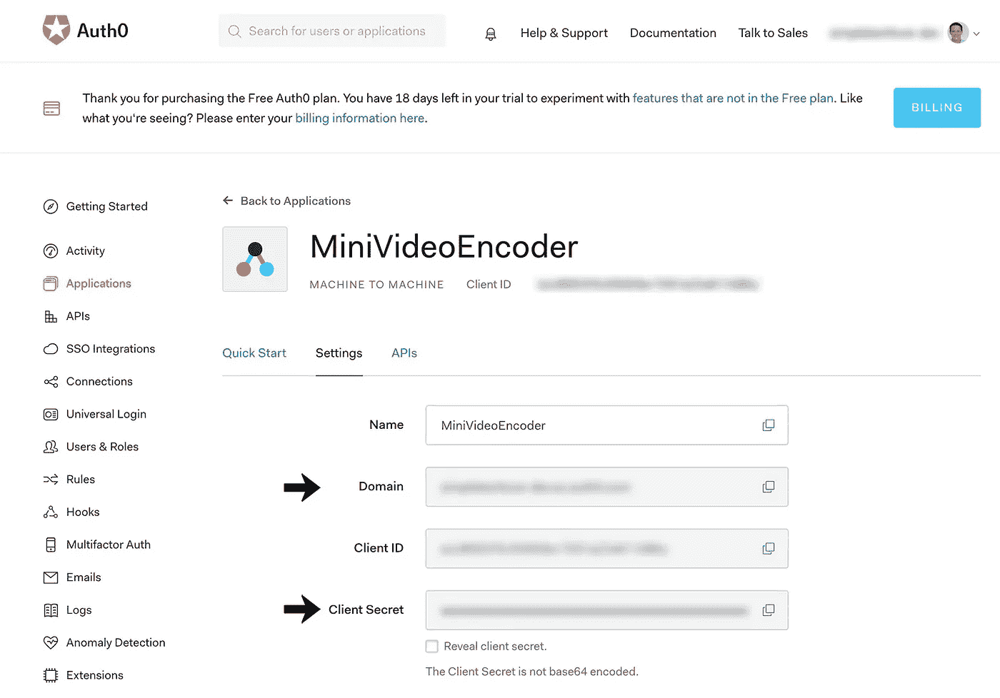
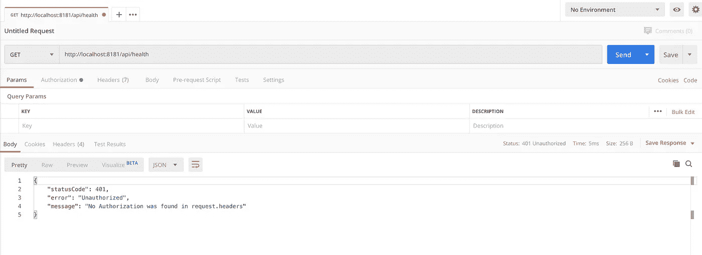
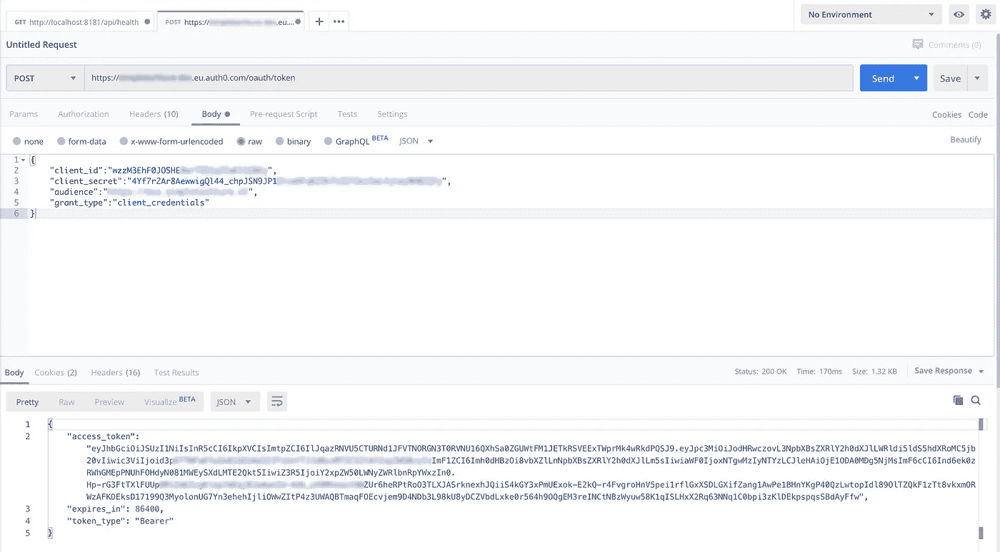
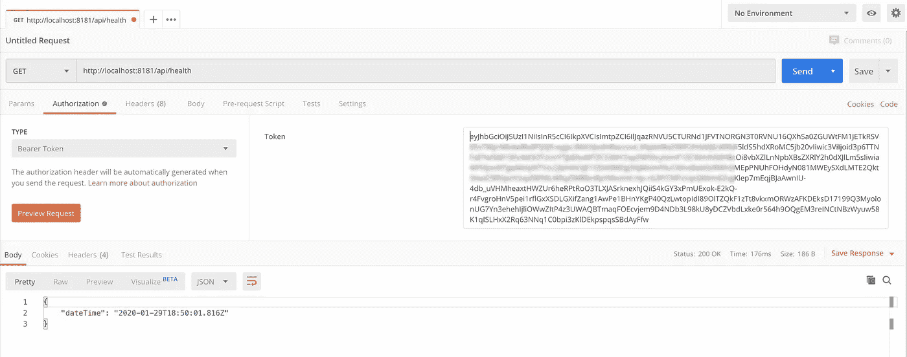

# 如何使用 Auth0 向 Fastify REST API 添加身份验证

> 原文：<https://betterprogramming.pub/how-to-add-authentication-to-your-fastify-rest-api-using-auth0-cddc7eacc90>

## 使用 Node.js、Fastify 和 Auth0 通过 OAuth 2.0 保护您的 REST API


克里斯·帕纳斯在 [Unsplash](https://unsplash.com/s/photos/security?utm_source=unsplash&utm_medium=referral&utm_content=creditCopyText) 上的照片

我身边的项目[迷你视频编码器](https://itnext.io/mini-video-encoder-implementation-part-1-1fce5fb081c1)的核心部分是工作流引擎。工作流引擎是使用 Node.js、 [Fastify](https://www.fastify.io/) 和 MongoDB 实现的 REST API。我没有保护好工作流引擎的 API。目前，客户可以匿名拨打电话。你会同意我的观点，每个在线 API 都需要安全性。所以我想在 REST API 中加入身份验证。

向 Fastify REST API 添加身份验证有很多选择。如果可能的话，我更喜欢使用基于开放标准的方法。因此，我将使用 OAuth 2.0 来保护 API。OAuth 2.0 是用于授权的行业标准协议。如果您打算将 OAuth 2.0 用于您的 API，您必须安装一个 OAuth 2.0 提供程序。我将使用 [Auth0](https://auth0.com/) ，这是一个提供认证和授权服务的平台。



使用 Auth0 的 OAuth 2.0 身份验证

对于身份验证，调用 API 必须遵循以下步骤:

1.  在工作流客户端能够访问工作流引擎的 API 之前，它必须具有访问令牌。如果 Auth0 对工作流客户端进行身份验证，它将生成并返回一个访问令牌。
2.  工作流客户端调用工作流引擎 API 并传递访问令牌。工作流客户端将访问令牌添加到 HTTP 授权头中。
3.  工作流引擎验证所呈现的访问令牌。如果验证正确，它将执行请求的 API 方法。工作流引擎将结果返回给工作流客户端。

OAuth 2.0 支持几种不同的方法来检索访问令牌。这些方式中的每一种——或者说[流](https://auth0.com/docs/flows)——都有一个特定的用例。OAuth 2.0 从示例中调用流，即[客户端凭证流](https://auth0.com/docs/flows/concepts/client-credentials)。工作流客户端使用客户端 ID 和客户端密码来请求访问令牌。

对于接下来的请求，工作流客户端不必请求访问令牌。它可以重用现有的访问令牌。对于访问令牌，我们将使用 JSON Web 令牌(JWT)。JWT 是创建基于 JSON 的访问令牌的标准方法。

# 在工作流引擎中使用 Auth0 实现 OAuth 2.0

为了能够在工作流引擎中添加身份验证，我们需要以下内容:

*   一个 Auth0 帐户——他们有一个免费计划，最多可容纳 7000 名活跃用户
*   具有 Auth0 的已注册应用程序
*   npm 包 [fastify-auth0-verify](https://github.com/nearform/fastify-auth0-verify) ，一个用于验证 auth0 发布的 JSON Web 令牌的 fastify 插件。

## 创建 Auth0 帐户

要使用 Auth0，您必须创建一个帐户和应用程序，以便将身份验证集成到 API 中。在这里，你可以注册一个免费账户。如果您已经添加了帐户，您可以通过点击“+创建应用程序”来添加应用程序

首先，您必须输入您的应用程序的名称。然后，选择“机器对机器应用程序”作为应用程序类型。应用程序类型定义了您可以使用哪个流来检索访问令牌。通过选择“机器对机器”,我们可以使用客户端凭据流。

## 检索域和客户端机密

您需要域和客户端密码来配置`[fastify-auth0-verify](https://github.com/nearform/fastify-auth0-verify)`插件。您可以在应用程序的设置选项卡上找到域和客户端密码。见下文。



从 Auth0 应用程序页面检索域和客户端机密

## 安装和配置 fastify-auth0-verify

在工作流引擎内部，我使用标准的 npm 命令安装了`fastify-auth0-verify`:

`npm i fastify-auth0-verify`

然后在`server.js`中，添加以下内容来注册插件:

注册 fastify-auth0-verify

## 不要将敏感信息放在源代码控制中

域和秘密是敏感信息，不应该放在源代码控制中。相反，您应该从环境中检索这些信息。

创建从环境中读取信息的配置对象

我更喜欢拥有一个包含所有设置的配置对象，而不是在我的源代码中到处引用`process.env.*`。

使用中央配置对象使得管理设置更容易维护。configuration 对象还提供了应用程序所有配置设置的概述。

## 将设置放入您的环境中

在环境变量中配置大量设置会变得很麻烦。库 [dotenv](https://www.npmjs.com/package/dotenv) 通过从一个`.env`文件中读取环境变量使它变得更容易。该库将文件中的变量存储在`process.env`中。

安装完`dotenv` npm 模块后，下面的命令从`.env`文件中读取环境变量，并将它们存储在`process.env`中。确保在 Node.js 应用程序中尽快执行这个命令。

```
require('dotenv').config()
```

# 使用 Postman 测试认证

注册插件`fastify-auth0-verify`并填充域和密码后，我们就可以测试认证了。我们将使用 [Postman](https://www.getpostman.com/) 进行测试，而不是使用工作流客户端。

## 发送未经授权的请求

首先，为了验证健康端点是安全的，我对健康端点执行一个 HTTP GET 请求(`[http://localhost:8181/api/health](http://localhost:8181/api/health))`)。单击 Send 后，工作流引擎会响应一个 HTTP 响应:`401 Unauthorized`。401 表示 API 无法访问。所以我们的认证成功了。



针对工作流引擎执行未经身份验证的请求

## 发送授权请求

要执行授权请求，我们首先必须从 Auth0 请求一个访问令牌。

我们通过向 Auth0 子域的令牌端点发送 HTTP POST 来请求访问令牌。您的请求体应该包含一个带有`client_id`、`client_secret`、`audience`和`grant_type`的 JSON 对象。您可以在应用程序页面的设置选项卡上找到此信息。通过`"grant_type": "client credentials”`，我们向 Auth0 声明我们想要使用客户端凭证流。



从 Auth0 请求访问令牌

如果输入了所有信息，Auth0 将返回一个 JSON 对象作为响应，其中包含访问令牌。这是我们需要能够调用工作流引擎的 API 的访问令牌。复制不带双引号的`access_token`的值。

现在，我们回到 Postman 中最初的请求。转到工作流引擎的健康端点，并使用访问令牌。您需要点击 Postman 中的授权选项卡，并选择`Bearer Token`作为类型。将您从上一个请求中获得的访问令牌粘贴到令牌字段中。



使用访问令牌来执行认证请求

当您单击 Send 时，您将看到您可以调用健康端点。健康 API 返回一个 HTTP 状态`200 OK`。响应的主体包含当前的日期和时间，表明 API 正在工作。

如果您一直坚持下去，您会同意在使用外部身份验证提供者(如 Auth0)时，向 API 添加身份验证是很容易的。

# 我不想使用外部身份验证提供商！

并不是每个人都可以或者想要使用像 Auth0 这样的外部认证提供者。相反，他们希望使用本地身份认证提供商。

幸运的是，还有其他几个选择，比如 [oidc-provider](https://www.npmjs.com/package/oidc-provider) 。oidc-provider 是一个兼容 OAuth 2.0 的 Node.js 授权服务器。关于安装和配置，我建议您参考[文档页面](https://github.com/panva/node-oidc-provider#get-started)。因为我们使用开放标准，所以用这个授权服务器替换 Auth0 很简单。

# 结论

感谢您的阅读。我希望这有助于您在自己的 Fastify REST API 中添加身份验证。