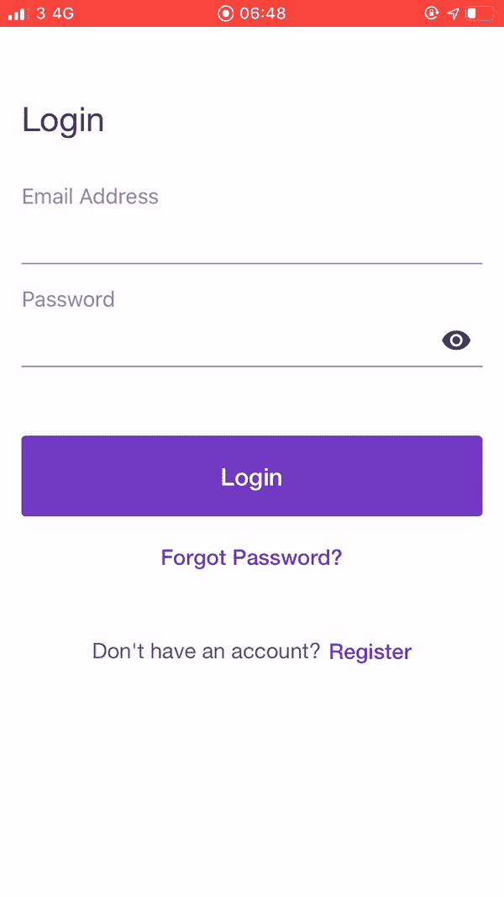
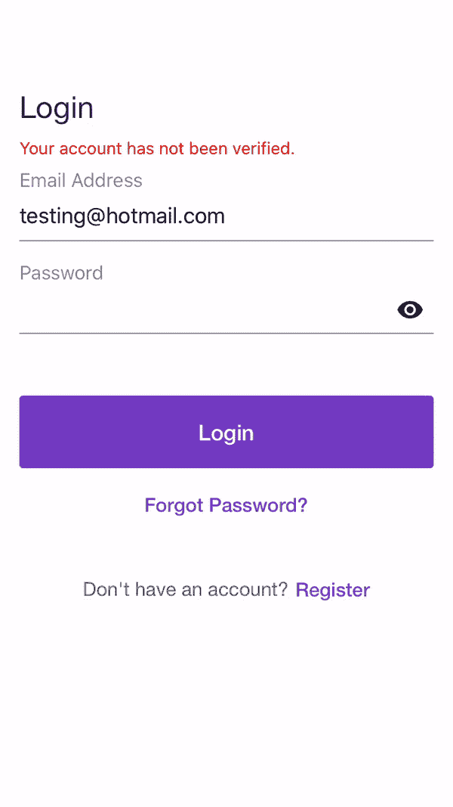

# 如何向 React 本机应用程序添加身份验证

> 原文：<https://betterprogramming.pub/how-to-add-authentication-to-your-react-native-app-with-react-hooks-and-react-context-api-46f57aedbbd>

## 以现代方式验证您的用户:使用 Expo 或 React Native CLI 的 React 挂钩和 React 上下文 API


菲利贝托·桑蒂兰在 [Unsplash](https://unsplash.com/s/photos/react?utm_source=unsplash&utm_medium=referral&utm_content=creditCopyText) 上拍摄的照片

我之前的教程概述了使用 Redux 的简单 React 原生应用程序所需的步骤和[样板代码](https://medium.com/mesan-digital/tutorial-1a-react-native-with-react-hooks-and-redux-boilerplate-75014ca8dee4)。接下来，我概述了如何通过开发一个允许用户创建、更新、删除和查看所有报价的报价应用程序，将 [CRUD 操作](https://medium.com/mesan-digital/tutorial-2a-how-to-add-crud-operations-to-your-react-native-app-using-react-hooks-and-redux-5896ebab89ea)添加到您的应用程序中。

在我的下一个教程中，我将向一个事件应用程序添加 CRUD 操作。与 quotes 的应用程序不同，用户需要注册并登录才能查看或添加活动。

在本教程中，将创建身份验证模块，用户将能够:

*   注册(每次注册后都会发送电子邮件确认)
*   登录(如果用户已经验证了他们的帐户，他们就可以登录)
*   更新个人资料
*   恢复密码



登记



登录，用户名，更新个人资料

## 要求

*   认证 API —(你可以按照这个[教程](https://medium.com/swlh/how-to-build-a-node-js-authentication-api-with-email-verification-image-upload-and-password-reset-95e35fd46be1)来创建一个 NodeJS 认证 API)或者随意使用我的演示 API([http://mesannodejsapiwithverification.herokuapp.com](http://mesannodejsapiwithverification.herokuapp.com))

## **链接**

*   Expo:[https://Expo . io/@ mosesesan/mesan-react-native-authentic ation](https://expo.io/@mosesesan/mesan-react-native-authentication)
*   GitHub (Expo 版):[https://GitHub . com/MosesEsan/mesan-react-native-authentic ation-app/tree/auth](https://github.com/MosesEsan/mesan-react-native-authentication-app/tree/auth)
*   GitHub ( **React Native CLI** 版本):[https://GitHub . com/MosesEsan/mesan-React-Native-CLI-authentic ation-app](https://github.com/MosesEsan/mesan-react-native-cli-authentication-app)

# 第 1 部分— PDF(项目、依赖项、文件夹结构)

## 步骤 1:创建您的项目

若要创建项目，请运行下面的命令。选择一个空白模板并设置应用程序的名称。

```
**Expo**
$ expo init react-native-authentication
$ cd react-native-authentication**React Native CLI**
$ npx react-native init ReactNativeAuthentication
$ cd ReactNativeAuthentication
```

## 步骤 2:安装依赖项

将使用以下软件包:

*   Axios ，一个基于承诺的 HTTP 客户端，用于调用 API
*   [反应原生基本形态](https://github.com/MosesEsan/react-native-basic-form)

```
$ npm i --save axios **react-native-basic-form** react-native-elements
```

导航依赖项:

*   [反应导航](https://reactnavigation.org/)为 app 导航。
*   [React 导航堆栈](https://github.com/react-navigation/stack) —用于 iOS 和 Android 的堆栈导航器。

```
$ npm i --save react-navigation react-navigation-stack**Expo** $ expo install react-native-gesture-handler react-native-reanimated react-native-screens react-native-safe-area-context @react-native-community/masked-view------**React Native CLI**
$ npm install react-native-gesture-handler react-native-reanimated react-native-screens react-native-safe-area-context @react-native-community/masked-view --save*//link these libraries*
$ cd ios; pod install; cd ..*//Vector Icons (***React Native CLI only***)*
npm i --save react-native-vector-icons  
react-native link react-native-vector-icons
```

## 步骤 3:创建文件夹结构

在你的项目根目录下，创建`app` 文件夹。在此文件夹中，创建以下文件夹:

```
**components**
contain all the components**scenes**
contain all the scenes**routes** contains the app routes.**services** contains functions to access the backend API.----**Make sure you are in the project root**$ mkdir app && cd app
$ mkdir providers services components scenes routes
```

# 第 2 部分— CPRS(常量、提供者、缩减者、服务)

## 第四步:配置

在`app`文件夹中，创建两个文件`constants.js`和`theme.js`:

```
**constants.js**The **api url,** its **endpoints** and other config variablesare declared.
```

`**constants.js**`

**theme.js**

## 第五步:供应商

在`providers`文件夹中，新建一个文件:`auth.js` *。*

```
**auth.js**At the top of the file, the context is created**const** AuthContext = React.createContext();---The **reducer** and **initial state** are imported from the reducer file [**this will be created later**] and passed to the **useReducer** hook which returns the current state paired with a dispatch method similar to redux.**const** [state, dispatch] = useReducer(*reducer*, initialState || {});---Various functions are declared and passed as value to the **Provider, this functions include:****getAuthState** returns user data if logged in **handleLogin***:* stores the token and the users' data, sets Axios Authorization header and dispatches the users' data to the reducer to be saved.**handleLogout***:* does the opposite of **handleLogin****updateUser***:* updates the users' data in the local storage and dispatches the new data to the reducer to be saved.---At the bottom, a new object **useAuth** is created using the [**useContext**](https://reactjs.org/docs/hooks-reference.html#usecontext)hook and the previously created **AuthContext**. This object represents the current context value for our context and is exported along with the **AuthContext** and the **Provider**.
```

**provider.js**

## 第六步:减肥药

在`app`文件夹中，新建一个文件:`reducer.js` *。*

```
The reducer is in charge updating the app state based on the dispatched action.
```

**reducer.js**

## 第七步:服务

在`services`文件夹中，新建一个文件:`auth.js` *。*

该文件将包含访问身份验证 API 端点所需的以下所有函数。

```
**register** makes API request to register the user.Accepts users data as parameter.--**login** makes API request to login the user.Accepts users data as parameter.---**forgotPassword** makes API request to login the user.Accepts users **'email' in an object** as parameter.---**updateProfile** makes API request to update users data.Accepts **userId** and **data** as parameter.Loops through the data passed to create a **FormData**object.An **axios options object** is created with the content type set to "multipart/form-data" to allow for image upload.
```

**服务/认证服务**

# 第 3 部分— CSR(组件、场景、路线)

## 第八步:组件

在`components`文件夹中，创建以下文件:

```
**CTA.js****props** title: E.g. "Already have an account?"ctaText: (e.g 'Login')
onPress: (CTA action - e.g. Navigate to another scene)style: (styles for the panel container)
titleStyle: (styles for the title)
ctaStyle: (styles for the cta)
```

```
**Shared.js**In here, 2 components are created, Header and ErrorText, one is used for displaying a header in the scene and the other for displaying errors.**props
(Header)** title: E.g. "Login"
**(Error)** error: the error message to display
```

**组件**

## 第九步:场景

在`scenes`文件夹中创建两个文件夹，并创建以下文件:

```
**auth/****Register.js** **auth/****Login.js** **auth/****Username.js** **auth/****ForgotPassword.js**All scenes use the Header and ErrorText components.---Register scene calls the auth service **register**function to register the new user. On success, the app replaces the current scene with the **Login** scene. Uses CTA component.---Login scene calls the auth service**login**function to log user in. On success, the app navigates to the **Home** scene. Uses CTA component.---Username scene calls the auth service **updateProfile**function to update the users' data. On success, the app navigates to the **Home** scene.---Forgot Password scene calls the auth service **forgotPassword**function to update the users' data. On success, the app navigates back to the **Login** scene.
```

```
**auth/****AuthLoading.js**Displays a loading screen while the app checks if the user is logged in.Uses the **useAuth** object to retrieve the **getAuthState** function. If a user exist, checks if the username has been set, if yes, the app navigates to the **Home** scene, if not, navigates to the **Username** scene.**const** { getAuthState } = *useAuth*();
**const** user = **await** getAuthState();
```

**认证场景**

```
**home/****Home.js**Displays a screen with a welcome message and a 'Logout' and 'Update Profile' button. Uses the **useAuth** object to retrieve the users data and the **handleLogout** function. 

**const** {state, handleLogout} = useAuth();
**const** user = state.**user**;---**home/****UpdateProfile.js**Calls the auth service **updateProfile**function to update the users' data. On success, the app navigates back to the **Home** scene.
```

**家居场景**

## 第十步:路线

在`routes`文件夹中，创建两个文件:`auth.js` 和`home.js` *。*

```
In these files, React Navigation **createStackNavigator**function is used to create the routes stacks.The authentication routes stack, consists of the Register, Login, Username and ForgotPassword scenes.
```

**路线**

# 第 4 部分—结论(RA)

## 路由器

在`app`文件夹中，新建一个文件:`router.js` *。*

```
Using the **createSwitchNavigator** function, the apps routes stack is created consisting of the **AuthLoading** scene, the authentication routes stack, and the home stack.The **Provider** is imported and theapps routes stack is wrapped in it, making the context value available across all scenes.
```

**router.js**

## App.js

这个文件是我们应用程序的主要入口点:

```
In this file, the router is imported. Update the App.js file with the code below.
```

**App.js**

# 第十步:测试

运行下面的命令来测试应用程序。

```
**Expo**
$ expo start**React Native CLI** $ npx react-native run-ios
```

# 那都是乡亲们！

欢迎来到 2020 年

# 变更日志

1.  **React 本地 CLI 指令和 GitHub Repo 已添加(2020 年 3 月)**

# 相关教程

1.  [用 React 钩子和 Redux 样板文件来反应本地](/mesan-digital/tutorial-1a-react-native-with-react-hooks-and-redux-boilerplate-75014ca8dee4)
2.  [如何使用 React 钩子和 Redux 将 CRUD 操作添加到 React 原生应用中](/mesan-digital/tutorial-2a-how-to-add-crud-operations-to-your-react-native-app-using-react-hooks-and-redux-5896ebab89ea)
3.  [如何使用 React Native 和 Redux 构建一个具有搜索和加载更多功能的新闻 App。](https://medium.com/swlh/how-to-build-a-news-app-with-search-and-load-more-functionality-using-react-native-and-redux-2875e827cd7f)