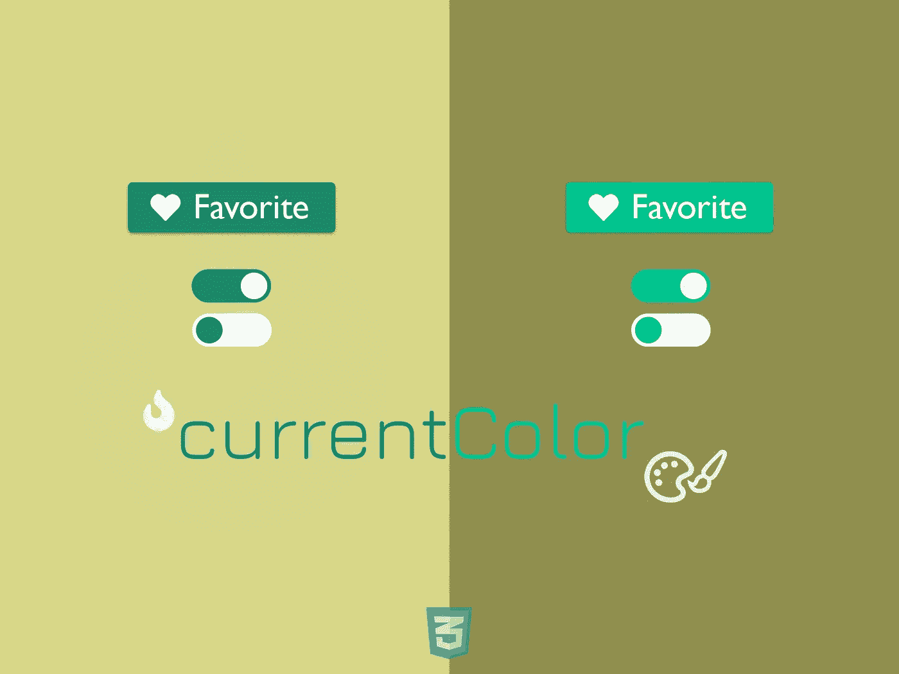
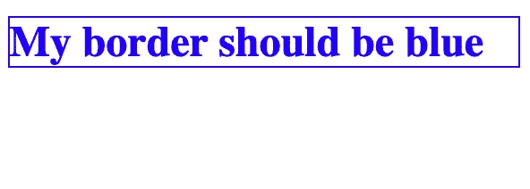
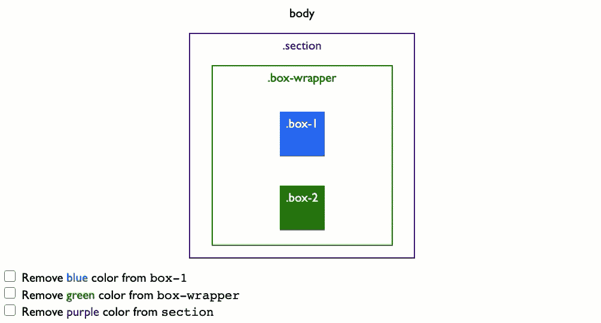
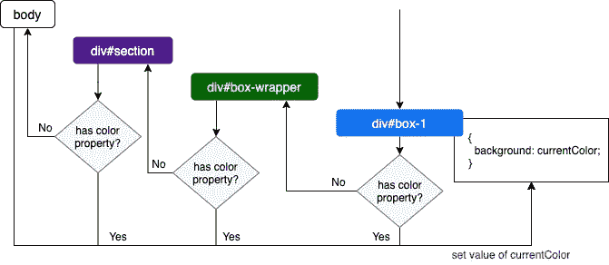
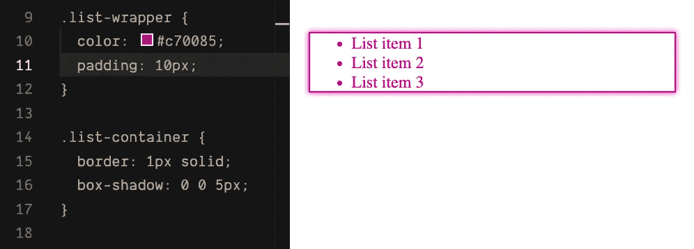
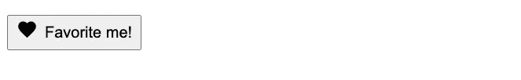
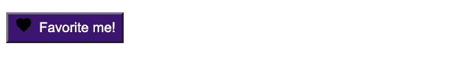
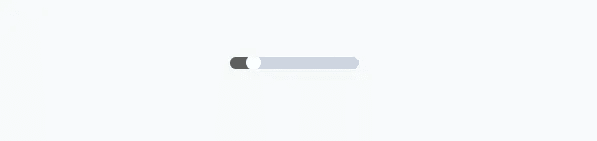
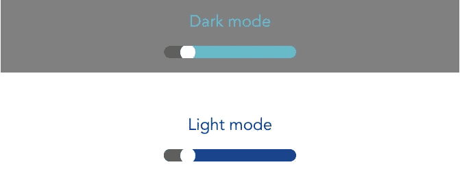

# 如何用 CurrentColor 给 SVG 图标和元素添加颜色

> 原文：<https://betterprogramming.pub/how-to-add-color-to-svg-icons-and-elements-with-currentcolor-6187febe702d>

## CSS 中的 currentColor 是什么？



用当前颜色为图标和按钮设置主题

*使用*`*currentColor*`*——一个 CSS 模块 3 变量，现在可以为组件制作可重用的 SVG 图标和一致的颜色主题，同时保持样式表简短。但是* `*currentColor*` *到底是什么？我们如何实现颜色的一致性并使用它创建可重用的 SVG 图标？* *我们来了解一下。*

# 什么是`currentColor`？

`currentColor`是一个 CSS 变量，包含元素上使用的最接近的`color`属性的**计算值**。

> 简而言之，`currentColor`的值=壁橱`color`属性的值。

`currentColor`是不是**不是**自定义变量，其值是**只读**；因此，我们不能覆盖它或给它赋值。

例如，给`currentColor`一个`blue`值:

```
/* Invalid syntax */
h1 {
 currentColor: blue;
}

/* Correct syntax */
h1 {
 color: blue;
}
```

我们可以将`currentColor`的值映射到任何可以接收颜色的属性。让我们看下面的例子:

```
<div class="textbox">
 <h1>My box shadow should be blue</h1>
</div>
```

假设我们已经将`h1`的`color`设置为`blue`。我们可以将`border`的颜色值赋给`currentColor`，如下图所示:

```
.blue-border {
 border: 1px solid currentColor;
}
```

当我们将`blue-border`添加到`h1`元素时:

```
<h1 class="blue-border">
  My border should be blue
</h1>
```

结果将是:



现在，边框采用与文本相同的颜色。就这么简单。

下一个问题—如果我们没有为`h1`设置任何文本颜色，那么`currentColor`如何选择正确的颜色呢？

# 使用`currentColor`关键字的颜色继承

像其他 CSS 变量一样，它遵循级联规则，这意味着如果元素的 CSS 规则集中没有`color`属性，它将从组件的最近祖先继承`color`属性。如果任何祖先中没有`color`，`currentColor`会自动接收浏览器定义的 fallback 值，很可能是黑色。

以下面的 DOM 树结构为例:

```
<html>
    <head><!-- header code --></head>
    <body>
    <div class="section purple" id="section">
      <div class="box-wrapper green" id="box-wrapper">
          <div class="box-1 box blue" id="box-1"></div>
          <div class="box-2 box" id="box-2"></div>
      </div>
    </div>
  </body>
</html>
```

元素`div#section`使用`purple`类将颜色设置为紫色，元素`div#box-wrapper`具有`green`类，我们的目标元素`div#box-1`具有用于颜色的`blue`类。为了进行试验，我们将下面的代码添加到任何带有类`box`的元素中(包括我们的目标元素)。

```
background: currentColor;
```

下面根据上面的结构描述颜色继承如何为`div#box-1`元素和`div#box-2`的`currentColor`工作。



更详细的解释图如下:



但是并不是所有的属性都需要访问`currentColor`。虽然有些属性可以继承`color`的值，但其他一些属性需要帮助才能获得正确的颜色。对于这样的属性，`currentColor`是极有帮助的。

那么哪个物业不需要`currentColor`的帮助，哪个需要呢？

## CSS 中的颜色继承

默认情况下，许多 CSS 属性都启用了颜色继承，包括:

*   `border-color`
*   `border`
*   文本元素的`outline`和`outline-color`
*   `color`
*   `box-shadow`

此外，所有文本元素，包括图像的`alt`文本，都将继承颜色值，除非有一个不同的颜色明确分配给它们。

以下面的例子为例:

```
<div class="list-wrapper">
    <ul class="list-container">
        <li>List item 1</li>
        <li>List item 2</li>
        <li>List item 3</li>
  </ul>
</div>
```

一旦父`div`的颜色改变，所有相关属性和文本元素的颜色也会改变。



对于以上场景，不需要使用`currentColor`。否则，`currentColor`对于支持元素之间的颜色继承是必不可少的，比如主题化和构建一致的 SVG 图标。

我们来看看这些用例，好吗？

# 用 SVG 和 currentColor 构建可重用的图标组件

对于图标来说，使用 SVG 是一种推荐的做法，因为有很多好的理由。创建可重用的 SVG 图标组件有很多方法。一个简单的方法是用`use`和`symbol`元素创建 SVG sprite。

## 用`use`创建 SVG 精灵

最直接的方法是使用`<svg>`元素作为精灵来创建一个图标容器。我们用`<symbol>`包装每个图标，用`use`重用它。`<symbol>`是 SVG 的一个嵌套元素，允许我们定义一个图标，而无需在屏幕上显示。只有在引用了那个图标的时候才使用`<use>`元素。例如，考虑下面的 SVG 图标 sprite 容器:

```
<body>
    <svg style="display: none">
        <symbol viewBox="0 0 32 32" id="heart-icon">
        </symbol>
    </svg>
</body>
```

我们给图标符号分配一个`id`，然后通过用`<use>`引用它的`id`，在页面的任何地方重用这个心形图标，比如在一个文本按钮中:

```
<button class="favorite-btn">
  <svg width="24px" height="24px">
    <use xlink:href="#heart-icon"></use>
  </svg>
    Favorite me!
</button>
```

和一点 CSS 来使按钮的内容对齐。

```
.favorite-btn {
  display: flex;
  align-items: center;
}
```

就是这样。该按钮将如下所示:



如果我们希望这个按钮以白色文本和紫色背景呈现呢？

## 添加颜色

对于按钮的背景和文本颜色，我们可以根据其类别`favorite-btn`将 CSS 样式添加到`button`中，如下所示:

```
.favorite-btn {
    /*...*/
  background: #3d1472;
  color: white;
}
```

该按钮看起来像这样:



不幸的是，图标颜色与按钮文本不同步。要改变它的颜色，我们可以使用带有适当值的`fill`属性:

```
.favorite-btn svg {
  fill: white;
}
```

现在我们得到了正确呈现的按钮:


如果我们想在悬停时将按钮的文本颜色改为`grey`并相应地匹配图标颜色，我们将需要在 CSS 文件中添加两个额外的规则集:

```
.favorite-btn:hover {
  color: grey; // color for button text
}

.favorite-btn:hover svg {
    fill: grey; // color for icon
}
```

这种解决方案并不是最佳的，特别是当你有更多的文本按钮和不同颜色的图标时。).它需要为每个按钮编写至少两个 CSS 规则集，并且为每个按钮状态编写两个额外的规则集，因此使得我们的 CSS 文件很长并且难以维护。

有更好的解决方案吗？使用`currentColor`！

对于任何`svg`元素，只需将`fill`的值设置为`currentColor`:

```
svg {
    fill: currentColor;
}
```

我们不再需要 CSS 样式的`favorite-btn svg`选择器。所以我们现在的 CSS 代码是:

```
.favorite-btn {
  background: #3d1472;
  color: white;
}

.favorite-btn:hover {
    color: grey;
}

svg {
  fill: currentColor
}
```

我们的图标颜色将自动匹配按钮的文本颜色。此外，更改按钮的文本颜色只需要修改按钮容器的 CSS 样式。代码更少，CSS 文件更短，错误更少。


很简单，对吧？在这里您可以随意尝试代码演示。

下一个用例怎么样——用`currentColor`进行主题化？

# 使用`currentColor`和 CSS 自定义变量进行主题化

我之前展示并写了一篇关于[如何用 CSS 自定义变量](http://mayashavin.com/articles/dynamic-theme-css-variables)动态定制暗/亮模式主题的文章。那么`currentColor`还能给主题化带来什么好处呢？

假设我们有一个用于输入范围的滑动组件，如下所示:



我们希望根据以下主题为暗/亮模式提供一致的外观和感觉:



在 CSS 自定义变量的帮助下，我们可以为应用程序定义如下原色:

```
:root {
    --page-bg-dark-mode: #808080;
    --page-color-dark-mode: #69bac9;
  --page-color-light-mode: #0b4491;
}

.dark-mode {
  background: var(--page-bg-dark-mode);
  color: var(--page-color-dark-mode);
}

.light-mode {
  color: var(--page-color-light-mode);
}
```

对于切换，我们使用`currentColor`作为输入范围的背景来自动继承主题颜色。

```
.input-range {
  /* ... */
  background-color: currentColor;
  color: inherit; /* make sure input text color is consistent with the theme */
}
```

tada，我们得到一个对主题改变有反应的组件。


太棒了。您可以[在这里试验完整的代码](https://codesandbox.io/s/currentcolor-demo-2r1fz?fontsize=14&hidenavigation=1&theme=dark)并轻松添加更多组件，如滑块、复选框等。创造你自己的设计系统。毕竟，为什么不呢？

# 摘要

大的 CSS 文件会导致更长的 TTFB(到达第一个字节的时间)和首次绘制，损害网站的整体性能。此外，从长远来看，阅读和维护它们更加困难。有了`currentColor`，我们终于可以在保持 CSS 简洁的同时，结合定制变量等其他工具来实现主题化自动化。此外，我们终于可以亲吻 CSS 样式表的规则，并使它们干燥(不要重复自己)。那么你还在等什么？

有一些与`currentColor`的新展柜？[打我一下](https://twitter.com/MayaShavin)。