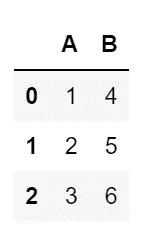
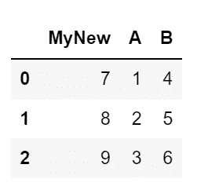
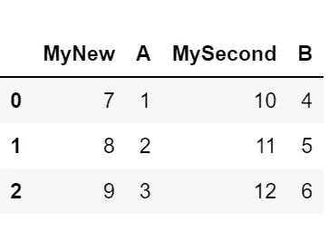
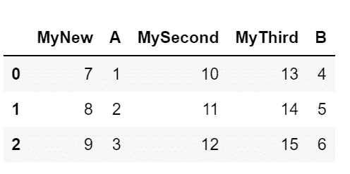
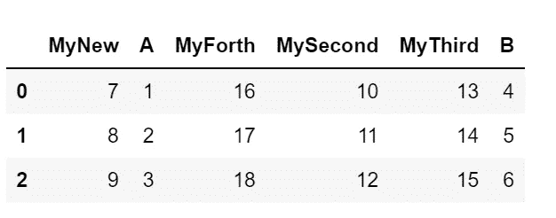

# 如何在特定位置向熊猫添加列

> 原文：<https://betterprogramming.pub/how-to-add-columns-to-pandas-at-a-specific-location-77913aa6b9f0>

## 如何根据列索引或列名在特定位置插入列的演练示例


帕斯卡·米勒在 [Unsplash](https://unsplash.com?utm_source=medium&utm_medium=referral) 上拍摄的照片

[](https://jorgepit-14189.medium.com/membership) [## 用我的推荐链接加入媒体-乔治皮皮斯

### 阅读乔治·皮皮斯(以及媒体上成千上万的其他作家)的每一个故事。您的会员费直接支持…

jorgepit-14189.medium.com](https://jorgepit-14189.medium.com/membership) 

在 Pandas 中，当我们添加一个新列时，它会出现在数据框的末尾。但是，很多时候需要在特定位置添加列。让我们看看如何通过使用`insert`方法在熊猫身上实现。

# 在开头插入一个熊猫专栏

让我们看看如何在数据框的开头添加一列。

```
**import** pandas as pddf **=** pd.DataFrame({'A': [1, 2, 3], 'B': [4, 5, 6]})df
```



```
# new columnC **=** [7, 8, 9]df.insert(loc**=**0, column**=** 'MyNew', value **=** C )df
```



# 在特定位置添加列

在下一个例子中，我们展示了如何在特定位置添加一个新列，尤其是作为第三列。

```
# new column
D **=** [10, 11, 12]df.insert(loc**=**2, column**=** 'MySecond', value **=** D )df
```



# 在列名之前或之后添加列

最后，假设我们想要在特定列之后添加一个新列。例如，假设我们想要在`MySecond`列之后添加一个新列。如前所述，我们需要指定要添加的列的位置。在 Pandas 中，我们可以使用`get_loc`方法通过列名获得列的位置。下面的例子有助于理解。

## 获取`MySecond`列的位置

```
df.columns.get_loc('MySecond')
```

我们得到了:

```
2
```

## 在`MySecond`列后添加新列

既然我们得到了引用列的位置，我们就可以指定新列的位置。例如，新列的位置将是`df.columns.get_loc('MySecond') + 1 = 3`

```
# new column
E = [13, 14, 15]df.insert(loc=df.columns.get_loc('MySecond')+1, column= 'MyThird', value = E )df
```



## 在`MySecond`列之前添加新列

同样，我们可以在特定列之前添加一个新列。

```
# new column
F = [16, 17, 18]df.insert(loc=df.columns.get_loc('MySecond'), column= 'MyForth', value = F )df
```



最初发布于[预测黑客](https://predictivehacks.com/?all-tips=how-to-add-columns-to-pandas-at-a-specific-location)