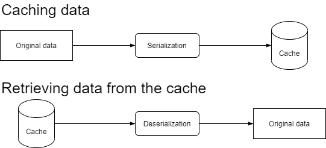
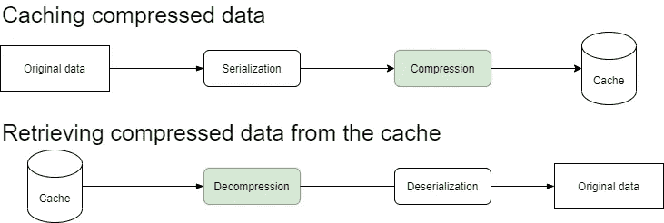

# 如何在 Spring Boot 的缓存中添加压缩

> 原文：<https://betterprogramming.pub/how-to-add-compression-to-caching-in-spring-boot-d4d21533167c>

## 释放您的缓存


[法托斯 Bytyqi](https://unsplash.com/@fatosi?utm_source=unsplash&utm_medium=referral&utm_content=creditCopyText) 在 [Unsplash](https://unsplash.com/s/photos/programming?utm_source=unsplash&utm_medium=referral&utm_content=creditCopyText) 上的照片。

RAM 是云提供商提供的最昂贵的资源之一。因此，将所有缓存数据存储在内存缓存中是有代价的。这就是为什么实现旨在不浪费它的技术是至关重要的。

另外，当您的 Spring Boot 应用程序和缓存服务器共存于同一台机器上，共享底层资源时，这实际上是不可避免的。事实上，缓存从应用程序中窃取的 RAM 越少越好。此外，众所周知，序列化的 Java 对象会占用大量空间。因此，通过缓存它们，您的 RAM 可能很容易就耗尽空间。

这就是压缩发挥作用的地方！

让我们看看如何用 Kotlin 和 Java 在 Spring Boot[的缓存系统中添加压缩。](https://spring.io/projects/spring-boot)

# 压缩和缓存

通常，在 Spring Boot 中处理缓存时，数据被序列化，然后存储在缓存中。需要时，数据被搜索、反序列化，最后以原始格式返回给应用程序，在本例中用 Java/Kotlin 对象表示。



正常缓存流程图。图片由作者提供。

添加压缩层意味着在序列化数据之后压缩数据，在反序列化之前解压缩数据，修改正常流程如下:



压缩数据缓存流程图

压缩数据减少了缓存的大小，并为您提供了两种选择:

1.  减少缓存服务器所需的 RAM，为您省钱。
2.  保持缓存大小不变，但允许您保存更多的数据。

这两个选项都很棒，但是压缩也会带来开销。特别是，压缩和解压缩需要花费时间，这可能会大大降低缓存的性能优势。这代表了 RAM 和 CPU 之间的权衡，这取决于您是否发现这种方法适合您的特定情况。

# 实现压缩逻辑

请记住，上面介绍的方法可以被 Spring Boot 支持的任何[缓存提供商](https://docs.spring.io/spring-boot/docs/1.3.0.M1/reference/html/boot-features-caching.html#_supported_cache_providers)采用。让我们看看如何使用一个 [Redis](https://redis.io/) 缓存来实现它。这可以通过注册一个从`[JdkSerializationRedisSerializer](https://docs.spring.io/spring-data/redis/docs/current/api/org/springframework/data/redis/serializer/JdkSerializationRedisSerializer.html)`继承的自定义类作为默认 Redis 序列化器来轻松实现。

首先，您需要定义一个有效的 Redis 序列化程序来实现压缩和解压缩逻辑，如上图所示。您将看到如何使用 [GZIP](https://en.wikipedia.org/wiki/Gzip) ，它是在 Java 中本地实现的，但是其他压缩方法也是可能的。另外， [Commons IO](https://commons.apache.org/proper/commons-io/) 库将用于保持解压缩逻辑简单。

如果您是 Gradle 用户，请将此依赖项添加到项目的构建文件中:

```
compile "commons-io:commons-io:2.9.0"
```

否则，如果您是 Maven 用户，请将以下依赖项添加到项目的构建 POM 中:

```
<dependency>
    <groupId>commons-io</groupId>
    <artifactId>commons-io</artifactId>
    <version>2.9.0</version>
</dependency>
```

现在，您已经具备了定义自定义 Redis 序列化程序所需的一切。

## Java 语言(一种计算机语言，尤用于创建网站)

## 科特林

其次，您需要将刚刚定义的类声明为默认的 Redis 值序列化程序。这可以通过在实现`[CachingConfigurerSupport](https://docs.spring.io/spring-framework/docs/current/javadoc-api/org/springframework/cache/annotation/CachingConfigurerSupport.html)`的自定义`[@Configuration](https://docs.spring.io/spring-framework/docs/current/javadoc-api/org/springframework/context/annotation/Configuration.html)`注释类中注册一个`RedisCacheConfiguration` [主 bean](https://docs.spring.io/spring-framework/docs/current/javadoc-api/org/springframework/context/annotation/Primary.html) 来实现，如下所示:

## Java 语言(一种计算机语言，尤用于创建网站)

## 科特林

瞧啊！您的 Redis 缓存将比以往更加自由！

# 奖金

处理缓存可能会带来一些只有彻底清理才能解决的问题。这正是你应该通过添加一些管理工具来保护自己的原因，如这里的[所解释的](https://levelup.gitconnected.com/building-an-api-to-clear-all-the-caches-of-your-spring-boot-application-2d0dfdfe71b3)。

[](https://levelup.gitconnected.com/building-an-api-to-clear-all-the-caches-of-your-spring-boot-application-2d0dfdfe71b3) [## 构建一个 API 来清除 Spring Boot 应用程序的所有缓存

### 通过按需清除所有缓存数据来避免一致性问题

levelup.gitconnected.com](https://levelup.gitconnected.com/building-an-api-to-clear-all-the-caches-of-your-spring-boot-application-2d0dfdfe71b3) 

另外，当错误发生时，你应该总是能够理解发生了什么。这就是为什么在您的 Spring Boot 应用程序中正确地[处理与缓存相关的错误可能变得不可避免。](/how-to-handle-cache-related-errors-in-spring-boot-679333e1beb7)

[](/how-to-handle-cache-related-errors-in-spring-boot-679333e1beb7) [## 如何处理 Spring Boot 中与缓存相关的错误

### 保护您的 Spring Boot 应用程序免受缓存故障的影响

better 编程. pub](/how-to-handle-cache-related-errors-in-spring-boot-679333e1beb7) 

# 结论

处理内存中的缓存可能会显著增加架构的成本。这就是为什么您应该采用旨在减少缓存数据空间的方法。正如我们刚刚看到的，在您的 Spring Boot 应用程序中向缓存系统添加压缩逻辑并不复杂，因此它允许您节省空间和金钱。

感谢阅读！我希望这篇文章对你有所帮助。如果有任何问题、意见或建议，请随时联系我。