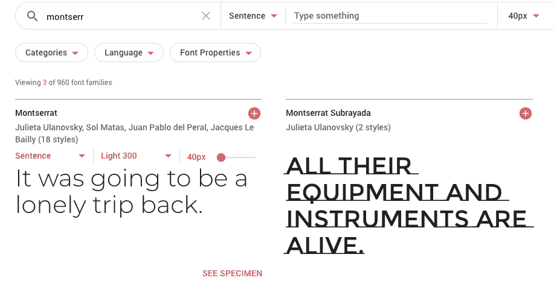
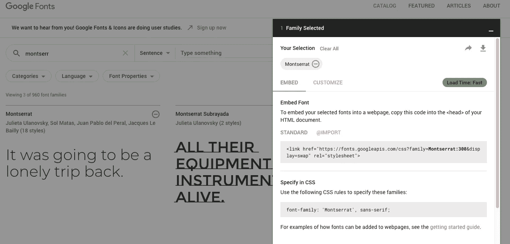
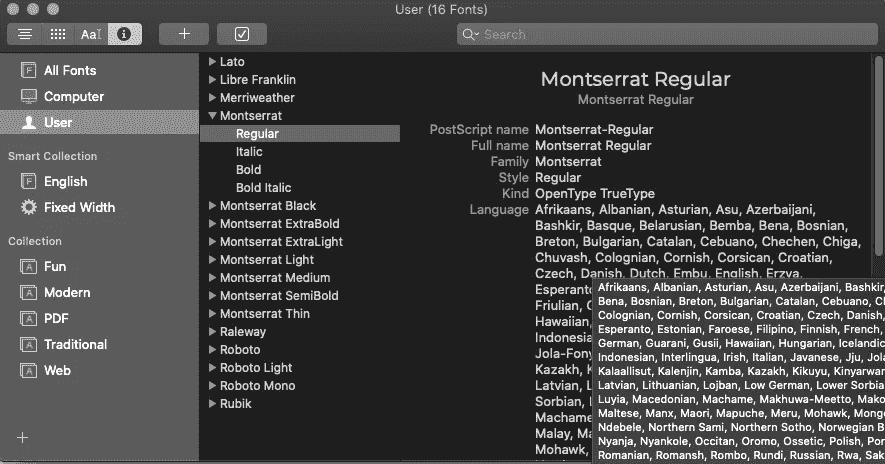
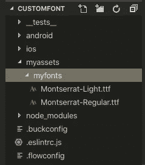
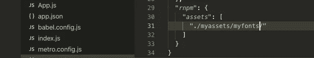
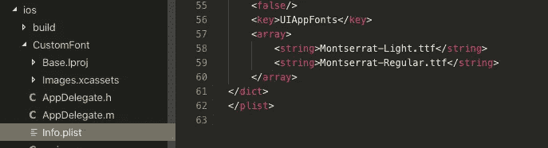
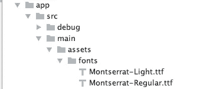
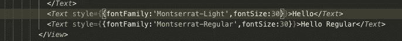
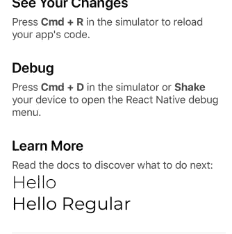

# 如何将自定义字体添加到 React-Native 项目中

> 原文：<https://betterprogramming.pub/how-to-add-custom-fonts-to-your-react-native-project-c64305281b9>

当我开始计划兼职项目时，我首先想的一个方面是我想在项目中使用的字体。

想到这一点，我意识到过去我在将自定义字体集成到我的 React-Native 项目中时遇到了一些问题，所以我认为制作一个关于如何做到这一点的教程以及大量的截图是一个很酷的想法。我们开始吧。


列昂尼德·奥西波维奇·帕斯捷尔纳克的《考试前一天》(1895)

您需要采取的第一步是使用下面的命令在您选择的文件夹目标中创建一个 React-Native 项目。

```
react-native init MyProject
```

其次，你会想去选择一种字体在你的应用程序中使用。我总是用谷歌字体。

你要做的是寻找你喜欢的字体，然后点击它右边的加号按钮。这意味着你已经选择了字体。然后点击刚才选择的家庭，再点击弹出窗口右上方的下载按钮。



这将下载字体包作为一个 ZIP 文件夹。将文件夹解压缩到设备上您选择的位置。我通常将它们解压到下载文件夹中。

**注意:**在将自定义字体集成到您的项目中时，需要注意的一点是，Android 在引用字体时将使用字体文件名，而 IOS 将使用 postscript 名称。要检查文件的 postscript 名称，您需要使用字体册。所以在我的例子中，我将检查字体 Montserrat 的 postscript 名称。

从下面的截图可以看出，Montserrat 字体的全称是 Montserrat Regular 但是，postscript 名称是 Montserrat-Regular，因此，如果需要，您需要将字体文件重命名为 postscript 文件名。然而，Montserrat 的字体文件名已经和 postscript 的名字一样了，所以对于这个字体，我不需要这样做。



下一步是在项目的根目录下创建一个文件夹，其中包含另一个文件夹，该文件夹包含您要添加的字体文件。

对于本教程，我已经创建了一个名为 myassets 的文件夹，并在其中创建了另一个名为 myfonts 的文件夹。在 myfonts 文件夹中，我已经复制了我想要使用的字体。



下一步是在项目的根目录下创建一个配置文件，其中包含对 assets 文件夹的引用。利用这一点，我们可以使用 React-Native 链接将我们的字体链接到 Android 和 iOS。

教程的下一步取决于您使用的 React Native 的版本。如果您使用的是高于 0.60 的 React 本地版本，那么您需要创建一个配置文件，我将在下面解释如何做。但是，如果您的 React-Native 项目版本低于 0.60，那么您可以 rnpm。我将在下面展示这两者。但是我将首先显示配置文件。

因此，在项目的根目录下，您需要创建一个名为 react-native.config.js 的文件。暂时不要担心项目对象——只需确保`assets`值与项目中包含字体名称的目录文件路径相同。这可能与您的不同，取决于您对文件夹的命名。

```
*module*.*exports* = {project: {ios: {},android: {}, // grouped into "project"},assets: ["./myassets/myfonts/"], // stays the same};
```

但是，您可以通过在终端中输入以下命令来检查您的 React-Native 版本。

```
react-native -v
```

它应该输出如下所示的内容，尽管在您的机器上这两个值可能不同。

```
react-native-cli: 2.0.1
react-native: 0.61.2
```

如果您发现您使用的版本低于 0.60，那么您需要将 rnpm 添加到 package.json 文件中，该文件将包含指向您的字体的文件目录链接。



此外，您现在需要输入并运行以下命令:

```
react-native link
```

这将把您的资源链接到 Android 和 iOS 文件夹，并在 Xcode 和 Android Studio 项目中创建组/文件夹，如果需要的话。您可以通过检查 iOS info.plist 文件来查看您的字体是否已成功添加。如果它们在那里，那么它们已经被成功链接。



你的 Android 项目也是如此，如果你使用 Android Studio 打开它，你应该可以看到一个名为“assets”的新文件夹，其中包含一个名为“fonts”的文件夹，该文件夹将包含字体文件。



就链接和同步而言，这应该是它(哈哈，看到我在那里做了什么吗？)您的自定义字体。接下来的事情是在您的代码中尝试它们。

下面是我如何实现自定义字体的截图。更新:要看到这些变化在你的项目模拟器或真实电话中生效，你可能需要先关闭你的终端连接和模拟器，然后重新启动项目。



最后，下面是我在 React-Native 应用模拟器上显示的自定义字体的截图。



如果您对本教程有任何问题，请告诉我，我会尽快回复您——和过去一样，我在为项目添加自定义字体时遇到了一些困难。但是我认为现在容易多了。话虽如此，还是谢谢你看我的文章！

在这里看我的博客—[https://simplyreact.uk/](https://simplyreact.uk/)