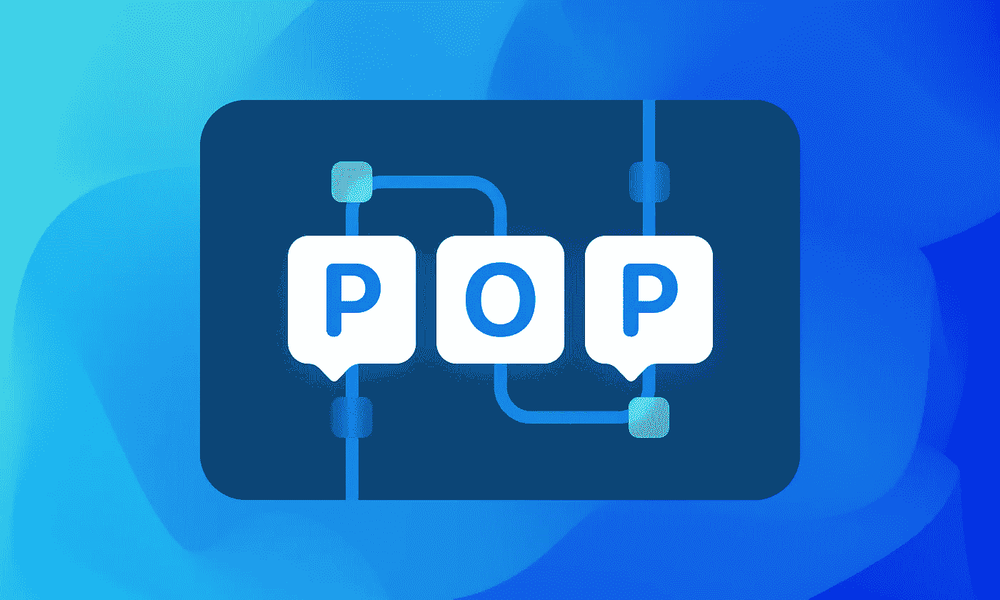
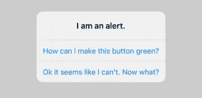
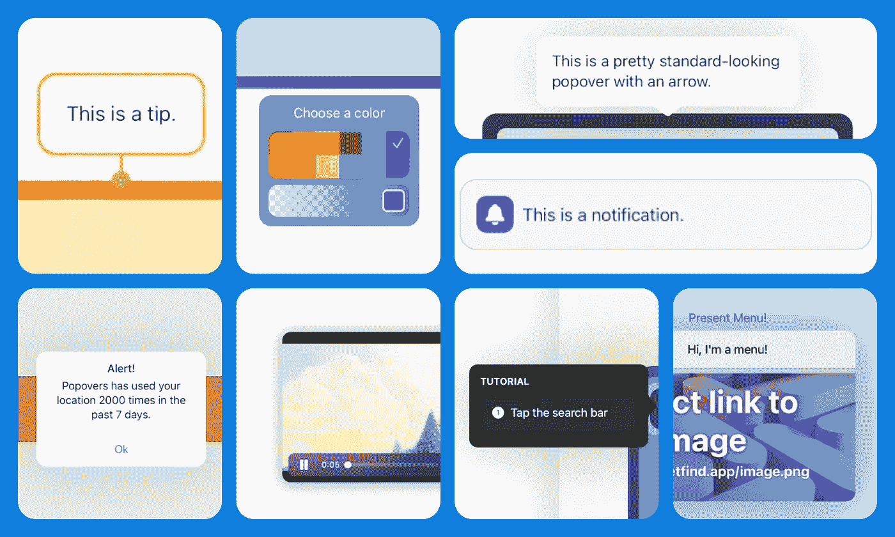
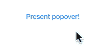
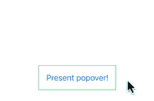
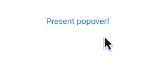
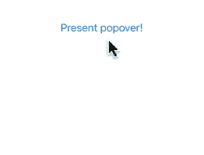
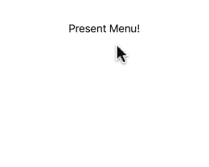

# 如何将自定义 Popovers 添加到您的 iOS 应用程序🔗

> 原文：<https://betterprogramming.pub/how-to-add-custom-popovers-to-your-swiftui-ios-app-814bdfad73d0>

## 使用 SwiftUI [突破**系统限制🔗**](https://medium.com/p/814bdfad73d0/edit#0c08)



目前有三种方式来展示松饼。一个是用`UIPopoverPresentationController`的，但那只在 iPad 上有效。你也可以展示一个`UIMenu`，但那只适用于 iOS 14+。最后，你可以使用`UIAlertController`。这可能是最容易实现的——但也是最受限制的，因为它只支持标签、按钮和文本字段。



那么…如果你需要一个应用内通知呢？一个画中画视频？还是一个入职弹出窗口？这就是定制松饼的用武之地。



我们将使用 [Popovers](https://github.com/aheze/Popovers) 库。充分披露:我是这个的开发者。但是它是 100%开源的，并且受麻省理工学院许可，所以你可以随意使用它。

[](https://github.com/aheze/Popovers) [## GitHub - aheze/Popovers:一个展示 popover 的库。简单、现代、高度可定制…

### 展示松饼的图书馆。呈现应用程序主要内容上方的任何视图。附加到源视图或使用…

github.com](https://github.com/aheze/Popovers) 

首先，您需要将库添加到项目中。Popovers 支持 Swift 包管理器——在 Xcode 中，只需进入`File` → `Add Packages…`，然后输入网址:

```
[https://github.com/aheze/Popovers](https://github.com/aheze/Popovers)
```

就这样，让我们开始吧！

# 基本松饼[🔗](https://medium.com/p/814bdfad73d0/edit#fcf9)

要添加一个简单的弹出器，只需使用`.popover()`修改器。Popovers 基于 SwiftUI，这意味着您可以传入并呈现任何您想要的视图。



一个简单的松饼。如果您使用 UIKit，请参见此处的。

好吧，如果你想把弹出框放在按钮的顶部呢？它也可以使用一点空间。嗯，很简单:



按钮上方有一个弹出框，中间有一些间隔。

酷——现在让我们添加一些动画并定制橡皮筋。



砰，砰。

现在你有一个有弹性的松饼了！这只是你能做的表面工作——这里列出了所有的[可定制属性](https://github.com/aheze/Popovers#customization)。但是现在让我们来看看一些更高级的功能。

# 高级松饼[🔗](https://medium.com/p/814bdfad73d0/edit#e39e)

我最喜欢的 SwiftUI 特性之一是它的过渡——只要视图结构相同，就可以在不同的视图之间进行动画处理。Popovers 通过`.popover(selection:)`修改器利用了这一点，让您可以在多个 popover 之间平滑过渡。


平稳。

很好。但还有更多！当我开始制作 Popovers 时，我想让它尽可能可定制。那么，如果您想*将*弹出窗口与底层视图连接起来，该怎么办呢？只需附加一个`background`并嵌入一个`PopoverReader`——有点像`[GeometryReader](https://developer.apple.com/documentation/swiftui/geometryreader)`，但更酷。



Smooooooooooooth。

最后一件事。我真的很喜欢`UIMenu`的外观，但它们只在 iOS 14+上可用。所以我用 Popovers 把它反移植到了 iOS 13！



它实际上只有 9 行代码:)

除了`Menu`模板，还有一堆[其他实用程序视图和方法](https://github.com/aheze/Popovers#templates)，我都包含在源代码中。我会让你来创造更酷的东西。

# 结论[🔗](https://medium.com/p/814bdfad73d0/edit#a2d0)

系统组件很棒，只要你愿意牺牲可定制性。这既是一件好事，也是一件坏事——由于所有应用都使用相同的组件，用户体验在整个平台上变得非常一致。但是如果你想要哪怕一丁点儿的控制，你就被困住了。

我的应用程序需要这种类型的控制，所以我做了 [Popovers](https://github.com/aheze/Popovers) 。我希望它有一天能对你有用。感谢阅读！