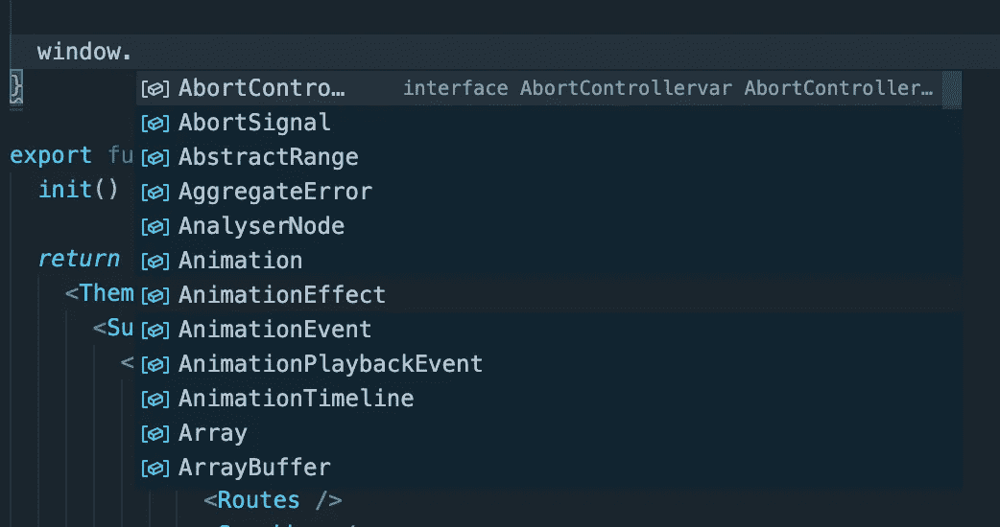
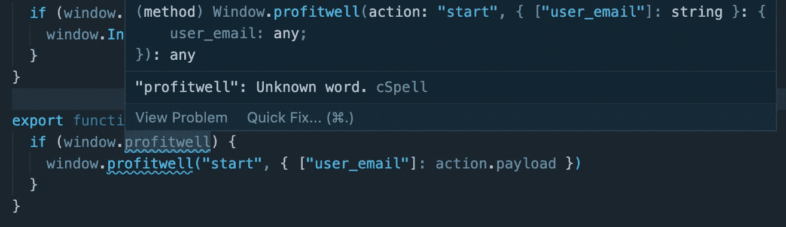

# 如何用 TypeScript 向窗口添加自定义类型

> 原文：<https://betterprogramming.pub/how-to-add-custom-types-to-the-window-with-typescript-8a5408da9e12>

## 创造完美环境的简要指南


由 [olllinka2](https://stock.adobe.com/contributor/205006394/olllinka2?load_type=author&prev_url=detail)

几周前，我受命将一个第三方模块与我们的一个应用程序集成在一起。这是一个需要通过 HTML 中的脚本标签加载的应用程序，类似于如何加载 Google analytics。一旦加载了页面并获取了脚本，我们可以在窗口对象上看到一个新的属性。

该对象具有连接服务所需的可调用方法。我们可以很容易地在 JavaScript 应用程序的窗口中调用这些方法。TypeScript 项目内部的事情变得有点棘手。

在本文中，我将介绍如何向您的应用程序添加窗口类型，以及如何扩充窗口以包含自定义属性。

首先要做的是添加基本窗口类型。通过将“DOM”添加到 tsconfig `lib`数组中，可以将窗口对象添加到您的项目中。

```
"lib": ["DOM"]
```

你可以在这里阅读更多关于包含选项[所得到的类型。这样，您就可以访问窗口对象上可用的内容了。](https://www.typescriptlang.org/docs/handbook/dom-manipulation.html)



有了合适的窗口类型后，接下来要做的事情是向我们的 IDE 将要选择的窗口对象添加一个自定义类型。

在您的项目中创建一个名为`globals.d.ts`的新文件。我选择把它放在我的`src`文件夹中一个叫做`types`的文件夹下。代码如下:

上面的语句将使用`profitwell`函数增加现有的窗口对象。

TypeScript 需要使用`export {}`将该文件分类为外部模块。

在我的例子中，我扩展的对象是一个函数。如果您正在模仿第三方服务，您需要阅读任何可用的文档，以确保您的类型匹配。

文件准备就绪后，最后要做的事情是在应用程序的顶层导入文件，以便 TypeScript 可以拾取它。我正在使用 React，所以我将这一行添加到我的根文件`index.tsx`中。

```
import "./types/globals"
```

重新启动 IDE，您应该可以访问 Window 对象上的新类型。



现在，您应该已经准备好了所有的工具，可以根据您的选择来扩充窗口对象。

感谢您的阅读。

敬请关注更多内容！