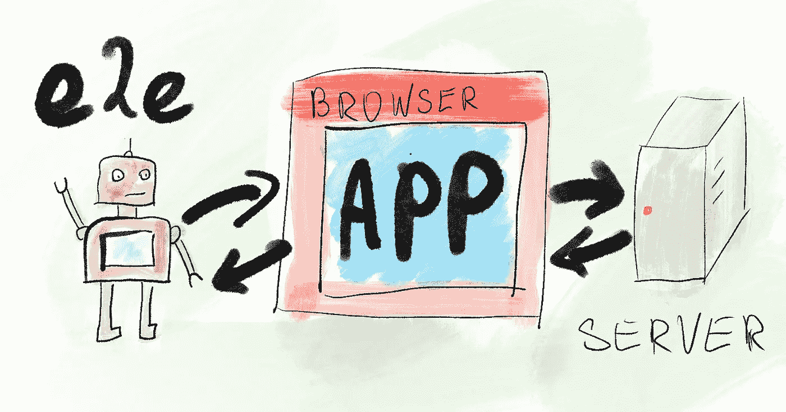

# 如何向项目中添加端到端测试

> 原文：<https://betterprogramming.pub/how-to-add-end-to-end-tests-to-a-project-99297dd31f0>

## 与 E2E 同行的三个步骤

恭喜你。设置端到端(E2E)是一个非常高级的话题，它可以为您的项目带来很多价值。它有机会在将变更合并到主分支之前捕捉到潜在的问题——远在接近生产部署之前。越早发现错误，就越容易修复。E2E 使您能够在更改可用时立即进行广泛的测试。

# 什么是端到端测试？

E2E 测试是脚本，它以类似于用户的方式与应用程序交互。他们打开一个浏览器，加载一个 URL，单击用户界面(UI)元素，如按钮，并期待一些结果。机器执行它们，它们比人快得多，也可靠得多。他们从不感到无聊。

唯一的缺点是——他们需要精确的指令，有时编程会比他们试图测试的特性更复杂。编写测试就是编程，它与被测试的应用程序相关联，但这是一项许多程序员并不特别感兴趣的任务。如果你擅长它，它可能会成为你的独特技能，帮助你在工作中大放异彩。

# 挑选你的工装！

建造 E2E 套房有很多选择:

在这里，这与其他技术堆栈决策是一样的:很好地调查你的选择是有好处的。您编写的每个测试都与您选择的平台紧密相关。从一个测试工具迁移到另一个测试工具是可能的，但是这将是一个像替换前端框架一样大的项目。

我的经验主要是用量角器，一个不赞成使用的角度居中的解决方案。我目前正在将测试迁移到 Cypress，我对这些年来测试工具的进步印象深刻。你希望在你的下一个项目中使用什么 E2E 工具？[让我知道投票结果](https://strawpoll.com/zc6v2fkff)。

# 本地机器上的简单测试

在你的第一次测试中，保持它们的琐碎。使用您拥有的任何本地测试 URL，并通过您的脚本访问它。你甚至不需要检查应用程序的任何工作流程。只需编写几个测试，每个测试针对不同的路线，并验证 UI 元素是否出现在页面上。例如，您可以检查:

*   在`/login`上，是否有用户名和密码的输入栏
*   在`/product/12`上，是否显示产品名称
*   等等。

即使通过如此简单的测试，您也可以证明:

1.  应用程序正在启动，并且所有路线都显示有关键的 UI 元素
2.  你可以开发 E2E 测试

就这样，E2E 开始起飞了——团队有一些测试，并且一个成员(你)愿意并且能够编写更多的测试！

# 让你的团队加入进来

一开始你可能不需要急于求成。只要确保每个人都知道有可用的 E2E 测试，并建立每个开发人员在将东西合并到主分支之前应该运行它们的期望。在这个阶段，你会注意到你的同事的本地设置之间的所有差异——人们在本地使用的不同域或端口。您可以通过让每个人使用相同的 URL 或者让测试 URL 易于配置而不是硬编码来解决这个问题。两种方式都可以。我只是让每个人都使用相同的本地主机 URL 就我而言，团队几乎没有任何反对意见。

下一步是测试工作流的快乐路径——当一切都按预期运行时，应用程序应该做什么。您编写测试来检查“添加到购物车”按钮是否确实将产品添加到购物车中，以及“结帐”是否转到支付提供商页面。这些测试编写起来更加复杂，但是它们测试了应用程序的关键部分。它们应该有助于让你的同事相信 E2E 的用处。你的测试越来越复杂了。

如果你对 E2E 有任何疑问，请随时告诉我！你也可以在我的博客上读到关于管理脆弱的遗留代码的文章。

*最初发布于*[*https://how-to . dev*](https://how-to.dev/how-to-add-end-to-end-tests-to-a-project)*。*