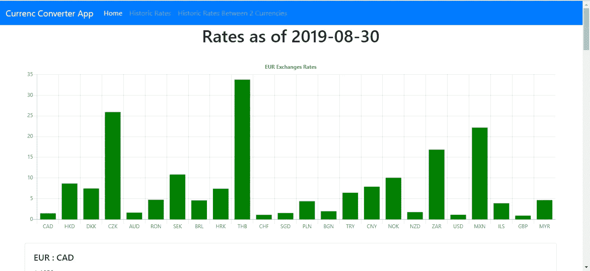
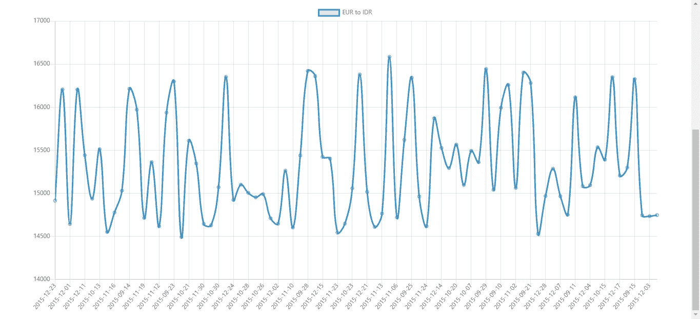

# 如何向 React 应用程序添加图形和图表

> 原文：<https://betterprogramming.pub/how-to-add-graphs-and-charts-to-a-react-app-339ed2dc4c05>

## 构建一个显示当前和历史汇率的应用程序


马库斯·斯皮斯克在 [Unsplash](https://unsplash.com/s/photos/exchange-rates?utm_source=unsplash&utm_medium=referral&utm_content=creditCopyText) 上拍摄的照片

商业应用程序通常会显示图形和图表。React 开发人员的辛勤工作已经产生了图形库，使其很容易满足在应用程序中显示图形和图表的要求。一个流行的图形显示库是 Chart.js，它可以在任何 JavaScript 应用程序中使用。对于 React 应用程序，我们可以使用 Chart.js 的 React 包装器`react-chartjs-2`，轻松地将图形和图表添加到我们的应用程序中。

在这一块，我们将建立一个应用程序来显示当前和历史汇率。当前对欧元的汇率将显示在条形图中，历史汇率将显示在线图中。数据从位于[https://exchangeratesapi.io/](https://exchangeratesapi.io/)的外汇汇率 API 获得。它是免费的，不需要注册就可以使用。它还支持跨域请求，因此可以由 web 客户端应用程序使用。

首先，我们运行 Create React App 来创建脚手架代码。运行`npx create-react-app exchange-rate-app`创建应用程序。接下来，我们需要安装我们的库:运行`npm i axios bootstrap chart.js formik react-bootstrap react-chartjs-2 react-router-dom yup`来安装库。Axios 是我们向汇率 API 发出请求的 HTTP 客户端。Bootstrap 用于样式化，React ChartJS 是我们的图形库。React Router 用于将 URL 路由到我们的页面。Formik 和 Yup 分别用于处理表单值更改和表单验证。

现在我们已经安装了所有的库，我们可以开始编写代码了。除非另有说明，代码位于`src`文件夹中。在`App.js`中，我们用以下代码替换现有代码:

```
import React from "react";
import { Router, Route, Link } from "react-router-dom";
import HomePage from "./HomePage";
import { createBrowserHistory as createHistory } from "history";
import "./App.css";
import TopBar from "./TopBar";
import HistoricRatesBetweenCurrenciesPage from "./HistoricRatesBetweenCurrenciesPage";
import HistoricRatesPage from "./HistoricRatesPage";
const history = createHistory();function App() {
  window.Chart.defaults.global.defaultFontFamily = `
  -apple-system, BlinkMacSystemFont, "Segoe UI", "Roboto", "Oxygen",
  "Ubuntu", "Cantarell", "Fira Sans", "Droid Sans", "Helvetica Neue",
  sans-serif`;return (
    <div className="App">
      <Router history={history}>
        <TopBar />
        <Route path="/" exact component={HomePage} />
        <Route path="/historicrates" exact component={HistoricRatesPage} />
        <Route
          path="/historicrates2currencies"
          exact
          component={HistoricRatesBetweenCurrenciesPage}
        />
      </Router>
    </div>
  );
}export default App;
```

我们在这里用 React Router 定义了路由，因为它是我们应用程序的入口点。我们还在这里设置了图形的字体，因此它现在可以应用到任何地方。

在`App.css`中，我们用以下代码替换现有代码:

```
.center {
    text-align: center;
}
```

这将使文本在我们的应用程序中居中。

我们添加一个文件来添加我们将使用的货币列表。创建一个名为`export.js`的文件，并添加以下代码:

```
export const CURRENCIES = [
  "CAD",
  "HKD",
  "ISK",
  "PHP",
  "DKK",
  "HUF",
  "CZK",
  "AUD",
  "RON",
  "SEK",
  "IDR",
  "INR",
  "BRL",
  "RUB",
  "HRK",
  "JPY",
  "THB",
  "CHF",
  "SGD",
  "PLN",
  "BGN",
  "TRY",
  "CNY",
  "NOK",
  "NZD",
  "ZAR",
  "USD",
  "MXN",
  "ILS",
  "GBP",
  "KRW",
  "MYR",
];
```

现在我们可以在组件中使用它。

接下来，我们创建一个页面来显示两种货币之间的历史汇率。创建一个名为`HistoricRatesBetweenCurrenciesPage.js`的文件，并添加以下内容:

```
import React, { useEffect, useState } from "react";
import { Formik } from "formik";
import Form from "react-bootstrap/Form";
import Col from "react-bootstrap/Col";
import Button from "react-bootstrap/Button";
import * as yup from "yup";
import {
  getHistoricRates,
  getHistoricRatesBetweenCurrencies,
} from "./requests";
import { Line } from "react-chartjs-2";
import { CURRENCIES } from "./exports";const schema = yup.object({
  startDate: yup
    .string()
    .required("Start date is required")
    .matches(/([12]\d{3}-(0[1-9]|1[0-2])-(0[1-9]|[12]\d|3[01]))/),
  endDate: yup
    .string()
    .required("End date is required")
    .matches(/([12]\d{3}-(0[1-9]|1[0-2])-(0[1-9]|[12]\d|3[01]))/),
  fromCurrency: yup.string().required("From currency is required"),
  toCurrency: yup.string().required("To currency is required"),
});function HistoricRatesBetweenCurrenciesPage() {
  const [data, setData] = useState({}); const handleSubmit = async evt => {
    const isValid = await schema.validate(evt);
    if (!isValid) {
      return;
    }
    const params = {
      start_at: evt.startDate,
      end_at: evt.endDate,
      base: evt.fromCurrency,
      symbols: evt.toCurrency,
    };
    const response = await getHistoricRatesBetweenCurrencies(params);
    const rates = response.data.rates;
    const lineGraphData = {
      labels: Object.keys(rates),
      datasets: [
        {
          data: Object.keys(rates).map(key => rates[key][evt.toCurrency]),
          label: `${evt.fromCurrency} to ${evt.toCurrency}`,
          borderColor: "#3e95cd",
          fill: false,
        },
      ],
    };
    setData(lineGraphData);
  }; return (
    <div className="historic-rates-page">
      <h1 className="center">Historic Rates</h1>
      <Formik validationSchema={schema} onSubmit={handleSubmit}>
        {({
          handleSubmit,
          handleChange,
          handleBlur,
          values,
          touched,
          isInvalid,
          errors,
        }) => (
          <Form noValidate onSubmit={handleSubmit}>
            <Form.Row>
              <Form.Group as={Col} md="12" controlId="startDate">
                <Form.Label>Start Date</Form.Label>
                <Form.Control
                  type="text"
                  name="startDate"
                  placeholder="YYYY-MM-DD"
                  value={values.startDate || ""}
                  onChange={handleChange}
                  isInvalid={touched.startDate && errors.startDate}
                />
                <Form.Control.Feedback type="invalid">
                  {errors.startDate}
                </Form.Control.Feedback>
              </Form.Group><Form.Group as={Col} md="12" controlId="endDate">
                <Form.Label>End Date</Form.Label>
                <Form.Control
                  type="text"
                  name="endDate"
                  placeholder="YYYY-MM-DD"
                  value={values.endDate || ""}
                  onChange={handleChange}
                  isInvalid={touched.endDate && errors.endDate}
                />
                <Form.Control.Feedback type="invalid">
                  {errors.endDate}
                </Form.Control.Feedback>
              </Form.Group><Form.Group as={Col} md="12" controlId="fromCurrency">
                <Form.Label>From Currency</Form.Label>
                <Form.Control
                  as="select"
                  placeholder="From Currency"
                  name="fromCurrency"
                  onChange={handleChange}
                  value={values.fromCurrency || ""}
                  isInvalid={touched.fromCurrency && errors.fromCurrency}
                >
                  <option>Select</option>
                  {CURRENCIES.filter(c => c != values.toCurrency).map(c => (
                    <option key={c} value={c}>
                      {c}
                    </option>
                  ))}
                </Form.Control>
                <Form.Control.Feedback type="invalid">
                  {errors.fromCurrency}
                </Form.Control.Feedback>
              </Form.Group> <Form.Group as={Col} md="12" controlId="currency">
                <Form.Label>To Currency</Form.Label>
                <Form.Control
                  as="select"
                  placeholder="To Currency"
                  name="toCurrency"
                  onChange={handleChange}
                  value={values.toCurrency || ""}
                  isInvalid={touched.toCurrency && errors.toCurrency}
                >
                  <option>Select</option>
                  {CURRENCIES.filter(c => c != values.fromCurrency).map(c => (
                    <option key={c} value={c}>
                      {c}
                    </option>
                  ))}
                </Form.Control>
                <Form.Control.Feedback type="invalid">
                  {errors.toCurrency}
                </Form.Control.Feedback>
              </Form.Group>
            </Form.Row>
            <Button type="submit" style={{ marginRight: "10px" }}>
              Search
            </Button>
          </Form>
        )}
      </Formik>
      <br />
      <div style={{ height: "400px", width: "90vw", margin: "0 auto" }}>
        <Line data={data} />
      </div>
    </div>
  );
}export default HistoricRatesBetweenCurrenciesPage;
```

该页面有一个表单，让用户输入他们想要的历史汇率的日期范围和他们正在转换的货币。一旦用户输入了数据，就会根据由 Yup 库提供的`schema`对象中的表单验证模式进行验证。我们要求日期采用 YYYY-MM-DD 格式，并且所有字段都是必需的，因此要根据模式检查它们的有效性。

我们从`toCurrency`的选择中过滤掉为`forCurrency`选择的货币，反之亦然，这样我们就不会在两个下拉菜单中使用相同的货币。

当表单提交完成后，我们将数据提交给 API 并获取费率。我们必须将数据转换成一种可以被`react-chartjs-2`使用的格式，所以我们将带有`datasets`属性的`lineGraphData`对象定义为一个历史汇率数组。`label`是折线图的标题，`borderColor`是线条的边框颜色，`fill` false 表示我们不用颜色填充线条。一旦我们用`setData(lineGraphData);`函数调用进行了设置，图表就会显示出来。

接下来，我们创建一个页面来搜索以欧元为基础货币的历史汇率。为此，我们添加一个名为`HistoricRatePage.js`的文件，并添加如下内容:

```
import React, { useEffect, useState } from "react";
import { Formik } from "formik";
import Form from "react-bootstrap/Form";
import Col from "react-bootstrap/Col";
import Button from "react-bootstrap/Button";
import * as yup from "yup";
import "./HistoricRatesPage.css";
import { getHistoricRates } from "./requests";
import { Line } from "react-chartjs-2";
import { CURRENCIES } from "./exports";const schema = yup.object({
  startDate: yup
    .string()
    .required("Start date is required")
    .matches(/([12]\d{3}-(0[1-9]|1[0-2])-(0[1-9]|[12]\d|3[01]))/),
  endDate: yup
    .string()
    .required("End date is required")
    .matches(/([12]\d{3}-(0[1-9]|1[0-2])-(0[1-9]|[12]\d|3[01]))/),
  currency: yup.string().required("Currency is required"),
});function HistoricRatesPage() {
  const [data, setData] = useState({}); const handleSubmit = async evt => {
    const isValid = await schema.validate(evt);
    if (!isValid) {
      return;
    }
    const params = {
      start_at: evt.startDate,
      end_at: evt.endDate,
    };
    const response = await getHistoricRates(params);
    const rates = response.data.rates;
    const lineGraphData = {
      labels: Object.keys(rates),
      datasets: [
        {
          data: Object.keys(rates).map(key => rates[key][evt.currency]),
          label: `EUR to ${evt.currency}`,
          borderColor: "#3e95cd",
          fill: false,
        },
      ],
    };
    setData(lineGraphData);
  }; return (
    <div className="historic-rates-page">
      <h1 className="center">Historic Rates</h1>
      <Formik validationSchema={schema} onSubmit={handleSubmit}>
        {({
          handleSubmit,
          handleChange,
          handleBlur,
          values,
          touched,
          isInvalid,
          errors,
        }) => (
          <Form noValidate onSubmit={handleSubmit}>
            <Form.Row>
              <Form.Group as={Col} md="12" controlId="startDate">
                <Form.Label>Start Date</Form.Label>
                <Form.Control
                  type="text"
                  name="startDate"
                  placeholder="YYYY-MM-DD"
                  value={values.startDate || ""}
                  onChange={handleChange}
                  isInvalid={touched.startDate && errors.startDate}
                />
                <Form.Control.Feedback type="invalid">
                  {errors.startDate}
                </Form.Control.Feedback>
              </Form.Group> <Form.Group as={Col} md="12" controlId="endDate">
                <Form.Label>End Date</Form.Label>
                <Form.Control
                  type="text"
                  name="endDate"
                  placeholder="YYYY-MM-DD"
                  value={values.endDate || ""}
                  onChange={handleChange}
                  isInvalid={touched.endDate && errors.endDate}
                />
                <Form.Control.Feedback type="invalid">
                  {errors.endDate}
                </Form.Control.Feedback>
              </Form.Group> <Form.Group as={Col} md="12" controlId="currency">
                <Form.Label>Currency</Form.Label>
                <Form.Control
                  as="select"
                  placeholder="Currency"
                  name="currency"
                  onChange={handleChange}
                  value={values.currency || ""}
                  isInvalid={touched.currency && errors.currency}
                >
                  <option>Select</option>
                  {CURRENCIES.map(c => (
                    <option key={c} value={c}>
                      {c}
                    </option>
                  ))}
                </Form.Control>
                <Form.Control.Feedback type="invalid">
                  {errors.country}
                </Form.Control.Feedback>
              </Form.Group>
            </Form.Row>
            <Button type="submit" style={{ marginRight: "10px" }}>
              Search
            </Button>
          </Form>
        )}
      </Formik>
      <br />
      <div style={{ height: "400px", width: "90vw", margin: "0 auto" }}>
        <Line data={data} />
      </div>
    </div>
  );
}export default HistoricRatesPage;
```

它与上一页类似，只是我们只选择要显示的货币，因为要转换的货币总是欧元。我们又有了一个`lineGraphData`，其中的`datasets`是一个数组，而`data`是一个历史汇率数组。`label`是图表的标题。`borderColor`和`fill`与上图相同。

这两种表单都是由 React 引导表单组件创建的。`Form`组件对应于常规自举 4 组件。

然后我们创建`HistoricalRatesPage.css`并放入以下内容:

```
.historic-rates-page {
  margin: 0 auto;
  width: 90vw;
}
```

这给我们的页面增加了一些空白。

接下来，我们创建我们的主页。创建一个名为`HomePage.js`的文件，并添加以下内容:

```
import React, { useEffect, useState } from "react";
import Card from "react-bootstrap/Card";
import { getExchangeRate } from "./requests";
import "./HomePage.css";
import { Bar } from "react-chartjs-2";function HomePage() {
  const [rates, setRates] = useState({});
  const [initialized, setInitialized] = useState(false);
  const [date, setDate] = useState("");
  const [base, setBase] = useState("");
  const [chartData, setChartData] = useState({}); const getRates = async () => {
    const response = await getExchangeRate();
    const { base, date, rates } = response.data;
    setRates(rates);
    setDate(date);
    setBase(base);
    const filteredRates = Object.keys(rates).filter(key => rates[key] < 50);
    const data = {
      labels: filteredRates,
      datasets: [
        {
          backgroundColor: "green",
          data: filteredRates.map(key => rates[key]),
        },
      ],
    };
    setChartData(data);
    setInitialized(true);
  }; useEffect(() => {
    if (!initialized) {
      getRates();
    }
  });
  const options = {
    maintainAspectRatio: false,
    legend: { display: false },
    scales: {
      yAxes: [{ ticks: { beginAtZero: true } }],
    },
    title: {
      display: true,
      text: "EUR Exchanges Rates",
    },
  }; return (
    <div className="home-page">
      <h1 className="center">Rates as of {date}</h1>
      <br />
      <div style={{ height: "400px", width: "90vw", margin: "0 auto" }}>
        <Bar data={chartData} options={options} />
      </div>
      <br />
      {Object.keys(rates).map(key => {
        return (
          <Card style={{ width: "90vw", margin: "0 auto" }}>
            <Card.Body>
              <Card.Title>
                {base} : {key}
              </Card.Title>
              <Card.Text>{rates[key]}</Card.Text>
            </Card.Body>
          </Card>
        );
      })}
    </div>
  );
}export default HomePage;
```

在这个页面中，我们显示了来自 API 的当前汇率列表。我们创建了一个`data`对象，用货币符号作为`labels`，我们还有一个`datasets`属性——一个对象数组，对象中的`data`是当前的汇率。此外，我们在 React Boostrap 提供的引导卡中显示汇率。

为了设计这个页面的样式，我们创建了`HomePage.css`，并添加了以下内容:

```
.home-page {
  margin: 0 auto;
}
```

这给了我们页面上的一些空白。

接下来，我们创建一个文件，让我们向外汇汇率 API 发出请求。创建一个名为`requests.js`的文件，并添加以下内容:

```
const APIURL = "[https://api.exchangeratesapi.io](https://api.exchangeratesapi.io)";
const axios = require("axios");
const querystring = require("querystring");export const getExchangeRate = () => {
  return axios.get(`${APIURL}/latest`);
};export const getRateBetweenCurrencies = data =>
  axios.get(`${APIURL}/history?${querystring.encode(data)}`);export const getHistoricRates = data =>
  axios.get(`${APIURL}/history?${querystring.encode(data)}`);export const getHistoricRatesBetweenCurrencies = data =>
  axios.get(`${APIURL}/history?${querystring.encode(data)}`);
```

这将按照我们想要的方式获取汇率，请求获取最新的汇率和历史汇率，指定或不指定基础货币和要转换到的货币的货币符号。

接下来，我们创建顶栏。创建一个名为`TopBar.js`的文件，并添加以下代码:

```
import React from "react";
import Navbar from "react-bootstrap/Navbar";
import Nav from "react-bootstrap/Nav";
import { withRouter } from "react-router-dom";function TopBar({ location }) {
  const { pathname } = location; return (
    <Navbar bg="primary" expand="lg" variant="dark">
      <Navbar.Brand href="#home">Currenc Converter App</Navbar.Brand>
      <Navbar.Toggle aria-controls="basic-navbar-nav" />
      <Navbar.Collapse id="basic-navbar-nav">
        <Nav className="mr-auto">
          <Nav.Link href="/" active={pathname == "/"}>
            Home
          </Nav.Link>
          <Nav.Link
            href="/historicrates"
            active={pathname.includes("/historicrates")}
          >
            Historic Rates
          </Nav.Link>
          <Nav.Link
            href="/historicrates2currencies"
            active={pathname.includes("/historicrates2currencies")}
          >
            Historic Rates Between 2 Currencies
          </Nav.Link>
        </Nav>
      </Navbar.Collapse>
    </Navbar>
  );
}export default withRouter(TopBar);
```

这将 Bootstrap 提供的导航栏添加到我们的页面，并添加到我们之前创建的页面的链接。它还会在当前打开的页面上突出显示链接。我们用`withRouter`函数包装组件，这样我们就可以获得当前打开的路线，让我们突出显示链接。

最后，我们用以下代码替换`index.html`中的代码:

```
<!DOCTYPE html>
<html lang="en">
  <head>
    <meta charset="utf-8" />
    <link rel="shortcut icon" href="%PUBLIC_URL%/favicon.ico" />
    <meta name="viewport" content="width=device-width, initial-scale=1" />
    <meta name="theme-color" content="#000000" />
    <meta
      name="description"
      content="Web site created using create-react-app"
    />
    <link rel="apple-touch-icon" href="logo192.png" />
    <!--
      manifest.json provides metadata used when your web app is installed on a
      user's mobile device or desktop. See [https://developers.google.com/web/fundamentals/web-app-manifest/](https://developers.google.com/web/fundamentals/web-app-manifest/)
    -->
    <link rel="manifest" href="%PUBLIC_URL%/manifest.json" />
    <!--
      Notice the use of %PUBLIC_URL% in the tags above.
      It will be replaced with the URL of the `public` folder during the build.
      Only files inside the `public` folder can be referenced from the HTML.Unlike "/favicon.ico" or "favicon.ico", "%PUBLIC_URL%/favicon.ico" will
      work correctly both with client-side routing and a non-root public URL.
      Learn how to configure a non-root public URL by running `npm run build`.
    -->
    <title>React Currency App</title>
    <link
      rel="stylesheet"
      href="[https://maxcdn.bootstrapcdn.com/bootstrap/4.3.1/css/bootstrap.min.css](https://maxcdn.bootstrapcdn.com/bootstrap/4.3.1/css/bootstrap.min.css)"
      integrity="sha384-ggOyR0iXCbMQv3Xipma34MD+dH/1fQ784/j6cY/iJTQUOhcWr7x9JvoRxT2MZw1T"
      crossorigin="anonymous"
    />
  </head>
  <body>
    <noscript>You need to enable JavaScript to run this app.</noscript>
    <div id="root"></div>
    <!--
      This HTML file is a template.
      If you open it directly in the browser, you will see an empty page.You can add webfonts, meta tags, or analytics to this file.
      The build step will place the bundled scripts into the <body> tag.To begin the development, run `npm start` or `yarn start`.
      To create a production bundle, use `npm run build` or `yarn build`.
    -->
  </body>
</html>
```

这是我们得到一些引导样式，可以改变应用程序的标题。我们用自己的标签替换了`title`标签，并在`head`标签之间添加了以下内容:

```
<link rel="stylesheet"
      href="[https://maxcdn.bootstrapcdn.com/bootstrap/4.3.1/css/bootstrap.min.css](https://maxcdn.bootstrapcdn.com/bootstrap/4.3.1/css/bootstrap.min.css)"
      integrity="sha384-ggOyR0iXCbMQv3Xipma34MD+dH/1fQ784/j6cY/iJTQUOhcWr7x9JvoRxT2MZw1T"
      crossorigin="anonymous"
/>
```



源代码:[https://bit bucket . org/hau yeung/react-chart-tutorial-app/src/master/](https://bitbucket.org/hauyeung/react-chart-tutorial-app/src/master/)