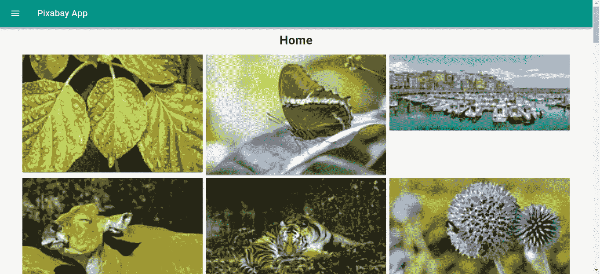
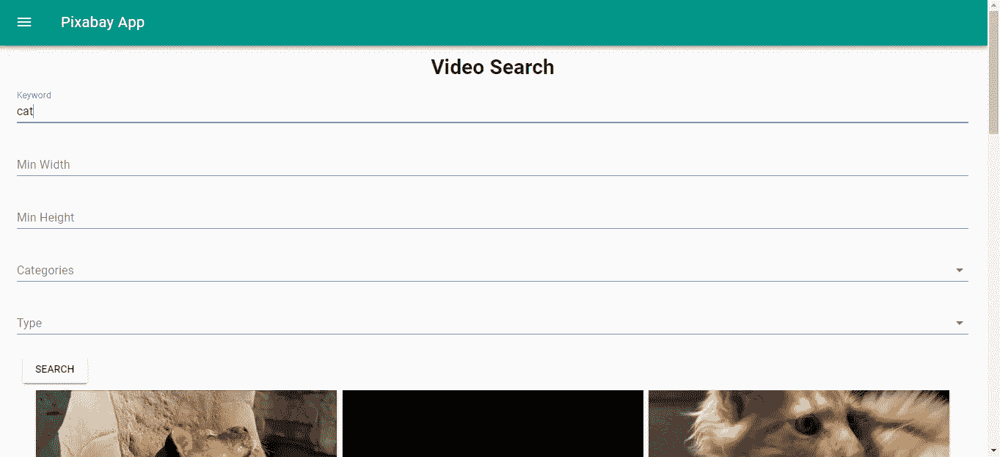

# 如何在 Vue.js 应用程序中添加无限滚动效果

> 原文：<https://betterprogramming.pub/how-to-add-infinite-scrolling-effect-to-a-vue-js-app-164280474274>

## 使用无限滚动图库和 Pixabay API 构建应用程序


向 Vue.js 应用添加无限滚动很容易。已经有一些库可以用来制作一个好看的图库应用程序。使用 Vue.js，构建图片库应用程序是一种令人愉快的体验。

我们将使用 [Vue 材质](https://vuematerial.io/)让应用程序看起来更有吸引力，我们使用 [Pixabay API](https://pixabay.com/api/docs/) 。

在我们的应用程序中，我们将为图像和视频搜索提供页面，主页将有一个无限滚动的图库，让用户查看来自 Pixabay API 的热门图像。

首先，我们通过运行`npm i @vue/cli`来安装 Vue CLI。然后，我们通过运行`vue create pixabay-app`来创建项目。

当提示选项时，我们选择选择自定义选项，并选择包含 [Babel](https://babeljs.io/) 、 [Vuex](https://vuex.vuejs.org/) 、 [Vue Router](https://router.vuejs.org/) 和一个 CSS 预处理器。我们需要所有这些，因为我们正在构建一个具有组件间共享状态的单个页面，CSS 预处理器减少了 CSS 的重复。

接下来，我们必须安装我们的应用程序运行所需的库。运行`npm i axios querystring vue-material vee-validate vue-infinite-scroll`来安装我们需要的包。

`axios`是我们的 HTTP 客户端，`querystring`是将消息对象转换成查询字符串的包，`vue-material`为我们的应用程序提供了具体的设计元素，使其看起来更有吸引力。

`vee-validate`是一个表单验证库。`vue-infinite-scroll`是无限卷轴库。有了这个库，添加无限滚动很容易。

现在我们可以开始写代码了。我们从编写页面将使用的共享代码开始。

在`components`文件夹中，我们创建一个名为`Results.vue`的文件，并添加以下内容:

```
<template>
  <div class="center">
    <div class="results">
      <md-card v-for="r in searchResults" :key="r.id">
        <md-card-media v-if="type == 'image'">
          
        </md-card-media>
        <md-card-media v-if="type == 'video'">
          <video class="image">
            <source :src="r.videos.tiny.url" type="video/mp4" />
          </video>
        </md-card-media>
      </md-card>
    </div>
  </div>
</template><script>
export default {
  name: "results",
  props: {
    type: String
  },
  computed: {
    searchResults() {
      return this.$store.state.searchResults;
    }
  },
  data() {
    return {};
  }
};
</script><!-- Add "scoped" attribute to limit CSS to this component only -->
<style scoped lang="scss">
.md-card {
  width: 30vw;
  margin: 4px;
  display: inline-block;
  vertical-align: top;
}
</style>
```

在这个文件中，我们从 Vuex 存储中获取数据，然后显示给用户。`this.$store`由 Vuex 提供，为状态提供`state`属性。

搜索结果可以是图像或视频，所以我们允许使用一个`type`道具来区分结果的类型。状态在`computed`属性中，所以我们可以从状态中获取它。

接下来，我们添加一个 mixin 来发出请求。为此，我们添加一个`mixins`文件夹和一个名为`photosMixin.js`的文件，并添加以下内容:

```
const axios = require('axios');
const querystring = require('querystring');
const apiUrl = '[https://pixabay.com/api'](https://pixabay.com/api');
const apikey = 'Pixabay api key';export const photosMixin = {
    methods: {
      getPhotos(page = 1) {
            const params = {
                page,
                key: apikey,
                per_page: 21
            }
            const queryString = querystring.stringify(params);
            return axios.get(`${apiUrl}/?${queryString}`);
        },searchPhoto(data) {
            let params = Object.assign({}, data);
            params['key'] = apikey;
            params['per_page'] = 21;
            Object.keys(params).forEach(key => {
                if (!params[key]) {
                    delete params[key];
                }
            })
            const queryString = querystring.stringify(params);
            return axios.get(`${apiUrl}/?${queryString}`);
        },searchVideo(data) {
            let params = Object.assign({}, data);
            params['key'] = apikey;
            params['per_page'] = 21;
            Object.keys(params).forEach(key => {
                if (!params[key]) {
                    delete params[key];
                }
            })
            const queryString = querystring.stringify(params);
            return axios.get(`${apiUrl}/videos/?${queryString}`);
        }
    }
}
```

这是我们从 Pixabay API 获得图像和视频结果的地方。我们用`querystring`包将搜索数据传递到查询字符串中。

助手代码完成后，我们可以开始构建一些页面了。我们首先在主页上工作，它将显示一个图像网格，用户可以向下滚动查看更多。

我们在`views`文件夹中创建一个名为`Home.vue`的文件，如果它不存在的话，并放入以下内容:

```
<template>
  <div class="home">
    <div class="center">
      <h1>Home</h1>
      <div
        v-infinite-scroll="loadMore"
        infinite-scroll-disabled="busy"
        infinite-scroll-distance="10"
      >
        <md-card v-for="p in photos" :key="p.id">
          <md-card-media>
            
          </md-card-media>
        </md-card>
      </div>
    </div>
  </div>
</template><script>
// @ is an alias to /src
import Results from "@/components/Results.vue";
import { photosMixin } from "@/mixins/photosMixin";export default {
  name: "home",
  components: {
    Results
  },
  data() {
    return {
      photos: [],
      page: 1
    };
  },
  mixins: [photosMixin],
  beforeMount() {
    this.getAllPhotos();
  },
  methods: {
    async getAllPhotos() {
      const response = await this.getPhotos();
      this.photos = response.data.hits;
    },async loadMore() {
      this.page++;
      const response = await this.getPhotos(this.page);
      this.photos = this.photos.concat(response.data.hits);
    }
  }
};
</script><style lang="scss" scoped>
.md-card {
  width: 30vw;
  margin: 4px;
  display: inline-block;
  vertical-align: top;
}.home {
  margin: 0 auto;
}
</style>
```

`v-infinite-scroll` prop 是由`vue-infinite-scroll`提供的事件处理程序，让我们在用户向下滚动时做一些事情。

在这种情况下，我们调用`loadMore`函数从下一页加载数据，并将其添加到`this.photos`数组中。我们在卡片视图中显示图像。

`infinite-scroll-distance=”10"`意味着当用户滚动到当前页面的 90%时，我们运行`v-infinite-scroll`中定义的处理程序。

接下来，我们创建一个图像搜索页面。在`views`文件夹中，我们创建一个名为`ImageSearch.vue`的文件，并添加以下内容:

```
<template>
  <div class="imagesearch">
    <div class="center">
      <h1>Image Search</h1>
    </div>
    <form [@submit](http://twitter.com/submit)="search" novalidate>
      <md-field :class="{ 'md-invalid': errors.has('q') }">
        <label for="q">Keyword</label>
        <md-input type="text" name="q" v-model="searchData.q" v-validate="'required'"></md-input>
        <span class="md-error" v-if="errors.has('q')">{{errors.first('q')}}</span>
      </md-field><md-field :class="{ 'md-invalid': errors.has('minWidth') }">
        <label for="minWidth">Min Width</label>
        <md-input
          type="text"
          name="minWidth"
          v-model="searchData.min_width"
          v-validate="'numeric|min_value:0'"
        ></md-input>
        <span class="md-error" v-if="errors.has('minWidth')">{{errors.first('minWidth')}}</span>
      </md-field><md-field :class="{ 'md-invalid': errors.has('minHeight') }">
        <label for="minHeight">Min Height</label>
        <md-input
          type="text"
          name="minHeight"
          v-model="searchData.min_height"
          v-validate="'numeric|min_value:0'"
        ></md-input>
        <span class="md-error" v-if="errors.has('minHeight')">{{errors.first('minHeight')}}</span>
      </md-field><md-field>
        <label for="movie">Colors</label>
        <md-select v-model="searchData.colors" name="colors">
          <md-option :value="c" v-for="c in colorChoices" :key="c">{{c}}</md-option>
        </md-select>
      </md-field><md-button class="md-raised" type="submit">Search</md-button>
    </form>
    <Results type='image' />
  </div>
</template><script>
// @ is an alias to /src
import Results from "@/components/Results.vue";
import { photosMixin } from "@/mixins/photosMixin";export default {
  name: "home",
  components: {
    Results
  },
  data() {
    return {
      photos: [],
      searchData: {},
      colorChoices: [
        "grayscale",
        "transparent",
        "red",
        "orange",
        "yellow",
        "green",
        "turquoise",
        "blue",
        "lilac",
        "pink",
        "white",
        "gray",
        "black",
        "brown"
      ]
    };
  },
  mixins: [photosMixin],
  beforeMount() {
    this.$store.commit("setSearchResults", []);
  },
  computed: {
    isFormDirty() {
      return Object.keys(this.fields).some(key => this.fields[key].dirty);
    }
  },
  methods: {
    async search(evt) {
      evt.preventDefault();
      if (!this.isFormDirty || this.errors.items.length > 0) {
        return;
      }
      const response = await this.searchPhoto(this.searchData);
      this.photos = response.data.hits;
      this.$store.commit("setSearchResults", response.data.hits);
    }
  }
};
</script>
```

该页面提供了一个表单，用户可以输入搜索参数，如关键字、图像尺寸和颜色。我们用`vee-validate`包提供的`v-validate`属性检查每个字段的正确数据。

所以，对于`minWidth`和`minHeight`，我们确定它们都是非负数。如果不是，我们会显示一个错误。如果表单数据通过`this.errors.items.length > 0`检查无效，我们也不允许提交，这也是由`vee-validate`提供的。

如果一切都有效，我们调用我们的`photoMixin`提供的`this.searchPhotos`函数，并用商店提供的`this.$store.commit`函数设置商店返回的结果。

我们将`image`传递给结果的`type`属性，以便显示图像结果。

类似地，对于视频搜索页面，我们在`views`文件夹中创建一个名为`VideoSearch.vue`的新文件。我们提出以下内容:

```
<template>
  <div class="videosearch">
    <div class="center">
      <h1>Video Search</h1>
    </div>
    <form [@submit](http://twitter.com/submit)="search" novalidate>
      <md-field :class="{ 'md-invalid': errors.has('q') }">
        <label for="q">Keyword</label>
        <md-input type="text" name="q" v-model="searchData.q" v-validate="'required'"></md-input>
        <span class="md-error" v-if="errors.has('q')">{{errors.first('q')}}</span>
      </md-field><md-field :class="{ 'md-invalid': errors.has('minWidth') }">
        <label for="minWidth">Min Width</label>
        <md-input
          type="text"
          name="minWidth"
          v-model="searchData.min_width"
          v-validate="'numeric|min_value:0'"
        ></md-input>
        <span class="md-error" v-if="errors.has('minWidth')">{{errors.first('minWidth')}}</span>
      </md-field><md-field :class="{ 'md-invalid': errors.has('minHeight') }">
        <label for="minHeight">Min Height</label>
        <md-input
          type="text"
          name="minHeight"
          v-model="searchData.min_height"
          v-validate="'numeric|min_value:0'"
        ></md-input>
        <span class="md-error" v-if="errors.has('minHeight')">{{errors.first('minHeight')}}</span>
      </md-field><md-field>
        <label for="categories">Categories</label>
        <md-select v-model="searchData.category" name="categories">
          <md-option :value="c" v-for="c in categories" :key="c">{{c}}</md-option>
        </md-select>
      </md-field><md-field>
        <label for="type">Type</label>
        <md-select v-model="searchData.video_type" name="type">
          <md-option :value="v" v-for="v in videoTypes" :key="v">{{v}}</md-option>
        </md-select>
      </md-field><md-button class="md-raised" type="submit">Search</md-button>
    </form>
    <Results type="video" />
  </div>
</template><script>
import Results from "@/components/Results.vue";
import { photosMixin } from "@/mixins/photosMixin";export default {
  name: "home",
  components: {
    Results
  },
  data() {
    return {
      photos: [],
      searchData: {},
      videoTypes: ["all", "film", "animation"],
      categories: `
       fashion, nature, backgrounds,
       science, education, people, feelings,
       religion, health, places, animals, industry,
       food, computer, sports, transportation,
       travel, buildings, business, music
      `
        .replace(/ /g, "")
        .split(",")
    };
  },
  mixins: [photosMixin],
  beforeMount() {
    this.$store.commit("setSearchResults", []);
  },
  computed: {
    isFormDirty() {
      return Object.keys(this.fields).some(key => this.fields[key].dirty);
    }
  },
  methods: {
    async search(evt) {
      evt.preventDefault();
      if (!this.isFormDirty || this.errors.items.length > 0) {
        return;
      }
      const response = await this.searchVideo(this.searchData);
      this.photos = response.data.hits;
      this.$store.commit("setSearchResults", response.data.hits);
    }
  }
};
</script>
```

我们允许用户通过关键词、类型、维度和类别进行搜索。

表单验证和搜索的逻辑与图片搜索页面类似，只是我们将`video`传递给结果的`type`属性，以便显示图片结果。

在`App.vue`中，我们添加了顶部栏和左侧导航菜单。我们用以下代码替换现有代码:

```
<template>
  <div id="app">
    <md-toolbar>
      <md-button class="md-icon-button" [@click](http://twitter.com/click)="showNavigation = true">
        <md-icon>menu</md-icon>
      </md-button>
      <h3 class="md-title">Pixabay App</h3>
    </md-toolbar>
    <md-drawer :md-active.sync="showNavigation" md-swipeable>
      <md-toolbar class="md-transparent" md-elevation="0">
        <span class="md-title">Pixabay App</span>
      </md-toolbar><md-list>
        <md-list-item>
          <router-link to="/">
            <span class="md-list-item-text">Home</span>
          </router-link>
        </md-list-item><md-list-item>
          <router-link to="/imagesearch">
            <span class="md-list-item-text">Image Search</span>
          </router-link>
        </md-list-item><md-list-item>
          <router-link to="/videosearch">
            <span class="md-list-item-text">Video Search</span>
          </router-link>
        </md-list-item>
      </md-list>
    </md-drawer><router-view />
  </div>
</template><script>
export default {
  name: "app",
  data: () => {
    return {
      showNavigation: false
    };
  }
};
</script><style>
.center {
  text-align: center;
}form {
  width: 95vw;
  margin: 0 auto;
}.md-toolbar.md-theme-default {
  background: #009688 !important;
  height: 60px;
}.md-title,
.md-toolbar.md-theme-default .md-icon {
  color: #fff !important;
}
</style>
```

`md-list`包含到我们页面的链接，我们有一个`showNavigation`标志来存储菜单状态，并让我们切换菜单。

在`main.js`中，我们包含了我们在该应用中使用的库，因此它将在我们启动应用时运行:

```
import Vue from 'vue'
import App from './App.vue'
import router from './router'
import store from './store'
import VueMaterial from 'vue-material';
import VeeValidate from 'vee-validate';
import 'vue-material/dist/vue-material.min.css'
import 'vue-material/dist/theme/default.css'
import infiniteScroll from 'vue-infinite-scroll'Vue.use(infiniteScroll)
Vue.use(VueMaterial);
Vue.use(VeeValidate);
Vue.config.productionTip = falsenew Vue({
  router,
  store,
  render: h => h(App)
}).$mount('#app')
```

在`router.js`中，我们添加了我们的路线，以便用户在输入 URL 或点击菜单中的链接时可以看到应用程序:

```
import Vue from 'vue'
import Router from 'vue-router'
import Home from './views/Home.vue';
import Search from './views/Search.vue';Vue.use(Router)export default new Router({
  mode: 'history',
  base: process.env.BASE_URL,
  routes: [
    {
      path: '/',
      name: 'home',
      component: Home
    },
    {
      path: '/search',
      name: 'search',
      component: Search
    }
  ]
})
```

在`store.js`中，我们输入:

```
import Vue from 'vue'
import Vuex from 'vuex'Vue.use(Vuex)export default new Vuex.Store({
  state: {
    searchResults: []
  },
  mutations: {
    setSearchResults(state, payload) {
      state.searchResults = payload;
    }
  },
  actions: {}
})
```

以便可以从页面中设置结果并显示在`Results`组件中。`this.$store.commit`函数设置数据，`this.$store.state`属性检索状态。

当我们运行`npm run serve`时，我们得到:

