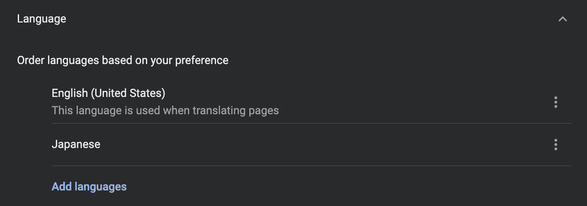
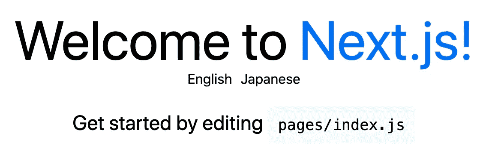
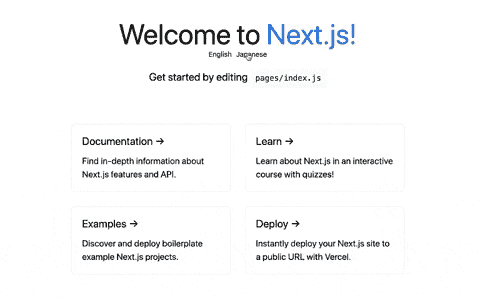

# 如何在你的 Next.js 应用中添加国际化

> 原文：<https://betterprogramming.pub/how-to-add-internationalization-in-your-next-js-app-a038c9407a1b>

## 在 Next.js 中实现国际化路由和本地化


由 [Farzad Mohsenvand](https://unsplash.com/@farzadme?utm_source=medium&utm_medium=referral) 在 [Unsplash](https://unsplash.com?utm_source=medium&utm_medium=referral) 上拍摄的照片

国际化，通常缩写为 i18n，是准备网站或 web app 以支持本地语言和设置的过程。这分两个主要部分完成。首先是添加国际化路由。第二是文本本地化。

从版本 10 开始，Next.js 提供了处理国际化路由的内置支持。

在本文中，我们将了解如何在 Next.js 中为应用程序添加国际化。在本文结束时，您应该了解如何执行以下操作:

*   将国际化路由添加到 Next.js 应用程序
*   处理不同地区之间的转换
*   向应用程序添加翻译文本

对于这个例子，我们将使用一个用`create-next-app`创建的基本应用程序。

如果您是 Next.js 的新手，请查看下面的文章开始学习:

[](https://blog.devgenius.io/what-i-learned-from-the-create-a-next-js-app-tutorial-1f506b56173d) [## 我从 Create a Next.js 应用程序教程中学到了什么

### Next.js 路由、样式、预渲染和部署简介

blog.devgenius.io](https://blog.devgenius.io/what-i-learned-from-the-create-a-next-js-app-tutorial-1f506b56173d) 

# 国际化路由

国际化的第一步是添加国际化路由。在 Next.js 应用程序中，我们可以将`i18n`配置添加到`next.config.js`文件中。

我们将传递一个对象并包含两个值。

第一个值是您希望在应用程序中支持的区域设置数组。区域设置是 UTS 区域设置标识符，这是定义区域设置的标准格式。对于这个例子，我将向数组中添加两个语言环境，`en`(英语)和`ja`(日语)。

第二个值是一个字符串，指定您想要使用的默认区域设置。我会将默认区域设置设置为`en`(英语)。

```
*module*.*exports* = {
  i18n: {
    locales: ['en', 'ja'],
    defaultLocale: 'en',
  },
};
```

## 现场策略

处理国际化路由有两种方式:子路径路由和域路由。

**子路径路由示例**

*   英语:`/blog`
*   日语:`/ja/blog`

**域路由示例**

*   英语:`example.com/blog`
*   日语:`example.ja/blog`

在本例中，我们将使用子路径路由。

# 更改区域设置

## 自动现场检测

Next.js 提供了自动区域检测。这意味着 Next.js 将尝试根据用户自动检测首选的语言环境。

例如，如果我启动我的项目并在浏览器中访问它，我将被带到 [http://localhost:3000/](http://localhost:3000/) 。这是因为我将浏览器设置为默认语言为英语。如果你使用的是谷歌 Chrome，你可以在*设置- >高级- >语言*中查看这个。



但是，如果我更改了 Google Chrome 中的设置，将日语设置为默认语言，我将被带到[http://localhost:3000/ja](http://localhost:3000/ja)。

## 区域转换

我们也可以手动处理地区之间的转换。

这可以通过使用`next/link`来实现。可以向`next/link`提供一个`locale`道具来处理地区间的转换。

比如我会在标题下面加两个链接:一个改成英文，一个改成日文。每个链接将有一个`href=”/”`属性和一个等同于适当区域设置的区域设置属性。

```
<div>
  <*Link* *href*="/" *locale*="en">
    <a *className*={styles.locale}>English</a>
  </*Link*>
  <*Link* *href*="/" *locale*="ja">
    <a *className*={styles.locale}>Japanese</a>
  </*Link*>
</div>
```



如果我们点击任何一个链接，我们将被发送到相应的网址。

**英文:**[http://localhost:3000/](http://localhost:3000/)

**日语:**[http://localhost:3000/ja](http://localhost:3000/ja)

# 本地化

国际化的第二部分是将内容翻译成正确的语言。如果我访问英文网站，我希望看到英文网站；如果我访问日本地区，我想看看日文网站。

本地化文本最简单的方法是创建两个独立的对象，每个对象都包含翻译后的文本。例如，我将创建两个新文件:`locales/en.js`和`locales/ja.js`。

**locales/en.js**

```
export const en = {
  title: 'Welcome to ',
};
```

**locales/ja.js**

```
export const ja= {
  title: 'ようこそへ',
};
```

在`index.js`文件中，我们可以导入`en`和`ja`对象。我们还需要使用`next/router`。

```
import { useRouter } from 'next/router';
import { en } from '../locales/en';
import { ja } from '../locales/ja';
```

要检查我们当前使用的是哪种语言环境，我们可以调用返回路由器对象的`useRouter()`钩子。然后，我们可以根据当前显示的语言环境设置一个变量。

```
const router = useRouter();
const t = router.locale === 'en' ? en : ja;
```

我们在这里做的是检查`router.locale`。如果它等于`en`，我们将设置变量`t`等于`en`对象。如果`router.locale`不等于`en`，我们将设置变量`t`等于`ja`对象。

然后我们可以用`{t.title}`值替换标题文本。

```
<h1 *className*={styles.title}>
  **{t.title}**
  <a *href*="https://nextjs.org">Next.js!</a>
</h1>
```

现在，当网站的区域设置改变时，标题文本也将改变为适当的语言。



# 结论

感谢阅读！我希望这篇文章对您将国际化添加到 Next.js 应用程序有所帮助。Next.js 版本 10 内置了对国际化路由的支持。你可以查看他们的文档[这里](https://nextjs.org/docs/advanced-features/i18n-routing)来了解更多。

如果您想继续了解 Next.js，请查看下面的文章:

[](https://levelup.gitconnected.com/how-to-handle-routing-in-your-next-js-app-6ba71280b922) [## 如何在你的 Next.js 应用中处理路由

### 查看页面目录、动态路由、链接组件和用户外部挂钩

levelup.gitconnected.com](https://levelup.gitconnected.com/how-to-handle-routing-in-your-next-js-app-6ba71280b922) [](https://levelup.gitconnected.com/optimize-images-from-an-external-website-with-the-image-component-from-next-js-aa104a1f78e0) [## 使用 Next.js 中的图像组件优化外部网站中的图像

### Next.js 中图像组件的介绍

levelup.gitconnected.com](https://levelup.gitconnected.com/optimize-images-from-an-external-website-with-the-image-component-from-next-js-aa104a1f78e0) 

**资源**

*   [https://nextjs.org/docs/advanced-features/i18n-routing](https://nextjs.org/docs/advanced-features/i18n-routing)