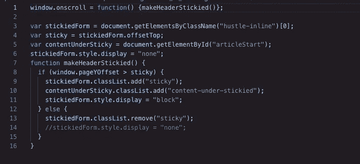
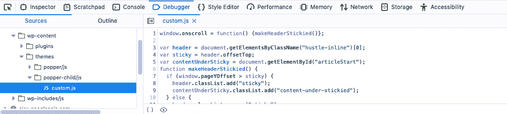
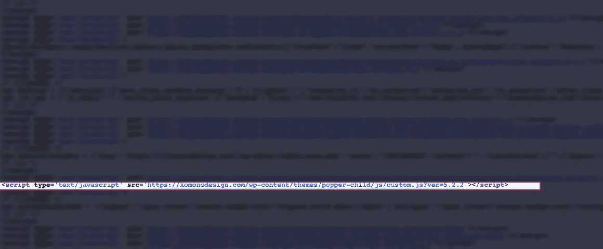

# 如何安全地将 Javascript 添加到 WordPress

> 原文：<https://betterprogramming.pub/how-to-add-javascript-to-wordpress-a4fdc7618a21>


莫伊插画

当你想给你的[站点增加交互性的时候，这种情况就会出现。意思是:你好 JavaScript。但是，如何以正确的方式将 JavaScript 添加到 WordPress 中，这样你就可以拥有一个很酷的网站而不会失眠？](https://wordpress.org/about/)

在 WordPress 中，有一种特殊的方法来修改你的站点。说到 JavaScript，就叫入队。

你在现实生活中很少会用到这个令人讨厌的词，但它值得学习，否则，你就有可能破坏你的网站。

# 以传统方式添加 JavaScript

在 HTML 中，JavaScript 代码被插入到`<script>`和`</script>`标签之间。就这么简单。

但是，像 WordPress 这样的内容管理系统呢？在 WordPress 中，根据 [WordPress 模板层次](https://wphierarchy.com/)，使用不同的 PHP 文件加载每个页面。让我们回到 WordPress 的基础。

# 以正确的方式添加 JavaScript

WordPress 作为一个内容管理系统，尽可能的不同于传统的静态网站。

这是一个使用一个活动主题和多个插件的生态系统。每个主题和插件又由许多文件组成，从 PHP 和 JavaScript 到 CSS。

因此，WordPress 站点会很快变得杂乱无章。为了让一切和谐地工作，建议开发者按照标准的 WordPress 方法加载 JavaScript 和 CSS，称为 *enqueue* 。

对于新的 WordPress 开发者来说，Enqueue 可能是一个陌生的概念，但最终，我们仍然比没有它要好。

# 步骤 1:创建一个子主题

你可能会问:“为什么要费心制作一个儿童主题，而不是马上投入进去？”

如果您对父主题进行了修改，并且在将来某个时候更新了主题，您将会丢失这些更改。

另一个原因是创建一个子主题需要大约五分钟。如果你已经不辞辛苦地在你的 WordPress 站点上添加了 JavaScript，为什么不多花五分钟作为对策呢？

如果你不知道怎么做，看看我的教程，制作一个 [WordPress 子主题](https://komonodesign.com/how-to-create-a-wordpress-child-theme/)。

# 步骤 2:创建您的定制 JavaScript 文件

当我开始在 WordPress 中使用 JavaScript 时，我的一个问题是，是在现有文件中添加自定义 JavaScript 代码，还是创建一个新的 JavaScript 文件。

回想起来，这听起来好像我是个业余爱好者，但我们都必须从某个地方开始。

的确，作为一个任何学科的学习者，你所遇到的大多数问题，在你之前已经有成千上万的人遇到过了。

如果你有这个疑问，你并不孤单。

正确答案是:

*   创建一个包含自定义代码的新 JavaScript 文件。
*   用唯一的名称保存它。
*   将其添加到您的子主题的`.js`文件夹中。

WordPress 正在把自己塑造成一个[乐高套装](https://torquemag.io/2015/07/5-ways-wordpress-is-like-the-ultimate-lego-set/)，所以如果可能的话不要弄乱现有的文件。



粘贴我的注册表单的简单 JavaScript 代码片段。

# 步骤 3:在 functions.php 将 JavaScript 文件排队

修改你的 WordPress 文件是一件令人头疼的事情，但是对于`functions.php`文件来说更是如此。

这个无情的文件就像一个 WordPress 插件，为你的网站增加了更多的功能。事实上，你甚至可以在这个文件中制作小插件。

让我们看看如何让新创建的 JavaScript 文件入队。下面是我的代码，用于将我的自定义 JavaScript 加入 WordPress。

```
function popper_enqueue_styles() {
wp_enqueue_script( 'custom', get_stylesheet_directory_uri() . '/js/custom.js', array(), '', true );
}
```

我来解释一下上面的代码是什么意思。

*   `wp_enqueue_script`是一个注册你的 JavaScript 文件的函数。
*   `‘custom’`是`$handle`值的值，它只是脚本文件的名称。
*   `get_stylesheet_directory_uri() . ‘/js/custom.js’`提供 JavaScript 的位置。`get_stylesheet_directory_uri()`是一个函数，用于检索当前主题的目录，在本例中是子主题。整个代码告诉 WordPress 在`wp-content/themes/theme’s name/js`目录中寻找名为`custom.js`的 JavaScript 文件。
*   `array()`是`$deps`参数的默认值，它指定了脚本所依赖的依赖项。例如，如果您的脚本需要 [jQuery](https://jquery.com/) ，`$deps`将变成`array(‘jQuery’)`。
*   `**‘’**`是`**$ver**`参数的值，它指定脚本版本号。通过留下一个空字符串，我告诉 WordPress 自动生成版本号。
*   `true`是`$in_footer`参数的值，为布尔值。如果为`true`，脚本将在结束`</body>`标签之前排队。如果`false`，它将在开始`<head>`和`</head>`标签之间排队。

你也可以从[扭矩 Mag](https://torquemag.io/2018/03/beginners-guide-wp_enqueue/) 查看这篇关于`wp_enque`如何工作的文章。

# 步骤 4:检查 Javascript 文件是否添加正确

从技术上来说，你已经完成了向 WordPress 添加 JavaScript。但是你怎么知道它是否被正确地排队了呢？

右键单击页面上的任意位置并选择*检查元素*。

在浏览器开发工具中，点击*调试器*选项卡。您应该会在`wp-content/themes/your theme name/js`目录下看到新的 JavaScript 文件。



顺便说一下，这告诉您 JavaScript 文件已经被合并到您的站点中，但是您如何知道它是否在`<head>`或`<body>`部分中呢？

为此，右键单击页面并选择*查看页面源代码*。

按 CMD+F 或 CTRL+F 调出搜索框。

输入“`your theme’s name/js`”。在我的例子中，搜索词是`popper-child/js`。



你可以在我网站上使用的一大堆脚本中看到我小小的自定义 JavaScript。

# 摘要

如果你正在寻找一种安全的方式将 JavaScript 添加到 WordPress，这里有一个总结:

1.  创建一个新的 JavaScript 文件，并将其添加到主题的`js`文件夹中。
2.  使用`wp_enqueue_scripts`函数将脚本排队。
3.  使用 Firefox 或 Chrome 开发人员工具来检查它是否已成功入队并位于正确的位置。

现在你可以走了。承认这一点很尴尬，但我花了几个小时才想出正确的方法。

你呢？你花了多长时间把 JavaScript 加入 WordPress？你用自定义 JavaScript 在你的网站上添加了哪些很酷的特性？