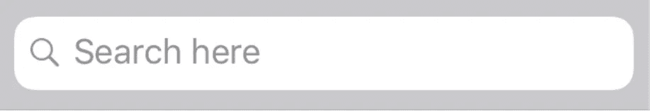
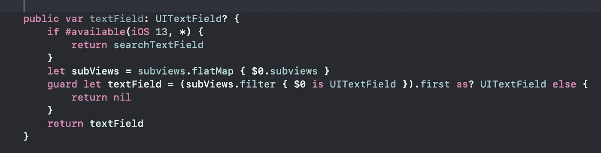
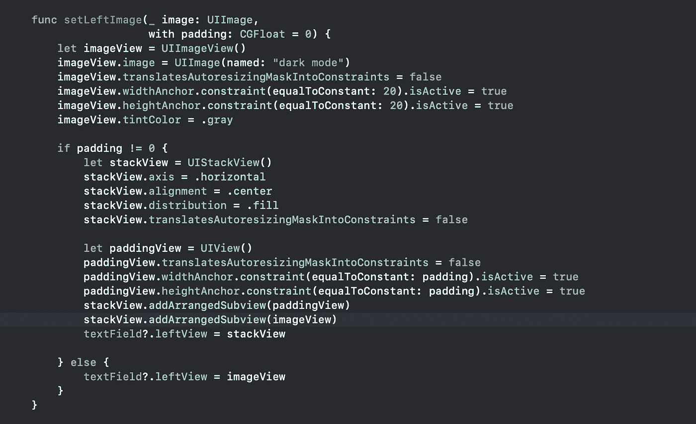
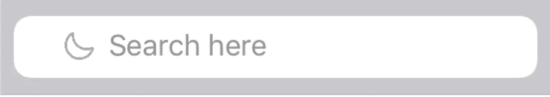

# 如何向 UISearchBar 添加左填充

> 原文：<https://betterprogramming.pub/how-to-add-left-padding-to-a-uisearchbar-2406bcaf9271>

## 自定义 UISearchBar 的左侧图标和填充，兼容所有 iOS 版本


照片由[马库斯·温克勒](https://unsplash.com/@markuswinkler?utm_source=unsplash&utm_medium=referral&utm_content=creditCopyText)在 [Unsplash](https://unsplash.com/s/photos/search?utm_source=unsplash&utm_medium=referral&utm_content=creditCopyText) 上拍摄

# 先说`UITextField`



iOS 10 UISearchBar

我们知道，苹果没有让我们在不同的操作系统版本上方便地访问`UITextField`参考。所以这里的代码可以帮助你们在所有 iOS 版本中安全访问`UITextField`。



用于访问文本字段并更改其属性的代码段

# UISearchBar 中的左填充



添加填充和更改左侧图标的代码段

现在只需一行代码，我们就可以定制`UISearchBar`的左侧图标，并为其添加填充。

```
searchBar.setLeftImage(UIImage(named: "dark mode")!, with: 20)
```



输出:带填充的 UISearchBar

# 感谢您的阅读

希望这篇文章对你有帮助。请分享您的宝贵反馈。

# 其他文章

*   [如何更改用户搜索栏中的搜索图标](https://medium.com/better-programming/how-to-change-the-search-icon-in-a-uisearchbar-150b775fb6c8)
*   [如何更改 UISearchBar 中的占位符颜色](https://medium.com/better-programming/how-to-change-the-placeholder-color-in-a-uisearchbar-1f47e5266e10)
*   [如何在 UISearchBar 中添加活动加载器](https://medium.com/better-programming/how-to-add-an-activity-loader-in-a-uisearchbar-6993f8476004)