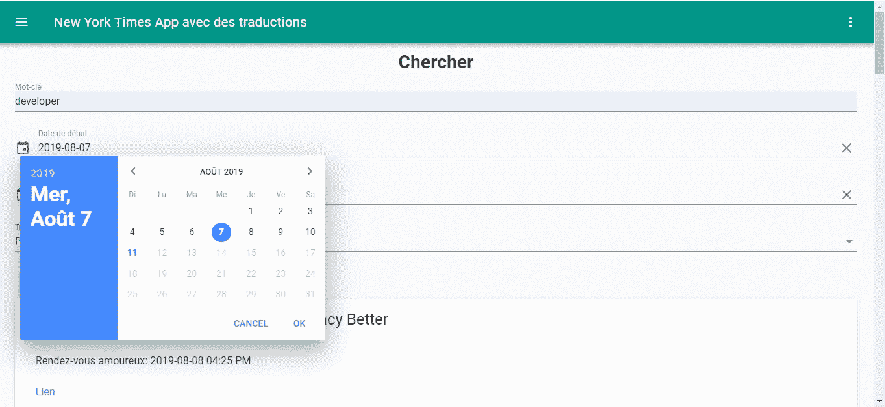

# 如何将本地化和翻译添加到您的 Vue.js 应用程序

> 原文：<https://betterprogramming.pub/how-to-add-localization-and-translation-to-your-vue-js-app-dc4ad2b6c3e8>

## 创建一个以英语和法语显示纽约时报 API 数据的应用程序


由 [Pakata Goh](https://unsplash.com/@pakata) 在 [Unsplash](https://unsplash.com/) 上拍摄的照片

Vue.js 通过附加包支持本地化和翻译。最流行的一个是`vue-i18n`库，它直接挂在你的 Vue.js 应用上。

在这个故事中，我们将构建一个应用程序，用英语和法语显示来自纽约时报 API 的数据。你可以在[https://developer.nytimes.com/](https://developer.nytimes.com/)注册一个 API 密钥。之后，我们可以开始构建应用程序。

# 安装 Vue CLI

要开始构建应用程序，我们必须安装 Vue CLI。我们通过运行以下命令来实现这一点:

```
npm install -g @vue/cli
```

运行 Vue CLI 需要 Node.js 8.9 或更高版本。我没能让 Vue CLI 在 Windows 版本的 Node.js 上运行，不过 Ubuntu 帮我运行 Vue CLI 没有问题。

然后我们运行:

```
vue create vue-material-nyt-app
```

这将创建项目文件夹和文件。在向导中，我们不使用默认选项，而是选择“手动选择功能”然后，我们从选项列表中选择 Babel、Router 和 Vuex，按下每个选项上的“space”。如果它们是绿色的，那意味着它们被选中了。

# 安装库

现在我们需要安装一些库。我们需要安装一个 HTTP 客户端，一个用于格式化日期的库，一个用于从对象生成 GET 查询字符串，另一个用于表单验证。另外，我们需要安装 Vue 素材库本身。我们通过运行以下命令来实现这一点:

```
npm i axios moment querystring vee-validate vue-material vue-i18n
```

`axios`是我们的 HTTP 客户端，`moment`是操纵日期，`querystring`是从对象生成查询字符串，`vee-validate`是 Vue.js 做验证的附加包，`vue-material`是我们的材料设计库。`vue-i18n`，正如我们提到的，是 Vue.js 应用程序的翻译库。

现在我们已经安装了所有的库，我们可以开始构建我们的应用程序了。首先，我们创建一些组件。在`views`文件夹中，我们创建`Home.vue`和`Search.vue`。这些是我们页面的代码文件。

然后，创建一个`mixins`文件夹和一个名为`nytMixin.js`的文件。Mixins 是代码片段，可以直接集成到我们的 Vue.js 组件中，就像直接在组件中一样使用。

# 向应用程序添加过滤器和翻译

然后，我们添加一些过滤器。过滤器是从一件事映射到另一件事的 Vue.js 代码。我们创建一个`filters`文件夹，并添加`capitalize.js`和`formatDate.js`。然后，在`components`文件夹中，我们创建一个名为`SearchResults.vue`的文件。`components`文件夹包含不是页面的 Vue.js 组件。

现在，我们需要在我们的应用程序中添加翻译。为此，我们在项目中创建一个`translations`文件夹。然后，我们为英语和法语翻译分别创建名为`en.js`和`fr.js`的文件。

在`en.js`中，我们把:

```
export const ENGLISH_TRANSLATIONS = {
    text: {
        nyt_app: 'New York Times App with Translations',
        home: 'Home',
        search: 'Search',
        date: 'Date',
        sections: 'Section | Sections',
        link: 'Link',
        arts: 'arts',
        automobiles: 'automobiles',
        books: 'books',
        business: 'business',
        fashion: 'fashion',
        food: 'food',
        health: 'health',
        insider: 'insider',
        magazine: 'magazine',
        movies: 'movies',
        national: 'national',
        nyregion: 'nyregion',
        obituaries: 'obituaries',
        opinion: 'opinion',
        politics: 'politics',
        realestate: 'realestate',
        science: 'science',
        sports: 'sports',
        sundayreview: 'sundayreview',
        technology: 'technology',
        theater: 'theater',
        tmagazine: 'tmagazine',
        travel: 'travel',
        upshot: 'upshot',
        world: 'world',
        english: 'English',
        french: 'French',
        begin_date: 'Begin Date',
        end_date: 'End Date',
        sort_by: 'Sort By',
        newest: 'Newest',
        oldest: 'Oldest',
        relevance: 'Relevance',
        keyword: 'Keyword'
    }
};
```

在`fr.js`中，我们把:

```
export const FRENCH_TRANSLATIONS = {
    text: {
        nyt_app: 'New York Times App avec des traductions',
        home: 'Accueil',
        search: 'Chercher',
        date: 'Rendez-vous amoureux',
        sections: 'Section | Section',
        link: 'Lien',
        arts: 'Arts',
        automobiles: 'Les automobiles',
        books: 'Livres',
        business: 'Entreprise',
        fashion: 'Mode',
        food: 'Aliments',
        health: 'Santé',
        insider: 'Initié',
        magazine: 'Magazine',
        movies: 'Films',
        national: 'National',
        nyregion: 'La région de New York',
        obituaries: 'Notices nécrologiques',
        opinion: 'Opinion',
        politics: 'Politics',
        realestate: 'Immobilier',
        science: 'Science',
        sports: 'Des sports',
        sundayreview: 'Avis dimanche',
        technology: 'La technologie',
        theater: 'Théâtre',
        tmagazine: 'T magazine',
        travel: 'Voyage',
        upshot: 'Résultat',
        world: 'Monde',
        english: 'Anglais',
        french: 'Français',
        begin_date: 'Date de début',
        end_date: 'Date de fin',
        sort_by: 'Trier par',
        newest: 'Plus récent',
        oldest: 'Le plus vieux',
        relevance: 'Pertinence',
        keyword: 'Mot-clé'
    }
};
```

**注意**:翻译来自谷歌翻译，因此可能不是 100%准确。

我们还必须设置英语和法语的日期格式、月份名称和星期名称。为此，我们创建一个名为`datepickerLocales`的新文件夹。然后，在这个文件夹中，我们分别创建两个名为`en.js`和`fr.js`的文件。

在`datepickerLocales/en.js`中，我们输入:

```
export const ENGLISH_DATEPICKER_LOCALE = {
    // range for datepicker
    startYear: 1900,
    endYear: 2099,// date format for date picker
    dateFormat: "yyyy-MM-dd",// i18n strings
    days: [
      "Sunday",
      "Monday",
      "Tuesday",
      "Wednesday",
      "Thursday",
      "Friday",
      "Saturday"
    ],
    shortDays: ["Sun", "Mon", "Tue", "Wed", "Thu", "Fri", "Sat"],
    shorterDays: ["S", "M", "T", "W", "T", "F", "S"],
    months: [
      "January",
      "February",
      "March",
      "April",
      "May",
      "June",
      "July",
      "August",
      "September",
      "October",
      "November",
      "December"
    ],
    shortMonths: [
      "Jan",
      "Feb",
      "Mar",
      "Apr",
      "May",
      "June",
      "July",
      "Aug",
      "Sept",
      "Oct",
      "Nov",
      "Dec"
    ],
    shorterMonths: [
      "J",
      "F",
      "M",
      "A",
      "M",
      "Ju",
      "Ju",
      "A",
      "Se",
      "O",
      "N",
      "D"
    ],// `0` stand for Sunday, `1` stand for Monday
    firstDayOfAWeek: 0
  };
```

在`fr.js`中，我们输入:

```
export const FRENCH_DATEPICKER_LOCALE = {
    // range for datepicker
    startYear: 1900,
    endYear: 2099,// date format for date picker
    dateFormat: "yyyy-MM-dd",// i18n strings
    days: [
        "Dimanche",
        "Lundi",
        "Mardi ",
        "Mercredi ",
        "Jeudi",
        "Vendredi ",
        "Samedi "
    ],
    shortDays: ["Dim", "Lun", "Mar", "Mer", "Jeu", "Ven", "Sam"],
    shorterDays: ["Di", "Lu", "Ma", "Me", "Je", "Ve", "Sa"],
    months: [
        "janvier",
        "février",
        "mars",
        "avril",
        "mai",
        "juin",
        "juillet",
        "août",
        "septembre",
        "octobre",
        "novembre",
        "décembre"
    ],
    shortMonths: [
        "Janv",
        "Févr",
        "Mars",
        "Avr",
        "Mai",
        "Juin",
        "Juil",
        "Août",
        "Sept",
        "Oct",
        "Nov",
        "Déc"
    ],
    shorterMonths: [
        "J",
        "F",
        "M",
        "A",
        "M",
        "Ju",
        "Ju",
        "A",
        "Se",
        "O",
        "N",
        "D"
    ],// `0` stand for Sunday, `1` stand for Monday
    firstDayOfAWeek: 0
};
```

# 使用 Vuex 进行状态管理

为了使组件之间的数据传递更容易、更有组织，我们使用 Vuex 进行状态管理。因为我们在运行`vue create`时选择了 Vuex，所以我们的项目文件夹中应该有一个`store.js`。如果没有，就创建它。在`store.js`中，我们输入:

```
import Vue from 'vue'
import Vuex from 'vuex'Vue.use(Vuex)export default new Vuex.Store({
  state: {
    searchResults: []
  },
  mutations: {
    setSearchResults(state, payload) {
      state.searchResults = payload;
    }
  },
  actions: { }
})
```

`state`对象是存储状态的地方。对象是我们可以操纵自己状态的地方。当我们在代码中调用`this.$store.commit(“setSearchResults”, searchResults)`时，假设`searchResults`被定义，那么`state.searchResults`将被设置为`searchResults`。然后我们可以使用`this.$store.state.searchResults`得到结果。

# 添加样板代码

我们还需要向我们的应用程序添加一些样板代码。首先，我们添加我们的过滤器。在`capitalize.js`中，我们把:

```
export const capitalize = (str) => {
    if (typeof str == 'string') {
        if (str == 'realestate') {
            return 'Real Estate';
        }
        if (str == 'sundayreview') {
            return 'Sunday Review';
        }if (str == 'tmagazine') {
            return 'T Magazine';
        }
        return `${str[0].toUpperCase()}${str.slice(1)}`;
    }
}
```

这使我们能够将在[https://developer . nytimes . com/docs/top-stories-product/1/routes/% 7 section % 7d . JSON/get](https://developer.nytimes.com/docs/top-stories-product/1/routes/%7Bsection%7D.json/get)中列出的纽约时报栏目名称进行大写映射。然后，在`formatDate.js`中，我们放入:

```
import * as moment from 'moment';export const formatDate = (date) => {
    if (date) {
        return moment(date).format('YYYY-MM-DD hh:mm A');
    }
}
```

这将把我们的日期格式化为人类可读的格式。之后，在`main.js`中，我们放入:

```
import Vue from 'vue'
import App from './App.vue'
import router from './router'
import store from './store'
import VueMaterial from 'vue-material';
import VeeValidate from 'vee-validate';
import 'vue-material/dist/vue-material.min.css'
import 'vue-material/dist/theme/default.css'
import { formatDate } from './filters/formatDate';
import { capitalize } from './filters/capitalize';
import VueI18n from 'vue-i18n';
import { ENGLISH_TRANSLATIONS } from './translations/en';
import { FRENCH_TRANSLATIONS } from './translations/fr';Vue.config.productionTip = false;Vue.use(VueMaterial);
Vue.use(VeeValidate);
Vue.use(VueI18n);
Vue.filter('formatDate', formatDate);
Vue.filter('capitalize', capitalize);const TRANSLATIONS = {
  en: ENGLISH_TRANSLATIONS,
  fr: FRENCH_TRANSLATIONS
}const i18n = new VueI18n({
  locale: 'en',
  messages: TRANSLATIONS,
})new Vue({
  router,
  store,
  i18n,
  render: h => h(App)
}).$mount('#app')
```

注意，在上面的文件中，我们必须通过调用`Vue.use`来注册我们在 Vue.js 中使用的库，以便它们可以在我们的应用程序模板中使用。我们可以通过在变量右侧添加管道和过滤器名称来调用过滤器函数上的`Vue.filter`。

然后，在`router.js`中，我们把:

```
import Vue from 'vue'
import Router from 'vue-router'
import Home from './views/Home.vue';
import Search from './views/Search.vue';Vue.use(Router)export default new Router({
  mode: 'history',
  base: process.env.BASE_URL,
  routes: [
    {
      path: '/',
      name: 'home',
      component: Home
    },
    {
      path: '/search',
      name: 'search',
      component: Search
    }
  ]
})
```

这将让我们进入网页时，我们进入列出的网址。`mode: ‘history’`意味着在基本 URL 和我们的路由之间不会有散列符号。如果我们部署我们的应用程序，那么我们需要配置我们的 web 服务器，这样所有的请求都将被重定向到`index.html`。这样，我们在重新加载应用程序时就不会出现错误。例如，在 Apache 中，我们做到了:

```
<IfModule mod_rewrite.c>
  RewriteEngine On
  RewriteBase /
  RewriteRule ^index\.html$ - [L]
  RewriteCond %{REQUEST_FILENAME} !-f
  RewriteCond %{REQUEST_FILENAME} !-d
  RewriteRule . /index.html [L]
</IfModule>
```

在 Nginx 中，我们放入:

```
location / {
  try_files $uri $uri/ /index.html;
}
```

查看您的 web 服务器文档，了解如何做同样的事情。

# 为应用程序的组件编写代码

现在，我们为组件编写代码。在`SearchResult.vue`中，我们放入:

```
<template>
  <div id="search-results">
    <md-card v-for="s in searchResults" :key="s.id">
      <md-card-header>
        <div class="md-title title">{{s.headline.main}}</div>
      </md-card-header><md-card-content>
        <md-list>
          <md-list-item>{{$t(`text.date`)}}: {{s.pub_date | formatDate}}</md-list-item>
          <md-list-item>
            <a :href="s.web_url">{{$t('text.link')}}</a>
          </md-list-item>
          <md-list-item v-if="s.byline.original">{{s.byline.original}}</md-list-item>
          <md-list-item>{{s.lead_paragraph}}</md-list-item>
          <md-list-item>{{s.snippet}}</md-list-item>
        </md-list>
      </md-card-content>
    </md-card>
  </div>
</template><script>
export default {
  computed: {
    searchResults() {
      return this.$store.state.searchResults;
    }
  }
};
</script><style scoped>
.title {
  margin: 0 15px !important;
}#search-results {
  margin: 0 auto;
  width: 95vw;
}.md-title.title {
  color: rgba(0, 0, 0, 0.87) !important;
}
</style>
```

这是从 Vuex 商店获取我们的搜索结果并显示它们的地方。我们在应用程序的`computed`属性的函数中返回`this.$store.state.searchResults`，这样当商店的`searchResults`状态更新时，搜索结果将自动刷新。

`md-card`是一个卡片小部件，用于在一个框中显示数据。`v-for`用于循环数组条目并显示所有内容。`md-list`是一个列表小部件，用于在页面上整齐地显示列表中的项目。`{{s.pub_date | formatDate}}`是我们应用`formatDate`过滤器的地方。

# 编写我们的混音

接下来，我们编写我们的 mixin。我们还将在 mixin 中为 HTTP 调用添加代码。在`nytMixin.js`中，我们输入:

```
const axios = require('axios');
const querystring = require('querystring');
const apiUrl = '[https://api.nytimes.com/svc'](https://api.nytimes.com/svc');
const apikey = 'your api key';export const nytMixin = {
    methods: {
        getArticles(section) {
            return axios.get(`${apiUrl}/topstories/v2/${section}.json?api-key=${apikey}`);
        },searchArticles(data) {
            let params = Object.assign({}, data);
            params['api-key'] = apikey;
            Object.keys(params).forEach(key => {
                if (!params[key]) {
                    delete params[key];
                }
            })
            const queryString = querystring.stringify(params);
            return axios.get(`${apiUrl}/search/v2/articlesearch.json?${queryString}`);
        }
    }
}
```

我们返回对 HTTP 请求的承诺，以在每个函数中获取文章。在`searchArticles`函数中，我们将传递给查询字符串的对象传递给请求。确保将 API 键放入`apiKey`常量，然后删除任何未定义的内容:

```
Object.keys(params).forEach(key => {
  if (!params[key]) {
     delete params[key];
  }
})
```

# 添加到主页部分

接下来，在`Home.vue`中，我们放入:

```
<template>
  <div>
    <div class="center">
      <h1>{{$t(`text.${selectedSection}`)  | capitalize}}</h1>
      <br />
      <md-menu>
        <md-button class="md-raised" md-menu-trigger>{{$tc('text.sections', 2)}}</md-button><md-menu-content>
          <md-menu-item
            v-for="s in sections"
            :key="s"
            [@click](http://twitter.com/click)="selectSection(s)"
          >{{$t(`text.${s}`) | capitalize}}</md-menu-item>
        </md-menu-content>
      </md-menu>
    </div>
    <br /><md-card v-for="a in articles" :key="a.id">
      <md-card-header>
        <div class="md-title title">{{a.title}}</div>
      </md-card-header><md-card-content>
        <md-list>
          <md-list-item>{{$t(`text.date`)}}: {{a.published_date | formatDate}}</md-list-item>
          <md-list-item>
            <a :href="a.url">{{$t('text.link')}}</a>
          </md-list-item>
          <md-list-item v-if="a.byline">{{a.byline}}</md-list-item>
          <md-list-item>{{a.abstract}}</md-list-item>
        </md-list>
        
      </md-card-content>
    </md-card>
  </div>
</template><script>
import { nytMixin } from "../mixins/nytMixin";export default {
  name: "home",
  mixins: [nytMixin],
  computed: {},data() {
    return {
      selectedSection: "home",
      articles: [],
      sections: `arts, automobiles, books, business, fashion, food, health,
    home, insider, magazine, movies, national, nyregion, obituaries,
    opinion, politics, realestate, science, sports, sundayreview,
    technology, theater, tmagazine, travel, upshot, world`
        .replace(/ /g, "")
        .split(",")
    };
  },beforeMount() {
    this.getNewsArticles(this.selectedSection);
  },methods: {
    async getNewsArticles(section) {
      const response = await this.getArticles(section);
      this.articles = response.data.results;
    },selectSection(section) {
      this.selectedSection = section;
      this.getNewsArticles(section);
    }
  }
};
</script><style scoped>
.image {
  width: 100%;
}.title {
  color: rgba(0, 0, 0, 0.87) !important;
  margin: 0 15px !important;
}.md-card {
  width: 95vw;
  margin: 0 auto;
}
</style>
```

注意我们有`{{$tc(‘text.sections’, 2)}}.``$tc`函数用于复数，其中第二个参数是第一个参数中项目的数量。`{{$t(`text.date`)}}`意味着我们在翻译对象中查看来自路径`text.date`的值并显示它。

这个页面组件是我们获取所选部分文章的地方，默认为`home`部分。我们还有一个菜单，通过添加以下内容来选择我们想要查看的部分:

```
<md-menu>
  <md-button class="md-raised" md-menu-trigger>{{$tc('text.sections', 2)}}</md-button> <md-menu-content>
    <md-menu-item
      v-for="s in sections"
      :key="s"
      [@click](http://twitter.com/click)="selectSection(s)"
  >{{$t(`text.${s}`) | capitalize}}</md-menu-item>
  </md-menu-content>
</md-menu>
```

注意，我们在承诺代码中使用了`async`和`await`关键字，而不是`then`。它要短得多，`then`、`await`和`async`之间的功能是等效的。但是，它在 Internet Explorer 中不受支持。在`beforeMount`块中，我们运行`this.getNewsArticles`在页面加载时获取文章。

# 添加到搜索部分

接下来，在`Search.vue`中，我们放入:

```
<template>
  <div>
    <div class="center">
      <h1>{{$t('text.search')}}</h1>
    </div>
    <form [@submit](http://twitter.com/submit)="search" novalidate>
      <md-field :class="{ 'md-invalid': errors.has('keyword') }">
        <label for="keyword">{{$t('text.keyword')}}</label>
        <md-input type="text" name="keyword" v-model="searchData.keyword" v-validate="'required'"></md-input>
        <span class="md-error" v-if="errors.has('keyword')">{{errors.first('keyword')}}</span>
      </md-field><div>
        <md-datepicker v-model="searchData.beginDate" :md-disabled-dates="disabledDates">
          <label>{{$t('text.begin_date')}}</label>
        </md-datepicker>
      </div><div>
        <md-datepicker v-model="searchData.endDate" :md-disabled-dates="disabledDates">
          <label>{{$t('text.end_date')}}</label>
        </md-datepicker>
      </div><md-field>
        <label for="movie">{{$t('text.sort_by')}}</label>
        <md-select v-model="searchData.sort">
          <md-option value="newest">{{$t('text.newest')}}</md-option>
          <md-option value="oldest">{{$t('text.oldest')}}</md-option>
          <md-option value="relevance">{{$t('text.relevance')}}</md-option>
        </md-select>
      </md-field><md-button class="md-raised" type="submit">{{$t('text.search')}}</md-button>
    </form>
    <SearchResults />
  </div>
</template><script>
import { nytMixin } from "../mixins/nytMixin";
import SearchResults from "@/components/SearchResults.vue";
import * as moment from "moment";export default {
  name: "search",
  mixins: [nytMixin],
  components: {
    SearchResults
  },
  computed: {
    isFormDirty() {
      return Object.keys(this.fields).some(key => this.fields[key].dirty);
    }
  },
  data: () => {
    return {
      searchData: {
        sort: "newest"
      },
      disabledDates: date => {
        return +date >= +new Date();
      }
    };
  },
  methods: {
    async search(evt) {
      evt.preventDefault();
      if (!this.isFormDirty || this.errors.items.length > 0) {
        return;
      }
      const data = {
        q: this.searchData.keyword,
        begin_date: moment(this.searchData.beginDate).format("YYYYMMDD"),
        end_date: moment(this.searchData.endDate).format("YYYYMMDD"),
        sort: this.searchData.sort
      };
      const response = await this.searchArticles(data);
      this.$store.commit("setSearchResults", response.data.response.docs);
    }
  }
};
</script>
```

这是我们用来搜索文章的表单。我们还有两个日期选择器来标记用户设置的开始和结束日期。我们只将日期限制在今天及之前，以便搜索查询有意义:

```
<md-field :class="{ 'md-invalid': errors.has('keyword') }">
   <label for="keyword">{{$t('text.keyword')}}</label>
   <md-input type="text" name="keyword" v-model="searchData.keyword" v-validate="'required'"></md-input>
   <span class="md-error" v-if="errors.has('keyword')">{{errors.first('keyword')}}</span>
</md-field>
```

我们使用`vee-validate`来检查所需的搜索关键字字段是否已填写。如果不是，它将显示一条错误消息并阻止查询继续进行。我们还将`SearchResults`组件嵌套到`Search`页面组件中，包括:

```
components: {
  SearchResults
}
```

我们应该把它放在模板中的`script`标签和`<SearchResults />`标签之间。

# 将顶部栏和菜单添加到应用程序

最后，我们通过在`App.vue`中输入以下内容来添加顶部栏和菜单:

```
<template>
  <div id="app">
    <md-toolbar>
      <md-button class="md-icon-button" [@click](http://twitter.com/click)="showNavigation = true">
        <md-icon>menu</md-icon>
      </md-button>
      <h3 class="md-title">{{$t('text.nyt_app')}}</h3> <div class="md-toolbar-section-end">
        <md-menu md-direction="bottom-start">
          <md-button class="md-icon-button" md-menu-trigger>
            <md-icon>more_vert</md-icon>
          </md-button> <md-menu-content>
            <md-menu-item [@click](http://twitter.com/click)="setLocale('en')">{{$t('text.english')}}</md-menu-item>
            <md-menu-item [@click](http://twitter.com/click)="setLocale('fr')">{{$t('text.french')}}</md-menu-item>
          </md-menu-content>
        </md-menu>
      </div>
    </md-toolbar>
    <md-drawer :md-active.sync="showNavigation" md-swipeable>
      <md-toolbar class="md-transparent" md-elevation="0">
        <span class="md-title">{{$t('text.nyt_app')}}</span>
      </md-toolbar><md-list>
        <md-list-item>
          <router-link to="/">
            <span class="md-list-item-text">{{$t('text.home')}}</span>
          </router-link>
        </md-list-item><md-list-item>
          <router-link to="/search">
            <span class="md-list-item-text">{{$t('text.search')}}</span>
          </router-link>
        </md-list-item>
      </md-list>
    </md-drawer><router-view />
  </div>
</template><script>
import { ENGLISH_DATEPICKER_LOCALE } from "@/datepickerLocales/en";
import { FRENCH_DATEPICKER_LOCALE } from "@/datepickerLocales/fr";export default {
  name: "app",
  data: () => {
    return {
      showNavigation: false
    };
  },
  methods: {
    setLocale(locale) {
      this.$root.$i18n.locale = locale;
      if (locale == "en") {
        this.$material.locale = ENGLISH_DATEPICKER_LOCALE;
      } else if (locale == "fr") {
        this.$material.locale = FRENCH_DATEPICKER_LOCALE;
      }
      localStorage.setItem("locale", locale);
    }
  }, beforeMount() {
    const locale = localStorage.getItem("locale") || "en";
    this.$root.$i18n.locale = locale;
    if (locale == "en") {
      this.$material.locale = ENGLISH_DATEPICKER_LOCALE;
    } else if (locale == "fr") {
      this.$material.locale = FRENCH_DATEPICKER_LOCALE;
    }
  }
};
</script><style>
.center {
  text-align: center;
}form {
  width: 95vw;
  margin: 0 auto;
}.md-toolbar.md-theme-default {
  background: #009688 !important;
  height: 60px;
}.md-title,
.md-toolbar.md-theme-default .md-icon {
  color: #fff !important;
}
</style>
```

这是我们为整个应用程序设置语言的地方，因为应用程序中的所有页面都是在这个组件加载后加载的。请注意，我们使用`this.$root.$i18n.locale`将我们的区域设置应用到应用程序的所有部分。为了设置日期选择器的地区，我们有:

```
if (locale == "en") {
  this.$material.locale = ENGLISH_DATEPICKER_LOCALE;
} else if (locale == "fr") {
  this.$material.locale = FRENCH_DATEPICKER_LOCALE;
}
```

我们将区域设置保存到本地存储，这样我们就可以在`beforeMount`函数中获取它们，并在应用程序重新加载时加载保存的区域设置。

我们还在右上方添加了一个菜单，让用户设置他们的首选语言:

```
<div class="md-toolbar-section-end">
  <md-menu md-direction="bottom-start">
    <md-button class="md-icon-button" md-menu-trigger>
      <md-icon>more_vert</md-icon>
    </md-button> <md-menu-content>
      <md-menu-item [@click](http://twitter.com/click)="setLocale('en')">{{$t('text.english')}}</md-menu-item>
      <md-menu-item [@click](http://twitter.com/click)="setLocale('fr')">{{$t('text.french')}}</md-menu-item>
    </md-menu-content>
   </md-menu>
</div>
```

如果你想要一个带有左导航抽屉的顶栏，你必须精确地遵循上面的代码结构。

# 最终产品

写完所有代码后，我们有以下代码:

