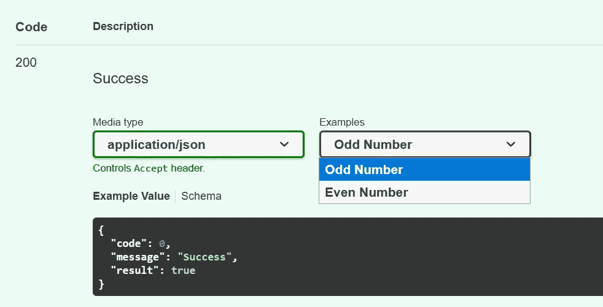
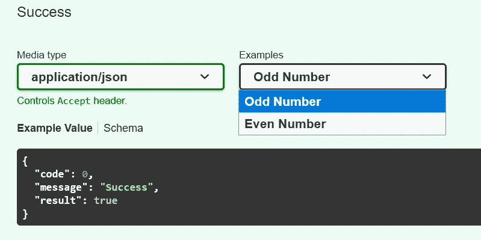
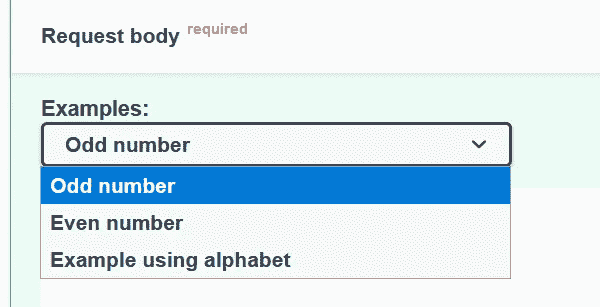
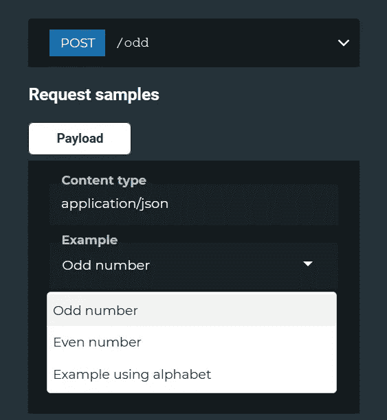

# 如何在 FastAPI 中添加多个请求和响应示例

> 原文：<https://betterprogramming.pub/how-to-add-multiple-request-and-response-examples-in-fastapi-ce2117eac7ed>

## 提升您的文档级别



作者图片

通过阅读本文，您将学会扩展 [FastAPI](https://fastapi.tiangolo.com/) 的文档，以包含所有请求和响应的多个示例。这适用于 Swagger UI 和 ReDoc 端点。

例如，您将能够在 ReDoc 中实现以下结果:


作者图片

同样，同样的功能也适用于 Swagger UI:



作者图片

以前，你必须依赖 pydantic 的`Field()`对象或者继承自`BaseModel`的类内部的`extra_schema`来添加例子。除此之外，您只能向请求或响应添加一个示例。

从版本 0.64.0 开始，FastAPI 正式支持以下对象的`example`和`examples`参数:

*   `Body()`
*   `Path()`
*   `Query()`
*   `Cookie()`
*   `Header()`

根据[官方文件](https://fastapi.tiangolo.com/tutorial/schema-extra-example/#technical-details):

> “最近发布了一个新版本的 OpenAPI: 3.1.0。它基于最新的 JSON 模式，并删除了 OpenAPI 定制版本 JSON 模式的大部分修改，以交换最新版本 JSON 模式的功能，因此所有这些小差异都减少了。尽管如此，Swagger UI 目前还不支持 OpenAPI 3.1.0。”

FastAPI 背后的开发人员通过一些技巧来解决这个问题，以处理 OpenAPI、JSON Schema 和 OpenAPI 的 3.0.x 定制版 JSON Schema 之间的兼容性和不兼容性。

让我们继续下一节，开始安装必要的 Python 模块。

# 设置

强烈建议您在继续安装之前创建一个新的虚拟环境。

## FastAPI

激活它并运行以下命令来安装 FastAPI:

```
pip install fastapi
```

请确保您安装了 0.65.1+版本，因为该版本附带了稳定的 pydantic 版本，该版本[修复了一个关键的安全问题](https://github.com/samuelcolvin/pydantic/security/advisories/GHSA-5jqp-qgf6-3pvh)。

## 紫玉米

接下来，安装标准的 uvicorn 包，如下所示:

```
pip install uvicorn[standard]
```

# 履行

让我们看看下面这个简单的 FastAPI 服务器的例子:

它包含两个继承自`BaseModel`的类:

*   `Number` —输入参数
*   `Response` —输出结果

此外，还有一个名为`odd`的端点，它确定输入值是否为奇数，并将结果返回给用户。

为了向端点添加请求示例，您需要做的就是创建一个有效的 dictionary 对象，该对象对应于以下对象之一的 JSON 模式:

*   `Body()`
*   `Path()`
*   `Query()`
*   `Cookie()`
*   `Header()`

在这种情况下，最好的选择是使用`Body()`对象。

## 添加请求示例

字典对象中的每个项目都应包含以下字段:

*   `summary` —作为选项的一部分显示在下拉列表中的名称。
*   `description` —可选字段包含用户选择选项时的简短支持描述。支持 markdown 格式的文本。
*   `value` —代表有效负载或结果的示例模式。

例如，您可以按如下方式定义字典对象:

接下来，只需修改以下代码:

```
def odd(number: Number):
```

收件人:

```
def odd(number: Number = Body(..., examples=odd_examples)):
```

## 添加回应示例

另一方面，将示例添加到响应中略有不同。这主要是因为响应被绑定到 HTTP 状态代码，尽管大多数情况下，示例只针对状态代码 200。

创建一个新的字典对象，如下所示:

然后，修改以下代码:

```
@app.post("/odd", response_model=Response)
```

收件人:

```
@app.post("/odd", response_model=Response, responses=odd_responses)
```

## 测试 FastAPI 的文档

完成后，将文件另存为`myapp.py`并在命令行中运行以下命令来启动 FastAPI 服务器:

```
uvicorn myapp:app
```

如果使用不同的文件名和变量名，请相应地修改名称:

```
uvicorn <file_name>:<variable_name>
```

默认情况下，它将使用端口 8000 运行服务器。请访问以下网址:

```
http://localhost:8000/docs
```

您应该在`Example`部分看到请求和响应的下拉列表。例如:



作者图片

至于 ReDoc，您应该使用以下 URL:

```
http://localhost:8000/redoc
```

结果应该如下所示:



作者图片

您可以在以下[要点](https://gist.github.com/wfng92/1c47646c9561b9fc75c5f0f983820213)中找到完整的代码:

# 结论

让我们回顾一下你今天所学的内容。

本教程首先简要解释了 FastAPI 如何支持请求和响应的多个示例。

稍后，我们继续安装过程，在此过程中，您将被引导完成`fastapi`和`uvicorn`包的安装。

在接下来的部分中，我们讨论了请求和响应的整个过程。给出了代码片段作为实现的参考。最后一部分是关于运行服务器和访问文档来验证结果。

感谢阅读！

# 参考

1.  [FastAPI —模式额外示例](https://fastapi.tiangolo.com/tutorial/schema-extra-example/)
2.  [FastAPI —附加响应](https://fastapi.tiangolo.com/advanced/additional-responses/)