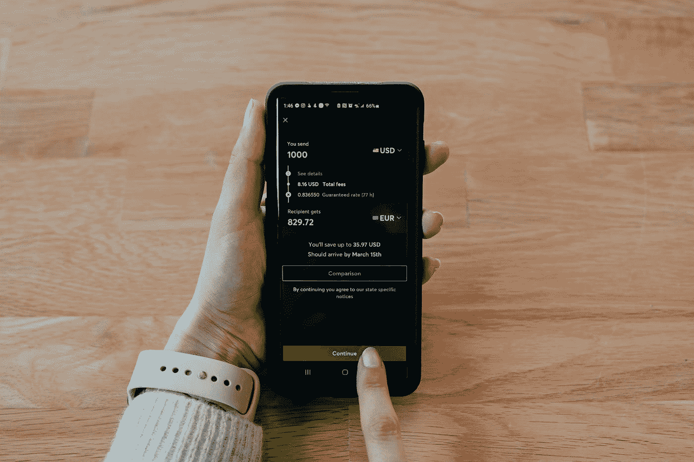
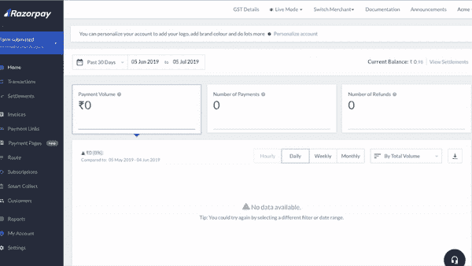

# 如何在 Android 应用中添加 Razorpay 支付

> 原文：<https://betterprogramming.pub/how-to-add-razorpay-payments-in-android-apps-7bd908666205>

## 探索 Android 中的 Razorpay 标准结账



[科技日报](https://unsplash.com/@techdailyca?utm_source=medium&utm_medium=referral)在 [Unsplash](https://unsplash.com?utm_source=medium&utm_medium=referral) 拍摄的照片

# 介绍

在现代技术时代，移动应用是在几天内接触数百万用户的重要方式之一。通过人工智能和 ML，移动应用程序的能力在行为编程方面出现了激增。

借助这些可怕的发展带来了隐私和基于行为的广告建议的威胁。苹果是第一家采取措施，通过限制 IDFA(广告商的标识符)来防止这种情况的公司。虽然这对客户非常有用，但它确实对像谷歌、脸书等收入主要来自广告的移动应用公司产生了重大影响。

从移动应用中获取收入的最佳选择之一是订阅和付费服务。实现支付涉及许多复杂的事情，如安全网络、支持首选支付模式、货币兑换、退款、支付验证等。

在 android 应用中实现支付的最佳选择之一是使用 Razorpay 这样值得信赖的合作伙伴。Razorpay 提供多种支付模式，如 UPI、VPA、网上银行、信用卡/借记卡、钱包等。

让我们立即从 android 中的 Razorpay SDK 集成开始。

# 综合

Razorpay 在 maven central 中托管 SDK，所以我们需要实现 maven central，然后在 app 级`build.gradle`文件中集成 Razorpay SDK。

```
repositories {
    mavenCentral()
}dependencies {
    implementation 'com.razorpay:checkout:1.6.12'
}
```

作为替代，开发者可以[下载](https://mvnrepository.com/artifact/com.razorpay/checkout)razor pay SDK 的 AAR 文件，放在 libs 文件夹下。

# 生成 Razorpay 密钥

下一步是从 Razorpay 控制台获取密钥。导航到 Razorpay 仪表板并创建帐户。成功创建帐户后，您将被导航至 Razorpay 仪表盘。

然后单击左侧面板中的设置，并选择 API 密钥选项卡。然后点击生成密钥选项。这将为您提供在项目中使用所需的键。



生成 Razorpay API 密钥—来源:Razorpay

您还可以在设置选项卡下更新公司名称、徽标等，该选项卡将在结账屏幕上显示给用户。

# Razorpay 标准结账

## 创建订单

必须使用 Orders API 通过使用 API 密钥的基本验证从服务器端创建订单 id，并将其传递给 Android、IOS 和 Web 等客户端。要创建订单，您需要传递货币、金额、收据(此订单的收据 id)等，如下所示:

```
**try** {
   JSONObject orderRequest = **new** JSONObject();
   orderRequest.put("**amount**", 50000);
 *// amount in the smallest currency unit
*   orderRequest.put("**currency**", "INR");
   orderRequest.put("**receipt**", "order_rcptid_11");
    Order order = razorpay.Orders.create(orderRequest);
 } **catch** (RazorpayException e) {
   *// Handle Exception
*   System.out.println(e.getMessage());
 }
```

## 预加载检验

建议预装 Razorpay checkout，以便为用户提供顺畅、快速的结账流程。通常情况下，建议在支付活动的`onCreate`功能中进行:

## 付款结帐

一旦用户点击支付按钮，我们需要从服务器获取订单 id 并创建 Razorpay checkout 对象。然后，我们需要使用`open`函数通过 JSON 对象将金额、货币、order_id、货币、电子邮件、联系人等字段传递给 checkout 对象:

`checkout.open`开启一个 Razorpay 活动，用户可以用首选模式结账。

我们还可以配置重试选项，比如用户可以重试支付多少次，以及 Razorpay 是否显示重试选项。看一看:

```
JSONObject retryObj = new JSONObject(); 
 retryObj.put(“enabled”, true); 
 retryObj.put(“max_count”, 4); 
 options.put(“retry”, retryObj);
```

## Razorpay 回调

一旦用户完成支付，Razorpay 通过 **PaymentResultListener 提供几个回调`**onPaymentSuccess**` 和`**onPaymentError**` 。**开发人员可以通过使用监听器扩展活动来覆盖这些功能，如下所示:

# 进步规则

如果项目混淆了代码，那么开发人员需要在他们的 proguard 规则文件中添加一些与 Razorpay SDK 相关的 Proguard 规则。看一看:

```
-keepclassmembers class * {
    [@android](http://twitter.com/android).webkit.JavascriptInterface <methods>;
}-keepattributes JavascriptInterface
-keepattributes *Annotation*-dontwarn com.razorpay.**-keep 
class com.razorpay.** {*;}-optimizations !method/inlining/*-keepclasseswithmembers class * {  
   public void onPayment*(...);
}
```

仅此而已，现在客户可以通过多种支付模式为您通过 android 应用程序提供的服务付费，而无需您进行任何人工操作。

**即将发布:**在下一篇文章中，我们将探讨如何在遵循新的 RBI 指南的同时，使用自定义 UI 实现 Razorpay 储值卡功能。

**更新时间:2022 年 1 月 4 日:**

[](https://sgkantamani.medium.com/card-tokenisation-with-razorpay-cfa7d5f315d0) [## 使用 Razorpay 进行卡令牌化

### 了解如何在遵守新的 RBI 准则的同时实施储值卡功能

sgkantamani.medium.com](https://sgkantamani.medium.com/card-tokenisation-with-razorpay-cfa7d5f315d0) 

目前就这些。希望你学到了有用的东西。感谢阅读。

[](/how-to-integrate-google-pay-into-your-existing-android-app-d75b269cd623) [## 如何将 Google Pay 集成到您现有的 Android 应用程序中

### 开始通过 GPay 接受付款

better 编程. pub](/how-to-integrate-google-pay-into-your-existing-android-app-d75b269cd623)