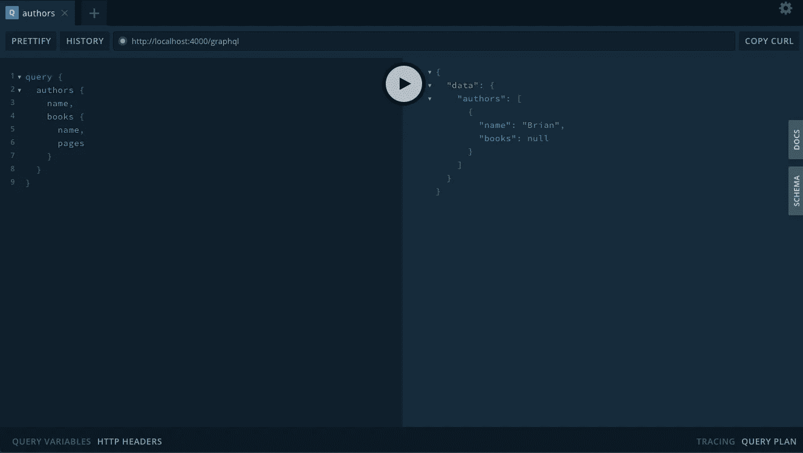
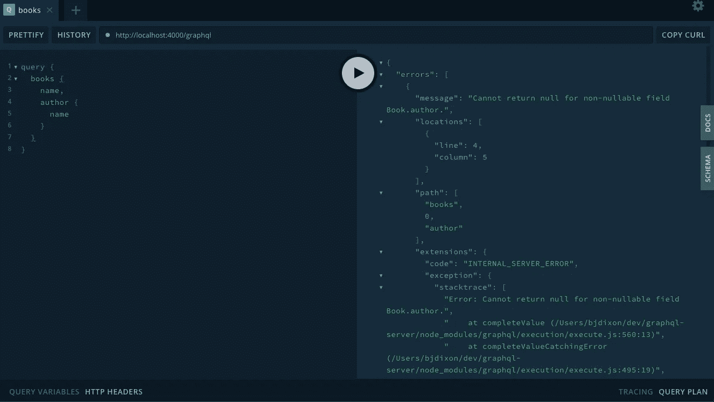
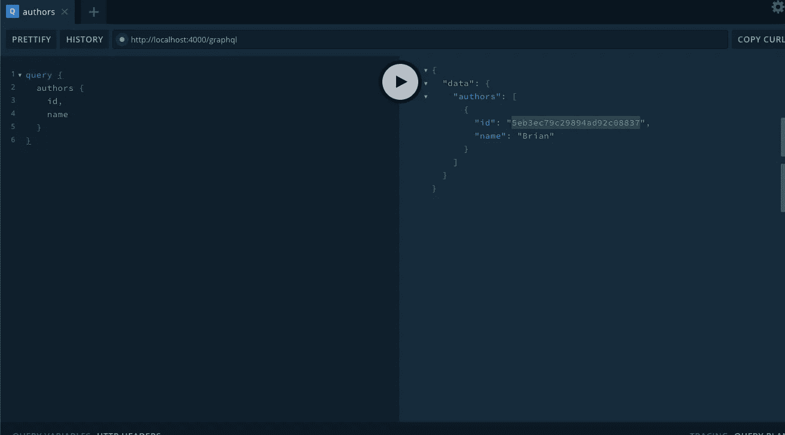
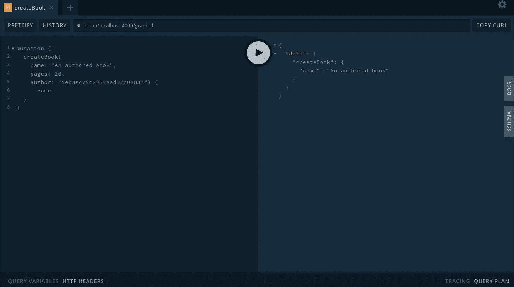
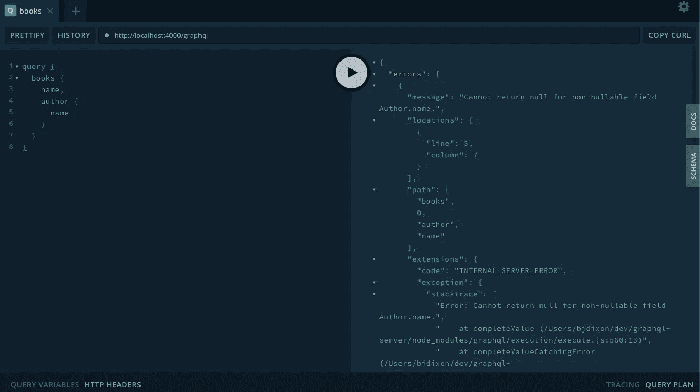
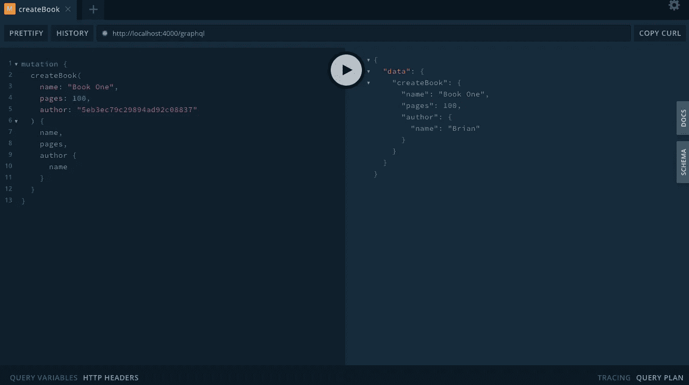
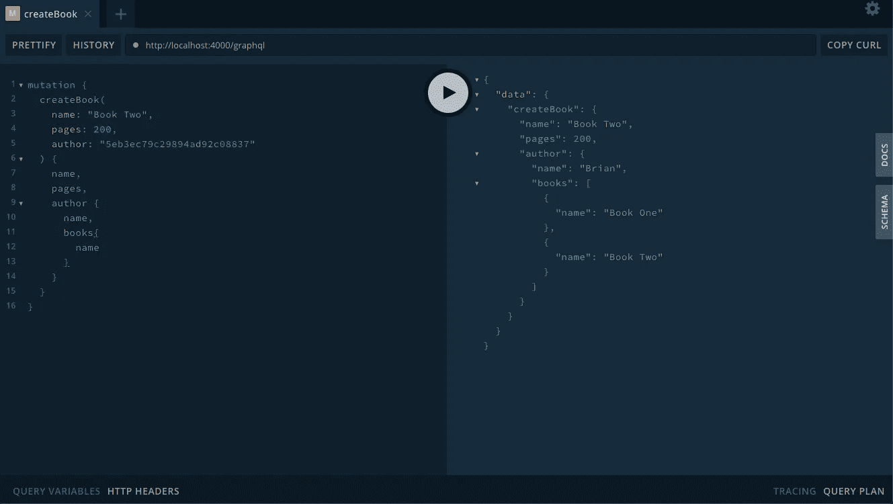
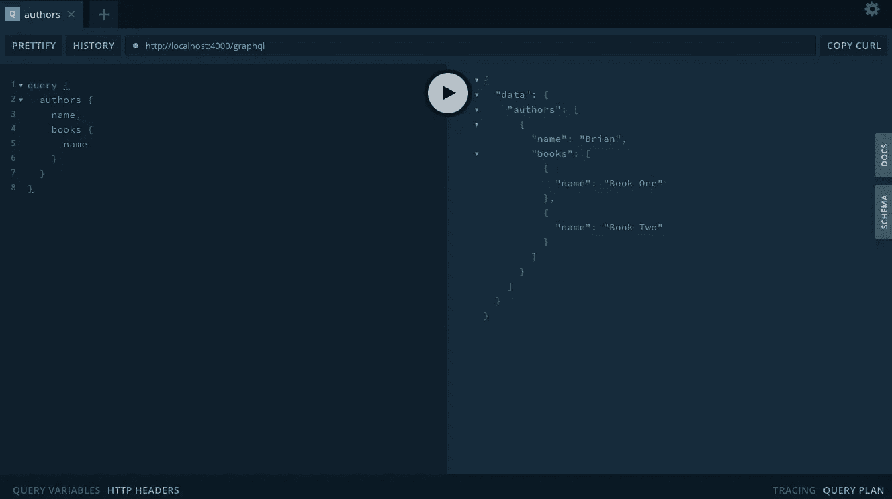
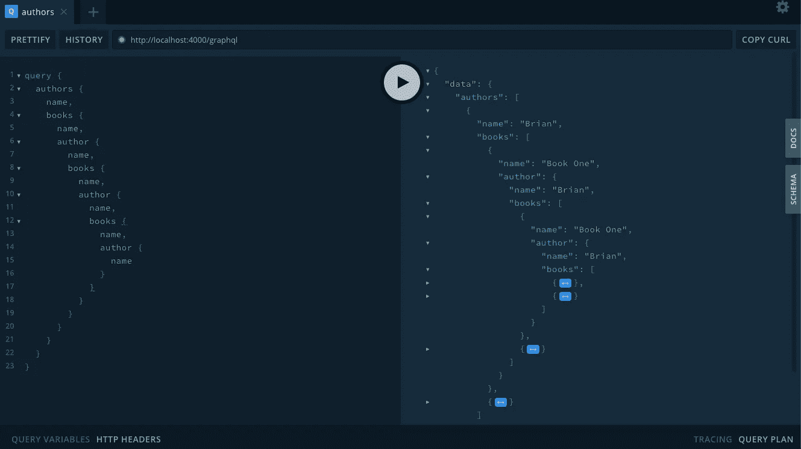

# 如何向 GraphQL 模式添加关系

> 原文：<https://betterprogramming.pub/how-to-add-relations-to-your-graphql-schema-295dd45cc62d>

## GraphQL 和 MongoDB 中的关系入门


罗马家庭纪念馆——由大英博物馆提供

在本文中，我们将添加对象类型之间的关系，并研究一些基本的模式定义语言语法。

# 出发点

我们构建在本系列的前一篇文章中建立的[基本 GraphQL 服务器之上。如果你只是想要这个](https://medium.com/better-programming/creating-a-graphql-server-basic-setup-73710ddf657e)[的代码，从这里下载](https://github.com/bjdixon/graphql-server/tree/setup)或者:

```
git clone --branch setup [https://github.com/bjdixon/graphql-server.git](https://github.com/bjdixon/graphql-server.git`)
```

如果此时您只是克隆或下载，那么您需要创建一个 MongoDB 实例并替换`./index.js`文件中的连接字符串。

确保安装了依赖项:

```
npm install
```

然后启动服务器:

```
npm start
```

我们准备好潜水了！

# 我们正在建造的东西

现在我们有两个可以交互的模型——我们可以创建并列出作者和书籍。这些模型有我们想要定义的自然关系，我们也应该能够查看单个作者和书籍，以及他们的相关对象。

# 扩展模式

到目前为止，在我们的`./schema/index.js`文件中，我们已经使用模式定义语言(SDL)定义了两种对象类型，`Author`和`Book`。

```
type Author {
  id: ID!
  name: String!
}
type Book {
  id: ID!
  name: String!
  pages: Int
}
```

每个对象类型都有一个属性列表以及每个属性的关联类型。在我们的例子中，我们有一个`Book`类型，它有三个属性:

*   `id`这是一种特殊的 ID 类型。
*   `name`这是一个字符串类型。
*   `pages`这是一个 int 类型。

所有支持类型的列表[可以在这里找到](https://www.apollographql.com/docs/apollo-server/schema/schema/#supported-types)。

您可能会注意到一些类型定义末尾的`!`。这表明该属性是必需的。我们的`Query`类型可以很好地说明这一点:

```
type Query {
  message: String!
  authors: [Author!]!
  books: [Book!]!
}
```

`message`属性需要一个字符串，`authors`属性需要一个列表(列表用方括号表示)，列表中的值需要是`Author`类型，尽管返回一个空列表也是有效的。现在，我们希望`authors`属性要么为空，要么为列表，并确保如果它返回一个非空列表，那么它只包含`Author`类型的数据。让我们也摆脱静态消息查询，我们不会再使用它:

```
type Query {
  authors: [Author!]
  books: [Book!]!
}
```

您也可以删除消息解析器。只需删除下面一行:

```
message: () => 'hello world',
```

除了删除消息之外，我们的查询还有细微的不同。作者的文章不再以感叹号结尾。在上面的例子中，`authors`属性可以返回 null 或者一个列表，但是如果它返回一个非空的列表，那么这个列表只能包含作者。属性必须返回一个列表(可以是空的),这个列表只能包含书籍。

有了这些知识，我们将在模式中创建几个关系。对于我们的`Book`类型，我们将添加一个必需的 author 属性(我们假设只有一个人可以是一本书的作者)，并且该值必须是一个`Author`类型。对于我们的`Author`类型，我们将添加一个`books`属性，该属性可以是 null 或列表，如果列表不为空，则值必须是`Book`类型。在`./schema/index.js`中编辑以下内容:

```
type Author {
  id: ID!
  name: String!
  books: [Book!]
}
type Book {
  id: ID!
  name: String!
  pages: Int
  author: Author!
}
```

# 测试模式更新



访问 localhost:4000/graphql 来测试更新后的模式

我们仍然可以列出作者并返回他们的名字，但是对于他们的书，我们只能得到 null。如果我们试图列出书籍并返回这些书籍的作者，我们会得到一个错误——书籍现在需要有一个类型为`Author`的作者，而我们的 book 实例还没有任何作者。



测试新模式时出错

我们仍然需要更新创造我们的书和作者的基础模型和突变。

# 扩展模型

我们将首先通过添加 books 数组来扩展`Author`模型。我们实际上只是要存储一个 Mongo `ObjectId`的列表(你可以在书籍的`type`属性中看到)并使用 ref 属性让 Mongo 知道我们希望它与哪个模型相关。编辑`./models/Author.js`:

```
import mongoose from 'mongoose'const Schema = mongoose.Schemaexport const Author = mongoose.model('Author', {
  name: String,
  books: [{
    type: Schema.Types.ObjectId,
    ref: 'Book'
  }]
})
```

类似地，我们需要更新`Book`模型，但是我们添加了一个与单个作者的关系，而不是一组作者。编辑此文件`./models/Book.js`:

```
import mongoose from 'mongoose'const Schema = mongoose.Schemaexport const Book = mongoose.model('Book', {
  name: String,
  pages: Number,
  author: {
    type: Schema.Types.ObjectId,
    ref: 'Author'
  }
})
```

现在，我们可以更改模式中的三行，并且能够创建我们的第一个关系。

首先，在我们的`Mutation`类型中，我们在创建一本新书时添加一个作者。这将是一个字符串，因为 Mongo 存储了作者的 ID，并将它作为一个字符串接受。在`./schema/index.js`编辑`createBook`中的`Mutation`类型中添加新的`Author`参数:

```
 type Mutation {
    createAuthor(name: String!): Author!
    createBook(name: String!, pages: Int, author: String!): Book!
  }
```

然后，在同一个文件中，我们将对`createBook`解析器做一个小小的修改，将作者参数添加到函数中，并作为参数添加到`Book`构造函数中:

```
const resolvers = {
  Query: {
    authors: () => Author.find(),
    books: () => Book.find()
  },
  Mutation: {
    createAuthor: async (_, { name }) => {
      const author = new Author({ name });
      await author.save();
      return author;
    },
    createBook: async (_, { name, pages, author }) => {
      const book = new Book({ name, pages, author });
      await book.save();
      return book;
    }
  }
}
```

# 测试更新的模型和变化

删除 MongoDB 中任何旧的`Book`和`Author`实例——它们不再反映更新的模式。然后创建一个新的`Author`。在`Author`上运行一个查询来获得它的 ID——我们将在创建`Book`时需要它。



记录作者的 id

现在创建一个新的`Book`，使用新创建的作者 ID 作为作者参数。



使用作者 id 创建一本书

如你所见，我们没有任何错误地创作了这本新书。如果我们查看 Mongo 数据库，我们可以看到 book 实例有一个带有作者的`ObjectId`的`Author`属性。

然而不幸的是，如果我们试图使用 books 查询来获取新书的作者详细信息，我们就会遇到麻烦。



试图查看某本书的作者详细信息时出错

我们希望*看到*关系，而不仅仅是创造它们，所以我们接下来会解决这个问题。

# 解析器中的连接关系

这一部分相当复杂，但也相当令人兴奋，我们将最终使用递归。

正如我们所知，在 MongoDB 中，我们将每本书的作者属性存储为一个`ObjectId`字符串，每个作者的书籍数组是一个`Book` `ObjectId`列表。让我们将这些`ObjectId`转化为更有用的东西。

我们将创建两个助手函数，用于将一本书的作者`ObjectId`扩展成一个`Author`对象，将一个`Author`的书的数组`ObjectId`扩展成一个`Book`对象的数组。我在`./schema/index.js`文件中定义了这些函数，就在将要使用它们的解析器之前:

```
const books = async bookIds => {
  try {
    const books = await Book.find({_id: { $in: bookIds }})
    return books.map(book => ({
      ...book._doc,
      author: author.bind(this, book._doc.author)
    }))
  } catch {
    throw err
  }
}const author = async authorId => {
  try {
    const author = await Author.findById(authorId)
    return {
      ...author._doc,
      books: books.bind(this, author._doc.books)
    }
  } catch (err) {
    throw err
  }
}
```

如您所见，books 函数接受一个由`Book` `ObjectId`组成的数组作为参数，然后查找所有带有这些 id 的`Book`文档。然后返回映射到它们的`Book` s，每个`Book`返回其所有属性——除了`Author`属性。我们通过调用已经绑定到`Book`作者的`ObjectId`的`Author`函数，在请求时覆盖`Author`属性。

接受一个`Author` `ObjectId`的 author 函数找到与那个`ObjectId`相关联的`Author`文档，并返回它的所有属性，除了 books 数组。当通过调用`Books`函数请求该属性时，books 数组被覆盖，该函数返回在`Author`的 books 数组中有关联的`ObjectId`的每本书的所有属性。

我们绑定这些函数供以后使用。如果我们立即调用它们，这将导致一个无限循环，其中`Books`函数调用`Author`函数，然后后者调用`Books`函数，依此类推。

我们现在可以使用这些方便的函数来重写我们的`Query`解析器，以膨胀一个`Book`的相关`Author`和一个`Author`的相关`Book`:

```
const resolvers = {
  Query: {
    authors: async () => {
      try {
        const authors = await Author.find()
        return authors.map(author => ({
          ...author._doc,
          books: books.bind(this, author._doc.books)
        }))
      } catch (err) {
        throw err
      }
    },
    books: async () => {
      try {
        const books = await Book.find()
        return books.map(book => ({
          ...book._doc,
          author: author.bind(this, book._doc.author)
        }))
      } catch (err) {
        throw err
      }
    }
  },
```

这些查询彼此之间以及与助手函数之间有很多相似之处。与 helper 函数的主要区别在于，我们列出了所有书籍和所有作者，并使用 helper 函数按需扩展它们的相关属性。

我们将通过重写`Mutation`解析器来完成解析器的更改:

```
Const resolvers = {
  Query: {
    ...
   },
   Mutation: {
    createAuthor: async (_, { name }) => {
      try {
        const author = new Author({ name })
        await author.save()
        return author;
      } catch (err) {
        throw err
      }
    },
    createBook: async (_, { name, pages, author: authorId }) => {
      const book = new Book({ name, pages, author: authorId })
      try {
        const savedBook = await book.save()
        const authorRecord = await Author.findById(authorId)
        authorRecord.books.push(book)
        await authorRecord.save()
        return {
          ...savedBook._doc,
          author: author.bind(this, authorId)
        }
      } catch (err) {
        throw err
      }
    }
  }
}
```

除了添加 try/catch 块之外，`createAuthor`突变保持不变。

在`createBook` 变异中，我们需要将我们作为参数提供的作者参数从`author`重命名为`authorId`，因为我们将使用`author`函数，并且名称冲突。我们在这里所做的最重要的改变是在新的`Book`被保存后，我们通过找到相关的`Author`的文档来更新它，将新的`Book` s `ObjectId`推入`Author`的 books 数组，然后保存记录。为了更好的测量，当新的`Book`返回时，我们使用我们的帮助函数按需膨胀`Author`属性。

# 测试最终版本

自从上次测试以来，我们已经做了相当多的改变，所以请删除您的 MongoDB 中任何以前创建的`Author`和`Book`，然后使用`createAuthor`突变创建一个新的`Author`。别忘了保存作者 ID。我们在创建`Book` s 时会用到它。

一旦完成，我们就可以通过使用突变`createBook`并请求返回`Author`属性来看到变化:



创建一本书并查看作者的详细信息

让我们使用同一个作者创建另一个`Book`，但是这一次在返回新`Book`的作者时，也返回该作者所有书籍的名称:



创建另一本书并获得同一作者的书

为了证明这一切都是可行的，让我们使用`Author`的查询来列出所有的`Author`和他们的书名:



列出所有作者及其书籍

最后，为了说明这里可能的递归，您可以这样做:



这是缓慢的，不要这样做

然而，我不推荐这样做，因为除了毫无意义之外，它还相当慢。

作为证明扩展相关属性的魔术是在代码中而不是在后台完成的最后一个测试，您可以在 MongoDB 中查看。您应该有一个带有包含`ObjectId` s 的`Books`数组的`Author`文档和一些带有同样是`ObjectId` s 的`Author`属性的`Book`文档

这篇文章[的完整工作代码可以在这里找到](https://github.com/bjdixon/graphql-server/tree/relations)。