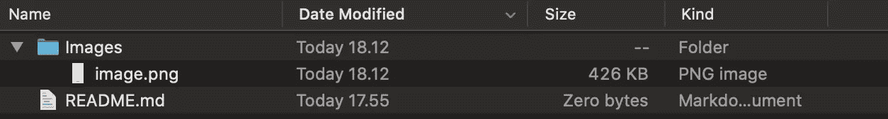
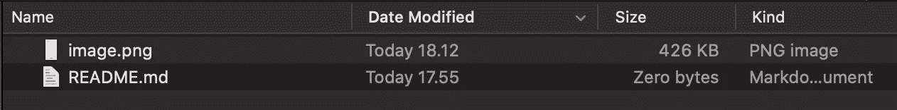
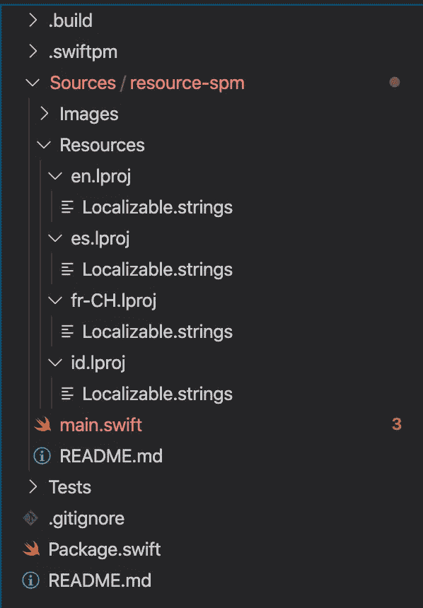

# 如何在 Swift Package Manager 中添加资源

> 原文：<https://betterprogramming.pub/how-to-add-resources-in-swift-package-manager-c437d44ec593>

## Swift 5.3 为 SPM 带来了资源能力


[良田中吉竹](https://unsplash.com/@yory?utm_source=unsplash&utm_medium=referral&utm_content=creditCopyText)在 [Unsplash](https://unsplash.com/s/photos/aerial?utm_source=unsplash&utm_medium=referral&utm_content=creditCopyText) 上拍摄的照片

[SE-0271](https://github.com/apple/swift-evolution/blob/master/proposals/0271-package-manager-resources.md)by[Anders Bertelrud](https://github.com/abertelrud)和 [Ankit Aggarwal](https://github.com/aciidb0mb3r) 为 Swift Package Manager 带来资源。如果你有任何 iOS 开发经验，你会知道你可以用`Bundle`添加非编译文件。在新的 Swift 包管理器中，基于 Swift 5.3 或更新版本，您可以添加相同的内容。您可以添加图像、声音和 JSON，Swift 将为您生成捆绑包。

在撰写本文的时候，Swift 5.3 还没有正式发布，但是如果你想试试，可以在 [Swift Snapshot](https://swift.org/download/#snapshots) 下载一个快照版本。

在每个目标上，要知道你可以递归地或者明确地声明你想要添加什么资源——稍后会有更多的细节。

```
.target(name: "HelloWorldProgram", dependencies: [], resources: nil)
```

如果您将未编译的文件添加到目标目录，Swift 将向您发出以下警告:

```
error: found 2 file(s) which are unhandled; explicitly declare them as resources or exclude from the target
    /Users/wendyliga/resource-spm/Sources/resource-spm/README.md
    /Users/wendyliga/resource-spm/Sources/resource-spm/Images/image.png
```

为了解决这个问题，Swift 5.3 在`.target`上引入了资源参数。您可以定义两种资源。

# 复制

`copy`将要求 Swift 对您申报的每个资源应用复制规则。如果您使用`copy`定位目录，那么 Swift 将保留其结构。所以，如果你想保留它的目录结构，你只需要使用`copy`。如果没有，用`process`代替。

```
.copy(path:)
```

示例:

```
.target(
   name: "HelloWorldProgram",
   dependencies: [], 
   resources: [.copy("README.md"), .copy("image.png")]
)
```

目录示例:

```
.target(
   name: "HelloWorldProgram",
   dependencies: [], 
   resources: [.copy(Images), .copy("README.md")]
)
```

如果您检查已编译的包(这取决于您的配置，但默认为`project-path/.build/build/your-project-name.bundle`)，您可以看到 Swift 将复制并保留其结构。



复制目录示例

# 过程

`process`将与`copy(path:)`做几乎相同的事情，但是相反，只是复制文件，`process`将遵循基于它运行的平台的复制和优化规则。如果你的目标是一个目录，它将递归地添加里面的文件，但不保留目录结构。

```
.process(path:)
```

示例:

```
.target(
   name: "HelloWorldProgram",
   dependencies: [], 
   resources: [.process("README.md"), .process("image.png")]
)
```

目录示例:

```
.target(
   name: "HelloWorldProgram",
   dependencies: [], 
   resources: [.copy(Images), .copy("README.md")]
)
```



处理一个目录示例

默认情况下，应该使用`process`。首选`process`，因为 Swift 将根据文件类型添加*平台效率规则*。但是，如果您想在目前支持`Bundle` API 的地方添加本地化资源，该怎么办呢？我们将在本文末尾讨论这一点。

# 如何使用资源

Swift 将为您创建样板代码，以便通过`Bundle`轻松访问资源。

```
extension Bundle {
    /// The bundle associated with the current Swift module.
    static let module: Bundle = { ... }()
}
```

示例:

```
import Foundationlet picture = Bundle.module.path(forResource: "image", ofType: "png")print(picture) // Optional("/Users/wendyliga/resource-spm/.build/x86_64-apple-macosx/debug/resource-spm_resource-spm.bundle/image.png")
```

# 本地化资源

感谢[大卫·哈特](https://github.com/hartbit)和 [SE-0278](https://github.com/apple/swift-evolution/blob/master/proposals/0278-package-manager-localized-resources.md) ，Swift 5.3 将支持 Swift Package Manager 的本地化资源。

```
let package = Package(
   name: "resource-spm",
   defaultLocalization: "en",
   ...
)
```

您应该将`defaultLocalization`添加到您的`package` init 中，告诉 Swift 您的包将支持本地化。如果任何本地化资源没有精确的本地化，Swift 也将使用`defaultLocalization`作为后备资源。

然后通过创建一个`language-tag.lproj`目录来创建您的本地化资源，该目录的语言标签将基于 [IETF 语言标签](https://en.wikipedia.org/wiki/IETF_language_tag)(在 [CFBundleDevelopmentRegion 文档](https://developer.apple.com/documentation/bundleresources/information_property_list/cfbundledevelopmentregion#)中了解更多信息)。



本地化资源示例

在`Package.swift`上，我添加了资源目录声明:

```
.process("Resources")
```

在我的例子中，我将创建几个本地化版本:`en`(英语)作为默认版本，`es`(西班牙语)、`id`(印度尼西亚)和`fr-CH`(法语(瑞士)，作为 IETF 语言标签。

正如我之前提到的，即使在本地化环境中也应该使用`.process`(本地化用例必须强制您创建一个目录，并且在编译成 bundle 时应该保留其结构)。即使没有`.copy`，Swift 也会施展魔法让这一切发生。

每个文件将有一个`hello_tag`本地化字符串，例如，法国:

```
"hello_world" = "Bonjour le monde";
```

然后，您可以用以下方式调用它:

```
NSLocalizedString("hello_world", bundle: .module, comment: "")
```

默认情况下，上面的代码将在可用的本地化字符串中搜索`hello_world`。

通过将每个文件放在各自的本地化目录中，您可以对其他文件类型做同样的事情，，如图像、声音或 JSON，与`Localizable.strings`示例相同。

# 如果我想强行访问本地化资源怎么办？

例如，如果您想要访问不是客户端上当前默认语言的其他语言资源，您可以访问相应的语言包。

这里有一点函数助手:

```
/// source: [https://github.com/apple/swift-package-manager/pull/2535/files#diff-cc8e61e90b098f4e9ebc74503408eaa8](https://github.com/apple/swift-package-manager/pull/2535/files#diff-cc8e61e90b098f4e9ebc74503408eaa8)func localizationBundle(forLanguage language: String) -> Bundle? {
   if let path = Bundle.module.path(forResource: language, ofType: "lproj") {
      return Bundle(path: path)
   } else {
      return nil
   }
}if let indonesiaBundle = localizationBundle(forLanguage: "id") {
  print(NSLocalizedString("hello_world", bundle: indonesiaBundle, comment: "")) // access image
  let image = UIImage(named: "MyIcon", in: indonesiaBundle, compatibleWith: UITraitCollection(userInterfaceStyle: .dark))}
```

# 示例项目

[](https://github.com/wendyliga/resource-spm) [## wendyliga/resource-spm

### 如何在 swift package manager-Wendy liga/resource-SPM 上添加资源的示例

github.com](https://github.com/wendyliga/resource-spm) 

# **WWDC 时段**

WWDC 2020 会议将讨论 Swift Package Manager 上的新资源，欢迎访问

[](https://developer.apple.com/videos/play/wwdc2020/10169/) [## Swift 软件包:资源和本地化- WWDC 2020 -视频-苹果开发者

### 当您使用 Swift 软件包组织和共享代码时，请随身携带您的资源。了解如何包含…

developer.apple.com](https://developer.apple.com/videos/play/wwdc2020/10169/) 

# 包装东西

那么，您对这个新的 Swift 包管理器感到兴奋吗？

在 Swift 5.3 之前，这意味着许多想要包含 Swift 文件之外的其他文件的 Swift 包管理器库或可执行文件需要使用 xcodeproj 格式。但是这个问题已经解决了——现在您可以向 SPM 项目添加资源了。

现在，您可以添加本地本地化支持，将 JSON 文件或音频文件引入 SPM 项目。

我就说这些。感谢您的时间，下一篇文章再见！