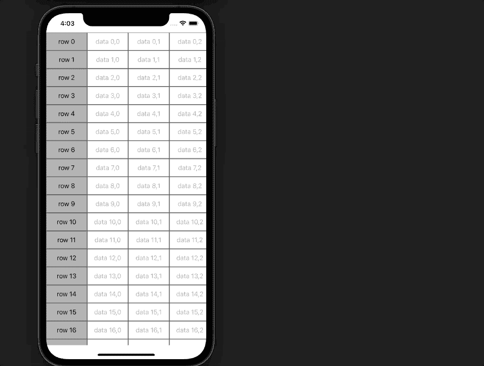
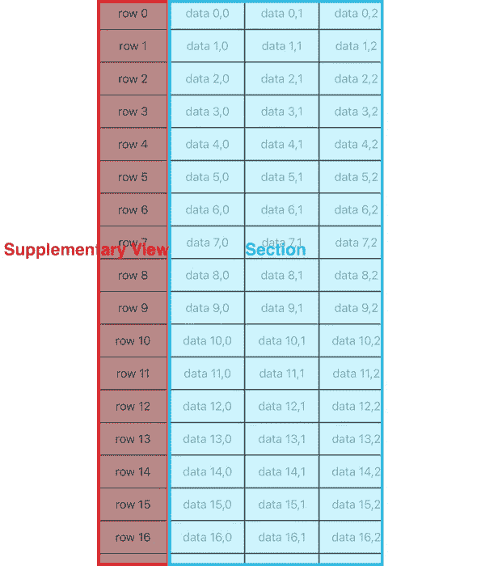
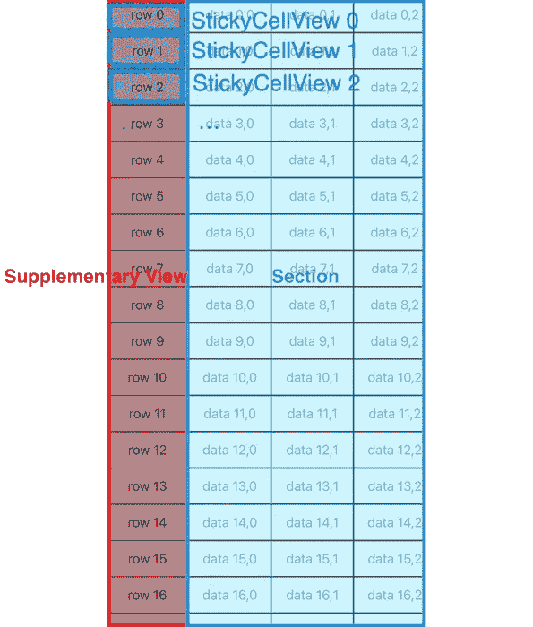
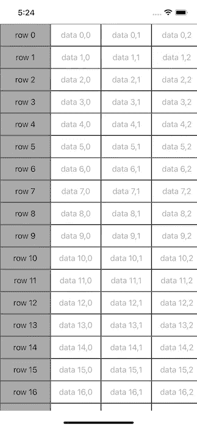

# 如何使用 iOS 13 合成布局添加粘性栏

> 原文：<https://betterprogramming.pub/how-to-add-sticky-column-by-using-compositional-layout-in-ios-6cb67f8f7458>

## 创建带有粘性栏的电子表格式现代收藏视图

实现 spreadsheetlike 类集合视图的老方法是通过继承定制`UICollectionViewFlowLayout`。你可以循环每个条目来计算`UICollectionViewLayoutAttributes`，但是滚动容易出错而且复杂。

`UICollectionViewCompositionalLayout`，已经推出一段时间了，是配置现代收藏视图的方式。我一直很好奇如何在一个高度可配置的布局中制作这种类似 spread 的收藏视图。先从一个粘性的专栏开始发掘它的潜力吧！

# 作为 Swift 包的可重用代码

完成的代码已被制成一个 Swift 包，可以在您的项目中轻松集成和重用。它可以在这里找到:

 [## ericleiyang/composition layout spreadsheet

### 要运行示例项目，克隆 repo，并从示例中运行 compositionallayoutspreadsheetexample . xcode proj…

github.com](https://github.com/ericleiyang/CompositionalLayoutSpreadsheet) 

# 1.补充视图坚持在左侧

我们可以使用不同的对齐方式在该部分添加`NSCollectionLayoutBoundarySupplementaryItem`。为了粘在左边的部分，我们选择了`.leading`。

*   粘性列被固定在可见边界上，成为粘性列
*   设置补充视图的`zIndex`，使其在滚动时可见

# 2.可水平滚动的部分

该部分应该是水平可滚动的，因此我们将该部分的正交滚动行为设置为`.continuous`。

*   将`orthogonalScrollingBehavior`设置为`.continue`以启用水平滚动
*   在该部分的`boundarySupplementaryItem`处增加了补充视图
*   部分内容插图设置为在左侧显示粘性栏

# 3.在粘性栏中累积视图

我们创建了具有相同高度的值单元格的`StickCellView`,并将实例一个接一个地累积起来，形成粘性列。

*   sticky-cell 视图只包含一个用于显示列值的`UILable`。以后可以定制。
*   每个单元格的样式由配置功能设置
*   默认情况下，文本居中对齐
*   传入的文本可归因于所需的颜色和/或字体

*   `StickyColumnView`根据传入的数据排列每个`StickCellView`
*   每个`StickCellView`的 *y* 位置按照数据数组的顺序计算
*   根据数据编号在`UICollectionViewCompositionalLayout`处计算出`StickyColumnView`的高度。

# 4.水平滚动部分的层次结构

节的层次从`ValueCell`开始。

*   每个单元格只包含一个`UILable`来显示值
*   该值作为`NSAttributedString`被传入，以定制文本颜色和字体
*   默认情况下，文本居中对齐

*   在`NSCollectionLayoutGroup`添加水平布局的项目
*   水平组根据行数添加到垂直`NSCollectionLayoutGroup`
*   垂直组的高度是根据行数和每行的高度计算的

# 5.粘性列的数据

虽然 sticky 列的单元格是垂直对齐的，但它们可以由一维数组表示。

# 6.截面数据

对于电子表格，通常按行组织数据。但是，组合布局的垂直组表示列中的数据。

*   我们需要旋转二维数组以适应垂直组，从而实现所需的表示顺序

# 7.用法示例

[完成的电子表格布局](https://github.com/ericleiyang/CompositionalLayoutSpreadsheet)被包装成一个 Swift 包，以便在不同的项目中重用。

要使用 Swift 包，我们只需使用 Xcode 的 Swift 包管理器来添加它。

在示例项目中，我们初始化`CompositionalLayoutSpreadsheet`，然后使用`configureHierarchy`函数将电子表格添加到视图控制器中。

示例数据如下:

*   它包含 50 行数据
*   用`row`和行的顺序创建粘性单元
*   有 20 列数据
*   数值单元格是用`data`和行与列的索引创建的

# 8.结论

我们使用了一个复合布局来制作一个 spreadsheetlike 样的集合视图，在左边有一个粘性列。比传统的使用方式`UICollectionViewFlowLayout`干净多了。集合视图的组件易于配置和调整。

带有使用示例的可重用布局可在以下 Swift 包中找到:

 [## ericleiyang/composition layout spreadsheet

### 要运行示例项目，克隆 repo，并从示例中运行 compositionallayoutspreadsheetexample . xcode proj…

github.com](https://github.com/ericleiyang/CompositionalLayoutSpreadsheet) 

我希望你喜欢这篇文章。我很想听听你们的想法，回答你们可能有的任何问题！