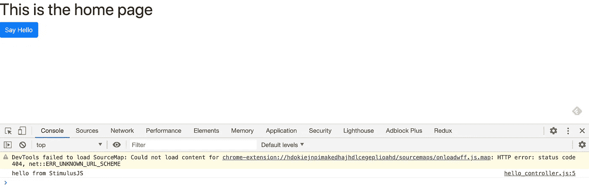

# 如何将 Stimulus.js 添加到 Rails 6 应用程序中

> 原文：<https://betterprogramming.pub/how-to-add-stimulus-js-to-a-rails-6-application-4201837785f9>

## 使用 Webpacker 和 Ruby on Rails 安装 Stimulus.js


图片由 [S. Hermann & F. Richter](https://pixabay.com/users/pixel2013-2364555/?utm_source=link-attribution&utm_medium=referral&utm_campaign=image&utm_content=2662550) 来自 [Pixabay](https://pixabay.com/?utm_source=link-attribution&utm_medium=referral&utm_campaign=image&utm_content=2662550)

[Stimulus.js](https://stimulusjs.org) 是 Rails 创建者提供的一个轻量级 JavaScript 框架。

使用 Stimulus 将不显眼的 JavaScript 无缝集成到 Rails 应用程序中。你可以把它想象成在 RoR 的基础上添加 React 或 Vue，但要轻量得多。

因为它是一个基于 MVC 框架构建的框架，所以它结合了 Rails 管道的简单性和现代 JavaScript 标准——它是模块化的，并且非常快。

Stimulus 创建了自己的一组控制器，可以与应用程序前端的 DOM 交互。它使用 [Turbolinks](https://github.com/turbolinks/turbolinks) 拦截请求，并通过 AJAX 执行它们。

从 Rails 6 开始，JavaScript 不再是资产管道的一部分，而是默认使用 [Webpacker](https://github.com/rails/webpacker) 进行集成。代码保存在`app/javascript`文件夹中，并通过`javascript_pack_tag`加载到应用程序布局的主体中。

增加刺激只需要几个步骤。我们开始吧！

# 第一部分—安装刺激装置

## 步骤 1:通过 yarn 或 npm 向应用程序添加刺激

因为 Rails 6 JS 是通过 Webpacker 加载的，所以任何 JavaScript 模块或外部库都不是通过 gems 或供应商文件夹添加的。

每个包都通过包管理器(如 yarn 或 npm)加载，并导入到应用程序中。要在应用程序中添加刺激，首先使用类似 yarn 的包安装它:

```
yarn add stimulus 
```

## 步骤 2:用 Webpacker 设置刺激

一旦安装了刺激，通过 Webpack 将其导入到应用程序中。`app/javascript/packs/application.js`文件通常用于引用不同的导入插件——它不应该有单独的 JS。

首先，创建`controllers`文件夹，然后在里面添加一个`index.js`文件。然后，参考`application.js`里面的文件夹。

```
#shell mkdir app/javascript/controllers
touch app/javascript/controllers/index.js #app/javascript/packs/application.jsimport 'controllers'
```

可以简单地导入文件夹的名称，因为默认情况下 Webpacker 会读取`index.js`文件和导入的文件夹。

## 步骤 3:添加刺激启动代码

导入刺激启动文件。`context`组件使得从`controllers`文件夹中读取和包含每个文件成为可能。

就是这样！现在，您可以将控制器添加到该文件夹中，并开始将其整合到您的 Rails 6 应用程序中。

继续阅读一些刺激措施的最佳实践。

# 第二部分——使用刺激

## 第一步:设置

第一步是创建一个 Stimulus.js 将访问 DOM 的页面。

通常，这样做是为了通过特定的模型与数据库进行交互，或者与 websockets 同时使用(通过 Action Cable)。但是对于这个演示，我将使用一个静态页面控制器作为主页。

```
rails g controller pages home#config/routes.rb
root "pages#home"
```

然后，我将在主页上添加一些要操作的内容。

```
#app/views/pages/home.html.erb<div class=”btn btn-primary”>Say Hello</div>
```

现在，你可以整合刺激方案了。

## 步骤 2:创建刺激控制器

在 JavaScript 文件夹中创建刺激控制器(注意:不是在`app/controllers`文件夹中)，然后添加样板代码。

对此没有 Rails 生成器，但我希望它能被包含在未来的版本中。

当从 DOM 调用控制器时，将运行 connect 方法:

```
#app/views/pages/home.html.erb<div data-controller="hello">
  <div class="btn btn-primary">Say Hello</div>
</div>
```

更优雅和 Rails-y 的方式是添加一个`content_tag`:

```
#app/views/pages/home.html.erb<%= content_tag :div, nil, data: {controller: "hello"} do %>
  <div class="btn btn-primary">Say Hello</div>
<% end %>
```

添加数据属性后，您可以在 JS 控制台中检查连接:



请访问网站 http://localhost:3000/

## 第三步:添加你的第一个动作

好吧，让我们让事情发生。为此，我将从官方[刺激](https://stimulusjs.org/handbook/hello-stimulus)手册中摘录一个例子。让我们在点击按钮时用经典程序员 *Hello World* 替换标题文本。

第一步是向我的按钮 div 添加一个回调。数据属性的这个组成部分被称为*动作描述符*。它在点击时创建一个监听器来调用`hello`控制器中的`greet`动作。

```
#app/views/pages/home.html.erb<div class="btn btn-primary" data-action="click->hello#greet">Say Hello</div>
```

接下来，将动作添加到刺激控制器。

## 第四步。改变 DOM

最后，让我们在 DOM 中添加一些可以通过点击按钮来改变的东西。刺激框架通过在控制器内部将元素指定为`targets`来简化对元素的引用。

在 HTML 页面中，将`data-target`属性添加到`h1`元素中，同时引用控制器的名称和元素的名称。

```
<h1 data-target="hello.heading">This is the home page</h1>
```

然后，在控制器内部，创建数据目标。可以将多个目标添加到阵列中。

```
export default class extends Controller {
  static targets = ["heading"]
  [...]
}
```

最后，修改 greet 函数来替换 click 上的目标的`innerHTML`:

```
greet() {
   this.headingTarget.innerHTML = "Hello World"
}
```

就是这样！就这么简单。

# **资源**

*   [GitHub 上的 Rails 刺激演示](https://github.com/maltyeva/rails-stimulus-demo)
*   [一个 Heroku demo](https://rails-stimulus-demo.herokuapp.com/)