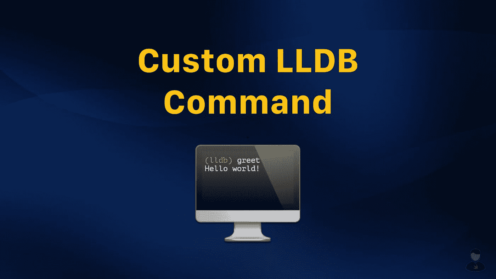
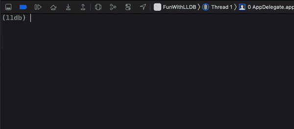
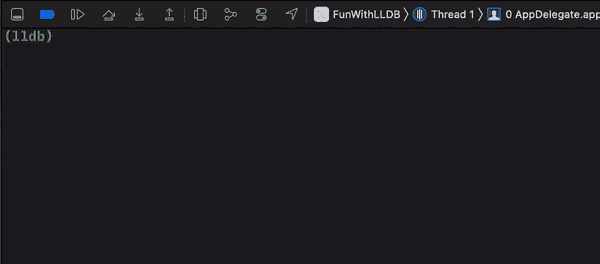

# 如何将 Swift 代码添加为自定义 LLDB 命令

> 原文：<https://betterprogramming.pub/how-to-add-swift-code-as-a-custom-lldb-command-34aa0ea0f02>

## 让我们启动 LLDB 调试器吧！



图片由作者提供。

如果我问 iOS 开发者他们最常用的是哪个 [LLDB](https://lldb.llvm.org/) 命令，他们可能会回答`po`。但是您知道吗，您实际上可以使用纯粹的 Swift 代码来定义自己的定制 LLDB 命令。

在本文中，我将向您展示如何创建自己的 LLDB 命令。以下是我将要讲述的内容:

*   添加您的第一个 LLDB 命令
*   添加带参数的 LLDB 命令
*   将复杂的 Swift 代码转换为 LLDB 命令

我们开始吧！

# 添加您的第一个 LLDB 命令

## 了解 LLDB 命令结构

为了添加定制的 LLDB 命令，我们必须利用`command alias` LLDB 命令。它具有以下结构:

```
command alias **[command_name]** expr -l Swift -O -- **[swift_code]**
```

让我们详细分解这个命令:

*   `command alias`:LLDB 命令，为 Swift 代码起别名。
*   `[command_name]`:自定义命令名。
*   `expr -l Swift -O --`:要求 LLDB 调试器将随后的所有内容解释为 Swift 代码。
*   `[swift_code]`:定义自定义命令逻辑的 Swift 代码。

例如，如果我们想添加一个名为`greet`的定制命令，打印“Hello World！”语句，LLDB 命令将是这样的:

```
command alias greet expr -l Swift -O -- print("Hello World!")
```

## 添加自定义命令

既然我们已经为`greet`构造了 alias 命令，是时候将它添加到 LLDB 调试器中了。

将`greet`命令添加到 LLDB 调试器中最直接的方法是在 Xcode 控制台中执行 alias 命令。



在 Xcode 控制台中执行别名命令。

然而，这样做只会使`greet`命令在特定的调试会话中可用。换句话说，每次开始新的调试会话时，我们都需要重新键入相同的 alias 命令。

为了避免这种情况发生，我们可以利用位于主目录中的`.lldbinit`文件。请注意，这是一个隐藏文件。如果看不到文件，您可以使用以下快捷方式在 Finder 中显示隐藏的文件:

```
shift + command + .
```

如果您已启用 Finder 来显示隐藏文件，但您仍然无法找到该文件，请使用以下终端命令在您的个人目录中创建一个文件:

```
touch ~/.lldbinit
```

之后，打开文件，将整个 alias 命令粘贴到刚刚创建的`.lldbinit`文件中。这样，Xcode 将在每次启动新的调试会话时执行您的 alias 命令。

*Pro 提示:如果您不想在每次更新完* `*.lldbinit*` *文件后重新启动调试会话，您可以使用以下命令重新加载它:*

```
*command source ~/.lldbinit*
```

# 添加带参数的 LLDB 命令

在本节中，让我们更进一步，添加一个能够接受参数的命令。出于演示的目的，让我们修改我们的`greet`命令，以便它能够接受一个字符串并相应地打印出问候消息。

这一次，我们将利用`command regex` LLDB 命令。它具有以下结构:

```
command regex **[command_name]** 's/[**regex]**/expr -l Swift -O -- **[swift_code]**/'
```

关于 regex 命令是如何工作的，我不会说得太详细，因为这超出了本文的范围。一般来说，你需要做的就是用正则表达式语句`(.+)`替换`[regex]`，然后用`%1`来表示 Swift 代码中的参数。

记住这一点，我们可以相应地更新`greet`命令，如下所示:

```
command regex greet 's/(.+)/expr -l Swift -O -- print("Hello \(%1)!")/'
```

在这里，它是在行动(假设`name = "Swift Senpai"`):

```
**(lldb)** greet name 
Hello Swift Senpai!
```

在这个阶段，你可能会问，“如果我需要传入多个参数呢？”答案其实很简单。

首先，将更多的`(.+)`追加到 regex 语句中，并用空格分隔每个`(.+)`。之后，使用`%2`、`%3`、`%4`...来表示 Swift 代码中的每个子序列参数。

现在，让我们试着调整我们的`greet`命令来接受两个参数:

```
command regex greet 's/(.+) (.+)/expr -l Swift -O -- print("Hello (%1) and (%2)!")/'
```

要使用该命令，只需用空格分隔每个参数，如下所示(假设`name1 = "Swift Senpai"`和`name2 = "iOS developers"`):

```
**(lldb)** greet name1 name2 Hello 
Swift Senpai and iOS developers!
```

现在您已经看到了如何添加一个接受多个参数的定制 LLDB 命令。在下一节中，我将向您展示如何将多行 Swift 函数转换成定制的 LLDB 命令。

# 将复杂的 Swift 代码转换为 LLDB 命令

添加定制 Swift 代码作为 LLDB 命令的一个警告是，所有事情都必须在一行中完成。所以，如果我们有多行 Swift 功能，首先要把它转换成单行。只有这样，我们才能将其添加到`.lldbinit`文件中。

假设我们想要添加以下将 RGB 值转换为十六进制值的 Swift 函数:

注意我是如何在代码注释中使用`/* */`而不是`//`语法的。这是为了确保我们的 Swift 代码在转换成一行代码后不会中断。

除此之外，我们还需要对 Swift 代码进行一些调整，然后才能将其转换成一行代码。我们需要做的是:

1.  为每个函数参数定义一个变量。
2.  分配`%1`、`%2`、`%3`...每个定义的变量。
3.  在每条语句的末尾加上`;`。

这是我们的 Swift 代码在调整后的样子:

这样，我们就可以将 Swift 代码转换成一行代码。我个人喜欢用这个[免费在线工具](https://www.textfixer.com/tools/paragraph-to-lines.php)进行单线转换。但是，如果你知道有什么好的工具可以推荐，请随时告诉我。

一旦我们将 Swift 代码转换成一行，我们就可以像这样构造 regex 命令:

```
command regex hex 's/(.+) (.+) (.+)/expr -l Swift -O -- let r = %1; let g = %2; let b = %3; if (r >= 0 && r <= 255) && (g >= 0 && g <= 255) && (b >= 0 && b <= 255) { let rgb:Int = r<<16 | g<<8 | b<<0; let hex = String(format:"#%06x", rgb); print(hex); } else { print("Invalid input value"); }/'
```

继续将命令粘贴到`.lldbinit`文件中，然后我们就可以开始了。



使用自定义 LLDB 命令将 RGB 转换为十六进制值

# 实用的定制 LLDB 命令

既然您已经学习了如何向 LLDB 调试器添加自定义命令，那么您应该添加什么自定义 LLDB 命令呢？

我个人觉得[这个自定义命令](https://soffes.blog/debugging-json-data-in-lldb)特别有用。它漂亮地打印任何 JSON 可序列化类型，如`Dictionary`、`Array`、`Data`等。作为 Xcode 控制台中的 JSON 字符串。

此外，我还喜欢本文中[讨论的一系列自定义命令。我们可以使用它们动态地修改 UI 元素的颜色，而不必重新构建项目。](https://diamantidis.github.io/2018/10/14/modifying-ui-elements-with-xcode-and-lldb-v2)

# 包扎

本文仅仅触及了 LLDB 调试器功能的皮毛。如果您是 LLDB 的新手，我希望这篇文章能启发您从今天开始探索这个神奇的调试工具。

如果你喜欢读这篇文章，请随意查看我的其他关于[测试](https://swiftsenpai.com/category/testing/)和 [Xcode](https://swiftsenpai.com/category/xcode/) 的文章。

感谢阅读。

*本文原载于 2021 年 6 月 2 日 https://swiftsenpai.com**的* [*。*](https://swiftsenpai.com/testing/add-custom-lldb/)