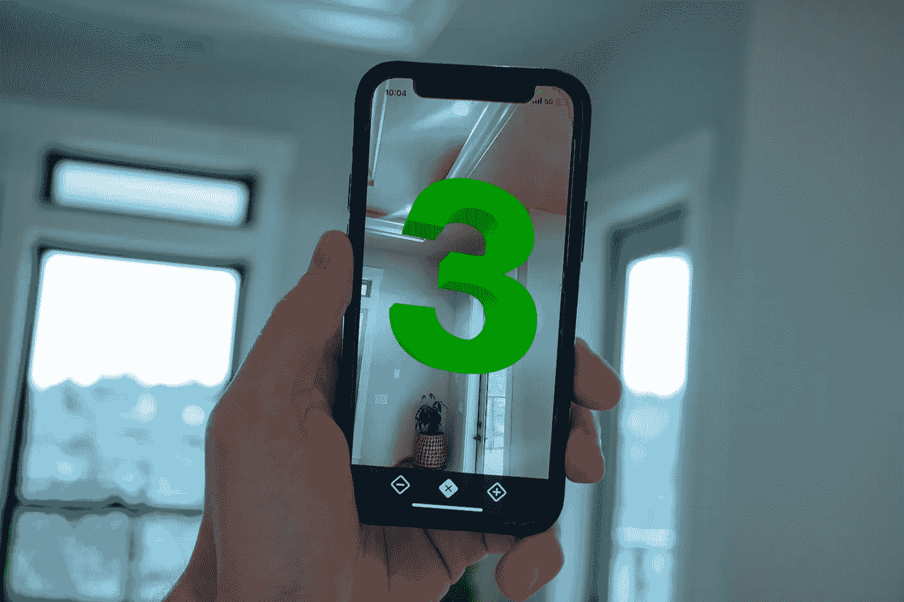
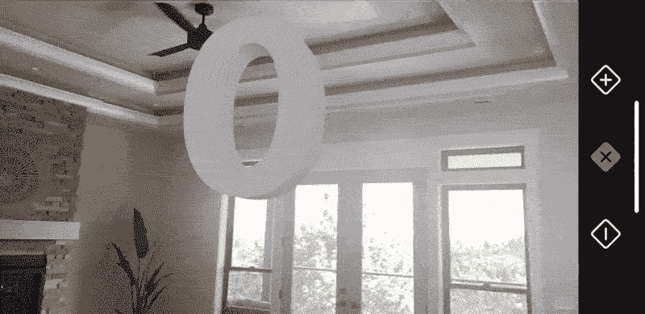
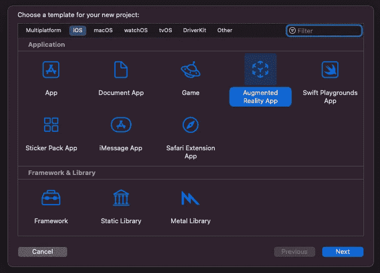
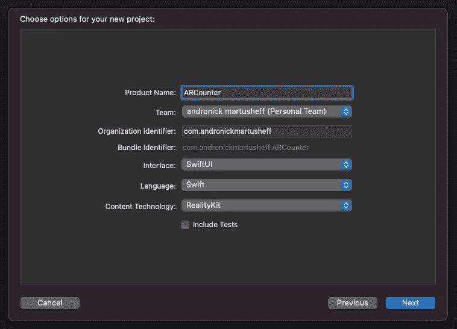
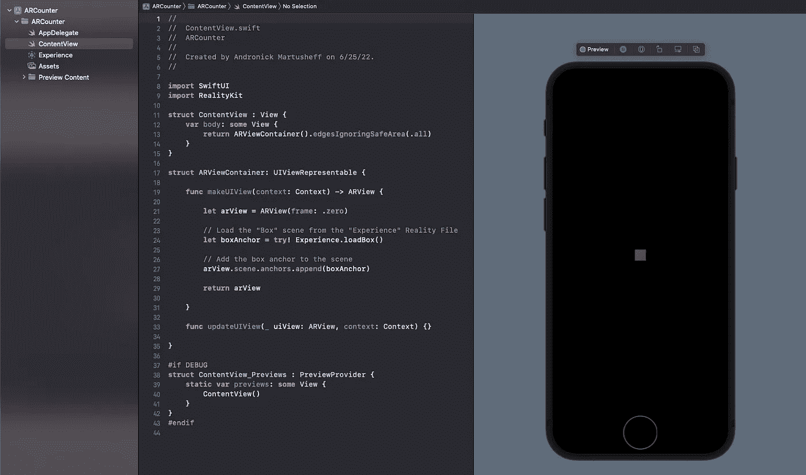
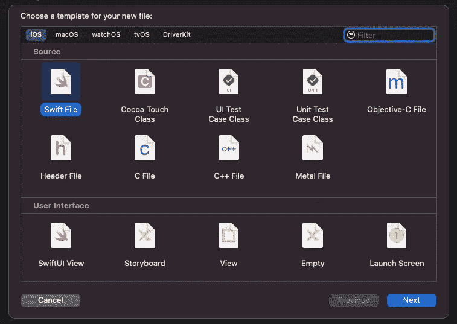
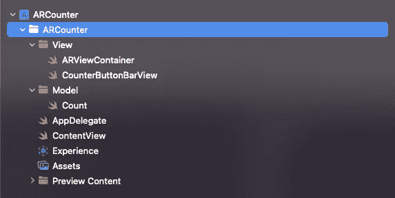
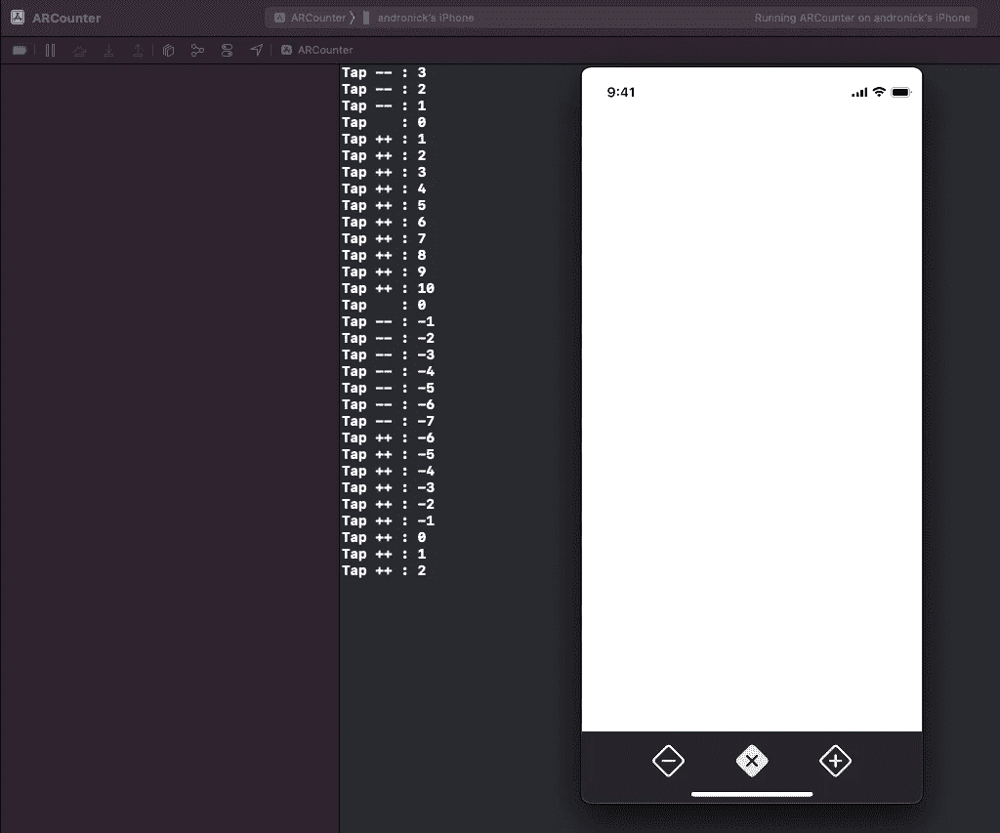
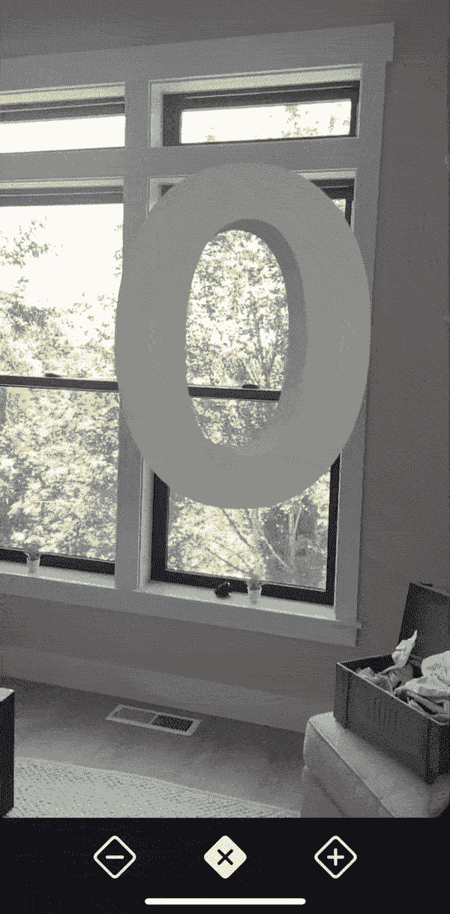

# RealityKit 遇上 swift ui——打造增强现实计数器 iOS 应用

> 原文：<https://betterprogramming.pub/how-to-add-text-to-an-arview-in-an-ios-application-tutorial-f3f746f4dc1f>

## 在 SwiftUI 中向视图添加文本

AR 在，我的理解是——不在。我很难找到关于如何在 iOS 应用程序中向 ARView 添加文本的资源，更不用说通过用户交互操作这些文本了。所以今天，我们把它带回到基础。我们将建立一个简单的计数器应用程序，除了我们可能从来没有做过的方式。我们在 AR 做。

如果您想直接设置 AR 场景，请直接跳到“设置 ARViewController ”,或者在此处复制报告:

 [## GitHub - martusheff/ar-counter:增强现实中的一款计数器 app！

### 此时您不能执行该操作。您已使用另一个标签页或窗口登录。您已在另一个选项卡中注销，或者…

github.com](https://github.com/martusheff/ar-counter) 

**设备兼容性:**

*   **iPhone***6s 及以上*
*   ***iPad****5 代及以上*
*   ***iPod****7 代*

## 查看计数器应用程序

以下是跟随今天教程的结果。在 ARKit 的帮助下，正在 SwiftUI 中构建一个计数器应用程序。

可见按钮栏(右)和`ARView`都被限制在它们自己的视图中，因此我们还将学习如何在视图之间传递对象状态，并在计数增加时更新`ARView`。让我们开始吧。

以上是我们的 AR 计数器的演示。

## 设置我们的项目

在创建我们的新项目时，我们将从选择**增强现实应用**开始。点击下一个。

然后输入项目的名称，并确保选择 **SwiftUI** 。点击**下一步后，**会提示你找到保存项目的位置。完成后，选择**创建**，Xcode 将完成设置。

在模拟器面板中选择 **resume** 后，启动代码将被填充预设，用于向我们的 AR 场景添加一个盒子。我们可以在上面的模拟器中看到盒子，但是因为模拟器没有相机可用，所以不会有 ***的 AR 体验。***

此时，您可以继续在 iOS 设备上运行项目(CMD + R ),并在应用程序中看到这个框。

## 建立我们的视图和模型

选中`ARCounter`目录，点击`cmd + option + n`创建一个新组(文件夹)。创建 2 个组，一个名为`View`，另一个名为`Model`。在视图组中，使用`cmd + n`添加一个新的 Swift 文件。

选择 Swift 文件，并将该文件命名为`Count`。重复这个过程，创建另外两个名为`ARViewContainer`、`CounterButtonBarView`的 Swift 文件。将文件移动到各自的组中。这里有一个图像，作为你的文件夹结构应该是什么样子的参考。

## **设置计数**

在我们的`Count`文件中，我们将创建`Count`类。这个类包含一个名为`num`的已发布变量。

Published 是一个属性包装器，每当它经历状态变化时，它将更新所有将它作为属性的`ObservableObjects`。稍后会详细介绍。

## 设置反向按钮栏视图

在我们的`ContentBarButtonView`中，我们想要添加上面的代码。这里，我们正在设置我们的交互式按钮栏，这样我们将能够更新将在我们的`ARView`中显示的计数。

*   在`line 5`上，我们为 Count 实例声明了一个变量，用于跟踪应用程序的当前计数。
*   在`line 8`上，我们将以下视图嵌入到一个水平堆栈中。
*   在`line 10`上，我们创建了减量按钮。在这个按钮中，我们将操作设置为将它的视图实例 Count 减 1。它还打印到控制台，这有助于调试。在该按钮的标签部分，我们使用由`[SFSymbols](https://developer.apple.com/sf-symbols/)`提供的图标设置来设置图像。
*   在`line 17` & `line 24`上，创建了类似的重置和递增计数器的按钮。
*   从`line 31`到`line 36`，我们正在设计 ContentBarButtonView 的样式。如果你觉得合适的话，可以随意调整。

## 将我们的按钮添加到内容视图

我们需要更新我们的`ContentView`来匹配上面的代码。`ARViewContainer`已经从内容视图中移除(并被移动到我们之前为其创建的文件中。)它也将暂时从 ContentView 的主体中移除。

*   在`line 6`上，我们正在创建我们的`Count`实例。
*   在`line 9`上，我们将所有进一步的视图嵌入到一个`ZStack`中。这是因为我们将在 Z 轴上将`CounterButtonBarView`叠加到 AR 的摄像机视图上。
*   在`line 10`上，我们正在将按钮栏嵌入一个`VStack`。
*   在`line 11`上，我们添加了一个`Spacer()`来将所有剩余的视图下推到屏幕底部。
*   在`line 12`上，我们正在添加我们的`CounterBarButtonView`视图，并传入我们为`line 6`上的应用程序创建的 counter 实例。条形按钮视图处理递增/重置/递减将更新此计数实例。

现在，连接好您的 iOS 设备，选择它作为构建的设备目标。运行`cmd + r`后，你会看到一个黑屏和按钮的应用出现。点击按钮时，您的控制台应该会跟踪 Count 的实例，如下所示。

## 设置 ARViewController

现在，来设置我们的 AR 场景。上面的代码将在每次点击我们之前创建的按钮时处理显示文本的创建和更新。我们将通过在每次点击按钮时重新绘制场景来简化这个过程。

*   在`line 6`上，我们正在设置一个引用，它将接受我们之前创建的 Count 类的一个实例。它被设置为一个被观察的对象，因为每当发布的变量`num`改变时，它与发布的属性包装器一起更新视图。
*   在`line 8`上，我们有了视图的构造函数。
*   在`line 12`上，我们有一个函数，每当`ObservedObject`有一个已发布的变量发生变化时，这个函数就会被调用来更新/重绘 AR 视图。我们从这里调用我们的自定义`updateCounter()`函数，传入现有的 ARView。
*   在`line 17`上，我们从场景中移除所有锚点，清空场景。
*   从`line 20`到`line 24`，我们使用`.generateText`创建我们的`MeshResource`，并传入一系列参数。首先，我们要显示的文本，它将是`count.num`的绝对值。第二，我们传入我们想要的挤压深度，使文本变成 3d。最后，我们设置一个期望大小的字体&字体粗细。
*   从`line 26`到`line 35`，我们检查`count.num`的新值，并根据它是正、负还是零来分配颜色。
*   在`lines 37`上，我们使用`SimpleMaterial`创建一个着色器，传入我们的颜色和其他一些想要的预设(随意使用这些)。
*   在`line 38`上，我们使用之前创建的网格和着色器创建了`Entity`。
*   在`line 40`上，通过改变其在 Z 轴上的位置，我们将`textEntity`定位在我们前面。
*   最后，在`lines 41 & 42`，我们将实体添加到锚点，并将锚点添加到场景。

一旦完成，文本将被更新，这是由用户点击按钮导致的已发布变量`num`的变化所触发的动作。

## 内容视图的最终更新

现在，在我们的`ContentView`中，我们可以添加我们的`ARViewContainer`，并传入我们的 count 实例。

应该就是这样了！运行应用程序并与计数器进行交互。下面，我又链接了回购。如果你面临任何麻烦，并希望看到我的完整的工作代码，随时克隆它&从它开始工作！

> L 油墨回购:[https://github.com/martusheff/ar-counter](https://github.com/martusheff/ar-counter)

## 挑战

我发现建立教程是一个非常好的学习方法，所以下面是一些你可以考虑在这个应用上建立的挑战！

*   添加一个更新显示文本的文本字段。
*   添加颜色选择器以更改文本的颜色。
*   每次计数器更新时向文本添加动画。