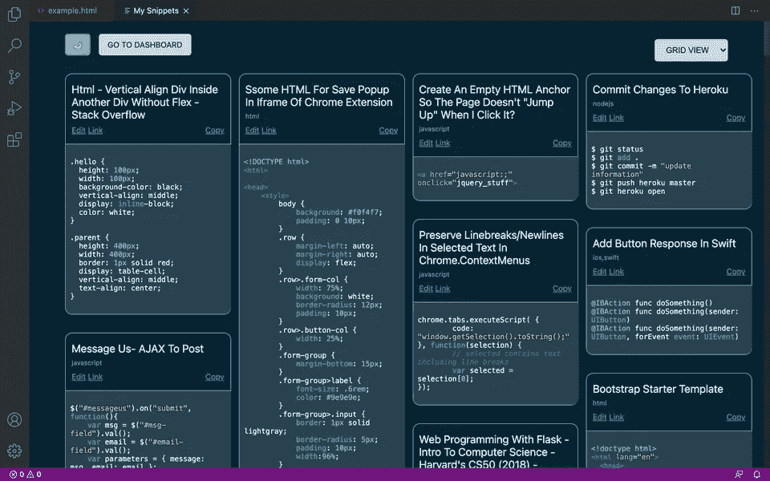

# 如何向 Visual Studio 代码扩展添加 Webviews

> 原文：<https://betterprogramming.pub/how-to-add-webviews-to-a-visual-studio-code-extension-69884706f056>

## 在 VS 代码中显示定制的 HTML、CSS 和 JS

照片由[克里斯蒂娜·莫里洛](https://www.pexels.com/@divinetechygirl)在 [Pexels](https://www.pexels.com/photo/person-looking-at-phone-and-at-macbook-pro-1181244/) 上拍摄。

奇怪的是网上没有足够的关于构建 VS 代码扩展的教程。我是一个总是依赖堆栈溢出和 YouTube 教程的人，所以我花了相当多的时间来弄清楚如何构建一个 VS 代码扩展来保存代码片段。

我真正遇到的一件事是添加一个 webview。用户希望看到他们保存在 VS 代码中的片段。我想树景会是最合适的。文档让你不敢使用 [webview API](https://code.visualstudio.com/api/extension-guides/webview) ，警告它会降低应用程序的速度。但是树形视图效果不好。

然后我注意到一个朋友的 VS 代码扩展有 webview，运行非常流畅([元代码](https://marketplace.visualstudio.com/items?itemName=MetacodeInc.metacode)，有兴趣的话)。所以我冒了一次险，在我的扩展中添加了一个 webview 它运行得非常好。没有抱怨(还没有！)关于它让任何人的电脑变慢。它看起来是这样的:

因此，事不宜迟，下面介绍如何将 webview 添加到 VS 代码扩展中。

# 1.注册命令以激活 Webview

在您的`package.json`文件中，添加一个命令来激活`webview`功能。

# 2.添加代码以激活 Webview

现在，在您的`extension.ts`(或`extension.js`)文件中，添加以下代码和函数来打开一个 webview。

# 3.打开网络视图

这很简单。通过在命令面板中键入命令来打开 webview。在本例中，这意味着键入并选择“打开 webview”

瞧，你的网络视图应该打开了！您也可以使用`keybindings`功能将该命令绑定到键盘快捷键。

# 4.将内部 CSS 和 JavaScript 文件链接到 Webview(可选)

如果您想将内部 CSS 样式表或 JavaScript 文件链接到 webview，您需要从扩展的上下文中获取这些文件的 URI。

在`webview`命令中添加以下代码行:

然后像这样将它传递到`getWebviewContent()`函数的 HTML 中:

我希望这是有帮助的！

查看 VS 代码市场上的[保存代码扩展](https://marketplace.visualstudio.com/items?itemName=thiscodeworks.savecode)。

*最初发表于*[*https://mishka . codes*](https://mishka.codes/webviews-in-vscode)*。*